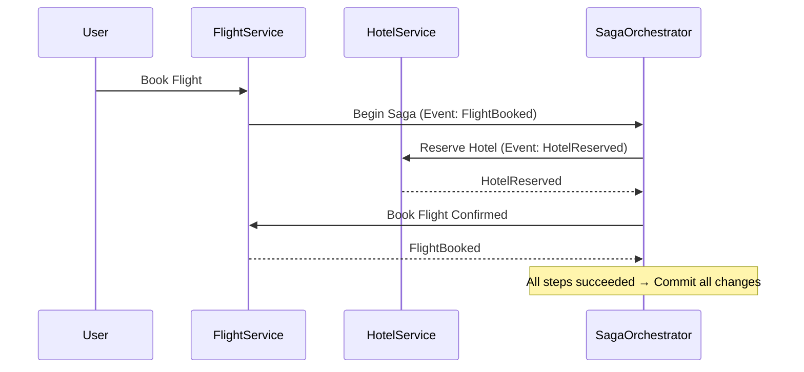

```markdown
---
title: "Mastering Consistency Strategies: How to Balance Speed and Accuracy in Distributed Systems"
date: 2023-10-15
tags: ["database", "distributed systems", "API design", "consistency", "CAP theorem", "patterns"]
---

# Mastering Consistency Strategies: How to Balance Speed and Accuracy in Distributed Systems

## Introduction

Distributed systems power the modern web—from social media feeds to global e-commerce platforms. But here’s the catch: the more nodes and services you add, the harder it becomes to keep everyone in sync. **Data inconsistency** can lead to errors, lost transactions, or even fraud (think about those "out of stock" items you still tried to buy).

Consistency strategies are the lifeblood of reliable distributed systems. You’ve likely heard terms like *strong consistency*, *eventual consistency*, or *saga patterns*—but how do they work in practice? How do you choose the right one for your use case? And more importantly: what are the tradeoffs when you do?

In this guide, we’ll dissect the core consistency strategies—**from simple optimizations to complex distributed workflows**—with clear examples, tradeoffs, and real-world pitfalls. By the end, you’ll know how to design systems that balance speed, reliability, and scalability.

---

## The Problem: When Consistency Goes Wrong

### **The CAP Theorem Reminder**
Before diving into solutions, let’s revisit the CAP theorem—a fundamental guideline for distributed systems. CAP states that for any distributed system, you can guarantee at most two of the following three properties:
- **Consistency**: All nodes see the same data at the same time.
- **Availability**: Every request receives a response (no timeouts).
- **Partition Tolerance**: The system continues to operate despite network failures.

Most real-world systems **must prioritize partition tolerance** because network issues are inevitable. This leaves us with a choice: **Consistency vs. Availability**.

### **Real-World Consistency Nightmares**
1. **The Double-Spend Bug**:
   Suppose a user transfers $100 between two bank accounts. If one account is deducted but the other isn’t (or vice versa), the system has a **strong inconsistency**. Worse, if the user spends the same $100 twice (because the system didn’t confirm the transfer), fraud occurs.

   ```sql
   -- Incorrect: Two "withdrawal" transactions without synchronization
   BEGIN;
   UPDATE accounts SET balance = balance - 100 WHERE user_id = 1;
   UPDATE accounts SET balance = balance + 100 WHERE user_id = 2;
   COMMIT;
   ```
   *(This fails if the network partition separates the two updates.)*

2. **The "Item Out of Stock" Lie**:
   An online merchant marks an item as "sold out" but doesn’t update its inventory database in time. A user buys it, and now the merchant has to refund—or the item suddenly reappears in the UI.

3. **The Race Condition in Microservices**:
   Two services (e.g., `OrderService` and `InventoryService`) independently check inventory before committing an order. The first service sees "10 units available," places an order, but the second service also sees "10 units" and places a second order. Now, the inventory is -10.

---

## The Solution: Consistency Strategies Demystified

Consistency strategies help manage tradeoffs between speed, reliability, and correctness. They fall into two broad categories:
1. **Synchronous Strategies**: Ensure immediate consistency (at the cost of performance).
2. **Asynchronous Strategies**: Allow eventual consistency (better performance, but with risks).

Let’s explore both with practical examples.

---

## Components/Solutions: Your Toolkit

### 1. Strong Consistency via Two-Phase Commit (2PC)

**When to use**: Critical transactions where failure cannot tolerate inconsistency (e.g., financial transfers, multi-account updates).

**How it works**:
- All participants (database nodes) agree to commit or abort a transaction **before** applying changes.
- If any participant fails, the entire transaction rolls back.

#### Example: Cross-Account Transfer with 2PC
Imagine a banking system where a transaction requires two databases (`AccountDB1` and `AccountDB2`).

```python
# Pseudocode for Two-Phase Commit
def transfer_money(user_id1, user_id2, amount):
    # Phase 1: Prepare (all participants vote to commit)
    response1 = AccountDB1.prepare("Deduct", amount, user_id1)
    response2 = AccountDB2.prepare("Credit", amount, user_id2)

    if response1.success and response2.success:
        # Phase 2: Commit (all participants confirm)
        AccountDB1.commit()
        AccountDB2.commit()
    else:
        # Phase 3: Rollback (undo changes if any failed)
        AccountDB1.rollback()
        AccountDB2.rollback()
```

**Pros**:
- Guarantees atomicity (all-or-nothing updates).
- Works well in tightly coupled systems.

**Cons**:
- **Performance bottleneck**: Requires coordination across all nodes.
- **Single point of failure**: If the coordinator fails, the system may stall.

**Tradeoff**: *High correctness, low scalability.*

---

### 2. Eventual Consistency via Event Sourcing

**When to use**: High-throughput systems where eventual consistency is acceptable (e.g., social media feeds, analytics dashboards).

**How it works**:
- Changes are published as *events* (e.g., "User purchased item X").
- Other services subscribe to these events and update their state accordingly.
- No immediate synchronization—just asynchronous updates.

#### Example: Order Processing with Event Sourcing
A `OrderService` publishes `OrderPlacedEvent`, and an `InventoryService` reacts by decrementing stock.

```python
# Event Sourcing Example (Python with Kafka)
from kafka import KafkaProducer

producer = KafkaProducer(bootstrap_servers='localhost:9092')

def handle_order(order):
    # Save order to DB (CAPTURE EVENT)
    order_id = save_order_to_db(order)

    # Publish event (ASYNC NOTIFICATION)
    event = {"type": "OrderPlaced", "order_id": order_id, "details": order}
    producer.send("orders_topic", json.dumps(event).encode('utf-8'))

# Inventory Service Subscriber
def update_inventory(event):
    if event["type"] == "OrderPlaced":
        item = event["details"]["item"]
        inventory.update(item, quantity=-1)  # Decrement stock
```

**Pros**:
- Scalable and decoupled (services communicate via events).
- Handles network partitions gracefully.

**Cons**:
- **Temporary inconsistencies**: A user might see an "out of stock" item for a few seconds.
- **Complexity**: Requires idempotency (handling duplicate events).

**Tradeoff**: *High scalability, eventual correctness.*

---

### 3. Read/Write Consistency with Quorum Reads/Writes

**When to use**: Systems where you need tunable consistency (e.g., NoSQL databases like Cassandra, DynamoDB).

**How it works**:
- For writes: Require a quorum (e.g., 2 out of 3 nodes) to acknowledge changes.
- For reads: Read from a quorum to ensure the latest changes are seen.

#### Example: Cassandra’s Tunable Consistency
Assume a Cassandra cluster with 3 replicas.

```sql
-- Write with quorum (2/3 acknowledgments)
INSERT INTO orders (user_id, item_id, quantity)
VALUES (123, "laptop", 1)
USING CONSISTENCY QUORUM;

-- Read with quorum (2/3 nodes)
SELECT * FROM orders WHERE user_id = 123
USING CONSISTENCY QUORUM;
```

**Pros**:
- Balances latency and correctness.
- Works well in partitioned systems.

**Cons**:
- Still requires careful tuning (e.g., quorum size affects performance).
- Not truly strong consistency (eventual consistency under partitions).

**Tradeoff**: *Flexible, but not always "strongly consistent."*

---

### 4. Saga Pattern for Distributed Transactions

**When to use**: Microservices where a transaction spans multiple services (e.g., "Book flight + reserve hotel").

**How it works**:
- Each service commits locally and publishes an event (e.g., "Flight booked").
- Other services react and either commit or roll back (with compensating transactions).

#### Example: Flight + Hotel Booking Saga


**Compensating Transactions**:
If the hotel booking fails, the saga triggers a compensating transaction to cancel the flight.

```python
def cancel_flight(order_id):
    # Undo the flight booking
    FlightService.cancel(order_id)
```

**Pros**:
- Works with microservices.
- No tight coupling between services.

**Cons**:
- **Complexity**: Hard to debug compensating transactions.
- **Partial failures**: If a compensating transaction fails, the system may be in an invalid state.

**Tradeoff**: *Scalable but error-prone.*

---

## Implementation Guide: Choosing the Right Strategy

| Strategy               | Use Case                          | Consistency Level       | Latency       | Scalability | Complexity |
|------------------------|-----------------------------------|------------------------|---------------|-------------|------------|
| **Two-Phase Commit**    | Critical transactions (e.g., banking) | Strong                 | High          | Low         | Medium     |
| **Event Sourcing**     | Event-driven architectures (e.g., social media) | Eventual       | Low           | High        | High       |
| **Quorum Reads/Writes** | NoSQL databases (e.g., Cassandra)   | Tunable                | Medium        | High        | Medium     |
| **Saga Pattern**       | Microservices workflows (e.g., e-commerce) | Eventual (or strong with compensations) | Medium | High | Very High |

### **Step-by-Step Decision Flow**
1. **Is your system single-node or multi-node?**
   - Single-node? Use **ACID transactions** (SQL databases).
   - Multi-node? Move to distributed strategies.

2. **Do you need immediate consistency?**
   - Yes → Use **2PC** or **distributed transactions** (e.g., SQL with `XA`).
   - No → Use **eventual consistency** (e.g., Kafka, NoSQL).

3. **Are you using microservices?**
   - Yes → **Saga pattern** or **event sourcing**.
   - No → **Quorum reads/writes** (for NoSQL) or **2PC** (for relational).

4. **Can you tolerate temporary inconsistencies?**
   - Yes → **Eventual consistency** (e.g., social media feeds).
   - No → **Strong consistency** (e.g., banking).

---

## Common Mistakes to Avoid

1. **Assuming "Eventual Consistency" is Always OK**
   - *Mistake*: Using eventual consistency for financial transactions.
   - *Fix*: Use strong consistency where correctness is critical.

2. **Ignoring Compensating Transactions in Sagas**
   - *Mistake*: Failing to implement rollback logic, leaving the system in a bad state.
   - *Fix*: Design compensating transactions upfront.

3. **Overusing Two-Phase Commit**
   - *Mistake*: Applying 2PC to every transaction (performance killer).
   - *Fix*: Reserve 2PC for truly critical operations.

4. **Not Handling Event Duplication**
   - *Mistake*: Assuming Kafka events are unique (they’re not; at-least-once delivery).
   - *Fix*: Design idempotent handlers (e.g., "If already processed, ignore").

5. **Tuning Quorum Sizes Incorrectly**
   - *Mistake*: Setting quorum too high (e.g., `QUORUM=ALL` in Cassandra) → slow writes.
   - *Fix*: Balance read/write quorums for your workload.

---

## Key Takeaways
- **Strong consistency** (2PC, distributed locks) ensures correctness but hurts performance.
- **Eventual consistency** (event sourcing, sagas) scales well but requires careful handling.
- **Quorum-based strategies** (NoSQL) offer a middle ground but need tuning.
- **Microservices need sagas or events** to coordinate across services.
- **Always consider tradeoffs**: Speed vs. correctness, complexity vs. scalability.

---

## Conclusion

Consistency strategies are the backbone of reliable distributed systems. The "right" approach depends on your use case:
- **Need atomicity?** Use **two-phase commit** or **distributed transactions**.
- **Need scalability?** Lean toward **eventual consistency** (event sourcing, sagas).
- **Using NoSQL?** Fine-tune **quorum reads/writes**.

Remember: **There’s no silver bullet.** The best strategy is the one that aligns with your requirements—balancing correctness, performance, and scalability.

Start small, test thoroughly, and iteratively improve. Happy debugging!

---
### Further Reading
- [CAP Theorem Explained](https://www.usenix.org/legacy/publications/library/proceedings/osdi02/full_papers/ng/paper.html)
- [Saga Pattern Deep Dive](https://microservices.io/patterns/data/saga.html)
- [Event Sourcing by Greg Young](https://www.youtube.com/watch?v=ezPLRP-7F0E)
```