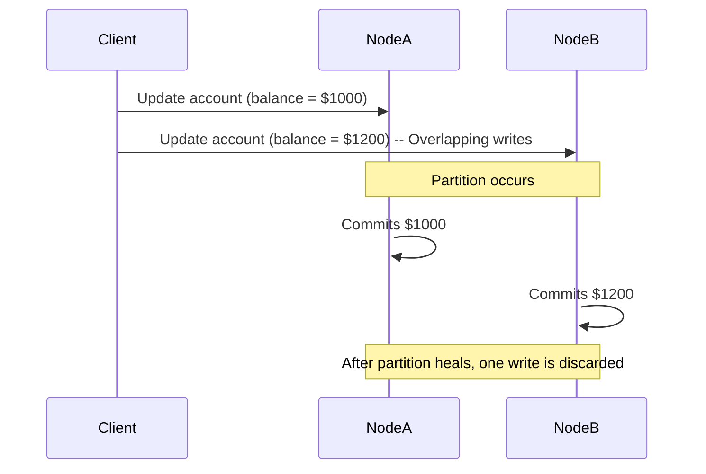

```markdown
# **Mastering Distributed Consistency: Techniques for Building Reliable APIs and Databases**

Distributed systems are the backbone of modern applications—scalable, resilient, and capable of handling global user traffic. But with their complexity comes a tradeoff: **eventual consistency**, where data across nodes may temporarily differ.

This post dives deep into **consistency techniques**—the patterns and strategies engineers use to balance performance, reliability, and correctness in distributed architectures. We’ll explore tradeoffs, real-world implementations, and when to apply each technique.

---

## **Introduction: Why Consistency Matters in Distributed Systems**

In monolithic applications, consistency is often assumed: a single database, a single thread of execution, and no external dependencies. But as systems grow, so do the challenges:

- **Microservices** communicate asynchronously, introducing latency.
- **Replication** ensures high availability but risks splitting data across nodes.
- **Eventual consistency** becomes the norm, not a bug.

Modern APIs (REST, GraphQL, gRPC) and databases (PostgreSQL, MongoDB, DynamoDB) expose tradeoffs between **strength of consistency** (how tightly coupled data must be) and **availability** (how quickly operations succeed). This is the **CAP Theorem** in practice: you can’t have all three—consistency, availability, and partition tolerance—simultaneously in a distributed environment.

This guide equips you with **practical consistency techniques** to implement based on your application’s needs. We’ll cover:
- **Strong consistency** (linearizable operations)
- **Weak consistency** (read-after-write guarantees)
- **Tunable consistency** (tradeoff mechanisms)
- **Quorum-based techniques** (Raft, Paxos)
- **Conflict resolution** (CRDTs, operational transforms)

---

## **The Problem: When Lack of Consistency Bites**

Consistency issues manifest in subtle ways—sometimes catastrophic. Here are real-world examples:

### **1. The Double-Spend Bug**
A payment service processes two identical transactions for the same credit card, draining the account twice before the conflict is detected. This happens when:
- A write is replicated to multiple nodes _asynchronously_.
- A subsequent read misses one of the writes due to network delays.

```sql
-- User A withdraws $100
UPDATE accounts SET balance = balance - 100 WHERE id = 'user_a';
-- Replication delay: Node B hasn’t seen this yet
-- User A withdraws $100 again
UPDATE accounts SET balance = balance - 100 WHERE id = 'user_a'; -- Now balance = -$100!
```

### **2. The Missing Update**
A user requests their balance but sees an outdated value because their last deposit hasn’t replicated across all regions yet.

```sql
-- Client reads balance from Node A (outdated)
SELECT balance FROM accounts WHERE id = 'user_a'; -- Returns $500
-- Meanwhile, Node B processed a $200 deposit but hasn’t synced
```

### **3. The Split-Brain Scenario**
A replicated database splits in two after a network partition, and each replica accepts conflicting writes. After the partition heals, one dataset is lost.



### **The Cost of Ignoring Consistency**
- **Financial losses** (double spends, incorrect billings).
- **User frustration** (inconsistent UI states, slow responses).
- **Data corruption** (silent race conditions).

To combat these, we need **consistency techniques**—mechanisms to control how and when data is synchronized across replicas.

---

## **The Solution: Consistency Techniques**

No single technique fits all use cases. The choice depends on:
- **Latency tolerance** (can users wait for strong consistency?).
- **Availability requirements** (must the system handle partitions?).
- **Data model** (key-value, document, relational).

Here’s a taxonomy of consistency techniques, ranked from **strongest to weakest**:

| Technique               | Description                                                                 | Use Cases                                  |
|-------------------------|-----------------------------------------------------------------------------|---------------------------------------------|
| **Strong Consistency**  | Reads return the latest committed write.                                | Banking, inventory systems.                 |
| **Causal Consistency**  | Reads see writes from the same causal chain (not necessarily all writes).  | Collaborative editing, chat applications.   |
| **Session Consistency** | Reads within a session see consistent data.                              | Personalized dashboards.                    |
| **Read-Your-Writes**    | A user’s writes are visible to their reads (eventual or strong).           | User profiles, settings.                    |
| **Monotonic Reads**     | Repeated reads never return stale data (but may skip recent writes).      | Analytics dashboards.                       |
| **Monotonic Writes**    | Writes don’t lose ordering.                                               | Audit logs.                                 |
| **Weak Consistency**    | Reads may see stale data (e.g., last-write-wins).                          | Caching, CDNs, high-throughput systems.     |

---

## **Components/Solutions**

We’ll explore **five key techniques**, each with tradeoffs and code examples.

---

### **1. Strong Consistency: Linearizable Operations**
**Definition**: A read operation returns a value that was committed by some previous write. No intermediate states are visible.

**How it works**:
- Use a **quorum-based protocol** (e.g., Raft, Paxos) to ensure agreement.
- Reads and writes require acknowledgments from a majority of replicas.

**Tradeoffs**:
- **High latency**: Writes block until a majority responds.
- **Low throughput**: Each operation requires consensus.

**Example: Raft-Based Strong Consistency (Pseudocode)**
```python
# In a Raft cluster (3 nodes)
def apply_write(key, value):
    # 1. Leader replicates to a majority (e.g., 2 nodes)
    if not majority_acknowledgment(key, value):
        raise "Consensus failed"
    # 2. Apply to local log
    write_to_log(key, value)
    # 3. Respond to client
    return "Success"

def read(key):
    # 1. Leader checks if the key exists in the committed log
    if not log_contains(key):
        return None
    # 2. Return the latest value
    return read_from_log(key)
```

**When to use**:
- Critical financial transactions.
- Systems requiring ACID compliance.

**Example Database**: PostgreSQL (by default uses strong consistency).

---

### **2. Quorum-Based Techniques: Paxos and Raft**
**Definition**: Ensure consensus by requiring acknowledgments from a quorum of nodes.

**How it works**:
- **Paxos**: General-purpose consensus algorithm for async systems.
- **Raft**: Simpler, more readable alternative with a leader election mechanism.

**Tradeoffs**:
- **Complexity**: Hard to implement correctly.
- **Performance overhead**: Each write requires network rounds.

**Example: Raft Leader Election (Simplified)**
```python
# Pseudocode for Raft leader election
def vote_for_candidate(term, candidate_id):
    if term > current_term or not is_voter_eligible():
        return False
    current_term = term
    voted_for = candidate_id
    return True

def become_leader():
    log = get_committed_log()
    for follower in followers:
        send_append_entries(follower, log)
    while True:
        await client_requests()  # Process client requests
```

**When to use**:
- Multi-datacenter replication.
- Systems requiring high availability with strong consistency.

**Example Databases**:
- etcd (Raft-based).
- Consul (Raft-based).

---

### **3. Eventual Consistency with Conflict Resolution**
**Definition**: Reads may return stale data, but all replicas will converge eventually.

**How it works**:
- Use **last-write-wins (LWW)** or **merge strategies** (e.g., CRDTs).

**Tradeoffs**:
- **Inconsistent reads**: Users may see stale data.
- **Conflict resolution overhead**: Handling merge conflicts.

**Example: Last-Write-Wins in DynamoDB**
```javascript
// DynamoDB automatically resolves conflicts with LWW
const updateUser = async (userId, data) => {
  await dynamodb.update({
    TableName: "users",
    Key: { userId },
    UpdateExpression: "SET last_name = :name",
    ExpressionAttributeValues: { ":name": data.lastName },
    ConditionExpression: "version = :expectedVersion", // Optimistic locking
    ExpressionAttributeValues: { ":expectedVersion": currentVersion }
  }).promise();
};
```

**Conflict Resolution with CRDTs (Pseudocode)**
```javascript
class CounterCRDT {
  constructor(initial = 0) {
    this.count = initial;
    this.versions = {}; // Track causality
  }
  increment() {
    this.count += 1;
    this.versions[this.count] = { operation: "inc" };
  }
  merge(other) {
    // Merge using version vectors
    const mergedCount = Math.max(this.count, other.count);
    return new CounterCRDT(mergedCount);
  }
}
```

**When to use**:
- High-throughput systems (e.g., social media feeds).
- Tolerating short-lived inconsistency.

**Example Databases**:
- DynamoDB (eventual consistency by default).
- Cassandra (tunable consistency).

---

### **4. Tunable Consistency: Customizing Tradeoffs**
**Definition**: Let clients specify consistency levels per operation (e.g., "one-read, two-writes").

**How it works**:
- Use **consistency levels** (e.g., in Cassandra or ScyllaDB).

**Example: Cassandra Consistency Levels**
```python
# Cassandra CQL: One-read, two-writes for strong consistency
session.execute(
  "UPDATE accounts SET balance = balance - 100 WHERE user_id = ?",
  (user_id,),
  consistency_level=ConsistencyLevel.TWO
)
result = session.execute(
  "SELECT balance FROM accounts WHERE user_id = ?",
  (user_id,),
  consistency_level=ConsistencyLevel.ONE
)
```

**Tradeoffs**:
- **Complexity**: Clients must handle consistency per query.
- **Performance**: Higher consistency levels slow down writes.

**When to use**:
- Applications with mixed consistency needs (e.g., analytics + transactions).

**Example Databases**:
- Cassandra.
- ScyllaDB.

---

### **5. Conflict-Free Replicated Data Types (CRDTs)**
**Definition**: Data structures that automatically merge without conflicts.

**How it works**:
- Each operation includes **causal context** (e.g., timestamps, vectors).
- Merges are commutative and associative.

**Example: CRDT for a Counter**
```python
// JavaScript CRDT counter (simplified)
class CRDTCounter {
  constructor() {
    this.value = 0;
    this.clocks = {}; // Track causality
  }
  increment() {
    const newClock = { ...this.clocks, timestamp: Date.now() };
    this.clocks = newClock;
    this.value += 1;
    return { type: "increment", value: this.value };
  }
  merge(other) {
    this.value = Math.max(this.value, other.value);
    return this;
  }
}
```

**Tradeoffs**:
- **Higher storage overhead** (version vectors).
- **Slower operations** (due to causality tracking).

**When to use**:
- Offline-first applications (e.g., collaborative docs).
- Systems requiring strong eventual consistency.

**Example Tools**:
- Automerge (JavaScript).
- Yjs (CRDT-based collaborative editor).

---

## **Implementation Guide**

### **Step 1: Define Consistency Requirements**
Ask:
1. **What’s the maximum acceptable latency for reads/writes?**
2. **Can the system tolerate temporary inconsistencies?**
3. **What’s the impact of a consistency violation?**

| Use Case               | Preferred Technique               |
|------------------------|------------------------------------|
| Banking transactions   | Strong consistency (Raft/Paxos)    |
| Social media feed      | Eventual consistency (LWW)         |
| Collaborative editor   | CRDTs                              |

### **Step 2: Choose a Protocol or Library**
| Technique          | Recommended Libraries/Protocols |
|--------------------|---------------------------------|
| Strong consistency | Raft, Paxos, etcd               |
| Tunable consistency | Cassandra, ScyllaDB             |
| CRDTs              | Automerge, Yjs                  |
| Eventual consistency | DynamoDB, MongoDB (replica sets) |

### **Step 3: Implement with Tradeoffs in Mind**
- **For Raft/Paxos**: Use existing implementations (e.g., [Raft.js](https://github.com/hamidreza-m/raft.js)).
- **For CRDTs**: Start with a library and customize.
- **For eventual consistency**: Accept staleness and add retries.

### **Step 4: Test Edge Cases**
- **Network partitions**: Simulate with [Chaos Engineering](https://principlesofchaos.org/).
- **Concurrent writes**: Test race conditions.
- **Reboots**: Ensure recovery works.

---

## **Common Mistakes to Avoid**

1. **Assuming "Eventual Consistency" Means "Fast"**
   - Eventual consistency can lead to **stale reads** and **silent errors**. Always add retries or version checks.

2. **Ignoring Partition Tolerance**
   - Systems must handle network splits. Use protocols like Raft that **elect leaders** during partitions.

3. **Overusing Strong Consistency Everywhere**
   - Strong consistency kills performance. Use **tunable consistency** for non-critical reads.

4. **Not Handling Conflicts Explicitly**
   - If using LWW, add **version vectors** or **timestamps** to detect conflicts early.

5. **Skipping Monitoring for Consistency**
   - Use tools like **Prometheus** to track:
     - Replication lag.
     - Failed quorums.
     - Read-after-write latency.

---

## **Key Takeaways**
✅ **Strong consistency** = correctness but higher latency. Use for financial/critical data.
✅ **Eventual consistency** = performance but requires conflict resolution.
✅ **CRDTs** = great for offline-first apps (e.g., collaborative tools).
✅ **Tunable consistency** = balance for mixed workloads (e.g., reads vs. writes).
✅ **Quorums (Raft/Paxos)** = gold standard for strong consistency in distributed systems.
✅ **Monitor replication lag** to detect consistency issues early.
✅ **Test partitions**—assume network failures will happen.

---

## **Conclusion: Consistency is a Spectrum, Not a Binary Choice**

There’s no "one-size-fits-all" solution. The best approach depends on your **latency tolerance**, **availability needs**, and **data model**.

- **Start with eventual consistency** if you can tolerate staleness.
- **Use strong consistency** for critical operations (e.g., payments).
- **Leverage CRDTs** for collaborative applications.
- **Monitor and tune** based on real-world usage.

Consistency techniques are **tools**, not rules. Use them intentionally, measure their impact, and iterate.

Now go build a system where data behaves predictably—even at scale.

---
**Further Reading**
- [CAP Theorem (Gilbert & Lynch)](https://www.cs.berkeley.edu/~brewer/cs262b-handout.pdf)
- [Raft Consensus Algorithm](https://raft.github.io/)
- [CRDTs Explained](https://www.particle.in/particle-news/conflict-free-replicated-data-types-crdts/)
- [DynamoDB Consistency Models](https://docs.aws.amazon.com/amazondynamodb/latest/developerguide/HowItWorks.Consistency.html)
```

This post balances theory with practical examples, highlights tradeoffs, and provides actionable guidance for backend engineers.