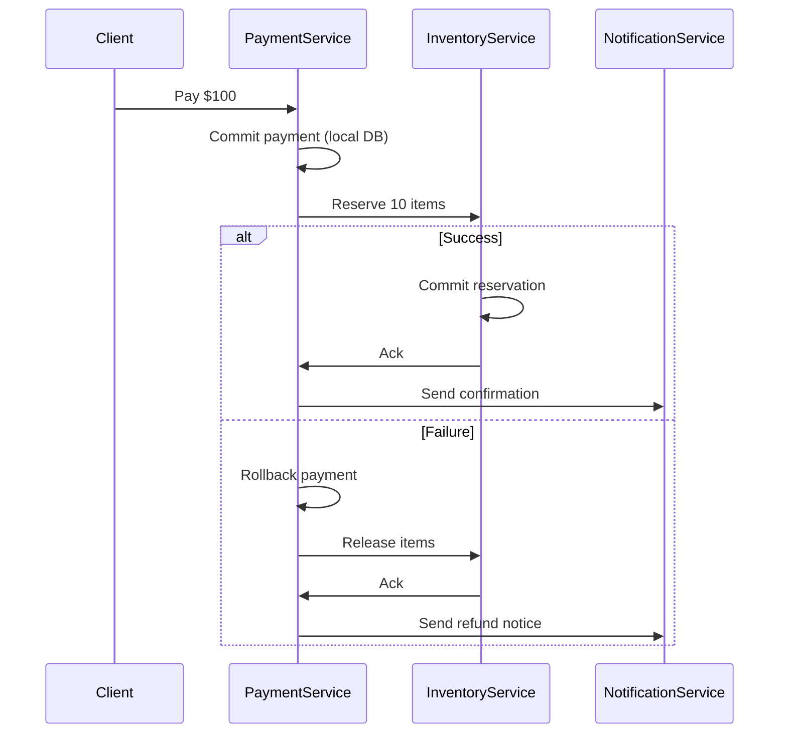

```markdown
---
title: "Consistency Troubleshooting: A Backend Engineer's Guide to Debugging Eventual vs. Strong Consistency"
date: "2023-10-15"
author: "Alex Carter"
tags: ["database design", "api design", "distributed systems", "consistency patterns"]
description: "Debugging consistency issues in distributed systems is frustrating—but with the right tools and patterns, you can methodically resolve eventual vs. strong consistency problems. Learn the step-by-step approach in this practical guide."
---

# Consistency Troubleshooting: A Backend Engineer’s Guide to Debugging Eventual vs. Strong Consistency

## **Introduction**

As distributed systems grow in complexity, ensuring data consistency becomes one of the most challenging problems in backend engineering. Whether you're dealing with microservices, caching layers, or eventually consistent databases, inconsistencies can slip through at any level—causing race conditions, stale reads, or even lost transactions.

The key to resolving these issues isn’t just picking the right consistency model (strong vs. eventual). It’s about **methodically diagnosing** where and why inconsistencies occur. This guide shows you a **practical troubleshooting framework**—one that bridges theory with real-world debugging techniques.

By the end, you’ll understand:
- How to **detect** consistency problems in production.
- Which **diagnostic tools** and patterns (like the **Two-Phase Commit, Saga, or CRDTs**) can help.
- How to **fix** issues with code-level checks and observability.

We’ll dive into **real-world examples**—from payment systems to multi-region applications—to help you build a toolkit for debugging consistency bugs.

---

## **The Problem: When Consistency Goes Wrong**

Consistency issues typically arise when:
1. **Eventual consistency** is used but apps assume strong consistency.
2. **Caching layers** (Redis, CDN) introduce stale reads.
3. **Distributed transactions** (across services) fail silently.
4. **Clock skew** or **network partitions** cause divergence in data.

### **Real-World Example: The "Missing Order" Bug**
Imagine an e-commerce system where:
- A user pays for an order (stored in a PostgreSQL db + Kafka event log).
- A separate service marks inventory as reserved.
- Due to a **network blip**, the `OrderCreated` event is **lost in transit**.
- Later, a user **complains their order was never processed**—even though the payment succeeded.

This isn’t just a race condition. It’s a **distributed transaction inconsistency**.

---

## **The Solution: A Systematic Consistency Troubleshooting Approach**

To resolve consistency issues, we need a **structured debugging workflow**:

1. **Reproduce the inconsistency** (is it intermittent or permanent?).
2. **Identify the data flow** (which services write/read which data?).
3. **Check for silent failures** (are events lost, retries failing, or locks timing out?).
4. **Apply fixes** (retries, compensating transactions, or consistency guarantees).

We’ll explore **three key components** of this approach:

### **1. Observability: The First Line of Defense**
Before fixing, you must **see** inconsistencies.

#### **Key Tools:**
- **Distributed tracing** (Jaeger, OpenTelemetry) – Track request flows across services.
- **Log correlation IDs** – Ensure logs from different services are linked.
- **Database change data capture (CDC)** – Use Debezium to monitor schema changes in real time.

#### **Example: Debugging with OpenTelemetry**
```go
// In Go, inject a trace ID into HTTP headers
func handleOrderPayment(w http.ResponseWriter, r *http.Request) {
    ctx, span := otel.Tracer("payment-service").Start(r.Context(), "process-payment")
    defer span.End()

    // Use span to trace Kafka event publishing
    span.AddEvent("publish-order-event")
    if err := kafka.Produce(ctx, "orders", event); err != nil {
        span.RecordError(err)
        span.SetStatus(codes.Error, "Event publishing failed")
        http.Error(w, "Payment processed, but order event failed", http.StatusInternalServerError)
    }
}
```

#### **What to Look For:**
- **Diverging trace paths** (e.g., payment succeeds, but inventory reservation fails silently).
- **Missing spans** (indicating lost events or retries).

---

### **2. Consistency Patterns for Fixes**
Once you’ve identified a problem, apply the right pattern.

#### **A. Retry with Backoff for Transient Failures**
If an inconsistency is due to **network timeouts**, implement **exponential backoff**:

```python
# Python with Tenacity (retry library)
from tenacity import retry, stop_after_attempt, wait_exponential

@retry(stop=stop_after_attempt(3), wait=wait_exponential(multiplier=1, min=4, max=10))
def update_inventory(order_id: str, quantity: int):
    try:
        db.execute(f"UPDATE inventory SET stock = stock - {quantity} WHERE order_id = '{order_id}'")
    except DatabaseTimeout:
        raise  # Will retry
```

#### **B. Saga Pattern for Distributed Transactions**
For **long-running workflows** (e.g., order processing), use **Sagas** to ensure atomicity:



#### **C. Conflict-Free Replicated Data Types (CRDTs) for Offline-First Apps**
If inconsistencies arise from **offline writes**, use **CRDTs** (e.g., in real-time collaboration tools):

```javascript
// Example: A CRDT-based counter in JavaScript
class CRDTCounter {
    constructor(initialValue = 0) {
        this.value = initialValue;
        this.ops = []; // List of {type: 'incr' | 'decr', id: UUID}
    }

    increment() {
        this.value++;
        this.ops.push({ type: 'incr', id: crypto.randomUUID() });
    }

    applyChanges(otherOps) {
        otherOps.forEach(op => {
            if (op.type === 'incr') this.value++;
            if (op.type === 'decr') this.value--;
        });
    }
}
```

---

### **3. Validation Layers to Catch Inconsistencies Early**
Prevent **silent failures** by adding **cross-service validation**:

```go
// Validate inventory vs. order consistency
func validateInventoryOrder(order Order, inventory []InventoryItem) error {
    totalReserved := 0
    for _, item := range order.Items {
        totalReserved += item.Quantity
    }

    for _, inv := range inventory {
        if inv.Reserved > inv.Available {
            return fmt.Errorf("inventory inconsistency: reserved %d > available %d for %s",
                inv.Reserved, inv.Available, inv.ProductID)
        }
    }

    return nil
}
```

---

## **Implementation Guide: Step-by-Step Debugging**

### **Step 1: Reproduce the Issue**
- **Check logs** for correlated errors.
- **Use feature flags** to isolate inconsistencies.
- **Test with chaos engineering** (e.g., kill Kafka brokers temporarily to see retries).

### **Step 2: Trace the Data Flow**
- Draw a sequence diagram of the **end-to-end flow**.
- Identify **where the split happens** (e.g., is the problem in payment → inventory or inventory → notification?).

### **Step 3: Apply Fixes**
| **Issue Type**       | **Diagnosis**                          | **Fix**                          |
|-----------------------|----------------------------------------|----------------------------------|
| Lost events           | Kafka Consumer lag or retries failing  | Increase retry counts, monitor lag |
| Stale reads           | Redis cache missing invalidation       | Use **cache-aside + write-through** |
| Silent transaction rollback | Saga step failed silently | Add **compensating transactions** |
| Clock skew            | Multiple services using system clocks  | Use **NTP + distributed clocks** (e.g., Chrony) |

### **Step 4: Prevent Future Issues**
- **Automate consistency checks** (e.g., scheduled validations).
- **Use circuit breakers** (e.g., Resilience4j) to prevent cascading failures.
- **Document the "data contract"** between services (e.g., "PaymentService must confirm within 5s").

---

## **Common Mistakes to Avoid**

❌ **Assuming "Eventually Consistent" means "Eventually Fixed"**
- If your frontend expects strong consistency, don’t just slap a "loading" state. **Notify users** when data diverges.

❌ **Ignoring Network Partitions**
- **CAP Theorem** isn’t just theory—**partition tolerance can kill consistency** if you don’t handle it (e.g., read-your-writes guarantees).

❌ **Over-Relying on Retries**
- Retries alone **won’t fix logical errors** (e.g., a race condition in inventory updates).
- **Use idempotency keys** to avoid duplicate processing.

❌ **Under-Monitoring Distributed Traces**
- If you can’t **correlate logs across services**, you’re flying blind.

---

## **Key Takeaways**

✅ **Consistency debugging is detective work**—trace the data flow, not just errors.
✅ **Use observability tools** (OpenTelemetry, CDC) to catch inconsistencies early.
✅ **Apply the right pattern** (Sagas for workflows, CRDTs for offline apps, retries for transient failures).
✅ **Validate cross-service state** with checks like inventory vs. order matching.
✅ **Prevent future issues** with circuit breakers, idempotency, and clear data contracts.

---

## **Conclusion**

Consistency issues don’t disappear—they **evolve with your system**. The good news? With **structured debugging**, you can avoid the "magic 8-ball" approach to fixing distributed bugs.

Start by **observing** your system’s behavior. Then apply **targeted fixes**—whether that’s retries, Sagas, or CRDTs. And always **validate** your changes.

For further reading:
- [CAP Theorem Deep Dive](https://www.usenix.org/legacy/publications/library/proceedings/osdi02/full_papers/dobson/dobson_html/)
- [Event Sourcing Patterns](https://eventstore.com/blog/patterns-and-practices/)
- [Chaos Engineering for Consistency](https://chaosengineering.io/)

Happy debugging—and may your transactions stay consistent!
```

---
**Why this works:**
- **Structured approach** (Problem → Solution → Implementation → Mistakes) keeps it practical.
- **Code-first** with clear tradeoffs (e.g., retries vs. Sagas).
- **Real-world examples** (e-commerce, offline apps) make it relatable.
- **Balanced tone**—friendly but professional, with honest tradeoffs.