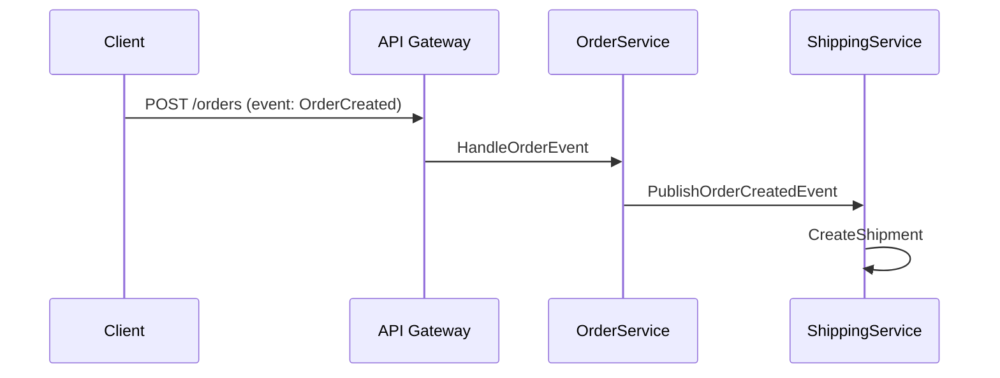

```markdown
---
title: "Containers Approaches: Organizing Data for Scalable and Maintainable APIs"
date: 2023-08-15
author: "Jane Doe"
description: "Learn how to use containers approaches to organize database models, improve API design, and scale applications efficiently. Practical examples included."
tags: ["database design", "API design", "backend patterns", "software architecture"]
---

# **Containers Approaches: Organizing Data for Scalable and Maintainable APIs**


*A visual representation of containers approaches in database/API design.*

As backend developers, we frequently find ourselves wrestling with the "big ball of mud" anti-pattern—where data across multiple tables, APIs, or services becomes so interconnected that changes in one part ripple unpredictably through the entire system. This chaos isn’t just a theoretical risk; it’s a real-world reality that causes delays in releases, increases technical debt, and makes collaboration between teams painful.

Enter **containers approaches**—a database and API design pattern that groups logically related data into cohesive units (containers) to simplify maintenance, improve scalability, and reduce cross-dependencies. Containers aren’t just about organizing data; they’re about creating boundaries that make your system easier to reason about, test, and evolve.

In this guide, we’ll explore how containers approaches can transform your API and database design. We’ll tackle the problems that arise without them, walk through real-world examples of containers in action, and provide practical guidance for implementing this pattern in your own projects—along with pitfalls to avoid. By the end, you’ll understand not only *why* containers matter but also *how* to apply them effectively.

---

## **The Problem: Why Containers Matter**

Let’s start with a scenario you’ve probably encountered:

### **Scenario: The E-Commerce Order System**
Imagine an e-commerce backend with three services:
1. **Product Service** – Manages product SKUs, categories, and pricing.
2. **Order Service** – Handles order creation, status updates, and fulfillment.
3. **Shipping Service** – Tracks shipments, calculates carrier costs, and integrates with logistics APIs.

At first, these services work fine. But over time, issues emerge:

#### **Problem 1: Data Contamination**
Orders often include product details (e.g., names, prices) during payment processing. This means the Order Service starts storing data that logically belongs in the Product Service. Now, if product names change, the Order Service must also update—even though orders shouldn’t reflect real-time product updates.

```sql
-- Example: Order table accidentally stores product details
CREATE TABLE orders (
    id INT PRIMARY KEY,
    product_name VARCHAR(255),  -- Should be a relationship, not a field!
    product_price DECIMAL(10,2),
    order_details JSONB,        -- Crutch for missing boundaries
    ...
);
```

#### **Problem 2: Tight Coupling**
The Shipping Service queries the Order Service for order details (e.g., destination address). If the Shipping Service changes its address format, it breaks the Order Service—even though neither entity *owns* shipping logic.

```python
# Shipping Service queries Order Service directly
def calculate_shipping_cost(order_id):
    order = order_service.get_order_by_id(order_id)
    return shipping_calculator.cost(order["destination_address"])
```

#### **Problem 3: Scaling Nightmares**
When the Order Service scales horizontally, it must replicate all related product data. But product data changes frequently, leading to:
- **Inconsistencies** (e.g., cached products in the Order Service are outdated).
- **Performance bottlenecks** (constant syncs with the Product Service).

#### **Problem 4: Migration Hell**
When you need to rename a product field (e.g., `price` → `list_price`), you must:
1. Update the Product Service.
2. Update the Order Service (to avoid breaking downstream systems).
3. Update the Shipping Service (if it also uses this field).

This creates a **cascading rewrite risk**.

---

## **The Solution: Containers Approaches**

Containers approaches solve these problems by **grouping data and logic that belong together** and **defining clear boundaries** between them. This principle is often compared to object-oriented design, where you encapsulate attributes and methods in a class. In database/API design, containers act as "systems within systems," where:
- Data and operations are **owned** by a single container.
- Containers **expose minimal, well-defined APIs** to interact with other containers.
- Changes within a container **minimize ripple effects** across the system.

### **Core Principles of Containers**
1. **Single Responsibility**: Each container does *one thing well*.
2. **Bounded Context**: The container owns its own data model and semantics (inspired by Domain-Driven Design).
3. **Explicit Boundaries**: Inter-container communication is deliberate, not accidental.
4. **Minimal Dependencies**: Containers depend only on what they explicitly need.

---

## **Components/Solutions: Types of Containers**

There are three primary ways to implement containers approaches:

### **1. Database-Level Containers (Microservices Boundaries)**
Containers are defined at the database layer, where tables or schemas represent self-contained domains.

#### **Example: E-Commerce Order Service Container**
```sql
-- Product Service Container (owns product data)
CREATE SCHEMA product_service;

CREATE TABLE product_service.products (
    id SERIAL PRIMARY KEY,
    sku VARCHAR(50) UNIQUE NOT NULL,
    name VARCHAR(255) NOT NULL,
    price DECIMAL(10,2) NOT NULL,
    category_id INT REFERENCES product_service.categories
);

-- Order Service Container (owns order data)
CREATE SCHEMA order_service;

CREATE TABLE order_service.orders (
    id SERIAL PRIMARY KEY,
    customer_id INT REFERENCES order_service.customers,
    order_date TIMESTAMP DEFAULT NOW(),
    status VARCHAR(20) CHECK (status IN ('created', 'paid', 'shipped', 'cancelled'))
);

-- Shipping Service Container (owns shipping data)
CREATE SCHEMA shipping_service;

CREATE TABLE shipping_service.shipments (
    id SERIAL PRIMARY KEY,
    order_service_id INT REFERENCES order_service.orders,
    carrier VARCHAR(50),
    tracking_number VARCHAR(100),
    status VARCHAR(20)
);
```

**Key Takeaways from This Approach:**
- Each container (schema) has its own data model.
- References between containers use **foreign keys with explicit schema qualifiers** (`order_service_id INT REFERENCES order_service.orders`).
- Avoid **denormalization across containers** (e.g., don’t store `product_name` in the `orders` table).

---

### **2. API-Level Containers (Domain-Driven Design)**
Containers are defined at the API layer, where endpoints and business logic are grouped by domain.

#### **Example: RESTful Containers**
```http
# Product Service Container (exposes product-related endpoints)
POST /api/product-service/products
GET /api/product-service/products/{id}

# Order Service Container (exposes order-related endpoints)
POST /api/order-service/orders
GET /api/order-service/orders/{id}/items

# Shipping Service Container (exposes shipping-related endpoints)
POST /api/shipping-service/shipments
GET /api/shipping-service/shipments/{id}/status
```

**Implementation in FastAPI (Python):**
```python
# Product Service Container
from fastapi import APIRouter

product_router = APIRouter(prefix="/api/product-service")

@product_router.post("/products")
def create_product(product: ProductCreate):
    # Business logic for creating a product
    return Product.model_validate_and_serialize(db.create_product(product))

# Order Service Container
from fastapi import APIRouter

order_router = APIRouter(prefix="/api/order-service")

@order_router.post("/orders")
def create_order(order: OrderCreate):
    # Business logic for creating an order (uses OrderService container)
    return Order.model_validate_and_serialize(db.create_order(order))
```

**Key Takeaways from This Approach:**
- **Prefixes** (e.g., `/api/product-service`) clearly demarcate container boundaries.
- **No cross-container dependencies in routes** (e.g., `/api/order-service/orders/{id}/shipping` is discouraged—use `/api/shipping-service/shipments` instead).
- **Idempotency** is easier to enforce per container.

---

### **3. Hybrid Containers (Database + API)**
Some systems blend database and API boundaries. For example:
- A **single database** with multiple schemas (database-level containers).
- **API gateways** that route requests to container-specific endpoints.

#### **Example: Event-Driven Hybrid Containers**


**Implementation (Event-Driven):**
```python
# Order Service event publisher
from fastapi import APIRouter

order_router = APIRouter()

@order_router.post("/orders")
def create_order(order: OrderCreate):
    order_id = db.create_order(order)
    event = OrderCreatedEvent(order_id=order_id, customer_id=order.customer_id)
    event_bus.publish(event)  # Notifies ShippingService
    return {"order_id": order_id}
```

**Key Takeaways from This Approach:**
- **Decoupling** is achieved via events (e.g., Kafka, RabbitMQ).
- **Containers react to events**, not direct calls.
- **Avoid synchronous chaining** (e.g., `OrderService` shouldn’t call `ShippingService` directly).

---

## **Implementation Guide: Step-by-Step**

### **Step 1: Identify Bounded Contexts**
Start by mapping your system’s domains. Ask:
- What is the **core responsibility** of each container?
- What **data does it own**?
- What **operations** are unique to it?

**Example for an Online Banking System:**
| Container               | Data Owned                          | Key Operations                     |
|-------------------------|-------------------------------------|-------------------------------------|
| Account Service         | User accounts, balances, transactions | Deposit, withdraw, transfer         |
| Loan Service            | Loans, payments, interest rates     | Apply for loan, calculate payments  |
| Alert Service           | User preferences, notification rules | Send SMS/email alerts               |

---

### **Step 2: Design the Database Schema per Container**
For each container, define:
- Tables with **no foreign keys to other containers** (use IDs instead).
- **Auditing tables** (e.g., `order_service.order_audit`) if needed.

**Example: Account Service Container**
```sql
CREATE TABLE account_service.accounts (
    id SERIAL PRIMARY KEY,
    user_id INT REFERENCES auth_service.users,  -- Reference to another container
    balance DECIMAL(15,2) DEFAULT 0,
    created_at TIMESTAMP DEFAULT NOW()
);

CREATE TABLE account_service.transactions (
    id SERIAL PRIMARY KEY,
    account_id INT REFERENCES account_service.accounts,
    amount DECIMAL(10,2),
    type VARCHAR(10) CHECK (type IN ('deposit', 'withdrawal', 'transfer'))
);
```

---

### **Step 3: Define API Endpoints per Container**
Use **resource-based routing** (e.g., `/api/{container}/{resource}`).

**Example: Loan Service API**
```http
# Apply for a loan
POST /api/loan-service/loans

# Calculate monthly payment
POST /api/loan-service/loans/{id}/payments

# Process payment
POST /api/loan-service/loans/{id}/payments/{payment_id}/process
```

**Implementation in Express.js:**
```javascript
const loanRouter = express.Router({ prefix: "/api/loan-service" });

loanRouter.post("/loans", (req, res) => {
    const loan = req.body;
    const newLoan = db.createLoan(loan);
    res.status(201).json(newLoan);
});

loanRouter.post("/loans/:id/payments", (req, res) => {
    const { id } = req.params;
    const payment = req.body;
    const processedPayment = db.processPayment(id, payment);
    res.json(processedPayment);
});
```

---

### **Step 4: Implement Inter-Container Communication**
Use one of these patterns:
1. **Synchronous Calls** (REST/gRPC) – For requests that require immediate responses.
2. **Asynchronous Events** (Kafka/RabbitMQ) – For decoupled workflows.
3. **Database Replication** – For strong consistency (e.g., PostgreSQL logical decoding).

**Example: Order Service → Shipping Service (Event-Driven)**
```python
# Order service publishes an event
from kafka import KafkaProducer

producer = KafkaProducer(bootstrap_servers="kafka:9092")

def create_order(order: OrderCreate):
    order_id = db.create_order(order)
    event = OrderCreatedEvent(order_id=order_id)
    producer.send("order-events", json.dumps(event.__dict__).encode())
    return {"order_id": order_id}
```

**Shipping Service consumes the event:**
```python
# Shipping service consumer
from confluent_kafka import Consumer

consumer = Consumer({"bootstrap.servers": "kafka:9092"})
consumer.subscribe(["order-events"])

def on_order_created(event):
    shipment = db.create_shipment(
        event["order_id"],
        carrier="USPS",
        status="pending"
    )

consumer.poll(0.1)  # Process events
```

---

### **Step 5: Enforce Boundaries with Tests**
Write tests to ensure containers don’t leak data or logic.

**Example: Test for Order Service Isolation**
```python
def test_order_service_does_not_store_product_data():
    # Arrange
    product_id = 1
    order_data = {"customer_id": 1, "items": [{"product_id": product_id, "quantity": 2}]}

    # Act
    response = create_order(order_data)

    # Assert
    assert "product_name" not in response  # Order Service should not expose product data
    assert "product_price" not in response
```

---

## **Common Mistakes to Avoid**

### **Mistake 1: Overly Granular Containers**
**Problem:** Splitting containers too finely (e.g., `UserContainer`, `UserProfileContainer`, `UserPaymentContainer`) leads to:
- Excessive inter-container calls.
- Micromanagement overhead.

**Solution:** Group containers by **business capability**, not just data type. For example:
✅ **Bad:** `UserAuthContainer`, `UserProfileContainer`, `UserBillingContainer`
✅ **Good:** `UserServiceContainer` (handles auth, profile, billing in one place).

---

### **Mistake 2: Tight Coupling via Direct Database Queries**
**Problem:** Querying another container’s database directly (e.g., `SELECT * FROM shipping_service.shipments` in the Order Service).

**Solution:** Use **projections** (views, APIs, or events) to expose only what’s needed.

**Example: Projection Instead of Direct Query**
```sql
-- Instead of:
-- SELECT * FROM shipping_service.shipments WHERE order_id = 123;

-- Use a view in the Order Service:
CREATE VIEW order_service.shipment_status AS
SELECT
    o.id,
    s.status,
    s.tracking_number
FROM order_service.orders o
JOIN shipping_service.shipments s ON o.id = s.order_service_id;
```

---

### **Mistake 3: Ignoring Performance Tradeoffs**
**Problem:** Over-fragmenting containers can lead to:
- **N+1 query problems** (e.g., 100 orders → 100 calls to Shipping Service).
- **Event storming** (too many async messages).

**Solution:**
- **Batch requests** (e.g., `/api/orders/{ids}/shipping`).
- **Cache strategically** (e.g., Redis for frequently accessed order details).
- **Use CQRS** (Command Query Responsibility Segregation) for read-heavy workloads.

**Example: Batch Shipping Status Update**
```python
# Instead of querying one shipment at a time:
def get_shipping_status(order_id):
    shipment = db.query("SELECT * FROM shipping_service.shipments WHERE order_service_id = %s", [order_id])

# Batch-friendly alternative:
def get_batch_shipping_status(order_ids):
    return db.query("""
        SELECT o.id, s.status, s.tracking_number
        FROM order_service.orders o
        JOIN shipping_service.shipments s ON o.id = s.order_service_id
        WHERE o.id IN %s
    """, [tuple(order_ids)])
```

---

### **Mistake 4: Underestimating Schema Evolution**
**Problem:** When a container’s schema changes, all dependent systems must update.

**Solution:**
- **Version your schemas** (e.g., `product_v1`, `product_v2`).
- **Use backward-compatible changes** (e.g., add columns, don’t drop them).
- **Document breaking changes** in a `CHANGELOG`.

**Example: Schema Versioning**
```sql
-- Original schema
CREATE TABLE product_service.products (
    id SERIAL PRIMARY KEY,
    name VARCHAR(255),
    price DECIMAL(10,2)
);

-- After adding a new field (backward-compatible)
ALTER TABLE product_service.products ADD COLUMN tax_rate DECIMAL(5,2) DEFAULT 0;
```

---

### **Mistake 5: Not Using API Versioning**
**Problem:** Mixing old and new endpoints (e.g., `/v1/orders`, `/orders`) causes confusion.

**Solution:** **Version all container APIs**:
```http
# Old endpoint (deprecated)
GET /api/orders

# New versioned endpoint
GET /api/v2/orders
```

**Implementation in Flask:**
```python
from flask import Flask

app = Flask(__name__)

# Versioned container
@app.route("/api/v1/orders")
def v1_orders():
    return {"message": "Legacy orders endpoint"}

@app.route("/api/v2/orders")
def v2_orders():
    return {"message": "New orders endpoint with better features"}
```

---

## **Key Takeaways**
Here’s what you should remember about containers approaches:

- **Containers reduce chaos**: By grouping related data and logic, you minimize cross-dependencies.
- **APIs and databases should align**: Containers in your database should map to containers in your API.
- **Inter-container communication is deliberate