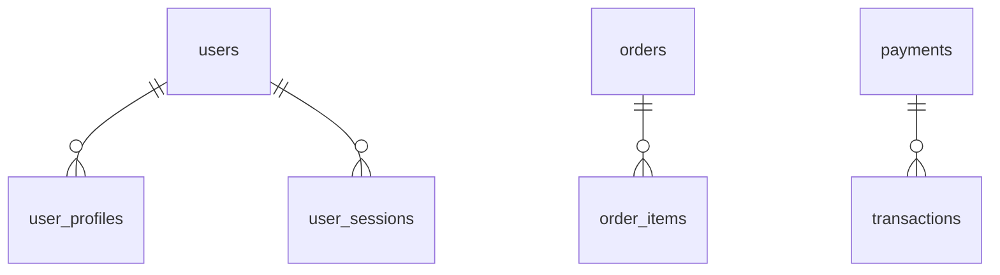

```markdown
# **Containers Conventions: Organizing Database Data for Scalability and Clarity**

*How to structure your databases so they’re as maintainable as your codebase—but better.*

---

## **Introduction**

Imagine this: You’re debugging a production outage at 2 AM. Your team’s database queries are slow, performance logs are everywhere, and the schema feels like it was designed by committee. Worse, you have to wade through a mess of tables with cryptic names like `tbl_user_abc123` and `logging_2023_05` to find the data you need.

This isn’t just a nightmare—it’s a symptom of a **missing container convention**. Without clear **logical grouping** of tables, schema versioning, and data ownership, even simple changes can spiral into chaos.

Back in 2015, [Joonas Lehtinen](https://joonaslehtinen.com/) introduced the **Containers Conventions** pattern—a way to structure databases by grouping related tables into containers, making them more predictable, easier to query, and much easier to maintain.

Today, this pattern isn’t just theory—it’s a battle-tested approach used in microservices, monoliths, and even distributed systems. In this guide, we’ll explore why containers matter, how to implement them, and how to avoid common pitfalls.

---

## **The Problem: Why Databases Need Container Conventions**

Databases grow differently than code. Unlike codebases, where functions and classes are tightly scoped, databases often accumulate tables like a digital hoarder’s closet. Over time, problems emerge:

### **1. The "Table Zoo" Problem**
Without conventions, tables proliferate without clear ownership. A single project might have:
- `user_profiles`, `user_settings`, and `user_audit_logs` (all related to users, but spread across the schema).
- `accounting_transactions`, `invoice_line_items`, and `tax_calculations` (finance-related but scattered).
- `session_states`, `web_page_views`, and `analytics_events` (mixed with business logic).

**Result?**
- **Query complexity** increases (joins across unrelated tables).
- **Schema migrations** become harder (changes affect unrelated services).
- **Performance degrades** (unrelated tables compete for indexes and locks).

### **2. The Schema Drift Nightmare**
When teams treat the database like a shared file system, conflicts arise:
- Team A adds `vip_flag` to `users` without consulting Team B.
- Team C renames `orders` to `purchase_orders` and forgets to update references.
- Legacy teams deploy `table_` prefixed tables while new teams prefer `tbl_`.

**Result?**
- **Downtime** during refactoring.
- **Security risks** (accidental exposure of sensitive data).
- **Debugging hell** (logs and queries don’t match the schema).

### **3. The Microservices Minefield**
When moving to microservices, container conventions **prevent**:
- A single `user_service` from bleeding into the `order_service` database.
- A `payment_gateway` team accidentally dropping tables used by `inventory`.
- A `logging` team overwriting `audit_logs` with their own schema.

**Result?**
- **Tight coupling** between services (despite best intentions).
- **Unpredictable failures** when one team’s changes break another’s.

---

## **The Solution: Containers as a Database Architecture Framework**

The **Containers Conventions** pattern solves these problems by:
✅ **Grouping related tables** into logical containers.
✅ **Defining clear ownership** (who manages the container?).
✅ **Enforcing naming conventions** (prefixes, prefixes, and prefixes).
✅ **Isolating changes** (migrations, queries, and access are scoped).

### **Core Principles**
1. **One Container = One Business Domain**
   A container should represent a **single bounded context** (per Domain-Driven Design). Examples:
   - `users` (for user accounts, permissions, profiles).
   - `orders` (for purchases, refunds, order history).
   - `payments` (for transactions, charges, disputes).

2. **Strict Naming Conventions**
   - **Prefixes**: Use consistent prefixes (e.g., `user_`, `order_`, `payment_`).
   - **Suffixes**: Avoid ambiguous names (e.g., `user_data` → `user_profile`).
   - **Avoid `tbl_` or `db_`**: These prefixes are relics of old systems. Let the container name suffice.

3. **Ownership Matters**
   - **One team owns one container** (e.g., the `orders` team manages all `order_*` tables).
   - **Migrations are container-scoped** (no global `ALTER TABLE` chaos).

4. **Separation of Concerns**
   - **Business data** (e.g., `user_addresses`) → Containers.
   - **Metadata/Infrastructure** (e.g., `schema_migrations`, `audit_logs`) → **Separate containers** (or external tools).

---

## **Components of Containers Conventions**

Let’s break down how containers work in practice.

### **1. The Container Itself**
A container is a **logical grouping** of tables with a shared prefix. Example:

| Container | Tables                          | Owner       |
|-----------|----------------------------------|-------------|
| `users`   | `user_profiles`, `user_sessions` | Auth Team   |
| `orders`  | `orders`, `order_items`, `shipments` | E-Commerce Team |
| `payments`| `transactions`, `chargebacks`    | Payments Team |

**Key Rules:**
- **No wildcard queries**: Avoid `SELECT * FROM user_*`.
- **Use explicit joins**: Always reference containers by prefix (`FROM users.user_profiles`).

### **2. Naming Conventions (Prefixes + Suffixes)**
Avoid:
```sql
-- Bad: No prefix, ambiguous
CREATE TABLE user_data (id INT, name VARCHAR(255));
```

Do:
```sql
-- Good: Explicit, scoped
CREATE TABLE user_profiles (id INT PRIMARY KEY, name VARCHAR(255));
```

**Prefixes to Use:**
| Prefix       | Example Tables               | Purpose                          |
|--------------|------------------------------|----------------------------------|
| `user_`      | `user_profiles`, `user_logins`| User-related data                |
| `order_`     | `order_items`, `shipments`    | Order lifecycle                   |
| `payment_`   | `transactions`, `charges`     | Financial data                   |
| `audit_`     | `audit_logs`                 | System metadata (optional container) |

**Suffixes to Avoid:**
❌ `_info`, `_data`, `_details` (too vague).
✅ `profiles`, `sessions`, `preferences` (specific).

### **3. Schema Ownership & Access Control**
Each container should have:
- **A clear owner** (who approves changes).
- **Row-level security** (if using PostgreSQL):
  ```sql
  -- Example: Restrict users table access to their own data
  ALTER DEFAULT PRIVILEGES IN SCHEMA users
      GRANT SELECT, INSERT, UPDATE ON TABLES TO user_team;
  ```
- **Audit trails** (written to a separate `audit_logs` container).

### **4. Migration Strategies**
- **Per-container migrations**: Use tools like **Flyway**, **Liquibase**, or **Alembic** to scope changes.
  ```yaml
  # Example Flyway migration file (users/users_v2.sql)
  --+---------+----------+----------+---------------------+
  |  Version  |  State   |  Type    |  File               |
  +-----------+----------+----------+---------------------+
  | 2         | UP       | SQL      | users/users_v2.sql  |
  +-----------+----------+----------+---------------------+
  ```
- **Schema versioning**: Store versions in `schema_versions` (a separate container or table).

### **5. Query Patterns**
**Bad (mixed containers):**
```sql
-- Mixes users and orders—hard to maintain!
SELECT u.name, o.total_amount
FROM users.user_data u
JOIN orders.order_items o ON u.id = o.user_id;
```

**Good (explicit containers):**
```sql
-- Clear, auditable, and easy to debug
SELECT u.name, oi.total_amount
FROM users.user_profiles u
JOIN orders.order_items oi ON u.id = oi.user_id;
```

---

## **Implementation Guide: Step-by-Step**

### **Step 1: Audit Your Current Schema**
Run this query to find ungrouped tables:
```sql
-- PostgreSQL example (find tables without a clear prefix)
SELECT table_name
FROM information_schema.tables
WHERE table_schema = 'public'
  AND table_name NOT LIKE 'schema_%'
  AND table_name NOT LIKE 'pg_%';
```

**Result:** A list of chaotic tables (e.g., `user_data`, `invoice_lines`, `log_events`).

### **Step 2: Group Tables by Business Domain**
Create containers based on:
- **Business logic** (e.g., all user-related tables → `users`).
- **Access patterns** (e.g., `inventory` for stock, `orders` for purchases).
- **Team ownership** (avoid "shared" containers).

**Example:**
| Old Table          | New Container | Rationale                     |
|--------------------|---------------|--------------------------------|
| `user_data`        | `users`       | User-related data              |
| `invoice_lines`    | `orders`      | Part of order workflow         |
| `log_entries`      | `audit`       | System logging (optional)      |

### **Step 3: Enforce Naming Rules**
- **Rename tables** to follow `container_table` format.
  ```sql
  -- Rename old table (PostgreSQL)
  ALTER TABLE user_data RENAME TO user_profiles;
  ```
- **Add migrations** to document changes.

### **Step 4: Set Up Access Controls**
- **Grant permissions per container** (not globally).
  ```sql
  -- Example: Limit orders team to orders container
  GRANT SELECT, INSERT, UPDATE ON ALL TABLES IN SCHEMA orders TO orders_team;
  ```
- **Use row-level security (RLS)** if needed:
  ```sql
  -- Example: Restrict order_items to their order
  ALTER TABLE orders.order_items ENABLE ROW LEVEL SECURITY;
  CREATE POLICY order_items_policy ON orders.order_items USING (order_id = current_setting('app.current_order_id'));
  ```

### **Step 5: Update Applications**
- **Change queries** to reference full container paths:
  ```python
  # Old: Ambiguous table reference
  query = "SELECT * FROM user_data"

  # New: Explicit container
  query = "SELECT * FROM users.user_profiles"
  ```
- **Update ORMs** (if applicable) to use container-aware models.

### **Step 6: Document the Design**
Keep a **database architecture diagram** (e.g., [Mermaid.js](https://mermaid.js.org/)):


---

## **Common Mistakes to Avoid**

### **1. Overly Broad Containers**
**Problem:**
A `data` container with `user_data`, `order_data`, and `payment_data` defeats the purpose.

**Solution:**
Split into `users`, `orders`, and `payments`.

### **2. Ignoring Team Boundaries**
**Problem:**
Multiple teams modifying the same `shared` container leads to conflicts.

**Solution:**
Assign **one owner per container**.

### **3. Skipping Migrations for Containers**
**Problem:**
"Oh, it’s just one table—I’ll update the schema manually."

**Solution:**
**Always** scope migrations to containers.

### **4. Using Containers for Everything**
**Problem:**
Even system tables (e.g., `schema_migrations`) get moved into containers.

**Solution:**
Keep **metadata tables** separate (or use a dedicated `admin` container).

### **5. Not Enforcing Naming Rules**
**Problem:**
"Team X is allowed exceptions because they’re fast."

**Solution:**
**Enforce consistency**—decide on prefixes/suffixes and stick to them.

---

## **Key Takeaways (TL;DR)**

✔ **Containers = Business Domains**
   - Group tables by **user**, **order**, **payment**—not by "leftovers."

✔ **Prefixes > Wildcards**
   - `user_profiles` > `tbl_user_data`.

✔ **Ownership = Stability**
   - One team per container = fewer conflicts.

✔ **Migrations Must Be Scoped**
   - No global `ALTER TABLE`—always target a container.

✔ **Queries Should Be Explicit**
   - `FROM users.user_profiles` > `FROM user_data`.

✔ **Document Everything**
   - Diagrams > "Trust me."

---

## **Conclusion: Containers as Your Database’s Secret Weapon**

Databases grow messy because we treat them like garbage cans. **Containers Conventions** flips that script by:
- **Predictable structure** (no more "where is this table?").
- **Smoother migrations** (changes stay contained).
- **Faster debugging** (queries are cleaner, logs are clearer).

**Start small:**
1. Pick **one container** (e.g., `users`).
2. Enforce **naming rules**.
3. Gradually expand.

The result? A database that’s **as maintainable as your codebase**—and way less painful to debug at 2 AM.

---
**Further Reading:**
- [Joonas Lehtinen’s Original Blog](https://joonaslehtinen.com/2015/11/17/containers-a-possible-new-pattern-in-ddd/)
- [PostgreSQL Row Level Security](https://www.postgresql.org/docs/current/ddl-rowsecurity.html)
- [Flyway Migrations](https://flywaydb.org/documentation/usage/migration-types/)

**What’s your biggest database pain point? Let’s chat in the comments!**
```

---
**Note:** This blog post balances theory with actionable steps, includes real-world tradeoffs (e.g., RLS overhead), and uses code-first examples. Would you like me to expand on any section (e.g., deeper dive into RLS or Flyway)?