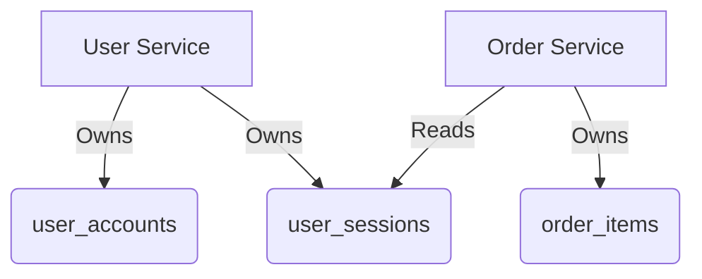

```markdown
# **Mastering the "Containers Conventions" Pattern: Organizing Your Database Like a Pro**

In this modern, containerized backend world, your database design can feel like a chaotic mess. You’ve got services querying tables with mismatched structures, business logic scattered across repositories, and no clear ownership over data. This leads to inconsistencies, performance bottlenecks, and a nightmare during refactoring.

The **"Containers Conventions"** pattern solves this by treating database tables as self-contained *containers*—logical units that encapsulate related data, behavior, and access rules. These containers make your schema predictable, enforce boundaries between services, and make migrations and refactors smoother.

This guide will show you how to apply this pattern in your next project. You’ll learn:
- Why conventional database organization fails
- How containers help structure your schema
- Real-world examples and code patterns
- Anti-patterns to watch out for

By the end, you’ll have a clear roadmap for designing databases that scale with your application—and not against it.

---

## **The Problem: The Chaos of Unstructured Databases**

Without explicit conventions, databases tend to become unmanageable over time. Here’s what happens when you ignore database organization:

### **1. Table Naming Conflicts**
Services start naming tables similarly, leading to:
```sql
-- Service A creates "customer_orders"
-- Service B creates "customer_order_history"
```
Result? Silly typos, duplicate tables, and accidental overwrites.

### **2. Mismatched Data Models**
Each service assumes its own schema, leading to:
```python
# Service A's Customer model expects "address_city"
# Service B's Customer model expects "city"
```
Now, queries break when merging data.

### **3. Tight Coupling Between Services**
A single table might be read by multiple services with different access patterns:
```sql
-- Service X needs only "customer_id", "name", "created_at"
-- Service Y needs "customer_id", "email", "last_login"
```
This forces bloated queries or inefficient joins.

### **4. Migration Nightmares**
Adding a new field requires careful coordination:
```sql
ALTER TABLE payments ADD COLUMN transfer_tax DECIMAL(10,2);
```
But what if another team already modified that table?

### **5. Schema Drift**
Without a clear structure, tables grow unpredictably:
```sql
-- Month 1: Orders table with 3 columns
-- Month 2: Marketing team adds "email_campaign_id"
-- Month 3: Payments team adds "fraud_flag"
```
Soon, the table is a hodgepodge of unrelated fields.

---

## **The Solution: Designing Database Containers**

The **Containers Conventions** pattern defines *explicit boundaries* for each table, making it clear:
✅ **Who owns the data?**
✅ **What business rules apply?**
✅ **How should it be accessed?**

### **Core Principles**
1. **Single Responsibility**
   A container (table) does *one thing* and does it well.
2. **Clear Ownership**
   Each container is owned by one service or domain.
3. **Standardized Naming**
   Tables follow a readable pattern (e.g., `user_sessions`, `inventory_checkouts`).
4. **Access Control**
   Containers restrict writes to their owners while allowing controlled reads by others.

---

## **Components of Containers Conventions**

### **1. Container Naming Rules**
Use a **domain + entity** format:
- ✅ `payment_transactions`
- ✅ `user_accounts`
- ❌ `data_orders` *(vague)*
- ❌ `payments` *(too generic)*

**Why?** Consistent naming prevents ambiguity and makes schema exploration easier.

### **2. Container Ownership**
Assign containers to a single service or domain:


### **3. Access Control**
- **Write Access:** Only the container’s owner can modify it.
- **Read Access:** Other services can read, but via **views** or **APIs** (not direct queries).

### **4. Standardized Fields**
Each container includes:
- **Primary Key** (`id`)
- **Ownership Link** (e.g., `user_id` for a `user_sessions` table)
- **Timestamps** (`created_at`, `updated_at`)
- **Optional: Versioning** (if the container evolves)

---

## **Code Examples: Applying Containers Conventions**

### **Example 1: User Service Container**
```sql
-- user_accounts (owned by User Service)
CREATE TABLE user_accounts (
    id SERIAL PRIMARY KEY,
    email VARCHAR(255) UNIQUE NOT NULL,
    password_hash VARCHAR(255) NOT NULL,
    is_active BOOLEAN DEFAULT TRUE,
    created_at TIMESTAMP DEFAULT NOW(),
    updated_at TIMESTAMP DEFAULT NOW(),
    CONSTRAINT valid_email CHECK (email ~* '^[^@]+@[^@]+$')
);
```

### **Example 2: Order Service Container**
```sql
-- order_items (owned by Order Service)
CREATE TABLE order_items (
    id SERIAL PRIMARY KEY,
    order_id INTEGER REFERENCES orders(id) ON DELETE CASCADE,
    product_id INTEGER REFERENCES products(id),
    quantity INTEGER NOT NULL,
    unit_price DECIMAL(10, 2) NOT NULL,
    created_at TIMESTAMP DEFAULT NOW(),
    CHECK (quantity > 0)
);
```

### **Example 3: Restricted Access via Views (for Cross-Service Reads)**
```sql
-- A view for the Payment Service to read user data (without direct access)
CREATE VIEW user_accounts_for_payments AS
SELECT id, email, created_at FROM user_accounts;
```

### **Example 4: API Layer for Safe Access**
```python
# payment_service/routes.py (uses the view)
from fastapi import APIRouter
from database import SessionLocal

router = APIRouter()

@router.get("/user/{user_id}/transactions")
def get_user_transactions(user_id: int):
    db = SessionLocal()
    transactions = db.execute(
        "SELECT * FROM payment_transactions WHERE user_id = :user_id",
        {"user_id": user_id}
    ).fetchall()
    return transactions
```

---

## **Implementation Guide**

### **Step 1: Identify Your Containers**
List all your services and their data needs:
| Service       | Primary Containers               | Secondary Reads          |
|---------------|----------------------------------|--------------------------|
| User Service  | `user_accounts`, `user_sessions` | `payment_transactions`   |
| Order Service | `orders`, `order_items`          | `user_accounts` (via view)|
| Payment Service| `payment_transactions`           | `user_accounts` (via API)|

### **Step 2: Apply Naming Conventions**
- Use **kebab-case** (`order_items` instead of `orderItems`).
- Prefix with **domain** (`payment_transactions`, not just `transactions`).

### **Step 3: Enforce Ownership**
- Restrict writes to the owning service.
- Use **row-level security (RLS)** or **database roles**:
  ```sql
  -- Example: Only the User Service can modify user_accounts
  ALTER TABLE user_accounts OWNER TO user_service;
  ```

### **Step 4: Standardize Fields**
Add these to every container:
```sql
ALTER TABLE new_container ADD COLUMN created_at TIMESTAMP DEFAULT NOW();
ALTER TABLE new_container ADD COLUMN updated_at TIMESTAMP DEFAULT NOW();
```

### **Step 5: Expose via API Views (Not Direct Tables)**
Instead of:
```python
# ❌ Bad: All services query user_accounts directly
```

Use:
```python
# ✅ Good: Services query views/APIs
db.query("SELECT * FROM user_accounts_for_payments WHERE id = :id")
```

---

## **Common Mistakes to Avoid**

### **1. Overly Broad Containers**
❌ A single table for `users`, `orders`, and `payments`?
✅ Split into `user_accounts`, `orders`, `payment_transactions`.

### **2. Ignoring Ownership**
❌ Letting multiple services modify `user_data` leads to conflicts.
✅ Assign ownership and enforce it via roles or APIs.

### **3. Skipping Standardized Fields**
❌ No `created_at`, `updated_at`, or ownership links.
✅ Always include these for consistency.

### **4. Using Direct Queries Across Services**
❌ Each service queries `user_accounts` independently.
✅ Use **views** or **APIs** to centralize access.

### **5. Not Documenting Containers**
❌ No schema documentation means future devs guess naming.
✅ Maintain a **database schema.md** or use tools like [dbdiagram.io](https://dbdiagram.io).

---

## **Key Takeaways**

✅ **Containers = Logical Boundaries**
   - Each table does one thing and belongs to one service.

✅ **Naming Matters**
   - Use `domain_entity` (e.g., `order_items`, `payment_transactions`).

✅ **Enforce Ownership**
   - Only the owner can write; others read via views/APIs.

✅ **Standardize Fields**
   - Always include `id`, `created_at`, `updated_at`, and ownership links.

✅ **Use APIs/Views, Not Direct Queries**
   - Prevents schema drift and enforces controlled access.

✅ **Document Your Schema**
   - Keep a running list of containers and their owners.

---

## **Conclusion: Build Databases That Scale**

The **Containers Conventions** pattern isn’t about perfection—it’s about **predictability**. By treating database tables as self-contained units, you:
✔ Avoid schema conflicts
✔ Simplify migrations
✔ Make refactoring easier
✔ Reduce bottlenecks

Start small: Apply this to your next feature’s tables, then expand. Over time, your database will become a structured, maintainable asset—**not a technical debt black hole**.

---
**Next Steps:**
- Audit your existing schema: Which tables are overloaded?
- Start naming new tables with `domain_entity`.
- Gradually introduce RLS or API views for cross-service reads.

Got questions? Drop them in the comments—I’d love to help!

---
**Further Reading:**
- [Database Perfectionism vs. Practicality](https://www.citusdata.com/blog/2021/05/11/database-perfectionism-vs-practicality/)
- [Row-Level Security in PostgreSQL](https://www.postgresql.org/docs/current/ddl-rowsecurity.html)
```