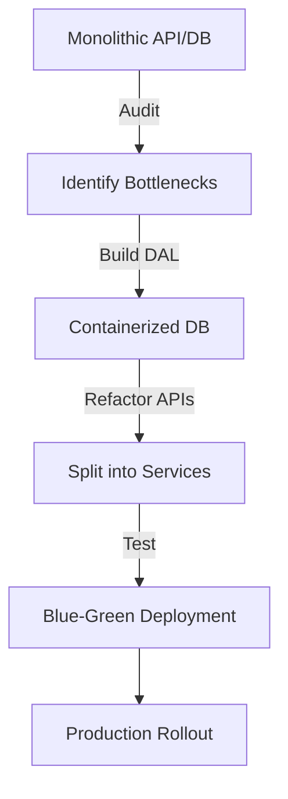

```markdown
---
title: "Containers Migration: A Backend Engineer’s Practical Guide"
date: 2023-09-15
authors: ["Jane Doe"]
tags: ["database", "api design", "containers", "migration", "refactoring"]
description: "Learn how to migrate database schemas, APIs, and services into containers with minimal downtime, using battle-tested patterns and real-world examples."
---

# Containers Migration: A Backend Engineer’s Practical Guide


Have you ever found yourself staring at a monolithic database or bloated API, struggling to deploy updates without downtime or rollback disasters? Or perhaps you’ve inherited a legacy system where scaling means spinning up new VMs—only to realize you’re stuck with a tangled mess of dependencies? If so, you’re not alone. Many backend engineers face these challenges when trying to modernize or scale applications, and **containers migration** is the key to breaking free from these constraints.

Containers—whether Docker, Kubernetes, or serverless containers—promise portability, efficiency, and ease of scaling. But migrating an existing system into containers isn’t as simple as tossing a `Dockerfile` into your repo and calling it a day. It requires careful planning, incremental changes, and strategic design to avoid breaking production. This guide will walk you through the **Containers Migration Pattern**, a structured approach to refactoring databases, APIs, and services into containers while minimizing risk.

We’ll cover:
- The pitfalls of unplanned containerization.
- How to design for containers from the ground up (or incrementally).
- Practical code examples for database and API migration.
- Common mistakes and how to avoid them.
- A step-by-step implementation guide for real-world scenarios.

By the end, you’ll have a clear roadmap for modernizing your backend infrastructure without fear of downtime or chaos.

---

## The Problem: Why “Just Containers” Often Fails

Before diving into solutions, let’s examine why many container migrations go wrong. Here are the most common pitfalls:

### 1. **Ignoring Legacy Dependencies**
Legacy databases (e.g., SQL Server, Oracle) or custom APIs often assume certain environment variables, network ports, or shared storage. When wrapped in containers, these assumptions can break. For example:
- A database might rely on a Unix socket for file storage, but containers use ephemeral filesystems.
- An API might hardcode a local Redis instance, but containers enforce network segmentation.

### 2. **Cold Starts and Scaling Quirks**
Containers are great for scaling, but they introduce new challenges:
- **Database connection pooling**: If your API spawns new containers, each must establish a connection pool to the database. Poorly configured pools can lead to connection leaks or timeouts.
- **Statelessness**: Containers are stateless by design, but databases, caches, and file systems must persist data elsewhere (e.g., volumes, external storage).

### 3. **Downtime During Migration**
Migrating a production database or API to containers often requires a cutover. Even with blue-green deployments, edge cases (like stale session data) can cause outages. For example:
```sql
-- Imagine this legacy query fails in a containerized environment:
SELECT * FROM users WHERE last_login > NOW() - INTERVAL '30 days';
-- If the database cluster isn’t properly configured for containerized access, this could hang.
```

### 4. **Security Gaps**
Containers exacerbate security risks if not designed carefully:
- **Exposed ports**: A misconfigured `expose 3306` in a Dockerfile could turn your database into an open target.
- **Missing isolation**: Shared volumes or sidecar containers can leak secrets or data.

### 5. **Testing Hell**
Testing containerized environments is harder than local dev environments:
- **Flaky tests**: Network latency between containers can cause intermittent failures.
- **Environment drift**: `docker-compose.yml` files can diverge from production Kubernetes manifests.

---

## The Solution: The Containers Migration Pattern

The **Containers Migration Pattern** is a phased approach to incrementally refactor monolithic or poorly containerized backends into a scalable, maintainable architecture. It consists of **three core components**:

1. **Database Abstraction Layer (DAL)**: Isolate database access behind a service to handle container-specific quirks (e.g., connection pooling, retries).
2. **API Service Layer**: Refactor APIs into lightweight, stateless containers with clear dependencies.
3. **Infrastructure as Code (IaC)**: Define containerized environments declaratively (e.g., using Terraform or Kubernetes manifests) to avoid configuration drift.

---

## Components/Solutions: Breaking It Down

### 1. Database Abstraction Layer (DAL)
The DAL acts as a buffer between your application and the database, handling:
- Connection pooling (e.g., PgBouncer for PostgreSQL, ProxySQL for MySQL).
- Retries for transient failures (e.g., network issues).
- Schema migrations (e.g., Flyway, Liquibase).

#### Example: PostgreSQL with PgBouncer in Docker
```dockerfile
# Dockerfile for PgBouncer
FROM postgres:14-alpine
RUN apk add --no-cache pgbouncer && \
    echo "max_client_conn = 1000" >> /etc/pgbouncer/pgbouncer.ini && \
    echo "auth_type = md5" >> /etc/pgbouncer/pgbouncer.ini && \
    echo "auth_file = /etc/pgbouncer/userlist.txt" >> /etc/pgbouncer/pgbouncer.ini
COPY userlist.txt /etc/pgbouncer/
EXPOSE 6432
CMD ["pgbouncer", "-v"]
```

```yaml
# docker-compose.yml (simplifies setup for testing)
version: '3.8'
services:
  db:
    image: postgres:14
    environment:
      POSTGRES_PASSWORD: secret
    ports:
      - "5432:5432"
  pgbouncer:
    build: .
    ports:
      - "6432:6432"
    depends_on:
      - db
```

#### Key Tradeoffs:
- **Pros**: Better connection management, reduced database load.
- **Cons**: Adds latency (PgBouncer introduces ~1-2ms overhead), requires extra configuration.

---

### 2. API Service Layer
Refactor APIs into **small, focused services** with clear responsibilities. Example: Split a monolithic `/users` API into:
- `user-service`: Handles CRUD for users.
- `auth-service`: Manages sessions/tokens.
- `analytics-service`: Tracks user activity.

#### Example: User Service in Go with Docker
```go
// main.go (user-service)
package main

import (
	"fmt"
	"net/http"
	"os"

	"github.com/gorilla/mux"
)

func main() {
	r := mux.NewRouter()
	r.HandleFunc("/users/{id}", getUser).Methods("GET")

	port := os.Getenv("PORT")
	if port == "" {
		port = "8080"
	}
	fmt.Printf("Listening on :%s\n", port)
	http.ListenAndServe(":"+port, r)
}

func getUser(w http.ResponseWriter, r *http.Request) {
	// Simulate DB call (replace with your DAL)
	w.Write([]byte("User data"))
}
```

```dockerfile
# Dockerfile for user-service
FROM golang:1.21-alpine
WORKDIR /app
COPY go.mod go.sum ./
RUN go mod download
COPY . .
RUN CGO_ENABLED=0 GOOS=linux go build -o /user-service
EXPOSE 8080
ENTRYPOINT ["/user-service"]
```

```yaml
# docker-compose.yml (for local dev)
version: '3.8'
services:
  user-service:
    build: .
    ports:
      - "8080:8080"
    environment:
      - DB_HOST=pgbouncer
      - DB_PORT=6432
    depends_on:
      - pgbouncer
```

#### Key Tradeoffs:
- **Pros**: Easier to scale individual services, clearer dependencies.
- **Cons**: Increased network hops (service-to-service calls are slower than local calls).

---

### 3. Infrastructure as Code (IaC)
Define your containerized environment in code (e.g., Kubernetes manifests, Terraform). Example: A `Deployment` for the `user-service`:

```yaml
# k8s/user-service-deployment.yaml
apiVersion: apps/v1
kind: Deployment
metadata:
  name: user-service
spec:
  replicas: 3
  selector:
    matchLabels:
      app: user-service
  template:
    metadata:
      labels:
        app: user-service
    spec:
      containers:
      - name: user-service
        image: your-registry/user-service:latest
        ports:
        - containerPort: 8080
        env:
        - name: DB_HOST
          value: "pgbouncer-service"  # Kubernetes service name
        - name: DB_PORT
          value: "6432"
---
# Service to expose the deployment
apiVersion: v1
kind: Service
metadata:
  name: user-service
spec:
  selector:
    app: user-service
  ports:
    - protocol: TCP
      port: 80
      targetPort: 8080
```

#### Key Tradeoffs:
- **Pros**: Reproducible environments, easy rollbacks.
- **Cons**: Steeper learning curve for Kubernetes/Docker Swarm.

---

## Implementation Guide: Step-by-Step

### Step 1: Audit Your Current Setup
- **Databases**: Identify schemas, dependencies, and access patterns.
- **APIs**: Trace request flows (e.g., `/users` → `/auth` → `/analytics`).
- **Dependencies**: List all external services (Redis, S3, etc.).

**Tooling**:
- Use `docker inspect` to analyze running containers.
- For APIs: Record network calls with tools like [Wireshark](https://www.wireshark.org/) or [Postman](https://www.postman.com/).

### Step 2: Build the DAL
1. Choose a connection pooler (e.g., PgBouncer for PostgreSQL, ProxySQL for MySQL).
2. Test the DAL locally with `docker-compose`.
3. Gradually replace direct DB calls in your codebase with DAL calls.

**Example Migration**:
```python
# Before (direct DB call)
import psycopg2
conn = psycopg2.connect("dbname=test user=postgres")

# After (using DAL)
from dal import DatabaseConnection
conn = DatabaseConnection(host="pgbouncer", port=6432)
```

### Step 3: Refactor APIs Incrementally
1. **Identify bottlenecks**: Use APM tools (e.g., New Relic, Datadog) to find slow endpoints.
2. **Split monolithic APIs**: Start with the slowest service (e.g., `/users`).
3. **Containerize the split service**: Use Docker for local testing, then migrate to Kubernetes.

**Example Workflow**:
1. Deploy `user-service` in a staging environment.
2. Redirect traffic from the old API to the new service using a load balancer (e.g., Nginx).
3. Monitor for errors (e.g., missing fields in responses).

### Step 4: Migrate Databases
1. **Backup your current DB**: Use tools like `pg_dump` (PostgreSQL) or `mysqldump` (MySQL).
2. **Set up a containerized DB**: Use official images (e.g., `postgres:14`).
3. **Restore the backup**: Test the restored DB thoroughly.
4. **Cut over traffic**: Use a dual-write pattern (write to both old and new DBs for a short period).

**Example Dual-Write Setup**:
```python
# Dual-write example (Python)
def create_user(user_data):
    # Write to old DB
    old_db.create_user(user_data)
    # Write to new DB (containerized)
    new_db.create_user(user_data)
```

### Step 5: Test and Validate
1. **Load testing**: Simulate traffic with tools like [Locust](https://locust.io/) or [k6](https://k6.io/).
   ```python
   # locustfile.py
   from locust import HttpUser, task

   class ApiUser(HttpUser):
       @task
       def get_user(self):
           self.client.get("/users/1")
   ```
2. **Chaos engineering**: Kill containers randomly to test resilience.
3. **Database checks**: Verify no data loss during migration.

### Step 6: Roll Out to Production
1. **Blue-green deployment**: Route 5% of traffic to the new containers, then gradually increase.
2. **Feature flags**: Enable new APIs behind flags (e.g., using [LaunchDarkly](https://launchdarkly.com/)).
3. **Monitor**: Set up alerts for errors, latency, or connection drops.

---

## Common Mistakes to Avoid

### 1. **Skipping the DAL**
Without a DAL, your containers will suffer from:
- Connection leaks (e.g., Go’s `database/sql` not closing connections properly).
- Poor performance (no pooling).

**Fix**: Always use a connection pooler or ORM (e.g., SQLAlchemy, TypeORM).

### 2. **Overcomplicating the Container Setup**
A `Dockerfile` with 50 layers and 100 dependencies is a nightmare to debug. Keep it simple:
```dockerfile
# Bad (bloat)
FROM ubuntu:20.04
RUN apt-get update && apt-get install -y \
    postgresql-client \
    redis-server \
    nodejs \
    python3 \
    && rm -rf /var/lib/apt/lists/*

# Good (minimal)
FROM alpine:latest
RUN apk add --no-cache postgresql-client redis
```

### 3. **Neglecting Health Checks**
Containers should fail fast. Example Kubernetes liveness probe:
```yaml
livenessProbe:
  httpGet:
    path: /health
    port: 8080
  initialDelaySeconds: 30
  periodSeconds: 10
```

### 4. **Hardcoding Environment Variables**
Never hardcode secrets or config in code. Use:
- Kubernetes Secrets or ConfigMaps.
- Environment variables (preferred for local dev).
- Vault for sensitive data.

**Bad**:
```go
const dbHost = "localhost" // Hardcoded!
```

**Good**:
```go
dbHost := os.Getenv("DB_HOST") // Resolved at runtime
```

### 5. **Ignoring Persistent Storage**
Containers are ephemeral. Use volumes for:
- Databases: Mount a persistent storage (e.g., AWS EBS, GCS).
- Apps: Store logs/files in external storage (e.g., S3).

**Example**:
```yaml
# Kubernetes PersistentVolumeClaim
apiVersion: v1
kind: PersistentVolumeClaim
metadata:
  name: postgres-pvc
spec:
  accessModes:
    - ReadWriteOnce
  resources:
    requests:
      storage: 10Gi
```

---

## Key Takeaways

- **Start small**: Migrate one service or database at a time to minimize risk.
- **Automate everything**: Use IaC (Terraform, Kubernetes) to avoid configuration drift.
- **Test rigorously**: Load test, chaos test, and monitor after migration.
- **Design for failure**: Assume containers will die; build resilience (retries, circuit breakers).
- **Document**: Keep a migration log for future rollbacks.



---

## Conclusion

Containers migration isn’t about slapping a `Dockerfile` on your legacy code and calling it modern. It’s a **strategic refactoring process** that requires patience, incremental changes, and attention to detail. By following the **Containers Migration Pattern**—focusing on the **Database Abstraction Layer**, **API Service Layer**, and **Infrastructure as Code**—you can safely migrate your backend to containers while avoiding downtime and technical debt.

### Next Steps:
1. **Pick one service** (e.g., `/users`) and containerize it locally.
2. **Set up a connection pooler** for your database (e.g., PgBouncer).
3. **Automate testing** with Docker Compose and Locust.
4. **Start a small production rollout** using blue-green deployment.

Remember: There’s no single "right" way to migrate to containers. The key is to **move incrementally**, **test relentlessly**, and **embrace failure as a learning opportunity**. Happy containerizing! 🚀

---
**P.S.** For further reading:
- [Kubernetes Best Practices](https://kubernetes.io/docs/concepts/cluster-administration/)
- [Docker Best Practices](https://docs.docker.com/develop/develop-images/dockerfile_best-practices/)
- [12-Factor App](https://12factor.net/) (principles for modern apps)
```