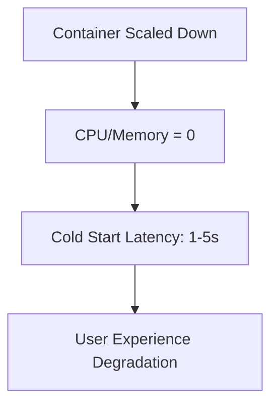

```markdown
# **"Containers Tuning for High-Performance Backend Systems: A Complete Guide"**

*A practical, code-first approach to optimizing container performance in distributed applications.*

---

## **Introduction**

Containers are the backbone of modern cloud-native applications, offering efficiency, portability, and scalability. Yet, even the best containerized architectures can suffer from performance bottlenecks if their resource allocation isn’t properly tuned. Poorly configured containers lead to inefficient CPU/memory usage, slow cold starts, excessive resource contention, and unpredictable latency—all of which degrade user experience and strain cloud costs.

In this guide, we’ll explore **containers tuning**, a systematic approach to optimizing container performance by adjusting CPU, memory, storage, and networking parameters. We’ll cover:
- The real-world consequences of unoptimized containers
- Core tuning strategies with code and configuration examples
- Step-by-step implementation guides for Kubernetes, Docker, and standalone containers
- Common pitfalls and how to avoid them

By the end, you’ll have a battle-tested toolkit to fine-tune your containers for maximum efficiency—whether you’re running microservices, batch jobs, or AI workloads.

---

## **The Problem: Why Containers Need Tuning**

### **1. Resource Starvation & Underutilization**
Containers that aren’t tuned to their workloads waste resources or struggle to meet demand. For example:
- **Over-provisioned memory**: A container with 4GB RAM might idle most of the time, increasing cloud costs.
- **CPU throttling**: Containers without proper CPU limits may starve other workloads or get killed by the OS during high-load periods.

**Real-world impact**: A misconfigured API service could see **10%+ request latency spikes** during traffic surges due to inadequate CPU reservations.

### **2. Cold Starts & Slow Scaling**
Short-lived containers (e.g., serverless functions or CI/CD builders) suffer from cold starts when resources aren’t pre-warmed:

**Example**: AWS Lambda cold starts can add **hundreds of milliseconds** to request processing if the container isn’t pre-warmed.

### **3. Storage I/O Bottlenecks**
Inadequate storage tuning causes:
- Slow database backups (e.g., PostgreSQL with default `work_mem` settings).
- Excessive disk I/O contention in multi-tenant containers.

### **4. Networking Overhead**
Containers often suffer from:
- High latency due to inefficient network policies.
- TCP/IP stack misconfigurations (e.g., `net.ipv4.tcp_tw_reuse` tuning).

---

## **The Solution: Containers Tuning Pattern**

The goal of containers tuning is to **balance performance, cost, and reliability** by aligning resource allocation with workload characteristics.

### **Core Strategies**
| **Area**         | **Strategy**                          | **Why It Matters**                                                                 |
|-------------------|---------------------------------------|------------------------------------------------------------------------------------|
| CPU               | Right-sizing (requests/limits)        | Prevents CPU throttling or underutilization.                                      |
| Memory            | OOM handling + swappiness tweaks      | Avoids crashes from memory pressure or excessive swapping.                          |
| Storage           | Tiered storage + read/write tuning    | Optimizes for workload patterns (e.g., analytics vs. OLTP).                        |
| Networking        | Egress/ingress policies + TCP tuning  | Reduces latency and bandwidth wastage.                                              |
| Startup           | Pre-warmed containers + sidecars      | Eliminates cold-start latency.                                                      |

---

## **Implementation Guide**

### **1. CPU Tuning**
#### **Problem:**
A database container with no CPU limits may consume all cores, starving other services during peak load.

#### **Solution: Requests & Limits**
Set CPU requests (`requests`) for guaranteed resources and limits (`limits`) as a hard cap.

**Example (Kubernetes Deployment YAML):**
```yaml
resources:
  requests:
    cpu: "1"      # Minimum guaranteed CPU (1 core)
    memory: "2Gi" # Minimum guaranteed memory
  limits:
    cpu: "2"      # Hard CPU limit (2 cores)
    memory: "4Gi" # Hard memory limit (OOM kill if exceeded)
```

**For Bursty Workloads (e.g., caching):**
Use **CPU bursts** (`limits > requests`):
```yaml
resources:
  requests:
    cpu: "500m"   # 0.5 cores
  limits:
    cpu: "2"      # Burst to 2 cores when needed
```

#### **Monitoring Tip:**
Use `kubectl top pods` to check CPU usage:
```bash
kubectl top pods -n my-namespace
```

---

### **2. Memory Tuning**
#### **Problem:**
A misconfigured container may crash silently when memory pressure triggers OOM (Out-Of-Memory) kills.

#### **Solution: OOM Handling + Swappiness**
- Set `limits.memory` to prevent OOM kills.
- Adjust `swappiness` (Linux kernel parameter) to avoid excessive swapping.

**Example (Docker container runtime config):**
```bash
docker run -d \
  --memory=2G \
  --memory-swap=3G \  # Allows 1G swap (2G + 1G)
  --sysctl swappiness=10 \  # Reduces swap usage
  my-image
```

**For Kubernetes:**
```yaml
resources:
  limits:
    memory: "2Gi"
# Enable OOMScoreAdj (K8s 1.23+)
securityContext:
  oomScoreAdj: -500  # Less likely to be killed first
```

#### **Debugging OOM Crashes:**
Check container logs for `Killed` status:
```bash
docker logs --tail 50 <container-id>
```

---

### **3. Storage Tuning**
#### **Problem:**
A PostgreSQL container with default settings may struggle under heavy query loads due to insufficient `shared_buffers`.

#### **Solution: Configure Database-Specific Tuning**
**Example (PostgreSQL `postgresql.conf`):**
```sql
# Optimize for read-heavy workloads
shared_buffers = "1GB"        # Cache frequently accessed data
effective_cache_size = "3GB"  # Account for OS cache
work_mem = "16MB"             # Memory per query (adjust for complex queries)
```

**Mount Non-Persistent Storage Efficiently (K8s):**
```yaml
volumeMounts:
- name: cache-volume
  mountPath: /var/cache
volumes:
- name: cache-volume
  emptyDir: {}  # Fast local storage for temp files
```

---

### **4. Networking Tuning**
#### **Problem:**
A gRPC microservice may suffer from high latency due to default TCP settings.

#### **Solution: TCP & Network Policy Tuning**
**Example (Docker Network Config):**
```bash
docker run -d \
  --network="my-custom-net" \
  --sysctl="net.core.somaxconn=65536" \
  --sysctl="net.ipv4.tcp_tw_reuse=1" \
  my-grpc-service
```

**Kubernetes NetworkPolicy (Restrict Egress):**
```yaml
apiVersion: networking.k8s.io/v1
kind: NetworkPolicy
metadata:
  name: restrict-grpc-traffic
spec:
  podSelector:
    matchLabels:
      app: grpc-service
  egress:
  - to:
    - podSelector:
        matchLabels:
          app: auth-service
    ports:
    - protocol: TCP
      port: 50051
```

---

### **5. Startup Optimization**
#### **Problem:**
A containerized CI/CD job takes 30s to start, causing pipeline delays.

#### **Solution: Pre-Warm Containers**
- Use **sidecar containers** to keep dependencies warm.
- Implement **readiness probes** for faster scaling.

**Example (K8s Deployment with Sidecar):**
```yaml
containers:
- name: main-app
  image: my-app:latest
  readinessProbe:
    httpGet:
      path: /health
      port: 8080
    initialDelaySeconds: 10
    periodSeconds: 5
- name: initdb-sidecar
  image: postgres:latest
  command: ["sleep", "infinity"]
```

---

## **Common Mistakes to Avoid**

| **Mistake**                          | **Why It’s Bad**                                  | **Fix**                                                                 |
|--------------------------------------|---------------------------------------------------|-------------------------------------------------------------------------|
| No CPU/Memory requests (best effort) | Containers compete unfairly for resources.        | Always set `requests`.                                                   |
| Ignoring OOM kills                   | Silent crashes without logs.                       | Enable `oomScoreAdj` and monitor with `kubectl describe pod`.           |
| Overcommitting memory                | Swapping kills performance.                         | Set `memory:swap` limits or use `cgroup` tuning.                        |
| Hardcoding network policies          | Blocks future architecture changes.                | Use labels/namespace-based policies.                                     |
| Not profiling workloads              | Blindly tuning without data.                       | Use `kubectl top`, `docker stats`, and tools like `sysdig`.              |

---

## **Key Takeaways**
✅ **Right-size CPU/memory**: Set `requests` and `limits` based on workload profiles.
✅ **Optimize for OOM**: Use `oomScoreAdj` and monitor swap usage.
✅ **Tune storage per workload**: Adjust PostgreSQL `shared_buffers` or mount temp files as `emptyDir`.
✅ **Networking matters**: Configure TCP settings and restrict traffic with `NetworkPolicy`.
✅ **Pre-warm cold starts**: Use sidecars or readiness probes for faster scaling.
❌ **Avoid**: No requests, ignored OOM kills, overcommitment, static network rules.

---

## **Conclusion**
Containers tuning isn’t about applying cookie-cutter settings—it’s about understanding **your workload’s unique characteristics** and optimizing accordingly. By following the patterns in this guide (CPU throttling, memory OOM handling, storage tuning, networking policies, and cold-start mitigation), you can **reduce latency, lower costs, and improve reliability**.

### **Next Steps**
1. **Profile your workloads**: Use `kubectl top` and `docker stats` to identify bottlenecks.
2. **Start small**: Tune one container at a time (e.g., a high-latency API).
3. **Automate monitoring**: Set up alerts for CPU/memory limits or OOM events.
4. **Iterate**: Tuning is ongoing—revisit configurations when workloads change.

**Final Thought**:
> *"The best container tuning is invisible tuning—your users shouldn’t notice the optimizations, only the performance gains."*

---
**Further Reading:**
- [Kubernetes Resource Management Docs](https://kubernetes.io/docs/concepts/configuration/assign-pod-node/)
- [PostgreSQL Tuning Guide](https://www.postgresql.org/docs/current/runtime-config-performance.html)
- [Docker CPU Pinning](https://docs.docker.com/config/containers/resource_constraints/#cpu)
```