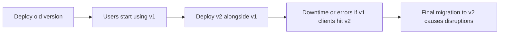

```markdown
---
title: "Data Format Evolution: A Backend Engineer's Guide to Future-Proofing Your APIs"
date: 2023-10-15
tags: ["database", "api-design", "schema-migration", "backend-engineering", "data-evolution"]
description: "How to handle schema changes gracefully in a multi-tenant, long-lived API without breaking existing systems. Practical strategies and tradeoffs for real-world backends."
author: "Alex Carter, Senior Backend Engineer"
---

# **Data Format Evolution: A Backend Engineer’s Guide to Future-Proofing Your APIs**


You’ve poured months into designing a clean, performant API. Your database schema is optimized, your queries are efficient, and your team is delighted with the system’s stability. Then—**crisis**. A new feature request arrives that requires a breaking change: a column needs to be renamed, a field becomes required, or a nested object structure must be flattened.

What happens when you deploy this change to production? Suddenly, every client of your API is sending requests with the old field names, your existing microservices fail to parse the new payloads, and your logs are flooded with errors. Overnight, a stable system becomes a nightmare.

This is the **data format evolution problem**—a common pain point for backend engineers building APIs that must endure for years. Without a strategy to handle schema changes gracefully, even well-designed systems can fracture under the weight of inevitable requirements.

In this post, we’ll explore the **Data Format Evolution pattern**, a battle-tested approach to managing schema changes in APIs without breaking existing systems. We’ll cover:

- Why traditional migration strategies fail (and how they backfire)
- How to implement forward/backward compatibility in real-world systems
- Code examples for JSON, Protocol Buffers (protobuf), and relational databases
- Tradeoffs and practical tradeoffs when choosing between strategies
- Anti-patterns and how to avoid them

By the end, you’ll have a toolkit to evolve your data formats without fear—just like the mature systems you depend on.

---

## **The Problem: Why Schema Changes Are So Painful**

Schema changes are inevitable. Here’s why:

1. **Business needs evolve faster than code.** What was "good enough" six months ago is now a bottleneck for new features. Teams are under pressure to iterate quickly, but schema changes are slow, risky, and often require coordination across services.

2. **Legacy systems cling to old formats.** Even well-architected APIs accumulate clients over time—internal tools, third-party integrations, and even your own downstream services. A change in your schema can break these dependencies overnight.

3. **Client code doesn’t always adapt.** Frontend developers, mobile apps, or even other microservices may not ship updates to handle new fields. You might deploy a "safe" change, only to discover that half your users are sending malformed requests.

4. **Data integrity risks.** If you're migrating data (e.g., renaming a column), you must ensure backward compatibility during the transition period. A failed migration can leave your system in an inconsistent state.

### **The "Big Bang" Migration Approach: Why It Fails**

Many teams adopt a **"big bang" migration** strategy, where they:

- Add a new column/field for backward compatibility.
- Deploy a versioned endpoint (e.g., `/v1`, `/v2`).
- Eventually drop the old format entirely.

This might work for small teams, but it breaks down at scale:



A single deployment can now take weeks or months as you coordinate clients, monitor failures, and manage the transition. And what if something goes wrong? Your system is left in a broken state until you fix it.

### **Real-World Example: The API Versioning Trap**

Consider a public API that serves millions of requests per day. Suppose you need to:

1. Add a new required field `payment_token` to a `CheckoutRequest`.
2. Make `customer_id` optional (moving to a `customer_reference` UUID).

Your options:
- **Option 1:** Deploy v2 with the new fields, deprecate v1. Risk: all current clients fail.
- **Option 2:** Add new fields to v1, then later drop old ones. Risk: ever-growing payloads, memory bloat.

Neither option scales well. You need **flexibility** without **lock-in**.

---

## **The Solution: The Data Format Evolution Pattern**

The **Data Format Evolution** pattern solves this by ensuring that:

✅ **Existing clients continue to work** (backward compatibility).
✅ **New clients can adopt improvements** (forward compatibility).
✅ **Migrations are safe and reversible** (zero-downtime where possible).
✅ **The system remains performant** (no unbounded growth in memory/bandwidth).

Here’s how it works:

### **Core Principles**
1. **Versioned Payloads:** Clients declare support for a payload version (e.g., `Accept: application/vnd.example.v1+json`).
2. **Forward/Backward Compatibility:** New versions can include new fields but must handle old ones gracefully.
3. **Graceful Degradation:** Missing or malformed fields are handled without crashing.
4. **Progressive Rollout:** New versions can be tested without deploying to all users.

### **Key Strategies**
| Strategy               | Use Case                          | Tradeoffs                                  |
|------------------------|-----------------------------------|--------------------------------------------|
| **Optional Fields**    | Add new fields without breaking old clients. | Payloads grow over time.                  |
| **Backward-Deletable Fields** | Fields can be removed later. | Requires careful validation.               |
| **Versioned Endpoints** | Isolate changes behind URI versions. | Complex routing and documentation.        |
| **Schema Registry**    | Centralized management of versions. | Adds dependency overhead.                  |
| **Protobuf/Schema URL** | Strong typing with backward compatibility. | Steeper learning curve.                    |

---

## **Implementation Guide: Code Examples**

Let’s explore how to apply this pattern in three common scenarios: **JSON APIs**, **Protocol Buffers**, and **relational databases**.

---

### **1. JSON API with Versioning**

#### **Problem**
You need to add a `metadata.updated_at` field but keep old clients happy.

#### **Solution: Versioned Fields with Graceful Handling**

```javascript
// Backend (Node.js/Express)
app.use((req, res, next) => {
  // Declared in the request header
  const acceptVersion = req.headers["Accept"]?.match(/v\d+/)?.[0] || "v1";
  res.locals.version = acceptVersion;
  next();
});

app.post("/orders", (req, res) => {
  const { version } = res.locals;
  const payload = req.body;

  // Validate and transform based on version
  let order = {
    id: payload.id,
    ...(version === "v2" && { metadata: { updated_at: new Date() } }),
    ...(version === "v1" && { legacy_metadata: payload.metadata }), // Deprecated field
  };

  if (!order.id) {
    return res.status(400).json({ error: "id is required" });
  }

  // Save to database
  db.save(order);
  res.json(order);
});

// Example client requests:
// v1: { id: "123", metadata: { ... } } → server returns { id, legacy_metadata }
// v2: { id: "123" } → server adds metadata.updated_at
```

#### **Tradeoffs**
- **Pros:** Simple to implement, no breaking changes.
- **Cons:** Clients must handle growing payloads; difficult to remove old fields.

---

### **2. Protocol Buffers (Protobuf) with Backward Compatibility**

#### **Problem**
You’re using protobuf (e.g., for gRPC) and need to add a field without breaking clients.

#### **Solution: Use `oneof` and Optional Fields**

```proto
// order.proto
syntax = "proto3";

message Order {
  string id = 1; // Core field (required)
  map<string, string> legacy_metadata = 2; // Deprecated

  // New field for v2+
  message Metadata {
    string updated_at = 1;
  }

  // Allow either old or new metadata (backward-compatible)
  oneof metadata {
    map<string, string> legacy = 2; // Old format
    Metadata new = 3;              // New format
  }
}
```

#### **Server-Side Handling (Python/Grpc)**
```python
from concurrent import futures
import grpc
import order_pb2
import order_pb2_grpc

class OrderService(order_pb2_grpc.OrderServicer):
    def CreateOrder(self, request, context):
        order = request.WhichOneof("metadata")
        if order == "legacy":
            # Handle legacy format
            new_metadata = order_pb2.Metadata(updated_at="legacy")
            # Transform legacy data if needed
            return order_pb2.Order(id=request.id, metadata=new_metadata)
        elif order == "new":
            # Use the new format
            return order_pb2.Order(id=request.id, metadata=order)

# gRPC server
server = grpc.server(futures.ThreadPoolExecutor(max_workers=10))
order_pb2_grpc.add_OrderServicer_to_server(OrderService(), server)
server.add_insecure_port("[::]:50051")
server.start()
```

#### **Client-Side Update (Go)**
```go
// Old client (v1)
order := &pb.Order{
    Id: "123",
    LegacyMetadata: map[string]string{
        "created_at": "2023-01-01",
    },
}

// New client (v2)
order := &pb.Order{
    Id: "123",
    Metadata: &pb.Metadata{
        UpdatedAt: time.Now().Format(time.RFC3339),
    },
}
```

#### **Tradeoffs**
- **Pros:** Strong typing, compact binary format, native support for backward compatibility.
- **Cons:** Steeper learning curve than JSON; requires protobuf compiler and tooling.

---

### **3. Relational Databases: Schema Evolution**

#### **Problem**
You need to rename a column from `user.email` to `user.email_address` while keeping historical data.

#### **Solution: Use Views and Migration Strategies**

##### **Option A: Add Column (Easiest for Backward Compatibility)**
```sql
-- Add new column
ALTER TABLE users ADD COLUMN email_address VARCHAR(255);

-- Update via view (for read operations)
CREATE VIEW v_user AS
SELECT
    id,
    email AS email_address, -- Alias for backward compatibility
    email_address,
    ...
FROM users;

-- Write operations must handle both columns
UPDATE users SET email_address = email WHERE email IS NOT NULL;
```

##### **Option B: View-Based Migration (Zero Downtime)**
```sql
-- Create a view that routes queries to the correct columns
CREATE VIEW v_user AS
SELECT
    id,
    COALESCE(email_address, email) AS email, -- New default
    email, -- Keep for backward compatibility
    ...
FROM users;

-- Application queries now use v_user instead of the raw table
```

##### **Option C: Reference Data (For Complex Changes)**
```sql
-- Store metadata about the column evolution
CREATE TABLE column_evolution (
    table_name VARCHAR(50),
    old_column VARCHAR(50),
    new_column VARCHAR(50),
    is_active BOOLEAN,
    created_at TIMESTAMP
);

INSERT INTO column_evolution (table_name, old_column, new_column, is_active, created_at)
VALUES ('users', 'email', 'email_address', true, NOW());

-- Application logic checks the table:
SELECT email_address
FROM users
WHERE email = (SELECT new_column FROM column_evolution WHERE old_column = 'email' AND table_name = 'users');
```

#### **Tradeoffs**
- **Pros:** Database views can hide migrations from clients; no downtime.
- **Cons:** Views can add overhead; complex queries may require careful tuning.

---

## **Common Mistakes to Avoid**

1. **Assuming "Optional Fields" Is Always Safe**
   - ❌ **Mistake:** Adding new fields without considering memory/bandwidth costs.
   - ✅ **Fix:** Document field deprecation timelines; monitor usage.

2. **Overusing API Versioning**
   - ❌ **Mistake:** Versioning everything (`/v1/users`, `/v2/users`, `/v3/users`).
   - ✅ **Fix:** Use versioning sparingly (e.g., for breaking changes). Prefer versioned payloads.

3. **Breaking Changes Without a Backout Plan**
   - ❌ **Mistake:** Making a "safe" change but not allowing rollback.
   - ✅ **Fix:** Design migrations as reversible; test failure scenarios.

4. **Ignoring Client Libraries**
   - ❌ **Mistake:** Assuming all clients will update automatically.
   - ✅ **Fix:** Provide clear migration guides; offer SDKs for new versions.

5. **Not Monitoring Adoption**
   - ❌ **Mistake:** Deploying v2 but not tracking which clients adopt it.
   - ✅ **Fix:** Log payload versions; use feature flags for gradual rollout.

---

## **Key Takeaways**

Here’s a quick checklist for implementing Data Format Evolution:

- **Design for backward compatibility first.** New versions should never break old clients.
- **Use optional fields, not required ones.** Add new fields, never remove old ones immediately.
- **Document deprecation timelines.** Clients need warnings before changes.
- **Leverage versioned payloads, not just URLs.** `/orders` with `Accept: v2` is cleaner than `/orders/v2`.
- **Test migrations in staging.** Assume something will go wrong—validate rollback plans.
- **Monitor adoption.** Use feature flags or logging to track which versions clients are using.
- **Consider protobuf for binary APIs.** It’s harder to misuse than JSON for strict schemas.
- **Avoid unbounded growth.** Periodically audit and clean up deprecated fields.

---

## **Conclusion: Future-Proof Your APIs**

Schema changes are not a question of *if*, but *when*. The Data Format Evolution pattern gives you the tools to handle them gracefully—without breaking existing systems, slowing down new features, or locking you into technical debt.

### **Final Thoughts**
- **No silver bullet:** Tradeoffs exist. Optional fields add complexity to clients; versioned endpoints require discipline.
- **Start small:** Begin with JSON/optional fields, then expand to protobuf or databases as needed.
- **Automate where possible:** Use tools like `jsonschema` for validation, or a schema registry for protobuf.
- **Plan for the long term:** Your API may outlive your team—design for sustainability.

By adopting this pattern, you’ll build systems that **scale with your business**, **adapt to change**, and **resist the fragmentation that comes from ad-hoc migrations**. Your future self (and your colleagues) will thank you.

Now go forth and evolve—**without the fear of breakage**.

---
**Further Reading:**
- [Google’s Protocol Buffer Guide on Backward Compatibility](https://developers.google.com/protocol-buffers/docs/proto3#json)
- [JSON Schema for API Versioning](https://json-schema.org/understanding-json-schema/)
- [AWS Schema Registry for Avro/Protobuf](https://aws.amazon.com/confluent/schema-registry/)

**Want to dive deeper?** Check out our [next post on Database Sharding](link-to-future-post) for handling scale alongside evolution!
```

---
**Note:** The Mermaid diagram link is a placeholder. In practice, you’d want to:
1. Generate the diagram using Mermaid.js or another tool.
2. Host it on a static site (e.g., GitHub Pages) or embed it directly in a blog platform that supports Markdown + Mermaid.

Would you like me to expand on any section (e.g., add a deeper dive into protobuf with examples, or include a case study)?