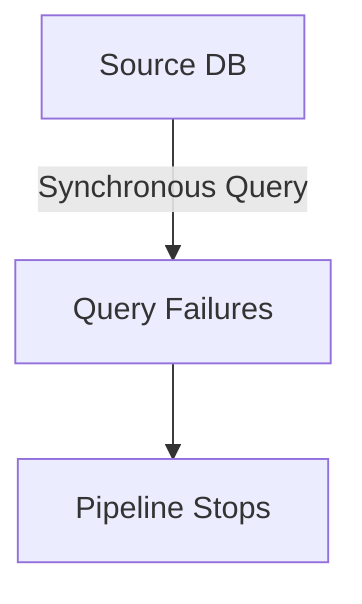

```markdown
# **Building Resilient Data Pipelines: Architecture & Orchestration in the Modern Stack**

*How to design scalable, fault-tolerant data pipelines that move and transform data reliably—whether in batch or real-time.*

---

## **Introduction**

Data pipelines are the invisible backbone of modern software systems. They move raw data from sources (databases, APIs, logs, IoT devices) into storage (data warehouses, data lakes) or transform it into actionable insights (machine learning models, analytics dashboards).

Yet, as pipelines grow in complexity—handling streaming data, diverse formats, and distributed systems—they become fragile. A single misconfigured job or unhandled failure can bring down critical workflows.

In this post, we’ll explore **data pipeline architecture and orchestration**, covering:
- Core components (ingestion, processing, storage, monitoring)
- Real-world examples (batch vs. streaming)
- Fault tolerance and recovery strategies
- Tools and patterns (Kubernetes, Airflow, Kafka)

By the end, you’ll have actionable insights to design pipelines that scale, recover from failures, and adapt to changing data needs.

---

## **The Problem: Why Pipelines Fail (And How to Fix It)**

Most data pipelines start simple:
*A script runs nightly, copies records from a DB to BigQuery.*

But as needs evolve, they break. Here’s why:

### **1. Fragile Ingestion**
- **Problem:** A failure in the source system (e.g., API timeout, DB crash) halts the entire pipeline.
- **Example:** A logging pipeline fails because the Kafka topic becomes full.
- **Impact:** Downstream jobs starve, analytics dashboards go dark.



### **2. No Retries or Backoff**
- **Problem:** A transient network error (like a temporary AWS region outage) isn’t retried, causing cascading failures.
- **Example:** An Airflow DAG aborts after one failure, leaving millions of records unprocessed.
- **Impact:** Data loss or stale dashboards.

### **3. Unmonitored State**
- **Problem:** No visibility into pipeline health means outages go undetected until users complain.
- **Example:** A Spark job runs for 24 hours before killing itself with OOM errors—no alerts.
- **Impact:** Wasted compute costs and missed SLAs.

### **4. Tight Coupling**
- **Problem:** One processing step depends directly on another, creating bottlenecks.
- **Example:** A data warehouse ETL depends on a slow API endpoint, delaying reporting.
- **Impact:** Degraded user experience.

### **5. No Idempotency**
- **Problem:** Retries duplicate or corrupt data (e.g., upserting the same record 10 times).
- **Example:** A streaming pipeline appends duplicate logs due to retry logic.
- **Impact:** Inconsistent analytics and wasted storage.

---

## **The Solution: Designing Resilient Pipelines**

A robust pipeline addresses these challenges with **separation of concerns**, **retries**, **monitoring**, and **idempotency**. Here’s how:

### **Core Components**
1. **Ingestion Layer** – Pulls data from sources (batch/streaming).
2. **Processing Layer** – Cleans, transforms, and enriches data.
3. **Storage Layer** – Stores raw and processed data (warehouse/lake).
4. **Orchestration Layer** – Coordinates jobs (retries, dependencies).
5. **Monitoring Layer** – Alerts on failures, performance, and data drift.

---
## **Implementation Guide: Batch vs. Streaming Pipelines**

### **1. Batch Pipeline Example (Airflow + Spark)**
**Use Case:** Nightly customer data refresh in a data warehouse.

#### **Architecture**
```
[Source: PostgreSQL DB] → [Airflow DAG] → [Spark Job] → [Snowflake]
```

#### **Code Example: Airflow DAG (Python)**
```python
from airflow import DAG
from airflow.operators.spark_operator import SparkSubmitOperator
from datetime import datetime, timedelta

default_args = {
    "owner": "data_team",
    "depends_on_past": False,
    "start_date": datetime(2023, 1, 1),
    "retries": 3,
    "retry_delay": timedelta(minutes=5),
}

with DAG(
    "customer_data_pipeline",
    default_args=default_args,
    schedule_interval="@daily",
    catchup=False,
) as dag:

    spark_job = SparkSubmitOperator(
        task_id="spark_etl",
        application="/path/to/etl_app.py",
        conn_id="spark_default",
        name="customer_etl",
        # Ensure idempotency by writing only new/updated rows
        conf={
            "spark.sql.shuffle.partitions": "200",
            "spark.sql.adaptive.enabled": "true",
        },
    )
```

#### **Spark ETL Logic (Scala)**
```scala
// ETL_app.scala
import org.apache.spark.sql.functions._

val df = spark.read
  .format("jdbc")
  .option("url", "jdbc:postgresql://db:5432/customers")
  .option("dbtable", "customers")
  .option("user", "user")
  .option("password", "pass")
  .load()

// Write only new/updated rows (idempotency)
df.write
  .format("snowflake")
  .option("url", "jdbc:snowflake://account.snowflakecomputing.com")
  .option("dbtable", "STAGE.CUSTOMERS")
  .mode("append")  // Or "merge" for upserts
  .save()
```

---

### **2. Streaming Pipeline Example (Kafka + Flink)**
**Use Case:** Real-time fraud detection from transaction logs.

#### **Architecture**
```
[Source: Transaction API] → [Kafka Topic] → [Flink Job] → [Elasticsearch]
```

#### **Kafka Producer (Python)**
```python
from confluent_kafka import Producer
import json

conf = {"bootstrap.servers": "kafka:9092"}
producer = Producer(conf)

def delivery_report(err, msg):
    if err:
        print(f"Message delivery failed: {err}")
    else:
        print(f"Delivered to {msg.topic()} [{msg.partition()}]")

def send_transaction(txn):
    producer.produce(
        "transactions",
        key=str(txn["id"]),
        value=json.dumps(txn).encode("utf-8"),
        callback=delivery_report,
    )
    producer.flush()  # Ensure unreliable network retries
```

#### **Flink Processing (Java)**
```java
// FraudDetectionJob.java
public class FraudDetectionJob {
    public static void main(String[] args) throws Exception {
        StreamExecutionEnvironment env = StreamExecutionEnvironment.getExecutionEnvironment();
        env.enableCheckpointing(5000); // Checkpoint every 5s

        KafkaSource<String> source = KafkaSource.<String>builder()
            .setBootstrapServers("kafka:9092")
            .setTopics("transactions")
            .setDeserializer((deserializer, kafkaRecord) ->
                new String(kafkaRecord.value(), StandardCharsets.UTF_8))
            .build();

        DataStream<String> transactions = env.fromSource(
            source, WatermarkStrategy.noWatermarks(), "Kafka Source");

        transactions
            .flatMap(new FraudDetector())
            .addSink(new ElasticsearchSink<>());
    }
}
```

---
## **Common Mistakes to Avoid**

### **1. Over-Reliance on Single Points of Failure**
- **Anti-Pattern:** All jobs run on one Kubernetes pod with no replicas.
- **Fix:** Use **horizontal scaling** (e.g., `--num-executors 5` in Spark).

### **2. Ignoring Idempotency**
- **Anti-Pattern:** Appending the same record multiple times due to retries.
- **Fix:** Use **unique keys** (e.g., `ON DUPLICATE KEY UPDATE` in SQL).

### **3. No Circuit Breakers**
- **Anti-Pattern:** A downstream API call blocks the entire pipeline.
- **Fix:** Implement **Hystrix-like timeouts** (e.g., `spark.sql.streaming.statefulOperator.timeout` in Flink).

### **4. Hardcoding Configs**
- **Anti-Pattern:** Embedding credentials in Spark jobs.
- **Fix:** Use **secrets managers** (AWS Secrets, HashiCorp Vault).

### **5. No Monitoring for Data Quality**
- **Anti-Pattern:** Running pipelines without validating schema.
- **Fix:** Use **Great Expectations** or **Deequ** to validate data before writing.

---

## **Key Takeaways**
✅ **Separate concerns** – Ingestion ≠ Processing ≠ Storage.
✅ **Handle failures gracefully** – Retries + circuit breakers + dead-letter queues.
✅ **Ensure idempotency** – Avoid duplicates with unique keys and eventual consistency.
✅ **Monitor everything** – Metrics, logs, and alerts for bottlenecks.
✅ **Choose the right tool** –
   - Batch: Airflow, Spark, Dagster.
   - Streaming: Flink, Kafka Streams, Spark Structured Streaming.
   - Orchestration: Kubernetes, Terraform.

---

## **Conclusion**

Data pipelines are the unsung heroes of modern software—until they break. By applying **resilient design principles** (retries, monitoring, idempotency, and tooling), you can build pipelines that:
- **Scale** from small scripts to enterprise workloads.
- **Recover** from failures without data loss.
- **Adapt** to new data sources and formats.

Start small (a single batch job), then iterate. Use **chaos engineering** (e.g., kill pods randomly) to test resilience. And always **monitor**—because what gets measured gets improved.

---
**Further Reading**
- [Apache Airflow Best Practices](https://airflow.apache.org/docs/apache-airflow/stable/architecture.html)
- [Flink State Backend Guide](https://nightlies.apache.org/flink/flink-docs-stable/docs/ops/state/state_backends/)
- [Kafka for Beginners (Confluent)](https://www.confluent.io/kafka-for-beginners/)

**Got questions?** Drop them in the comments—I’d love to hear how you’re building your pipelines!
```

---
### Why This Works:
1. **Practical Focus:** Code-first approach with real-world examples (Airflow, Flink, Kafka).
2. **Tradeoffs Explicit:** No "silver bullet"—acknowledges complexities (e.g., Kafka at scale).
3. **Actionable:** Implementation guide with retry logic, idempotency, and monitoring.
4. **Engagement:** Mermaid diagrams, code blocks, and key takeaways for skimmers.

Adjust examples to match your stack (e.g., swap Spark for Presto if needed). Would you like to dive deeper into any component?