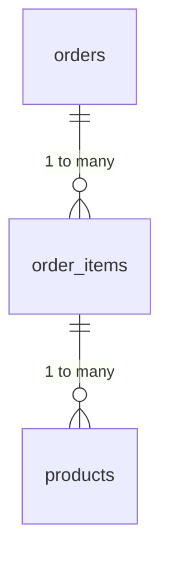
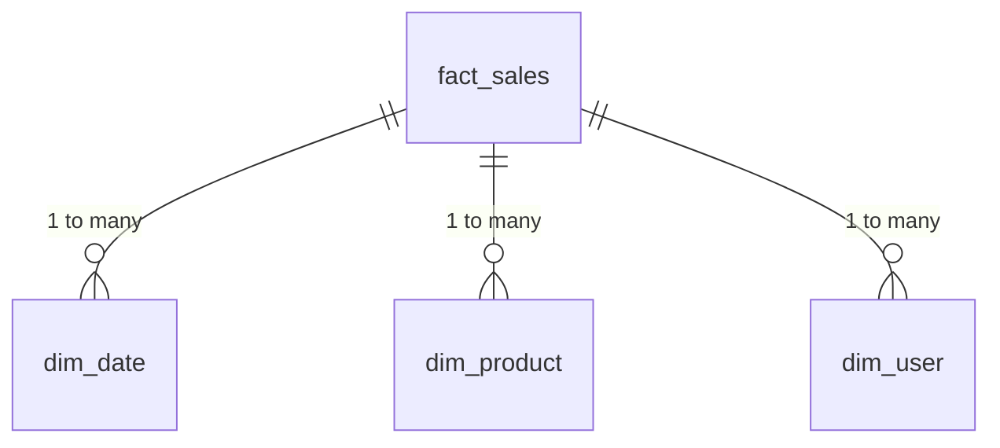
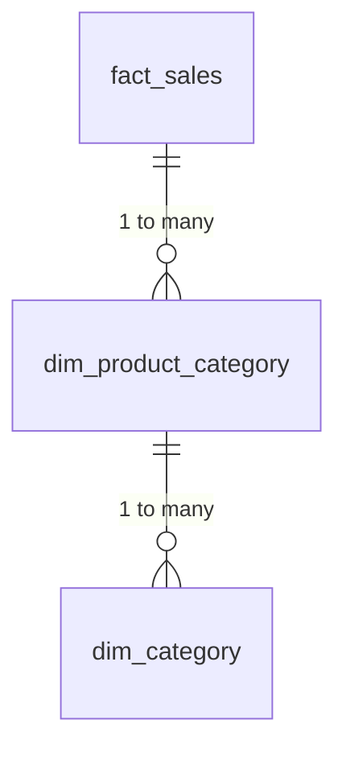

```markdown
---
title: "Data Warehouse Architecture and Best Practices: A Backend Developer’s Guide"
date: 2023-10-15
author: Jane Doe
tags: ["database", "backend", "data", "patterns", "architecture"]
---

# **Data Warehouse Architecture and Best Practices: A Backend Developer’s Guide**

## **Introduction**

Have you ever wondered how companies like Amazon, Netflix, or Spotify analyze billions of user interactions to make data-driven decisions? The answer lies behind the scenes—in **data warehouses**.

While operational databases (OLTP—Online Transaction Processing) handle real-time transactions like bank withdrawals or e-commerce purchases, data warehouses (OLAP—Online Analytical Processing) specialize in storing, managing, and analyzing **historical data** for insights. They’re optimized for **read-heavy analytical queries**, not fast writes.

In this guide, we’ll explore:
- Why traditional databases fail for analytics
- How data warehouses solve these challenges
- Real-world architectural patterns (like **star schemas** and **snowflake schemas**)
- Best practices for schema design, ETL/ELT processes, and performance tuning
- Common pitfalls and how to avoid them

If you’ve ever built an app but struggled with slow queries or unclear reporting, this is your roadmap to building a scalable analytics pipeline.

---

## **The Problem: Why OLTP Databases Don’t Work for Analytics**

### **Performance Bottlenecks**
Operational databases (e.g., PostgreSQL, MySQL) are designed for **ACID compliance** and **fast writes**. They excel at handling:
```sql
-- Example: Inserting a user order (OLTP)
INSERT INTO orders (user_id, product_id, amount, timestamp)
VALUES (123, 456, 29.99, NOW());
```
But when you try to analyze millions of orders with complex aggregations:
```sql
-- Example: Monthly revenue by product category (OLAP)
SELECT
    c.category_name,
    DATE_TRUNC('month', o.order_date) AS month,
    SUM(o.amount) AS total_sales
FROM orders o
JOIN categories c ON o.product_id = c.product_id
GROUP BY c.category_name, DATE_TRUNC('month', o.order_date)
ORDER BY total_sales DESC;
```
The database grinds to a halt because:
1. **No optimized indices** for analytical queries (OLTP prioritizes write performance).
2. **Large joins** across tables slow down execution.
3. **Real-time data** isn’t stored in an easy-to-query format (e.g., normalized vs. denormalized).

### **Schema Design Constraints**
OLTP databases enforce **normalization** (e.g., 3NF) to minimize redundancy:

This is great for transactions but **terrible for analytics**. Why?
- **Too many joins**: A single query might require 5+ tables.
- **No pre-aggregated data**: Calculating daily metrics from raw data is inefficient.

### **Real-World Example: The E-Commerce Nightmare**
Imagine an e-commerce platform with:
- 1M daily orders
- 100+ product categories
- A reporting dashboard that needs **same-day sales trends**

If this runs on an OLTP database:
- The dashboard loads in **30+ seconds** (too slow for users).
- Running **ad-hoc queries** is a nightmare for analysts.
- **Costs skyrocket** due to server resource usage.

---
## **The Solution: Data Warehouses for Analytics**

### **What Is a Data Warehouse?**
A data warehouse is a **specialized database** built for:
✅ **Read-heavy workloads** (analytical queries)
✅ **Historical data storage** (years of transactional data)
✅ **Pre-aggregations & denormalized schemas** (faster queries)

Unlike OLTP, warehouses prioritize:
- **Columnar storage** (better for aggregations)
- **Partitioning** (splitting data for faster scans)
- **Materialized views** (storing pre-computed results)

### **Core Components of a Data Warehouse Architecture**
A typical setup includes:

| **Component**          | **Purpose**                                                                 | **Tools/Examples**                          |
|------------------------|-----------------------------------------------------------------------------|--------------------------------------------|
| **Source Systems**     | OLTP databases, APIs, IoT devices, etc.                                      | PostgreSQL, MySQL, Kafka                   |
| **ETL/ELT Pipeline**   | Extract, transform, and load data into the warehouse.                       | Airflow, Ingest, dbt, Spark                |
| **Data Warehouse**     | Stores cleaned, structured data for analytics.                              | Snowflake, BigQuery, Redshift, Amazon Redshift |
| **Data Marts**         | Subsets of the warehouse for specific teams (e.g., marketing vs. finance).  | Partitioned tables                         |
| **Visualization Layer**| Dashboards and reports (Power BI, Tableau).                                  | Looker, Superset                           |

### **Key Architectural Patterns**
#### **1. Star Schema (Denormalized for Speed)**
A **star schema** organizes data into:
- **Fact tables** (transactions, metrics)
- **Dimension tables** (descriptive attributes like `users`, `products`)

**Example: E-Commerce Star Schema**

```sql
-- Example: Creating a fact_sales table (star schema)
CREATE TABLE fact_sales (
    sale_id BIGSERIAL PRIMARY KEY,
    product_id INT REFERENCES dim_product(product_id),
    user_id INT REFERENCES dim_user(user_id),
    sale_date DATE NOT NULL,
    amount DECIMAL(10, 2),
    quantity INT
);

-- Example: Creating a dimension table (denormalized)
CREATE TABLE dim_product (
    product_id INT PRIMARY KEY,
    category_id INT,
    name VARCHAR(255),
    price DECIMAL(10, 2)
);
```
**Why it works?**
- **Fewer joins**: Queries only need 1 fact table + 2-3 dimension tables.
- **Faster aggregations**: Columnar storage scans only the needed columns.

#### **2. Snowflake Schema (Normalized for Storage)**
A **snowflake schema** is a star schema with **normalized dimensions** (to save space).

**Example: Snowflake Schema**

```sql
-- Example: Normalized product hierarchy
CREATE TABLE dim_product_category (
    category_id INT PRIMARY KEY,
    parent_category_id INT REFERENCES dim_category(category_id),
    name VARCHAR(255)
);

CREATE TABLE dim_category (
    category_id INT PRIMARY KEY,
    name VARCHAR(255)
);
```
**Tradeoffs:**
- **More joins** → Slower queries.
- **Less storage** → Better for large datasets.

### **ETL vs. ELT: Which to Choose?**
| **ETL (Extract, Transform, Load)** | **ELT (Extract, Load, Transform)** |
|------------------------------------|------------------------------------|
| Transform data **before** loading.  | Load raw data, then transform.       |
| Works well with small/structured data. | Handles **big data** and unstructured data. |
| Example: Clean data in Python before inserting into Snowflake. | Example: Load raw JSON into BigQuery, transform with SQL. |

**Modern trend:** ELT (e.g., **dbt**) is more common today due to cheaper cloud storage.

---
## **Implementation Guide: Building a Data Warehouse**

### **Step 1: Choose Your Warehouse**
| **Tool**          | **Best For**                          | **Pricing Model**               |
|--------------------|---------------------------------------|---------------------------------|
| **Snowflake**      | Enterprise, cloud-native               | Pay-as-you-go (storage + compute) |
| **BigQuery**       | Serverless, Google Cloud users        | Pay-per-query + storage         |
| **Amazon Redshift**| AWS users, hybrid cloud               | Node-based pricing              |
| **PostgreSQL (with TimescaleDB)** | Open-source, time-series data   | Self-hosted or cloud-managed    |

**Recommendation for beginners:** Start with **BigQuery** (free tier available).

### **Step 2: Design Your Schema**
1. **Identify fact tables** (metrics like sales, clicks, events).
2. **Identify dimension tables** (descriptive attributes like users, products).
3. **Choose star or snowflake** based on query speed vs. storage needs.

**Example: Star Schema for a Music Streaming App**
```sql
-- Fact table: user listens
CREATE TABLE fact_user_listens (
    listen_id BIGSERIAL PRIMARY KEY,
    user_id INT REFERENCES dim_user(user_id),
    song_id INT REFERENCES dim_song(song_id),
    listen_date DATE NOT NULL,
    duration_seconds INT,
    device_type VARCHAR(50)
);

-- Dimension tables
CREATE TABLE dim_user (
    user_id INT PRIMARY KEY,
    signup_date DATE,
    country VARCHAR(50),
    subscription_plan VARCHAR(50)
);

CREATE TABLE dim_song (
    song_id INT PRIMARY KEY,
    artist_id INT,
    title VARCHAR(255),
    album VARCHAR(255)
);
```

### **Step 3: Set Up Your ETL/ELT Pipeline**
#### **Option A: Simple ETL with Python + Snowflake**
```python
import snowflake.connector
import pandas as pd

# Connect to Snowflake
conn = snowflake.connector.connect(
    user='your_user',
    password='your_password',
    account='your_account',
    warehouse='your_warehouse',
    database='your_db',
    schema='public'
)

# Read from PostgreSQL (source)
postgres_query = "SELECT * FROM orders"
orders_df = pd.read_sql(postgres_query, postgres_engine)

# Transform: Add a new column
orders_df['month'] = orders_df['order_date'].dt.to_period('M')

# Load into Snowflake
with conn.cursor() as cur:
    cur.executemany("""
        INSERT INTO fact_orders
        (order_id, user_id, product_id, amount, order_date, month)
        VALUES (%s, %s, %s, %s, %s, %s)
    """, orders_df[['order_id', 'user_id', 'product_id', 'amount', 'order_date', 'month']].values)
```

#### **Option B: ELT with dbt (Data Build Tool)**
1. **Extract raw data** into your warehouse (e.g., BigQuery).
2. **Transform using dbt models** (SQL-based):
   ```sql
   -- dbt model: transformed_orders.sql
   {{
     config(
       materialized='table'
     )
   }}

   SELECT
     o.order_id,
     u.signup_date,
     p.category,
     o.amount,
     DATE_TRUNC('month', o.order_date) AS month
   FROM {{ ref('raw_orders') }} o
   LEFT JOIN {{ ref('users') }} u ON o.user_id = u.user_id
   LEFT JOIN {{ ref('products') }} p ON o.product_id = p.product_id
   ```

### **Step 4: Optimize for Performance**
| **Technique**               | **How It Helps**                          | **Example**                              |
|-----------------------------|-------------------------------------------|------------------------------------------|
| **Partitioning**            | Split data by date/time for faster scans. | `CREATE TABLE fact_sales (PARTITION BY RANGE (order_date))` |
| **Clustering**              | Group related data for better caching.    | `CLUSTER BY (product_id)`                 |
| **Materialized Views**      | Pre-compute aggregations.                 | `CREATE MATERIALIZED VIEW mv_daily_sales AS SELECT ...` |
| **Columnar Storage**        | Better compression for analytical queries. | Snowflake/BigQuery use this by default.   |

**Example: Partitioning a Table**
```sql
-- Partition by month (BigQuery syntax)
CREATE TABLE fact_sales (
    sale_id INT64,
    sale_date DATE
) PARTITION BY DATE_TRUNC(sale_date, MONTH);
```

### **Step 5: Visualize with BI Tools**
Connect your warehouse to:
- **Power BI** (Microsoft ecosystem)
- **Tableau** (industry standard)
- **Looker Studio** (Google)

**Example Power BI Query (DirectQuery mode):**
```powerbi
-- Querying Snowflake directly
Let
    Source = Snowflake.Database("your_account", "your_db", "fact_sales"),
    SalesData = Source{[Schema="public", Item="fact_sales"]}[Data]
in
    SalesData
```

---

## **Common Mistakes to Avoid**

### **1. Treating Your Data Warehouse Like an OLTP Database**
❌ **Mistake:** Running transactional writes (INSERT/UPDATE) in a warehouse.
✅ **Fix:** Use a **separate OLTP database** for transactions and sync only changes.

### **2. Ignoring Schema Design**
❌ **Mistake:** Starting with a normalized OLTP schema and joining everything.
✅ **Fix:** Design for **read patterns** (star/snowflake schema).

### **3. Overlooking Data Freshness**
❌ **Mistake:** Loading data **once a day** when your dashboard needs **real-time**.
✅ **Fix:**
- Use **incremental ETL** (only load new/changed data).
- Consider **streaming** (Kafka → Snowflake).

### **4. Not Monitoring Query Performance**
❌ **Mistake:** Running slow queries without checking why.
✅ **Fix:** Use **EXPLAIN ANALYZE** (PostgreSQL) or **BigQuery’s Query Execution Details**:
```sql
EXPLAIN ANALYZE
SELECT * FROM fact_sales WHERE sale_date = '2023-01-01';
```

### **5. Underestimating Storage Costs**
❌ **Mistake:** Storing **all raw data** without archiving old records.
✅ **Fix:**
- **Time-based partitioning** (e.g., keep only 1 year of detailed data).
- **Archive old data** to cheaper storage (e.g., AWS S3).

---

## **Key Takeaways**
Here’s a quick cheat sheet for **data warehouse best practices**:

✅ **Separate OLTP (transactions) from OLAP (analytics).**
✅ **Use star/snowflake schemas** for analytical queries.
✅ **Prefer ELT** (load raw data first, transform later).
✅ **Partition and cluster** tables for performance.
✅ **Monitor query performance** with EXPLAIN.
✅ **Avoid over-normalizing** (denormalize for speed).
✅ **Use materialized views** for common aggregations.
✅ **Archive old data** to reduce costs.

---

## **Conclusion**

Data warehouses are the **backbone of modern analytics**, enabling businesses to turn raw data into actionable insights. By understanding the differences between OLTP and OLAP, designing efficient schemas, and optimizing your ETL pipeline, you can build a **scalable, high-performance** analytics system.

### **Next Steps**
1. **Play with a free tier** (BigQuery, Snowflake Sandbox).
2. **Experiment with dbt** to transform data in SQL.
3. **Start small**: Build a star schema for a single use case (e.g., sales analytics).
4. **Learn from others**: Check out [Snowflake’s sample schemas](https://docs.snowflake.com/en/user-guide/sample-databases.html).

### **Final Thought**
Analytical databases are **not a silver bullet**, but with the right approach, they can **transform the way your team makes decisions**. Whether you’re analyzing user behavior, sales trends, or IoT sensor data, a well-designed data warehouse will save you **time, money, and headaches**.

Happy building! 🚀
```

---
### **Why This Works for Beginners**
1. **Hands-on examples**: SQL, Python, and dbt snippets make it actionable.
2. **Analogies**: The "library" analogy helps visualize data organization.
3. **Tradeoffs**: Explicitly calls out star vs. snowflake tradeoffs.
4. **Step-by-step guide**: From schema design to BI tools.
5. **Real-world examples**: Music streaming, e-commerce to keep it relatable.

Would you like me to expand on any section (e.g., deeper dive into dbt or streaming architectures)?