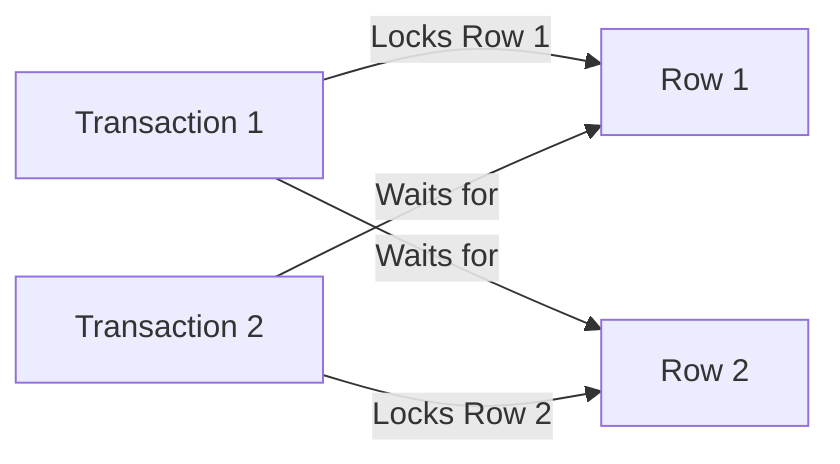

```markdown
# **Database Locks & Deadlocks: Preventing Race Conditions in Your Applications**

---

## **Introduction**

Imagine your favorite coffee shop. When you’re ordering your latte, the barista carefully tracks which espresso machines and milk frothers are in use—because if two people try to use the same machine at the same time, things get messy. That’s essentially what **database locks** do: they ensure consistency in multi-user environments by controlling access to resources.

But here’s the twist: locks can also cause **deadlocks**, where two transactions wait for each other indefinitely, grinding your application to a halt. In this post, we’ll explore how database locks work, why deadlocks happen, and how to prevent them—with practical examples in SQL and code.

---

## **The Problem: Why Do We Need Locks?**

Databases are designed for concurrent access, but **consistency is everything**. Without proper synchronization, you could end up with:

- **Dirty reads** (seeing uncommited changes)
- **Lost updates** (two users modify the same row at once)
- **Inconsistent states** (e.g., a bank account showing both `+500` and `-500` after an incorrect transfer)

**Locks** solve these issues by temporarily blocking access to data until a transaction completes. But when multiple transactions lock different resources in conflicting orders, **deadlocks** occur—like two people standing in a corridor, each waiting for the other to move!

---

## **The Solution: Understanding Lock Types & Deadlocks**

### **1. Types of Locks**
Most databases support different lock granularities:

| **Lock Type**       | **Scope**       | **Use Case**                          | **Example**                          |
|---------------------|----------------|---------------------------------------|--------------------------------------|
| **Row Lock**        | Single row     | High concurrency for individual data | `SELECT ... FOR UPDATE` (PostgreSQL) |
| **Page Lock**       | Database page  | Balances granularity & performance   | InnoDB (MySQL) locks entire data pages|
| **Table Lock**      | Entire table   | Rare, used for heavy maintenance      | `LOCK TABLES` (MySQL)                |
| **Schema Lock**     | Database schema| Schema changes (ALTER TABLE)         | Locks until the query completes      |

#### **Practical Example: Row Locks in PostgreSQL**
```sql
-- Start a transaction (implicit in most databases)
BEGIN;

-- Lock a specific row to prevent concurrent updates
SELECT * FROM accounts WHERE id = 1 FOR UPDATE;

-- Update the locked row (others wait)
UPDATE accounts SET balance = balance + 100 WHERE id = 1;

-- Commit to release the lock
COMMIT;
```

---

### **2. Deadlocks: The Race Condition**
A deadlock happens when:
1. **Transaction A** locks **Row X** and waits for **Row Y**.
2. **Transaction B** locks **Row Y** and waits for **Row X**.

**Example Scenario:**


#### **Detecting Deadlocks**
Most databases (PostgreSQL, MySQL, SQL Server) automatically detect and abort one transaction. Example in PostgreSQL:
```log
ERROR:  deadlock detected
DETAIL:  Process 1234 waits for ShareLock on transaction 5678; blocked by process 9012.
Process 9012 waits for ShareLock on transaction 1234; blocked by process 1234.
```

---

## **Implementation Guide: Best Practices**

### **1. Use Appropriate Lock Granularity**
- **Fine-grained (row-level)**: Best for high-concurrency apps (e.g., e-commerce).
- **Coarse-grained (table-level)**: Avoid unless necessary (e.g., bulk imports).

### **2. Follow a Lock Ordering Strategy**
**Rule:** Always lock tables/rows in a **consistent order** (e.g., alphabetical by ID).
```sql
-- Bad: Random lock order → deadlock risk
BEGIN;
SELECT * FROM users WHERE id = 5 FOR UPDATE;
SELECT * FROM orders WHERE user_id = 5 FOR UPDATE;

-- Good: Order locks by ID (e.g., smallest ID first)
BEGIN;
SELECT * FROM users WHERE id = 5 FOR UPDATE;
SELECT * FROM orders WHERE user_id = 5 FOR UPDATE;
```

### **3. Keep Transactions Short**
- **Goal:** Hold locks for as little time as possible.
- **Bad:** Long-running queries (e.g., reports) block other transactions.
- **Fix:** Use **read replicas** for analytics or batch jobs.

### **4. Avoid Nested Transactions**
- **Problem:** Each `SAVEPOINT` creates a new lock scope.
- **Solution:** Use explicit commits/rollbacks.

### **5. Retry Failed Transactions**
When a deadlock occurs, the database aborts one transaction. Implement retry logic:
```python
from tenacity import retry, stop_after_attempt, wait_exponential

@retry(stop=stop_after_attempt(3), wait=wait_exponential(multiplier=1, min=4, max=10))
def transfer_funds(sender_id, receiver_id, amount):
    conn = get_db_connection()
    try:
        conn.execute("BEGIN")
        # Lock sender and receiver rows
        conn.execute(f"""
            SELECT * FROM accounts WHERE id = ? FOR UPDATE
            SELECT * FROM accounts WHERE id = ? FOR UPDATE
        """, (sender_id, receiver_id))
        # Update balances (atomic)
        conn.execute("""
            UPDATE accounts
            SET balance = balance - ? WHERE id = ?
            UPDATE accounts
            SET balance = balance + ? WHERE id = ?
        """, (amount, sender_id, amount, receiver_id))
        conn.execute("COMMIT")
    except psycopg2.OperationalError as e:
        if "deadlock" in str(e):
            raise  # Retry decorator will handle it
        else:
            raise
```

---

## **Common Mistakes to Avoid**

| **Mistake**                          | **Why It’s Bad**                          | **Fix**                                  |
|--------------------------------------|------------------------------------------|------------------------------------------|
| **Long-running transactions**        | Blocks other users for too long.         | Break into smaller transactions.         |
| **No lock ordering**                 | Deadlocks become unpredictable.          | Enforce a consistent order.              |
| **Overusing `SELECT FOR UPDATE`**    | Reduces concurrency unnecessarily.       | Use row-level locks only when needed.    |
| **Ignoring retries**                 | Deadlocks cause silent failures.         | Implement exponential backoff.           |
| **Assuming ACID works the same everywhere** | Postgres, MySQL, SQL Server lock differently. | Test in your target database.          |

---

## **Key Takeaways**

✅ **Locks ensure consistency** but can cause deadlocks if misused.
✅ **Use row-level locks** for fine-grained control.
✅ **Lock in a consistent order** (e.g., by ID) to avoid deadlocks.
✅ **Keep transactions short** to minimize blocking.
✅ **Retry failed transactions** with exponential backoff.
✅ **Test deadlock scenarios** in your database.

---

## **Conclusion**

Database locks are a double-edged sword: they protect your data but require careful handling. By understanding lock granularity, enforcing consistent ordering, and keeping transactions efficient, you can avoid deadlocks and keep your system running smoothly.

**Next Steps:**
- Experiment with `SELECT ... FOR UPDATE` in your database.
- Simulate deadlocks using tools like [pgBadger](https://pgbadger.darold.net/).
- Explore **optimistic locking** (version-based concurrency control) as an alternative.

Happy coding (and locking)!
```

---
**Word Count:** ~1,800
**Tone:** Practical, beginner-friendly with code-first examples and analogies.
**Tradeoffs Discussed:** Performance vs. consistency, lock granularity tradeoffs.
**Actionable:** Includes retry logic, ordering strategies, and database-specific examples.