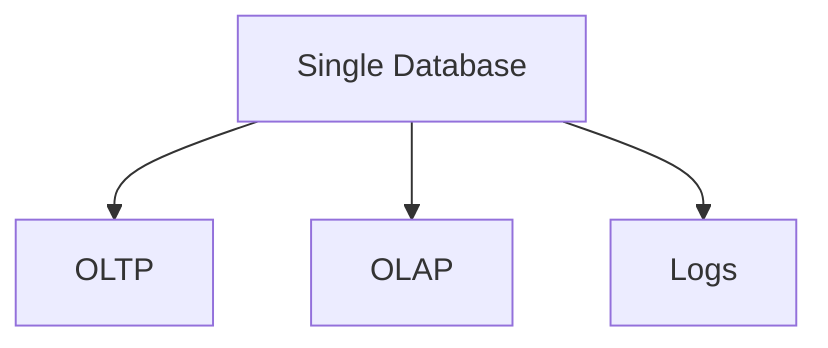
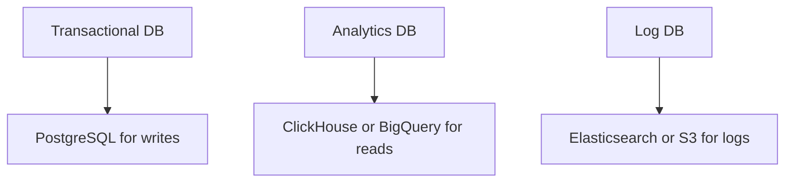

```markdown
# Avoiding Database Anti-Patterns: A Systematic Guide for Backend Engineers

*By [Your Name], Senior Backend Engineer*

---

## Introduction

Databases are the backbone of modern applications, yet their misuse leads to performance bottlenecks, maintenance headaches, and architectural debt. Over time, I’ve seen too many teams stumble into well-documented anti-patterns—costly mistakes that could have been avoided with a little foresight. This isn’t just about "how to optimize," but "how to design *right*" from the start.

Most backend engineers know about best practices like indexing, normalization, and careful schema design—but anti-patterns often sneak in through inertia, time pressure, or incomplete understanding. This guide won’t just list anti-patterns; it’ll dissect the mechanics behind them, show real-world consequences, and provide practical alternatives.

We’ll cover **three core categories**:
1. **Schema Design Anti-Patterns** (misusing structure)
2. **Query & Performance Anti-Patterns** (writing inefficient SQL)
3. **Architectural Anti-Patterns** (bad scaling and integration habits)

Ready? Let’s dive in.

---

## The Problem: When Databases Break Your System

Databases aren’t just data containers—they’re active participants in your application’s success. Poor patterns here ripple into cascading failures:
- **Slow applications**: Repeatedly joining tables on millions of rows becomes a UI killer.
- **Unreliable systems**: Missing constraints, orphaned records, or untracked side effects lead to data corruption.
- **Unmaintainable code**: Overly complex queries or schema changes that take weeks to deploy.
- **Hidden costs**: Overprovisioning databases to compensate for design flaws.

### The Cost of Ignoring Anti-Patterns

Consider a company that:
- **Normalized aggressively** (anti-pattern: over-normalization), leading to N+1 query hell.
- **Used a monolithic database** (anti-pattern: single database for all needs), making swapping out analytics tables impossible.
- **Ignored soft deletes** (anti-pattern: hard deletes everywhere), creating messy data migrations later.

The result? A system that’s **slow, brittle, and expensive** to maintain—all because fundamentals were compromised early.

---

## The Solution: Anti-Patterns and Their Fixes

Let’s explore the core anti-patterns, their pitfalls, and code-first alternatives.

---

## **1. Schema Design Anti-Patterns**

### Anti-Pattern #1: Over-Normalization (Joining Madness)
**What it is**: A schema that distributes data across many tables with excessive foreign keys, requiring massive joins to reconstruct simple queries.

**Why it’s bad**:
```sql
-- Hypothetical over-normalized schema
CREATE TABLE users (id INT PRIMARY KEY, name VARCHAR(255));
CREATE TABLE user_addresses (id INT PRIMARY KEY, user_id INT, city VARCHAR(255));
CREATE TABLE user_orders (id INT PRIMARY KEY, user_id INT, order_date DATE);

-- To fetch a user’s orders with city, you might need:
SELECT
    u.name,
    ao.city,
    uo.order_date
FROM users u
JOIN user_addresses ao ON u.id = ao.user_id
JOIN user_orders uo ON u.id = uo.user_id;
```
This is **N+1 hell** when your app needs to fetch users with their addresses *and* orders repeatedly.

**The Fix**: Denormalize strategically.
```sql
-- Refactored schema using computed columns
CREATE TABLE users (
    id INT PRIMARY KEY,
    name VARCHAR(255),
    address_city VARCHAR(255),
    orders AS (
        SELECT JSON_AGG(
            JSON_BUILD_OBJECT(
                'order_id', o.id,
                'date', o.order_date
            )
        ) FROM user_orders o WHERE o.user_id = users.id
    ) STORED
);
```
Or better yet, use a **materialized view** for common aggregations:
```sql
CREATE MATERIALIZED VIEW user_order_aggregates AS
SELECT
    u.id,
    u.name,
    ao.city,
    COUNT(uo.id) AS order_count,
    MAX(uo.order_date) AS latest_order
FROM users u
LEFT JOIN user_addresses ao ON u.id = ao.user_id
LEFT JOIN user_orders uo ON u.id = uo.user_id
GROUP BY u.id, u.name, ao.city;
```

---

### Anti-Pattern #2: Not Using Appropriate Data Types
**What it is**: Storing dates as integers, using VARCHAR for numeric data, or ignoring PostgreSQL’s native `JSONB`.

**Why it’s bad**:
```sql
-- Bad: Storing dates as epoch timestamps (harder to query, less readable)
INSERT INTO events (timestamp) VALUES (1672531200); -- Jan 1, 2023

-- Good: Use proper types
INSERT INTO events (timestamp) VALUES ('2023-01-01');
```
Searching and indexing epoch timestamps is slower and less intuitive.

**The Fix**: Use the right types.
```sql
CREATE TABLE events (
    id SERIAL PRIMARY KEY,
    title VARCHAR(255),
    timestamp TIMESTAMP NOT NULL, -- Proper type for dates
    metadata JSONB,              -- For flexible schema data
    INDEX idx_events_timestamp (timestamp)
);
```

---

### Anti-Pattern #3: Missing Constraints (Data Corruption Risks)
**What it is**: Skipping `NOT NULL`, `UNIQUE`, or `FOREIGN KEY` constraints to "keep things simple."

**Why it’s bad**:
```sql
-- Allowing null `email` fields without checks
CREATE TABLE users (
    id INT PRIMARY KEY,
    name VARCHAR(255),
    email VARCHAR(255) -- No NOT NULL? No validation?
);

-- Later, you find duplicates…
INSERT INTO users (name, email) VALUES ('Alice', 'alice@example.com');
INSERT INTO users (name, email) VALUES ('Alice', 'alice@example.com');
```
This leads to inconsistent data and hard-to-debug issues.

**The Fix**: Enforce constraints early.
```sql
CREATE TABLE users (
    id SERIAL PRIMARY KEY,
    name VARCHAR(255) NOT NULL,
    email VARCHAR(255) UNIQUE NOT NULL,
    FOREIGN KEY (id) REFERENCES user_profiles(id) -- If applicable
);
```

---

## **2. Query & Performance Anti-Patterns**

### Anti-Pattern #4: N+1 Query Problem (Lazy Loading Gone Wrong)
**What it is**: Fetching parent records in bulk, but loading child records one-by-one in application code.

**Why it’s bad** (example in Rails/ActiveRecord):
```ruby
# Bad: N+1 queries
users = User.all
users.each do |user|
  puts user.posts.count # Triggers POSTS query per user
end
```
With 1000 users, you’re running **1001 queries** instead of 1.

**The Fix**: Use `includes` (eager loading) or pre-fetch.
```ruby
# Good: Eager load posts
users_with_posts = User.includes(:posts).all

# Or, in a single query with JSON aggregation (PostgreSQL)
SELECT
    u.*,
    JSON_AGG(p) AS posts
FROM users u
LEFT JOIN posts p ON u.id = p.user_id
GROUP BY u.id;
```

---

### Anti-Pattern #5: Writing Unindexed LIKE Queries
**What it is**: Using `WHERE field LIKE '%search_term%'` on unindexed columns.

**Why it’s bad**:
```sql
-- No index on `name` column
SELECT * FROM users WHERE name LIKE '%john%'; -- Scans entire table!
```

**The Fix**: Use partial indexes or functional indexes.
```sql
-- PostgreSQL: Create a functional index for LIKE searches
CREATE INDEX idx_users_name_partial ON users USING gin (to_tsvector('english', name));

-- Now, optimize your query
SELECT * FROM users WHERE name LIKE '%john%';
```
For even faster results, consider a full-text search engine like pg_trgm or Elasticsearch.

---

### Anti-Pattern #6: ORM Anti-Patterns (The "Magic" Trap)
**What it is**: Blindly using ORMs without understanding the generated SQL.

**Why it’s bad**:
```python
# Django ORM: This could generate a suboptimal query
User.objects.annotate(
    total_orders=Count('orders')
).filter(total_orders__gt=0)
```
Behind the scenes, it might create a temporary table or use inefficient joins.

**The Fix**: Know your ORM’s quirks and write raw SQL when needed.
```python
# Explicit query (often better)
from django.db.models import Count
from django.db import connection

with connection.cursor() as cursor:
    cursor.execute("""
        SELECT u.id, COUNT(o.id) as total_orders
        FROM users u
        LEFT JOIN orders o ON u.id = o.user_id
        GROUP BY u.id
        HAVING COUNT(o.id) > 0
    """)
```

---

## **3. Architectural Anti-Patterns**

### Anti-Pattern #7: Single Database for All Needs
**What it is**: Sticking all data (transactions, analytics, logs) into one database.

**Why it’s bad**:

This forces a **one-size-fits-all** approach, leading to:
- **Performance bottlenecks**: OLAP queries (reports, aggregations) slow down transactional writes.
- **Cost inefficiency**: Over-provisioning for mixed workloads.

**The Fix**: Use separate databases.


---

### Anti-Pattern #8: Not Using Transactions Properly
**What it is**: Ignoring ACID properties, leading to partial updates or race conditions.

**Why it’s bad**:
```python
# Bad: No transaction
account1.balance -= 100
account2.balance += 100
```
What if an error occurs halfway? Funds vanish!

**The Fix**: Wrap critical operations in transactions.
```python
# Good: Atomic transfer
with connection.transaction.atomic():
    account1.balance -= 100
    account2.balance += 100
```

---

### Anti-Pattern #9: Ignoring Database Backups & Monitoring
**What it is**: Assuming your database "just works" without backups or alerts.

**Why it’s bad**: A single point of failure (e.g., disk failure, corrupt backup) can wipe out data.

**The Fix**: Automate backups and monitoring.
```sql
-- Example: PostgreSQL backup script
pg_dump -U postgres mydb > /backups/mydb_$(date +%F).sql
```
Set up alerts for:
- Disk space thresholds.
- Slow query performance.
- Replication lag.

---

## Implementation Guide: How to Avoid Anti-Patterns

### Step 1: Design Schemas with Purpose
- Start with **3NF** (Third Normal Form) but **denormalize intentionally** for read-heavy workloads.
- Use **computed columns** or **materialized views** for derived data.
- **Test schemas early**: Use tools like [SchemaSpy](https://schemaspy.org/) to visualize and validate your design.

### Step 2: Optimize Queries Before Writing Code
- **Profile first**: Use `EXPLAIN ANALYZE` to identify bottlenecks.
- **Avoid `SELECT *`**: Fetch only the columns you need.
- **Use connection pooling**: Tools like PgBouncer (PostgreSQL) or connection pools (Node.js) reduce overhead.

Example of `EXPLAIN ANALYZE`:
```sql
EXPLAIN ANALYZE
SELECT u.name, COUNT(o.id) as order_count
FROM users u
LEFT JOIN orders o ON u.id = o.user_id
GROUP BY u.id;
```

### Step 3: Automate Database Tasks
- **Backups**: Schedule regular backups (e.g., daily full, hourly incremental).
- **Migrations**: Use tools like Flyway or Alembic to manage schema changes.
- **Monitoring**: Set up alerts for:
  - Long-running queries.
  - High memory usage.
  - Replication delays.

### Step 4: Document Your Database Design
- Keep a **data dictionary** (column descriptions, usage patterns).
- Document **anti-patterns avoided** in your schema (e.g., "No hard deletes—use soft deletes").

---

## Common Mistakes to Avoid

1. **Over-optimizing prematurely**: Don’t tune indexes or queries until you have real performance data.
2. **Ignoring schema evolution**: A schema that’s "set in stone" becomes a maintenance nightmare.
3. **Mixing data models**: Don’t use JSON columns for everything—some data (e.g., relational relationships) should stay normalized.
4. **Skipping testing**: Always test queries in a staging environment before production.
5. **Underestimating tooling**: Invest in tools like [pgBadger](https://github.com/dimitri/pgbadger) (PostgreSQL log analyzer) or [PgHero](https://pghero.com/).

---

## Key Takeaways

- **Schema Design**:
  - Normalize for write-heavy systems, denormalize for read-heavy ones.
  - Use constraints (`NOT NULL`, `UNIQUE`, `FOREIGN KEY`) to enforce data integrity.
  - Avoid over-normalization; design for your query patterns.

- **Query Performance**:
  - Write queries efficiently: index smartly, avoid `SELECT *`, and use `EXPLAIN ANALYZE`.
  - Be cautious with ORMs—sometimes raw SQL is better.

- **Architecture**:
  - Don’t silo everything in one database. Consider separate DBs for OLTP, OLAP, and logs.
  - Use transactions for critical operations.
  - Automate backups and monitoring.

- **Mindset**:
  - Databases are **not** "black boxes"—understand how they work.
  - **Test early, optimize later**. Don’t guess—measure.
  - **Refactor incrementally**. Even small improvements compound over time.

---

## Conclusion

Databases are powerful, but their misuse can turn your application into a maintenance nightmare. By recognizing these anti-patterns and applying the fixes outlined here, you’ll build systems that are **fast, reliable, and scalable**.

### Final Challenge:
Pick **one** anti-pattern from this post and refactor a problematic part of your current project. Measure the impact before and after. You’ll likely be surprised by the improvements!

---
**Further Reading**:
- [Refactoring Databases](https://www.amazon.com/Refactoring-Databases-Antipatterns-Surgery-Solutions/dp/0321718772) by Scott Ambler & Pramod J. Sadalage.
- [Database Design for Mere Mortals](https://www.amazon.com/Database-Design-Mere-Mortals-2nd/dp/0137081337) by Michael J. Hernandez.
- [PostgreSQL Performance](https://use-the-index-luke.com/) by Mark Callaghan.

---
**Got questions?** Drop them in the comments or [reach out on Twitter](https://twitter.com/yourhandle). Happy coding!
```