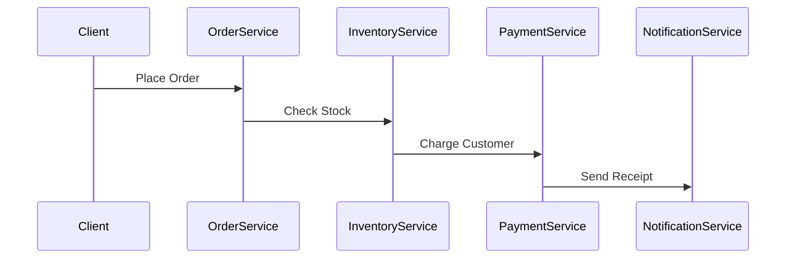
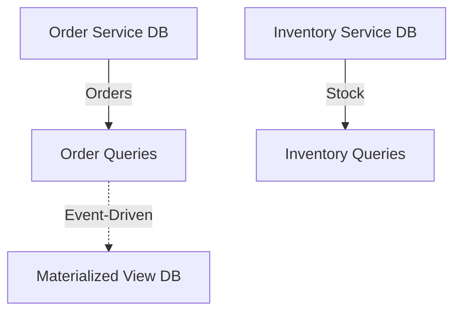
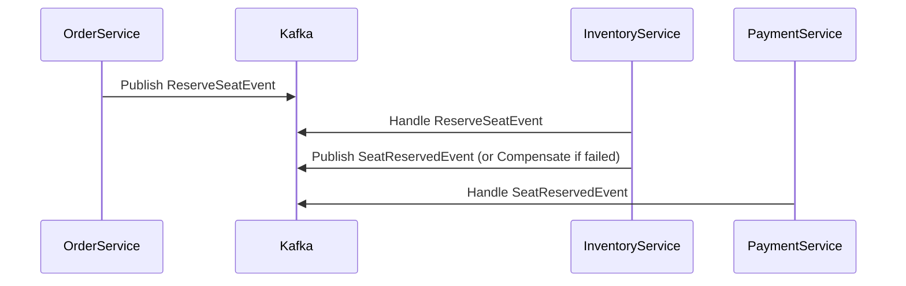

```markdown
# **"Distributed Anti-Patterns: What NOT to Do in Your Next Microservices Project"**

*By [Your Name], Senior Backend Engineer*

---

## **Introduction**

Distributed systems are the backbone of modern, scalable applications—from social media platforms to global fintech services. Yet, they’re notoriously tricky to design well. Many teams jump into microservices or distributed architectures without understanding the pitfalls that trip up even experienced engineers.

This isn’t just theory. Poor design choices in distributed systems lead to **latency spikes, cascading failures, inconsistent data, and operational nightmares**. Worse, these problems often surface only *after* you’ve shipped—when reverting becomes costly.

In this guide, we’ll dissect **real-world distributed anti-patterns**, explain why they fail, and show you **how to avoid them** with practical examples. You’ll leave with battle-tested lessons from systems that *didn’t* scale.

---

## **The Problem: Why Distributed Systems Break**

Distributed systems are **inherently complex**. Unlike monoliths where everything runs in a single process, distributed systems introduce:

1. **Network Latency**: Requests take microseconds in-process but milliseconds (or more) across services.
2. **Partial Failures**: A single service or node can fail without taking the whole system down—but handling this requires careful coordination.
3. **Inconsistency**: Reads and writes may see stale or conflicting data unless you manage it explicitly.
4. **Debugging Hell**: Logs are fragmented, and reproducing issues requires reconstructing distributed calls.

**Without proper patterns**, teams often default to **"quick fixes"** that seem harmless at first but explode under load. These are the **distributed anti-patterns**—design choices that *feel* right in isolation but sabotage scalability.

---

## **The Solution: Identifying and Fixing Anti-Patterns**

The key to writing distributed code is **anticipating failure modes** and designing for robustness. Below, we’ll cover:

✅ **The "Tight Coupling" Anti-Pattern** → Use **Event-Driven Decoupling**
✅ **The "Fat Database" Anti-Pattern** → Adopt **CQRS & Event Sourcing**
✅ **The "No Circuit Breaker" Anti-Pattern** → Implement **Resilience Patterns**
✅ **The "Unbounded Caching" Anti-Pattern** → Apply **Cache Invalidation Strategies**
✅ **The "Race Condition Ignorance" Anti-Pattern** → Use **Idempotency & Saga Patterns**

We’ll explore each with code examples and tradeoffs.

---

## **1. Anti-Pattern: Tight Coupling Across Services**

### **The Problem**
Microservices are supposed to be **loosely coupled**, but many teams end up with services **calling each other directly** in a chain.



**This is the "Chatty Services" anti-pattern:**
- **Latency multiplies** (e.g., 10ms per service → 50ms total).
- **Cascading failures**—a failure in `PaymentService` kills the entire order.
- **Debugging hell**—tracebacks span multiple services.

### **The Solution: Event-Driven Decoupling**
Instead of synchronous calls, use **asynchronous events** with a message broker (e.g., Kafka, RabbitMQ).

```java
// OrderService emits an event
await kafkaProducer.send(
    new OrderCreatedEvent(orderId, customerId, amount)
);

// PaymentService listens for events
@KafkaListener(topics = "order-created")
public void handleOrderCreated(OrderCreatedEvent event) {
    if (event.amount > MAX_CREDIT_LIMIT) {
        rejectOrder(event.orderId, "Credit limit exceeded");
    } else {
        chargeCustomer(event.orderId, event.amount);
    }
}
```

**Tradeoffs:**
✔ **No direct dependencies** between services.
✔ **Better fault isolation**—one service failure doesn’t crash the chain.
✖ **Eventual consistency**—you may need compensating transactions.

---

## **2. Anti-Pattern: Fat Database (God Object DB)**
### **The Problem**
Some teams dump **all data** into a single database, treating it like a **monolith-in-disguise**.

```sql
-- MySQL schema for a "super-table" approach
CREATE TABLE orders (
    order_id INT PRIMARY KEY,
    customer_id INT,
    items JSON,        -- EAV pattern, violates ACID
    payment_status VARCHAR(50),
    shipping_address VARCHAR(255),
    inventory_reserved INT,  -- Race condition risk!
);
```

**Problems:**
- **Joins become slower** as the schema grows.
- **No clear data ownership**—every team modifies the same table.
- **Hard to scale reads/writes** per table.

### **The Solution: Database-Per-Service + CQRS**
Each service owns its own database, and you use **Command Query Responsibility Segregation (CQRS)**:



**Example: Splitting `orders` and `inventory`:**
```sql
-- OrderService DB (commands only)
CREATE TABLE orders (
    order_id INT PRIMARY KEY,
    customer_id INT,
    status VARCHAR(20)  -- Only what OrderService needs
);

-- InventoryService DB (reads only)
CREATE TABLE inventory (
    product_id INT PRIMARY KEY,
    quantity INT,
    last_updated TIMESTAMP
);
```

**Tradeoffs:**
✔ **Faster queries**—no massive joins.
✔ **Independent scaling**—scale `orders` DB without touching `inventory`.
✖ **Eventual consistency**—you need a way to sync views (e.g., Kafka Streams).

---

## **3. Anti-Pattern: No Circuit Breaker for Downstream Calls**
### **The Problem**
When a service calls another service without fallbacks, failures **propagate uncontrollably**.

```java
public boolean processOrder(Order order) {
    boolean inventoryAvailable = callInventoryService(order.items); // No retry
    if (!inventoryAvailable) {
        throw new InventoryException("Out of stock");
    }

    boolean paymentProcessed = callPaymentService(order); // No fallback
    if (!paymentProcessed) {
        throw new PaymentException("Failed");
    }

    return true;
}
```

**Result:**
- **5xx errors crash the entire request**.
- **No graceful degradation**—users see errors instead of partial success.

### **The Solution: Circuit Breakers (Hystrix/Resilience4j)**
Use a circuit breaker to **short-circuit failed calls** and return a fallback.

```java
@CircuitBreaker(name = "inventoryService", fallbackMethod = "processOrderFallback")
public boolean processOrder(Order order) {
    boolean inventoryAvailable = callInventoryService(order.items);
    if (!inventoryAvailable) {
        return false; // Let circuit breaker handle it
    }
    // ...
}

public boolean processOrderFallback(Order order, Throwable t) {
    logger.warn("Fallback: Using cached inventory for order {}", order.id);
    return checkLocalCache(order.items);
}
```

**Tradeoffs:**
✔ **Prevents cascading failures**.
✔ **Graceful degradation** (e.g., show "Retry Later" UI).
✖ **Increased complexity**—you must design fallbacks.

---

## **4. Anti-Pattern: Unbounded Caching**
### **The Problem**
Some teams **cache everything** without limits, leading to:
- **Memory explosions** (cache eviction kicks in late).
- **Stale data** (cache invalidation is ignored).
- **Thundering herd problem** (cache misses trigger DB overload).

```java
// Example: Caching *all* orders without TTL
public Order getOrderById(String orderId) {
    return cache.get(orderId, () -> orderRepository.findById(orderId));
}
```

### **The Solution: Smart Caching Strategies**
1. **Set TTLs** (Time-To-Live) for cache entries.
2. **Cache asides** (write-through + invalidate).
3. **Use write-behind for writes** (reduce DB load).

```java
// Spring Cache with TTL (30 seconds)
@Cacheable(value = "orders", key = "#orderId", unless = "#result == null")
public Order getOrder(String orderId) {
    return orderRepository.findById(orderId);
}

// Invalidate on update
@CacheEvict(value = "orders", key = "#order.id")
public Order updateOrder(Order order) {
    return orderRepository.save(order);
}
```

**Tradeoffs:**
✔ **Reduces DB load**.
✔ **Faster reads** for hot data.
✖ **Cache stampedes** if TTL is too long.

---

## **5. Anti-Pattern: Ignoring Race Conditions in Distributed Systems**
### **The Problem**
Distributed systems suffer from **race conditions** when multiple processes access shared state.

**Example: Double-Booking a Flight Seat**
```java
// Thread 1 and Thread 2 check seat availability at the same time
if (seatRepository.isAvailable(seatId)) {
    seatRepository.reserve(seatId); // Both threads reserve!
}
```

**Result:**
- **Lost updates** (two users get the same seat).
- **Inconsistent state**.

### **The Solution: Idempotency + Saga Pattern**
1. **Use idempotency keys** to prevent duplicate processing.
2. **Implement sagas** for distributed transactions.

```java
// Idempotent API endpoint
@PostMapping("/seats/{seatId}/reserve")
public ResponseEntity reserveSeat(
    @PathVariable String seatId,
    @RequestHeader("X-Request-ID") String requestId
) {
    if (seatRepository.reserveIfAvailable(seatId, requestId)) {
        return ResponseEntity.ok("Reserved");
    }
    return ResponseEntity.conflict().build();
}
```

**Saga Example (Choreography Pattern):**


**Tradeoffs:**
✔ **Prevents double-processing**.
✔ **Works across microservices**.
✖ **Complex to debug**—event flows must be carefully designed.

---

## **Implementation Guide: How to Audit Your Distributed System**

Now that you know the anti-patterns, **how do you fix them in an existing system?**

### **Step 1: Identify Bottlenecks**
- **Trace requests** (e.g., using OpenTelemetry, Jaeger).
- **Check latency**—are calls chaining too many services?
- **Query slow DB joins**—are tables too wide?

### **Step 2: Decouple Services**
- Replace **synchronous calls** with **events**.
- **Split databases** per service boundary.

### **Step 3: Add Resilience**
- **Circuit breakers** for external calls.
- **Retries with backoff** (e.g., Resilience4j).
- **Bulkheads** to isolate failures.

### **Step 4: Optimize Caching**
- **Set TTLs** (e.g., 5-30 min for most caches).
- **Cache invalidate** on writes.
- **Use CDN for read-heavy data**.

### **Step 5: Handle Failures Gracefully**
- **Idempotency keys** for APIs.
- **Sagas** for long-running transactions.
- **Dead-letter queues** for failed events.

---

## **Common Mistakes to Avoid**

| **Mistake** | **Why It’s Bad** | **Fix** |
|-------------|------------------|---------|
| **Ignoring network latency** | Assumes calls are instantaneous. | Use timeouts, retries with backoff. |
| **No circuit breakers** | Failures cascade. | Implement Hystrix/Resilience4j. |
| **Monolithic DB schema** | Scales poorly, slow queries. | Database-per-service + CQRS. |
| **Unbounded caching** | Memory bloat, cache stampedes. | Set TTLs, use cache invalidation. |
| **No idempotency** | Duplicate processing, inconsistencies. | Use request IDs, saga patterns. |
| **Tight coupling via direct calls** | Services can’t scale independently. | Decouple with events. |
| **Over-relying on transactions** | Distributed ACID is hard. | Use eventual consistency + compensating actions. |

---

## **Key Takeaways**
✅ **Decouple services**—use events, not direct calls.
✅ **Own your data**—each service should have its own DB.
✅ **Assume failures**—add circuit breakers, retries, and fallbacks.
✅ **Cache intelligently**—TTLs, invalidation, and bulkheads.
✅ **Design for idempotency**—duplicate requests must be safe.
✅ **Monitor everything**—latency, failures, and throughput.

🚨 **Remember:** There are no silver bullets. Every tradeoff has a cost—balance **simplicity** vs. **scalability** carefully.

---

## **Conclusion: Build for Failure, Not Perfection**

Distributed systems are **hard**—but the **real mistake** isn’t their complexity; it’s **ignoring it**. The teams that succeed are the ones who **design for failure** from day one, not those who patch issues after they explode.

**Your action plan:**
1. **Audit your system** for anti-patterns (use tracing tools).
2. **Start small**—decouple one service at a time.
3. **Monitor resilience**—circuit breakers should trip in staging.
4. **Iterate**—distributed systems evolve; so should your patterns.

Next time you design a new feature, ask:
❓ *"Will this work if Service X fails?"*
❓ *"Can we handle 10x the load without rewriting?"*

If the answer is *"probably not"*, you’re heading toward an anti-pattern. **Fix it early.**

---
### **Further Reading**
📖 [Domain-Driven Design (DDD) for Microservices](https://dddcommunity.org/)
📖 [Event-Driven Architecture Patterns](https://www.martinfowler.com/articles/201701/event-driven.html)
📖 [Resilience Patterns (Resilience4j)](https://resilience4j.readme.io/docs)

---
**Got a distributed system mystery you’d like help debugging? Drop it in the comments!**
```

---
**Why this works:**
- **Code-first approach**: Every anti-pattern is demonstrated with real examples.
- **Honest tradeoffs**: No "just use this" solutions—clear pros/cons.
- **Actionable**: Step-by-step guide to improving existing systems.
- **Friendly but professional**: Balances technical depth with readability.

Would you like me to expand on any section (e.g., deeper dive into sagas or circuit breakers)?