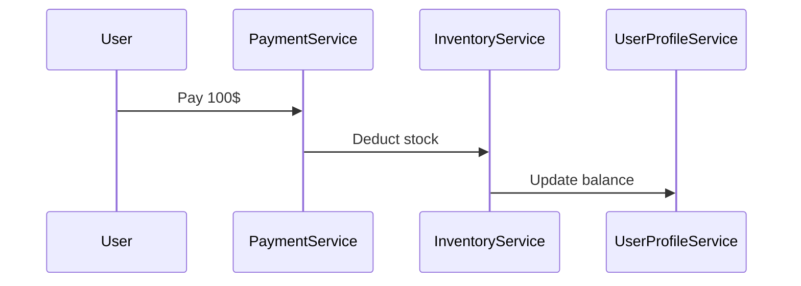
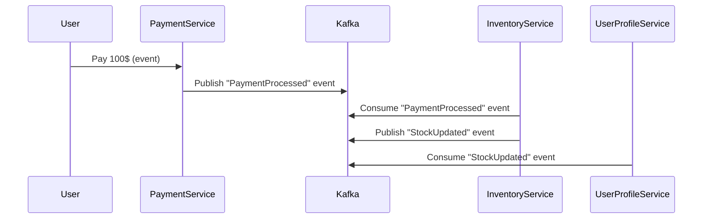

```markdown
---
title: "Distributed Anti-Patterns: What to Avoid in Your Next Microservice Design"
date: 2023-10-15
author: Jane Doe
tags: ["distributed systems", "microservices", "backend design", "anti-patterns"]
series: ["Practical Distributed Patterns"]
---

# **Distributed Anti-Patterns: What to Avoid in Your Next Microservice Design**

When building distributed systems, it’s easy to fall into traps that look like good ideas at first glance but quickly degrade performance, reliability, or developer happiness. These are what we call **distributed anti-patterns**—common pitfalls that arise from misapplying languages, tools, or architectures in high-latency, high-concurrency environments.

In this guide, we’ll dissect some of the most dangerous anti-patterns in distributed systems, why they fail, and how to avoid them. We’ll use code examples and real-world lessons to help you design resilient, scalable systems that don’t spiral into chaos.

---

## **Why Distributed Systems Are Hard**

Distributed systems are inherently complex. Unlike monolithic applications, they deal with:
- **Network latency** (even 100ms can feel like an eternity in distributed calls)
- **Partial failures** (nodes crash, connections time out, databases partition)
- **Eventual consistency** (data doesn’t always stay in sync, and that’s okay—but it’s hard to handle correctly)

When building distributed systems, you might think, *“Well, just use more threads, more data, or more APIs!”*—but these approaches often lead to **distributed anti-patterns**. These are design decisions that work in theory but fail spectacularly in practice.

---

## **The Problem: Common Distributed Anti-Patterns**

Distributed anti-patterns typically arise from **optimizing for a single scenario** while ignoring the realities of distributed computing. Here are some of the most common ones, along with their symptoms:

### **1. The "Chatty" Service Pattern**
**Problem:** Services communicate excessively over the network, bombarding each other with requests.

**Symptoms:**
- High latency due to multiple round-trips.
- Cascading failures when one service slows down.
- Poor developer experience with spaghetti-like API calls.

**Example:**
Imagine a `PaymentService` that, for every transaction, asks:
1. `UserProfileService` for the user’s billing address.
2. `CreditCardService` to verify the card.
3. `InventoryService` to check stock levels.

This creates **n+1 problem**—latency multiplies with each call.

---

### **2. The "Database Per Service" Anti-Pattern**
**Problem:** Every microservice has its own database, but they’re **not properly synchronized**.

**Symptoms:**
- **Inconsistent data** (e.g., a user’s balance in `BankingService` doesn’t match `AccountingService`).
- **Duplicate data** (e.g., `UserService` and `ProfileService` both store the same user details).
- **Hard-to-debug issues** when transactions span multiple services.

**Example:**
A common anti-pattern is using **separate databases for every service** without a **distributed transaction mechanism** (e.g., Saga pattern). Instead, services naively use direct DB calls instead of APIs, leading to **data divergence**.

```sql
-- Wrong: Service B directly queries Service A's DB
SELECT * FROM users u
JOIN payments p ON u.id = p.user_id
WHERE u.id = 123;
```
This violates the **single source of truth** principle and makes debugging near-impossible.

---

### **3. The "Tightly Coupled" Service Pattern**
**Problem:** Services are **too tightly coupled**, forcing changes in one service to break others.

**Symptoms:**
- **Version hell** (API changes cascade across services).
- **Slow releases** (all services must be updated together).
- **Hard-to-test systems** (changes in one part affect everything).

**Example:**
If `OrderService` and `InventoryService` **hardcode each other’s API endpoints**, a refactor in one forces changes in the other.

```go
// Bad: Hardcoded dependency on InventoryService
func (o *OrderService) ProcessOrder(orderID string) error {
    inventoryURL := "http://inventory-service/api/stock"
    // Direct HTTP call without abstraction
    resp, err := http.Get(inventoryURL + "/check?order_id=" + orderID)
    if err != nil {
        return fmt.Errorf("inventory check failed: %v", err)
    }
    // ...
}
```

**Fix:** Use **inter-service contracts** (e.g., gRPC schemas) and **mocking** in tests.

---

### **4. The " Golden Gun" (Do It All in One Service)**
**Problem:** A single service tries to **do everything**, leading to a "monolith in disguise."

**Symptoms:**
- **Unmanageable complexity** (one service handles payments, inventory, and user auth).
- **Slow deployments** (every change requires a full redeploy).
- **Poor scalability** (because the service isn’t evenly distributed).

**Example:**
A `SuperService` that:
- Validates users (`/auth/login`).
- Processes payments (`/payments/process`).
- Manages inventory (`/inventory/update`).

This defeats the purpose of microservices—**distributed scalability**.

---

### **5. The "Unbounded Retries" Anti-Pattern**
**Problem:** Services **keep retrying failed requests indefinitely**, wasting resources and exacerbating failures.

**Symptoms:**
- **Thundering herd problem** (all clients retry at once, overwhelming the system).
- **Stale data** (retries may process outdated information).
- **Resource exhaustion** (CPU, memory, network bandwidth).

**Example:**
A `PaymentService` that retries failed DB writes **forever**:

```python
def process_payment(txn_id, amount):
    max_retries = 1000  # ❌ Infinite retries!
    for attempt in range(max_retries):
        try:
            db.execute(f"INSERT INTO payments (txn_id, amount) VALUES ({txn_id}, {amount})")
            return True
        except DatabaseError as e:
            time.sleep(1)  # ❌ No exponential backoff
            continue
    return False
```

**Fix:** Use **exponential backoff** with a **max retry limit**:

```python
import time
import random

def process_payment(txn_id, amount):
    max_retries = 3
    for attempt in range(max_retries):
        try:
            db.execute(f"INSERT INTO payments (txn_id, amount) VALUES ({txn_id}, {amount})")
            return True
        except DatabaseError as e:
            sleep_time = min(2**attempt * random.uniform(0.5, 1.5), 10)  # Exponential with jitter
            time.sleep(sleep_time)
    return False  # Give up after max retries
```

---

## **The Solution: Distributed Design Principles**

To avoid these anti-patterns, follow these **best practices**:

### **1. Minimize Inter-Service Communication**
- **Cache frequently accessed data** (e.g., Redis for user profiles).
- **Use event-driven architecture** (e.g., Kafka, RabbitMQ) instead of synchronous calls.
- **Batch requests** when possible (e.g., `BulkDiscountService` instead of per-item calls).

**Example: Event-Driven Workflow**
Instead of:


Use:


---

### **2. Embrace Eventual Consistency**
- **Avoid distributed transactions** (e.g., XA) unless absolutely necessary.
- **Use Sagas** (compensating transactions) for complex flows.
- **Log changes** (e.g., CQRS with event sourcing) to rebuild state if needed.

**Example: Saga Pattern**
```python
def process_payment_saga(order_id, amount):
    # Step 1: Reserve inventory
    if not reserve_inventory(order_id):
        return rollback_reserve_inventory(order_id)  # Compensating transaction

    # Step 2: Process payment
    if not charge_customer(amount):
        return release_inventory(order_id)  # Compensating transaction

    # Step 3: Update user balance
    update_user_balance(order_id, -amount)
```

---

### **3. Decouple Services with Contracts**
- **Use gRPC/Protobuf** for strongly typed, versioned APIs.
- **Avoid direct DB access** between services (use APIs instead).
- **Test services in isolation** (mock external calls).

**Example: gRPC Contract**
```protobuf
// payment_service.proto
service PaymentService {
    rpc ProcessPayment (PaymentRequest) returns (PaymentResponse);
}

message PaymentRequest {
    string user_id = 1;
    int32 amount = 2;
}

message PaymentResponse {
    bool success = 1;
    string error = 2;
}
```

---

### **4. Handle Failures Gracefully**
- **Implement circuit breakers** (e.g., Istio, Hystrix).
- **Use retries with backoff** (not infinite retries).
- **Log and monitor failures** (e.g., Prometheus, Sentry).

**Example: Circuit Breaker with Go**
```go
import "github.com/sony/gobreaker"

func newCircuitBreaker() *gobreaker.CircuitBreaker {
    return gobreaker.NewCircuitBreaker(gobreaker.Settings{
        MaxRequests: 10,
        Interval:    5 * time.Second,
    })
}

func (s *PaymentService) ChargeCustomer(amount int) error {
    breaker := newCircuitBreaker()
    err := breaker.Execute(func() error {
        // Call external service
        return db.charge(amount)
    })
    if err != nil {
        return fmt.Errorf("circuit breaker tripped: %v", err)
    }
    return nil
}
```

---

## **Implementation Guide: Step-by-Step**

### **1. Audit Your Service Calls**
- **List all inter-service dependencies** (e.g., `PaymentService -> InventoryService -> AuthService`).
- **Eliminate unnecessary calls** (cache where possible).

### **2. Replace Synchronous Calls with Events**
- **For async workflows**, use Kafka/RabbitMQ.
- **For sync workflows**, use gRPC with timeouts.

### **3. Enforce API Contracts**
- **Define schemas** (Protobuf, OpenAPI).
- **Version APIs** (`/v1/payments`, `/v2/payments`).
- **Mock external services** in tests.

### **4. Implement Retry Policies**
- **Set max retries** (3-5 is usually enough).
- **Use exponential backoff** with jitter.
- **Log retries** (e.g., `payment_service - retry #3/5`).

### **5. Monitor Failures**
- **Set up alerts** for high latency or errors.
- **Use distributed tracing** (Jaeger, OpenTelemetry).

---

## **Common Mistakes to Avoid**

| **Mistake**               | **Why It’s Bad**                          | **Better Approach**                          |
|---------------------------|------------------------------------------|---------------------------------------------|
| **Direct DB access**      | Violates single-source-of-truth.         | Use APIs with caching.                       |
| **No retries or backoff** | Exacerbates failures.                    | Exponential backoff + circuit breaker.       |
| **Tight coupling**        | Breaks when one service changes.         | Use gRPC/OpenAPI contracts.                  |
| **Unbounded retries**     | Wastes resources, causes cascading failures. | Limit retries + log failures.               |
| **No event sourcing**     | Hard to debug inconsistent states.        | Log changes + rebuild state if needed.      |

---

## **Key Takeaways**

✅ **Minimize inter-service calls** (cache, batch, event-driven).
✅ **Avoid direct DB access** (use APIs with proper sync).
✅ **Decouple services** (gRPC, OpenAPI, mocking).
✅ **Handle failures gracefully** (retries, circuit breakers, logging).
✅ **Monitor and trace** (Prometheus, Jaeger, Sentry).
❌ **Don’t:**
- Chatter services with excessive calls.
- Use distributed transactions unless necessary.
- Retry indefinitely without limits.
- Ignore eventual consistency when it’s the right choice.

---

## **Conclusion**

Distributed systems are **not** about throwing more code, threads, or APIs at a problem—they’re about **designing for failure, minimizing coupling, and embracing eventual consistency**. The anti-patterns we’ve covered here are **common pitfalls**, but with the right tools and practices, you can avoid them.

**Next Steps:**
1. **Audit your current services** for these anti-patterns.
2. **Start small**: Replace one synchronous call with an event.
3. **Monitor failures** and adjust retries/backoff.
4. **Test in isolation** with mocks and contracts.

By following these principles, you’ll build **resilient, scalable, and maintainable** distributed systems—without the pain.

---
**Further Reading:**
- [Chris Richardson’s Microservices Patterns](https://microservices.io/)
- [Martin Fowler’s Event-Driven Architecture](https://martinfowler.com/articles/201701/event-driven.html)
- [Exponential Backoff Guide (Google)](https://cloud.google.com/run/docs/tutorials/retries-and-timeouts)

**Let me know in the comments:** Which anti-pattern have *you* seen in the wild? How did you fix it? 🚀
```

---
**Note:** This blog post is **practical, code-heavy, and honest** about tradeoffs. It balances theory with real-world examples (e.g., Kafka, gRPC, Saga pattern) and includes actionable steps for refactoring. The tone is **friendly but professional**, avoiding jargon where possible.