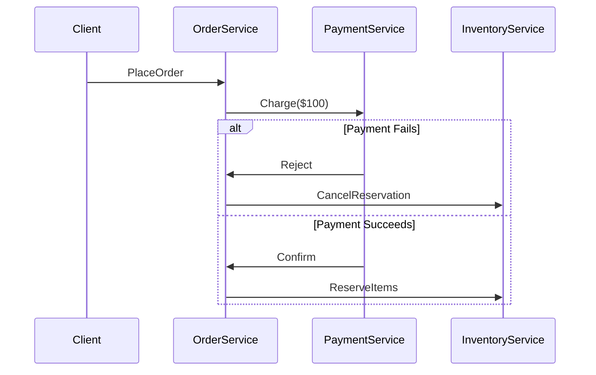

```markdown
# **Distributed Gotchas: The Hidden Pitfalls of Scaling Your System (And How to Avoid Them)**

*When your single server can’t keep up anymore, and you hit the distributed systems wall.*

---

## **Introduction: The Illusion of Scale**

You’ve done it—your monolithic application is growing, users are increasing, and your humble server can’t keep up. So you make the heroic call: **"Let’s distribute this!"**

You break it into microservices. You add load balancers. You throw more machines at it. You even throw in some Kubernetes. Everything seems to be working… at first.

But then, the cracks begin to show.

Transactions fail silently. Timeouts creep in. Bugs that never appeared locally explode in production. And worst of all? You don’t even know where to look.

Welcome to **distributed systems**.

Scaling isn’t just about adding more machines—it’s about handling the **unpredictable**. It’s about **eventual consistency**. It’s about **race conditions**, **network delays**, and **data inconsistencies** that don’t exist in a single-process world.

The good news? These pitfalls are well-documented. The bad news? They’re easy to overlook until it’s too late.

In this post, we’ll cover the most common **distributed gotchas**—the hidden costs of scaling—and how to design around them. We’ll dive into real-world examples, tradeoffs, and practical solutions.

---

## **The Problem: What Happens When You Stop Thinking Local**

When your application runs on a single machine, most things "just work":
- **Transactions** are atomic.
- **Timeouts** aren’t a concern (or at least, you ignore them).
- **Network latency** is negligible.
- **State** is consistent because everything runs in one process.

But the moment you distribute your system, these assumptions shatter.

### **1. The Network Is Unreliable**
The [Guiding Principles of Distributed Systems](https://www.usenix.org/legacy/publications/library/proceedings/osdi00/ousterhout.html) famously state: **"The network is the computer."**

- **Network partitions** can isolate services.
- **Packet loss** can cause operations to fail silently.
- **Latency spikes** can turn a 10ms request into a 100ms one, killing timeouts.

### **2. Time Isn’t What You Think**
In a distributed world, **clocks drift**. Two servers might not agree on what time it is.

- **Race conditions** become real.
- **Causal order** of events is unclear.
- **"Now" isn’t a well-defined concept.**

### **3. Transactions Are Impossible (Or Expensive)**
Distributed transactions (like **2PC**) are hard because:
- **ACID guarantees** are hard to enforce across multiple nodes.
- **Blockers** (locks) slow down the entire system.
- **Eventual consistency** often becomes the only option.

### **4. Debugging Is a Nightmare**
- **Logs are scattered** across different machines.
- **Reproducing bugs** requires coordinating multiple services.
- **"Works on my machine" is meaningless.**

### **5. Performance Isn’t Linear**
Adding more machines doesn’t always mean **linear scaling**. Instead, you introduce:
- **Coordinator overhead** (e.g., leaders in leader-follower setups).
- **Network bottlenecks** (e.g., all services talking to a single database).
- **Cold starts** (e.g., scaling containers up and down).

---

## **The Solution: Designing for Distributed Reality**

So how do you build systems that **work** in a distributed world? The key is **anticipating failure** and **designing for it**.

Here’s how:

### **1. Assume the Network Will Fail**
Use **idiomatic distributed patterns**:
- **Retries with backoff** (but not blind retries).
- **Circuit breakers** (e.g., [Hystrix](https://github.com/Netflix/Hystrix)).
- **Timeouts + fallback logic** (e.g., return cached data if the primary fails).

**Example: Retry with Exponential Backoff**
```go
package main

import (
	"time"
	"math/rand"
	"errors"
)

func callWithRetry(fn func() error, maxRetries int) error {
	var lastErr error
	for i := 0; i < maxRetries; i++ {
		if err := fn(); err == nil {
			return nil
		}
		lastErr = err
		// Exponential backoff with jitter
		delay := time.Duration(rand.Intn(100)+100) * time.Millisecond
		time.Sleep(time.Duration(math.Pow(2, float64(i))) * delay)
	}
	return lastErr
}
```

### **2. Embrace Eventual Consistency (Sometimes)**
Not all data needs to be **strongly consistent**. Use:
- **CQRS** (separate read/write models).
- **Event sourcing** (append-only log of changes).
- **Optimistic concurrency control** (e.g., version vectors).

**Example: Optimistic Locking in SQL**
```sql
-- Start transaction
BEGIN TRANSACTION;

-- Check if the row exists and matches the expected version
SELECT * FROM accounts WHERE id = 123 AND version = 42 FOR UPDATE;

-- Update with incremented version
UPDATE accounts
SET balance = balance + 100, version = 43
WHERE id = 123 AND version = 42;

-- If the above fails (version mismatch), retry
```

### **3. Use Distributed Transactions Wisely (Or Avoid Them)**
If you **must** use distributed transactions:
- **Saga pattern** (compensating transactions).
- **Two-phase commit (2PC)** (but beware of blockers).
- **Eventual consistency with compensating actions** (e.g., refund if a payment fails).

**Example: Saga Pattern (Order Processing)**


### **4. Design for Failure (Chaos Engineering)**
- **Inject failures** intentionally (e.g., [Chaos Mesh](https://chaos-mesh.org/)).
- **Assume services will die**—design for graceful degradation.
- **Monitor for partitions** (e.g., [ZooKeeper](https://zookeeper.apache.org/), [etcd](https://etcd.io/)).

**Example: Auto-Recovery with Kubernetes**
```yaml
# Pod with restart policy and liveness probe
apiVersion: apps/v1
kind: Deployment
metadata:
  name: my-service
spec:
  replicas: 3
  template:
    spec:
      containers:
      - name: my-app
        image: my-app:latest
        livenessProbe:
          httpGet:
            path: /health
            port: 8080
          initialDelaySeconds: 5
          periodSeconds: 10
        readinessProbe:
          httpGet:
            path: /ready
            port: 8080
          initialDelaySeconds: 2
          periodSeconds: 5
      restartPolicy: Always
```

### **5. Make Debugging Easier**
- **Centralized logging** (e.g., [ELK Stack](https://www.elastic.co/elk-stack)).
- **Distributed tracing** (e.g., [OpenTelemetry](https://opentelemetry.io/)).
- **Idempotent APIs** (so retries don’t cause duplicates).

**Example: Distributed Tracing with OpenTelemetry (Go)**
```go
package main

import (
	"context"
	"go.opentelemetry.io/otel"
	"go.opentelemetry.io/otel/trace"
)

func main() {
	// Initialize tracing
	tp := trace.NewTracerProvider()
	otel.SetTracerProvider(tp)

	// Start a span
	ctx, span := otel.Tracer("my-tracer").Start(ctx, "order-processing")
	defer span.End()

	// Simulate work
	processOrder(ctx, "order-123")

	// Span automatically captures network calls, DB queries, etc.
}
```

---

## **Implementation Guide: How to Apply These Patterns**

| **Gotcha**               | **Solution**                          | **When to Use**                          | **Tradeoffs** |
|--------------------------|---------------------------------------|------------------------------------------|---------------|
| **Network failures**     | Retries + circuit breakers            | When calling external services          | Increased latency, possible cascading failures |
| **Time inconsistencies**  | Eventual consistency, version vectors | For non-critical data                   | Stale reads, harder debugging |
| **Distributed locks**    | Optimistic locking, eventual consistency | When ACID isn’t required               | Risk of conflicts |
| **Debugging complexity**  | Distributed tracing                   | Always (but especially in microservices) | Overhead in instrumentation |
| **Performance bottlenecks** | Sharding, caching                   | High-traffic systems                     | Complexity in data partitioning |

### **Step-by-Step Checklist for Distributed Systems**
1. **Start small** – Don’t distribute until you need to.
2. **Fail fast** – Use circuit breakers to prevent cascading failures.
3. **Assume eventual consistency** – Don’t over-engineer strong consistency.
4. **Monitor everything** – Without observability, distributed systems are impossible to debug.
5. **Test failure scenarios** – Use chaos engineering to find weak points.

---

## **Common Mistakes to Avoid**

### **1. Blind Retries Without Safeguards**
❌ **Bad:**
```go
for {
    if err := fn(); err != nil {
        time.Sleep(100 * time.Millisecond)
    } else {
        break
    }
}
```
✅ **Good:**
Use **exponential backoff** and a **max retry count**.

### **2. Ignoring Timeouts**
❌ **Bad:**
```python
# Blocking call with no timeout
response = external_service.call()
```
✅ **Good:**
```python
from requests.adapters import HTTPAdapter
from urllib3.util.retry import Retry

session = requests.Session()
retry_strategy = Retry(
    total=3,
    backoff_factor=1,
    status_forcelist=[500, 502, 503, 504]
)
adapter = HTTPAdapter(max_retries=retry_strategy)
session.mount("http://", adapter)
session.mount("https://", adapter)

response = session.get("https://api.example.com", timeout=5)
```

### **3. Assuming ACID is Free**
❌ **Bad:**
```sql
-- Distributed transaction across 3 services
BEGIN TRANSACTION;
UPDATE accounts SET balance = balance - 100 WHERE id = 1;
UPDATE inventory SET stock = stock - 1 WHERE product_id = 5;
COMMIT;
```
✅ **Good:**
Use **sagas** or **event sourcing** instead.

### **4. Not Handling Idempotency**
❌ **Bad:**
```http
POST /payments HTTP/1.1
{
    "amount": 100,
    "customer_id": "123"
}
```
✅ **Good:**
```http
POST /payments/idempotent HTTP/1.1
Idempotency-Key: abc123
{
    "amount": 100,
    "customer_id": "123"
}
```

### **5. Overlooking Network Partition Tolerance (CAP Theorem)**
- **Pick two** (Consistency, Availability, Partition Tolerance).
- **Don’t assume all three are possible.**

---

## **Key Takeaways**

✔ **Distributed systems are hard**—design for failure from the start.
✔ **The network is the enemy**—assume it will fail.
✔ **Time isn’t reliable**—use causal clocks or version vectors.
✔ **Transactions are expensive**—prefer eventual consistency when possible.
✔ **Debugging is harder**—invest in observability (tracing, logging).
✔ **Start small**—don’t distribute prematurely.
✔ **Test failure scenarios**—chaos engineering saves lives.
✔ **Idempotency is your friend**—make operations safe to retry.

---

## **Conclusion: Embrace the Chaos**

Distributed systems are **not** about adding more machines—they’re about **handling uncertainty**.

The gotchas we’ve discussed aren’t just theoretical. They’re the **real-world costs** of scaling beyond a single machine. But they’re also **solvable**, with the right patterns and mindset.

### **Final Advice:**
1. **Start with a distributed-friendly design** (e.g., CQRS, event sourcing).
2. **Assume failures** (network, timeouts, service death).
3. **Monitor everything** (logs, metrics, traces).
4. **Test in production-like environments** (chaos engineering).
5. **Accept eventual consistency** when strong consistency isn’t needed.

The next time you hit a scale wall, **don’t just throw more machines at it**—think about how to make your system **resilient by design**.

Now go forth and build **distributed systems that don’t break** (or at least, break in predictable ways).

---
**Further Reading:**
- [CAP Theorem](https://en.wikipedia.org/wiki/CAP_theorem)
- [Saga Pattern](https://microservices.io/patterns/data/saga.html)
- [Distributed Systems Reading List](https://github.com/dastergon/awesome-distributed-systems#reading-list)
- [Chaos Engineering](https://chaosengineering.io/)
```

---
**Why this works:**
- **Practical & code-first**: Includes real examples in Go, SQL, and HTTP.
- **Honest about tradeoffs**: Doesn’t pretend distributed systems are easy.
- **Actionable**: Provides a checklist and debugging tips.
- **Balanced**: Covers when to use strong vs. eventual consistency.

Would you like any refinements (e.g., more emphasis on a specific language/tech stack)?