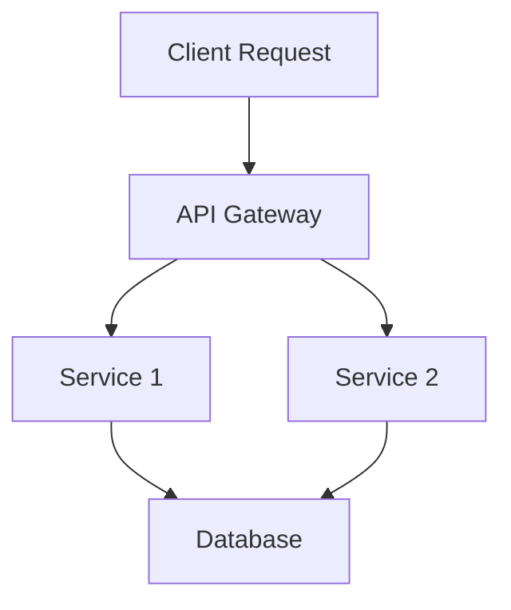

```markdown
---
title: "Distributed Observability: A Complete Guide for Backend Beginners"
date: "2023-11-15"
tags: ["backend", "observability", "distributed systems", "patterns"]
description: "Learn how to implement distributed observability patterns to debug, monitor, and optimize microservices and large-scale applications."
---

# Distributed Observability for Backend Developers: A Beginner-Friendly Guide

---

## **Introduction**

Imagine this: Your application is processing 10,000 concurrent requests per second, spread across 50 microservices hosted on Kubernetes. Suddenly, response times spike, and users start complaining. Without proper observability tools, you’re left with a "where do I even start?" feeling.

This is where **distributed observability** comes in. Unlike traditional logging in monolithic apps, observability in distributed systems demands a structured approach to **tracing, metrics, and logs**—collecting data across services, analyzing performance bottlenecks, and ensuring reliability.

In this guide, we’ll cover:
- Why observability is critical in distributed systems.
- Key components (logs, metrics, traces).
- Hands-on examples using open-source tools like **OpenTelemetry, Prometheus, and Jaeger**.
- Common pitfalls and how to avoid them.

By the end, you’ll have a practical framework to implement observability in your own systems.

---

## **The Problem: Why Traditional Logging Fails**

In a monolithic app, logs from a single process are straightforward to analyze. However, in a distributed system:



- **Log correlation**: Requests span multiple services, making it hard to track a single user flow.
- **Noise overload**: Too many logs can drowning out the signal (e.g., "DEBUG: User logged in" vs. "ERROR: DB connection failed").
- **Latency blind spots**: You might detect high latency only after complaints—too late to act.
- **Distributed tracing**: Without connecting logs/metrics, it’s like solving a jigsaw puzzle with missing pieces.

**Real-world example**: A high-traffic e-commerce app might have:
- A slow checkout page due to payment service delays.
- Users timing out before completing their order.
- Logs from multiple services, but no way to link them.

Without observability, you’re flying blind.

---

## **The Solution: Distributed Observability Components**

Distributed observability relies on three pillars:

| Component      | What It Does                          | Example Tools                     |
|----------------|---------------------------------------|-----------------------------------|
| **Logs**       | Debugging and troubleshooting         | Loki, ELK Stack, Fluentd          |
| **Metrics**    | Performance monitoring (latency, errors) | Prometheus, Grafana               |
| **Traces**     | End-to-end request tracking           | Jaeger, OpenTelemetry, Zipkin     |

### **1. Structured Logging**
Instead of plain-text logs, use structured JSON or protobuf format to enable filtering and analysis.

```javascript
// Example: Structured Log (Node.js)
const log = {
  level: "ERROR",
  timestamp: new Date().toISOString(),
  service: "checkout-service",
  requestId: "req-12345",
  userId: "user-987",
  message: "Payment gateway timed out",
  error: { stack: "TimeoutError:..." }
};

console.error(JSON.stringify(log));
```

### **2. Metrics (Prometheus + Grafana)**
Track key business metrics with labels for granularity.

```sql
-- Example Prometheus rule (in prometheus.yml)
- alert: HighCheckoutLatency
  expr: rate(checkout_service_latency_seconds_bucket{quantile="0.95"}[5m]) > 2
  for: 5m
  labels:
    severity: warning
  annotations:
    summary: "Checkout service latency > 2s (instance {{ $labels.instance }})"
```

### **3. Distributed Tracing (Jaeger + OpenTelemetry)**
Annotate requests with traces to visualize flow across services.

```python
# Example: OpenTelemetry trace in Python
from opentelemetry import trace
from opentelemetry.sdk.trace import TracerProvider
from opentelemetry.sdk.trace.export import BatchSpanProcessor
from opentelemetry.exporter.jaeger import JaegerExporter

# Configure tracer
provider = TracerProvider()
processor = BatchSpanProcessor(JaegerExporter(endpoint="http://jaeger:14250"))
provider.add_span_processor(processor)
trace.set_tracer_provider(provider)

tracer = trace.get_tracer(__name__)

def checkout_flow():
    with tracer.start_as_current_span("checkout_flow"):
        # Simulate sub-operations
        with tracer.start_as_current_span("process_payment"):
            # Payment logic...
        with tracer.start_as_current_span("ship_order"):
            # Shipping logic...
```

---

## **Implementation Guide: Step-by-Step**

### **Step 1: Instrument Your Services**
Add OpenTelemetry SDK to each microservice.

#### **Node.js (Express) Example**
```javascript
// Install OpenTelemetry
npm install @opentelemetry/sdk-node @opentelemetry/exporter-jaeger @opentelemetry/instrumentation-express
```

```javascript
// app.js
const { NodeTracerProvider } = require('@opentelemetry/sdk-node');
const { JaegerExporter } = require('@opentelemetry/exporter-jaeger');
const { registerInstrumentations } = require('@opentelemetry/instrumentation');
const { ExpressInstrumentation } = require('@opentelemetry/instrumentation-express');

// Instrument Express
registerInstrumentations({
  instrumentations: [
    new ExpressInstrumentation(),
  ],
});

// Configure Jaeger exporter
const provider = new NodeTracerProvider();
provider.addSpanProcessor(new JaegerExporter({
  endpoint: 'http://jaeger:14250',
}));
provider.register();

// Start server
app.listen(3000);
```

---

### **Step 2: Collect Logs with Loki**
Use Fluentd to forward logs to Loki.

```nginx
# Fluentd Config (conf.d/checkout.service.conf)
<source>
  @type tail
  path /var/log/checkout.service.log
  pos_file /var/log/fluentd-checkout.pos
  tag checkout.logs
</source>

<match checkout.logs>
  @type loki
  url http://loki:3100/loki/api/v1/push
  labels { service = "checkout.service" }
</match>
```

---

### **Step 3: Visualize with Grafana**
Combine metrics and traces in Grafana dashboards.

#### **Grafana PromQL Example**
```sql
# Check checkout service errors
increase(checkout_service_requests_total{status!="200"}[5m])
```

#### **Jaeger Trace Query**

*(Query for checkout requests and drill into payment service delays.)*

---

### **Step 4: Set Up Alerts**
Trigger alerts when key metrics degrade.

```yaml
# Alertmanager config (alertmanager.yml)
route:
  receiver: 'slack-alerts'
  group_by: ['alertname', 'service']
  group_wait: 30s
  group_interval: 5m
  repeat_interval: 1h

receivers:
- name: 'slack-alerts'
  slack_configs:
  - channel: '#backend-ops'
    api_url: 'https://hooks.slack.com/services/XYZ'
```

---

## **Common Mistakes to Avoid**

| Mistake                          | Why It’s Bad                          | Fix                          |
|----------------------------------|---------------------------------------|-----------------------------|
| **No correlation IDs**           | Logs/traces without `trace_id` are useless. | Use OpenTelemetry’s `trace_id`. |
| **Logs too verbose**             | Noise drowns out actual errors.        | Use structured logging + sampling. |
| **Ignoring cold starts in traces** | Serverless apps add latency spikes.   | Monitor `trace_start_time`. |
| **No synthetic monitoring**       | Real-user monitoring (RUM) is reactive. | Add canary checks.           |
| **Over-reliance on dashboards**   | Alerts are still critical.            | Set up alerting early.      |

---

## **Key Takeaways**

- **Distributed observability requires structured logs, metrics, and traces**.
- **OpenTelemetry is the standard** for instrumentation (supports many languages).
- **Loki/Prometheus/Grafana** form the observability stack.
- **Alerts save lives**—proactively monitor SLOs (e.g., 99.9% uptime).
- **Start small**: Instrument one service, then expand.

---

## **Conclusion**

Distributed observability isn’t just for "big tech"—it’s a necessity for any system with multiple services. By adopting patterns like structured logging, tracing, and metrics, you’ll debug issues faster, improve reliability, and gain confidence in your distributed systems.

### **Next Steps**
1. Try [OpenTelemetry’s minimal example](https://opentelemetry.io/docs/instrumentation/).
2. Deploy a [Prometheus + Jaeger setup](https://www.jaegertracing.io/docs/latest/quick-start/).
3. Experiment with [Loki’s log queries](https://grafana.com/docs/loki/latest/logs/).

Your future self (and your team) will thank you.

---
# **Resources**
- [OpenTelemetry Documentation](https://opentelemetry.io/docs/)
- [Grafana Loki](https://grafana.com/docs/loki/latest/)
- [Jaeger Tutorial](https://www.jaegertracing.io/docs/latest/getting-started/)
```