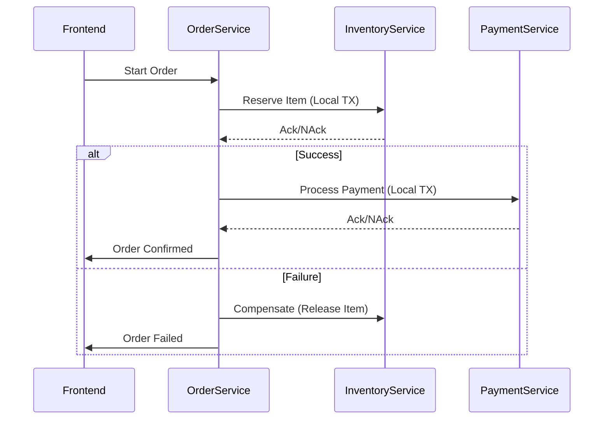

```markdown
---
title: "Mastering Distributed Patterns: Building Scalable and Reliable Systems"
date: 2024-02-20
author: "Jane Doe, Senior Backend Engineer"
---

# Mastering Distributed Patterns: Building Scalable and Reliable Systems

As backend engineers, we’ve all been there: your monolithic application is running smooth, but then the user count explodes, and suddenly, you're staring at latency issues, cascading failures, or data consistency nightmares. Welcome to the world of distributed systems. The good news? Patterns exist to help you tame this complexity—**distributed patterns**—that enable scalability, resilience, and consistency in modern, multi-service architectures.

In this guide, we’ll dive deep into **distributed patterns**, the challenges you’ll encounter without them, and how to implement them effectively. Whether you're deploying microservices, scaling APIs, or managing event-driven workflows, these patterns are your toolkit for writing robust, production-grade systems.

---

## The Problem: Why Distributed Systems Are Hard

Distributed systems are inherently complex because they involve multiple processes or machines working together to achieve a common goal. Unlike monolithic systems, where "just call a function" works, distributed systems introduce challenges like:

1. **Latency and Network Delays**: Even small delays (e.g., 100ms across services) compound when chaining requests like `A → B → C`.
2. **Partial Failures**: A single node or service can fail, but the system must remain available (e.g., AWS Lambda cold starts, database timeouts).
3. **Data Consistency**: When data is replicated across services, how do you ensure transactions are atomic? CAP theorem strikes again.
4. **Scalability Bottlenecks**: Horizontal scaling requires sharding, caching, and async processing—all of which introduce new complexities.
5. **Debugging Nightmares**: Distributed systems are like detective stories where logs are scattered across machines, and every request leaves a trail of breadcrumbs.

### Example: The Classic E-Commerce Checkout
Let’s say your e-commerce app uses:
- A **User Service** (handles authentication).
- An **Inventory Service** (tracks stock).
- An **Order Service** (processes payments).

A user checks out and buys a product. This involves:
1. The frontend calls `POST /orders` to create an order.
2. The Order Service deducts inventory (calling `POST /inventory`).
3. The Order Service processes payment (calling `POST /payments`).
4. If any step fails, the entire transaction should roll back—but how?

Without distributed patterns, you risk:
- **Inconsistent Inventory**: The user pays, but the product is "sold out" later.
- **Payment Failures**: The payment succeeds, but inventory isn’t deducted.
- **Unrecovered Errors**: A network blip causes a timeout, and the order is lost.

---

## The Solution: Distributed Patterns to the Rescue

Distributed patterns address these challenges by providing **proven, battle-tested approaches** to handle:
1. **Synchronization** (e.g., Saga, Compensating Transactions).
2. **Resilience** (e.g., Circuit Breaker, Retry with Backoff).
3. **Scalability** (e.g., Event Sourcing, CQRS).
4. **Data Partitioning** (e.g., Sharding, Database Per Service).
5. **Async Communication** (e.g., Message Queues, Event Bus).

Below, we’ll explore five key patterns with code examples and tradeoffs.

---

## 1. Saga Pattern: Managing Distributed Transactions

### The Problem
When multiple services participate in a transaction (e.g., checkout), you need a way to **atomically commit or rollback** across all of them. Traditional ACID transactions fail in distributed settings because they require a two-phase commit (2PC), which is slow and complex.

### The Solution: Saga Pattern
The **Saga pattern** breaks a transaction into a sequence of **local transactions**, coordinated via **compensating actions**. If a step fails, a compensating transaction reverses prior steps.

#### Example: Order Processing Saga


#### Code Example: Implementing a Saga in Python
Here’s a simplified saga orchestrator using Python and FastAPI:
```python
from fastapi import FastAPI
from pydantic import BaseModel
from typing import Callable

app = FastAPI()

class SagaStep(BaseModel):
    name: str
    execute: Callable
    compensate: Callable

# Mock services
def reserve_inventory(order_id: str):
    print(f"Reserving inventory for order {order_id}")
    return True

def compensate_inventory(order_id: str):
    print(f"Releasing inventory for order {order_id}")

def process_payment(order_id: str, amount: float):
    print(f"Processing payment {amount} for order {order_id}")
    return True

def compensate_payment(order_id: str):
    print(f"Refunding payment for order {order_id}")

# Define the saga steps
saga_steps = [
    SagaStep(
        name="reserve_inventory",
        execute=lambda oid: reserve_inventory(oid),
        compensate=lambda oid: compensate_inventory(oid),
    ),
    SagaStep(
        name="process_payment",
        execute=lambda oid: process_payment(oid, 99.99),
        compensate=lambda oid: compensate_payment(oid),
    ),
]

@app.post("/start-order/{order_id}")
async def start_order(order_id: str):
    executed_steps = []
    for step in saga_steps:
        try:
            if step.execute(order_id):
                executed_steps.append(step)
            else:
                # Compensate for all previous steps
                for s in reversed(executed_steps):
                    s.compensate(order_id)
                return {"status": "failed"}
        except Exception as e:
            # Rollback on error
            for s in reversed(executed_steps):
                s.compensate(order_id)
            raise e
    return {"status": "success"}

```

### Tradeoffs
| **Pro** | **Con** |
|---------|---------|
| Avoids 2PC complexity | Requires careful design of compensating actions |
| Scales horizontally | Debugging is harder (distributed state) |
| Works with eventual consistency | Race conditions possible if not sequenced correctly |

---

## 2. Circuit Breaker Pattern: Preventing Cascading Failures

### The Problem
If a downstream service fails repeatedly (e.g., `InventoryService` is down), your `OrderService` will keep retrying, eventually overwhelming itself. This is called **cascading failure**.

### The Solution: Circuit Breaker
The **Circuit Breaker** pattern monitors a service’s health and:
1. Allows requests when the service is healthy.
2. Stops requests after a threshold of failures (opens the "circuit").
3. Forces retries after a timeout (resets the "circuit").

#### Code Example: Circuit Breaker in Java (using Resilience4j)
```java
import io.github.resilience4j.circuitbreaker.CircuitBreaker;
import io.github.resilience4j.circuitbreaker.CircuitBreakerConfig;

public class OrderServiceClient {
    private final CircuitBreaker circuitBreaker;

    public OrderServiceClient() {
        CircuitBreakerConfig config = CircuitBreakerConfig.custom()
            .failureRateThreshold(50) // Open after 50% failures
            .waitDurationInOpenState(Duration.ofSeconds(30))
            .build();
        this.circuitBreaker = CircuitBreaker.of("inventoryService", config);
    }

    public boolean reserveInventory(String orderId) {
        return circuitBreaker.executeSupplier(() -> {
            // Simulate calling InventoryService
            boolean success = new Random().nextBoolean(); // Assume 50% chance of failure
            if (!success) {
                throw new RuntimeException("InventoryService failed");
            }
            return true;
        });
    }
}
```

### Tradeoffs
| **Pro** | **Con** |
|---------|---------|
| Prevents cascading failures | Introduces latency due to monitoring |
| Reduces load on unhealthy services | Stateful (requires coordination) |
| Simple to implement | Misconfiguration can hide issues |

---

## 3. Event Sourcing Pattern: Auditing and Async Processing

### The Problem
When services need to **track changes over time** (e.g., audit logs, replayability), traditional CRUD models are limiting. You also want to avoid tight coupling between services.

### The Solution: Event Sourcing
Instead of storing the latest state, **store a sequence of events** that describe changes. Services subscribe to events via an **event bus** (e.g., Kafka, RabbitMQ).

#### Example: Order Processing via Events
1. `OrderCreated` event is published.
2. `InventoryReserved` event is published.
3. `PaymentProcessed` event is published.

#### Code Example: Event Sourcing in Node.js
```javascript
const { Kafka } = require('kafkajs');
const kafka = new Kafka({ brokers: ['localhost:9092'] });
const producer = kafka.producer();
const consumer = kafka.consumer({ groupId: 'order-service' });

// Step 1: Publish events
async function createOrder(orderId) {
    await producer.connect();
    await producer.send({
        topic: 'orders',
        messages: [
            { value: JSON.stringify({ type: 'OrderCreated', orderId }) },
        ],
    });
}

// Step 2: Consume events
async function processOrderEvents() {
    await consumer.connect();
    await consumer.subscribe({ topic: 'orders', fromBeginning: true });
    await consumer.run({
        eachMessage: async ({ topic, partition, message }) => {
            const event = JSON.parse(message.value.toString());
            if (event.type === 'OrderCreated') {
                console.log(`New order: ${event.orderId}`);
                // Reserve inventory, process payment, etc.
            }
        },
    });
}

// Example usage
createOrder('123');
processOrderEvents();
```

### Tradeoffs
| **Pro** | **Con** |
|---------|---------|
| Enables auditing and replayability | Complex event schema design |
| Decouples services | Eventual consistency model |
| Scales well with async processing | Debugging is harder (event ordering) |

---

## 4. Database Per Service Pattern: Isolation and Scalability

### The Problem
A shared database becomes a **bottleneck** as services grow. You also risk **tight coupling** between services (e.g., `UserService` and `OrderService` query the same `users` table).

### The Solution: Database Per Service
Each service owns its own database, reducing contention and enabling **independent scaling**.

#### Example Architecture
```
┌─────────────┐    ┌─────────────┐    ┌─────────────┐
│  User DB    │    │  Order DB   │    │ Inventory DB│
│ (users)     │    │ (orders)    │    │ (products)  │
└─────────────┘    └─────────────┘    └─────────────┘
       │                  │                  │
       ▼                  ▼                  ▼
┌─────────────┐    ┌─────────────┐    ┌─────────────┐
│ User Service│    │ Order Service│    │ Inventory   │
│ (Auth)      │    │ (Checkout)   │    │ Service     │
└─────────────┘    └─────────────┘    └─────────────┘
```

### Tradeoffs
| **Pro** | **Con** |
|---------|---------|
| Eliminates shared DB bottlenecks | Data duplication (e.g., user details in multiple DBs) |
| Enables independent scaling | Joins are harder (use event sourcing or CQRS) |
| Reduces coupling | Eventual consistency required for cross-service data |

---

## 5. Retry with Backoff Pattern: Handling Transient Failures

### The Problem
Network issues, timeouts, or database locks cause **transient failures**. Retrying blindly wastes resources and can exacerbate problems.

### The Solution: Retry with Exponential Backoff
Retry failed requests with **increasing delays** between attempts. Useful for:
- Database operations (e.g., `retry: 3, delay: 100ms, maxDelay: 1s`).
- External API calls (e.g., Stripe payments).

#### Code Example: Retry in Python (using `tenacity`)
```python
from tenacity import retry, stop_after_attempt, wait_exponential

@retry(stop=stop_after_attempt(3), wait=wait_exponential(multiplier=1, min=4, max=10))
def call_inventory_service(order_id: str):
    try:
        # Simulate a transient failure (e.g., network blip)
        if random.random() < 0.3:  # 30% chance of failure
            raise ConnectionError("Inventory service unavailable")
        print(f"Successfully reserved inventory for {order_id}")
        return True
    except Exception as e:
        print(f"Attempt failed: {e}")
        raise
```

### Tradeoffs
| **Pro** | **Con** |
|---------|---------|
| Handles transient failures gracefully | Can still fail if the issue persists |
| Improves resilience | Misconfigured backoff can mask bugs |
| Simple to implement | Not a silver bullet (e.g., deadlocks) |

---

## Implementation Guide: Choosing Patterns for Your System

Here’s how to apply these patterns in a real-world scenario (e.g., scaling an e-commerce platform):

1. **Start with Database Per Service**
   - Isolate `UserService`, `OrderService`, and `PaymentService` into separate databases.
   - Use **event sourcing** for cross-service consistency (e.g., publish `OrderCreated` events).

2. **Implement Saga for Critical Transactions**
   - Use the Saga pattern for checkout workflows:
     ```
     OrderService → InventoryService (reserve) → PaymentService (charge)
     ```
   - If any step fails, compensate (release inventory, refund payment).

3. **Add Circuit Breakers**
   - Protect `OrderService` from `InventoryService` failures:
     ```java
     CircuitBreakerConfig config = CircuitBreakerConfig.custom()
         .failureRateThreshold(70) // Open circuit after 70% failures
         .waitDurationInOpenState(Duration.ofMinutes(5))
         .build();
     ```

4. **Use Retry with Backoff**
   - Add retry logic to database calls in `InventoryService`:
     ```python
     @retry(stop=stop_after_attempt(5), wait=wait_exponential)
     def update_inventory(product_id: str, quantity: int):
         # SQL logic here
     ```

5. **Leverage Async Communication**
   - Replace direct calls between services with **events** (e.g., Kafka):
     ```
     OrderService → Kafka (OrderCreated) → InventoryService → Kafka (InventoryReserved)
     ```

---

## Common Mistakes to Avoid

1. **Ignoring Idempotency**
   - Always design APIs to be idempotent (e.g., `POST /orders` with an `Idempotency-Key` header). Without this, retries can cause duplicate orders.

2. **Overusing Synchrony**
   - Avoid chaining synchronous calls (`A → B → C`). Use async patterns (events, queues) instead.

3. **Tight Coupling via Shared DB**
   - Don’t let `UserService` and `OrderService` query the same `users` table. Use **events** or **CQRS** for cross-service data.

4. **Not Monitoring Circuit Breakers**
   - If a circuit breaker is always open, it’s hiding real issues. Monitor failure rates and thresholds.

5. **Ignoring Event Ordering**
   - In event sourcing, events must be processed in order. Use **partitioned topics** (e.g., Kafka) or **sagas** for critical workflows.

6. **Blind Retries Without Backoff**
   - Retrying every 100ms for 5 times will overwhelm downstream services. Always use **exponential backoff**.

---

## Key Takeaways

- **Saga Pattern**: Break distributed transactions into local steps with compensating actions.
- **Circuit Breaker**: Protect your system from cascading failures by monitoring downstream services.
- **Event Sourcing**: Decouple services and enable auditing by storing events instead of states.
- **Database Per Service**: Scale independently and reduce contention by isolating data.
- **Retry with Backoff**: Handle transient failures gracefully with exponential delays.
- **Tradeoffs Exist**: No pattern is a silver bullet. Choose based on your system’s needs (e.g., consistency vs. availability).
- **Start Small**: Apply one pattern at a time (e.g., circuit breakers first, then sagas).

---

## Conclusion

Distributed systems are the backbone of modern scalable applications, but they introduce complexity that can derail even the best-designed systems. By leveraging **distributed patterns**—Sagas, Circuit Breakers, Event Sourcing, Database Per Service, and Retry with Backoff—you can build systems that are **resilient, scalable, and maintainable**.

Remember:
- **Design for failure**: Assume services will fail. Use patterns like Circuit Breakers to handle it.
- **Decouple services**: Events and async communication reduce tight coupling.
- **Monitor everything**: Distributed systems are hard to debug without observability.
- **Iterate**: Start with a minimal set of patterns and refine as you grow.

The key to mastering distributed patterns isn’t memorizing them—it’s understanding **when to apply them** and **how they interact**. Start experimenting in a staging environment, and you’ll be well on your way to building robust, production-grade distributed systems.

Happy coding!
```

---
**Further Reading**:
- [Saga Pattern (Wikipedia)](https://en.wikipedia.org/wiki/Saga_pattern)
- [Resilience4j (Circuit Breaker Library)](https://resilience4j.readme.io/)
- [Event Sourcing in Practice (Martin Fowler)](https://martinfowler.com/eaaDev/EventSourcing.html)
- [Kafka for