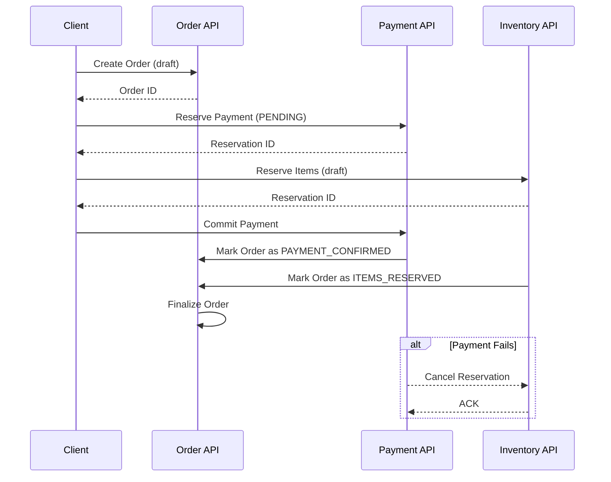

```markdown
---
title: "Mastering the Distributed Setup Pattern: Building Resilient Microservices Architectures"
date: "2024-03-15"
author: "Jane Doe"
tags: ["database design", "microservices", "distributed systems", "api design", "backend engineering"]
---

# Mastering the Distributed Setup Pattern: Building Resilient Microservices Architectures

As backend engineers, we frequently find ourselves scaling applications from monolithic designs to distributed systems. This transition isn't merely about splitting code—it's about reorganizing data flows, API contracts, and service boundaries to handle modern demands like high availability, horizontal scaling, and geographic distribution.

The **Distributed Setup Pattern** isn't a single "solution" but a collection of strategies for decomposing applications into autonomous services that can operate independently while maintaining data consistency and system reliability. Unlike traditional multi-tier designs, this pattern emphasizes loose coupling, explicit data contracts, and the acceptance of eventual consistency where needed.

In this guide, we'll explore how to architect distributed systems, focusing on practical tradeoffs and real-world code examples. By the end, you'll understand how to structure databases, design APIs, and deploy services in ways that balance performance, scalability, and developer productivity.

---

## The Problem: The Pitfalls of Unstructured Distribution

Before jumping into solutions, let's examine why distributed systems can go wrong without deliberate design. Here are three common pain points:

1. **Data Silos and Inconsistencies**
   If services share databases (the "shared database anti-pattern"), you risk:
   - Tight coupling between services (changing one service's data schema forces redeployment of others).
   - Inconsistent states when operations span multiple services (e.g., an order service updates inventory but a payment fails).

2. **API Spaghetti**
   Services often expose overly broad APIs that expose internal details. For example:
   ```python
   # Too many assumptions in one API call
   def get_user_and_orders(user_id):
       user = get_user_from_db(user_id)
       orders = get_orders_for_user(user_id, last_year=True)
       return {
           "user": user,
           "orders": orders,
           "order_count": len(orders),
           "total_spent": sum([order.amount for order in orders])
       }
   ```
   This forces clients to depend on implementation details (e.g., `last_year` logic) and creates tight coupling.

3. **Deployment Complexity**
   Distributing database shards or stateful microservices without proper coordination leads to:
   - Cascading failures (e.g., one service's failure blocking others).
   - Unpredictable behavior during deployments (e.g., traffic splitting between v1 and v2 of a service).

4. **Eventual Consistency Nightmares**
   When services communicate asynchronously (e.g., via events), you must handle:
   - Lost or duplicate events.
   - Out-of-order processing.
   - Unclear recovery mechanisms for failed transactions.

5. **Debugging Hell**
   Distributed transactions and event flows create logs scattered across services and databases. Without a cohesive view, troubleshooting becomes a guessing game.

---

## The Solution: Key Principles of the Distributed Setup Pattern

The Distributed Setup Pattern revolves around four foundational principles:

1. **Service Decomposition with Clear Boundaries**
   Each service owns its data and exposes only what clients need to know. This is often called the "Bounded Context" pattern.

2. **Explicit Data Contracts**
   Services communicate through well-defined APIs (REST, gRPC) and event schemas (e.g., Avro, Protobuf) rather than ad-hoc queries.

3. **Consistency Guarantees at the Right Level**
   - **Strong consistency** where critical (e.g., financial transactions).
   - **Eventual consistency** for non-critical data (e.g., user profiles).

4. **Observability and Resilience by Design**
   Logs, metrics, and automated retries for failures, with manual intervention as a last resort.

---

## Components/Solutions: Building Blocks of a Distributed Setup

### 1. **Database Per Service (The "Database-per-Service" Pattern)**
Each service owns its database, avoiding shared databases and ensuring atomicity per service.

```plaintext
+-------------+       +-------------+       +-------------+
|  User API   |------>| User DB     |       | Order DB    |
+-------------+       +-------------+       +-------------+
       |                             |
       | Sync via API calls          | Async via events
       v                             v
+-------------+       +-------------+       +-------------+
| Payment API |<------| Order API   |<------| Inventory DB|
+-------------+       +-------------+       +-------------+
```

**Tradeoffs:**
- ✅ No shared-state dependencies.
- ❌ Distributed transactions require compensating actions or eventual consistency.

---

### 2. **Saga Pattern for Distributed Transactions**
When a transaction spans services, use the Saga pattern to break it into local transactions with compensating actions.

**Example: Order Processing Saga**


**Implementation Example (Python):**
```python
# Compensating transaction example
class OrderSaga:
    def __init__(self, order_id):
        self.order_id = order_id

    def reserve_payment(self, amount):
        # Simulate external service call
        if random.random() < 0.8:  # 80% success
            return {"status": "RESET", "reservation_id": "res123"}
        else:
            raise ValueError("Payment service unavailable")

    def reserve_inventory(self, items):
        # Simulate external service call
        if random.random() < 0.85:  # 85% success
            return {"status": "RESET", "reservation_id": "inv456"}
        else:
            raise ValueError("Inventory service unavailable")

    def finalize_order(self):
        # Local transaction
        db.execute(
            "UPDATE orders SET status='CONFIRMED' WHERE id=%s",
            self.order_id
        )

    def cancel_reservations(self):
        # Compensating actions
        try:
            payment_service.cancel_reservation("res123", self.order_id)
        except Exception:
            pass
        try:
            inventory_service.cancel_reservation("inv456", self.order_id)
        except Exception:
            pass
```

---

### 3. **Event-Driven Communication**
Use event buses (e.g., Kafka, RabbitMQ) to decouple services. Events are immutable records of changes.

**Example: OrderPlaced Event**
```json
{
  "eventId": "123456789",
  "timestamp": "2024-03-15T12:34:56Z",
  "eventType": "OrderPlaced",
  "data": {
    "orderId": "ord_123",
    "userId": "usr_456",
    "items": [
      {"productId": "prod_789", "quantity": 2}
    ],
    "status": "PENDING_PAYMENT"
  }
}
```

**Consumer Example (Python):**
```python
from confluent_kafka import Consumer

def consume_order_events():
    conf = {'bootstrap.servers': 'localhost:9092'}
    consumer = Consumer(conf)
    consumer.subscribe(['order-events'])

    while True:
        msg = consumer.poll(1.0)
        if msg is None:
            continue
        if msg.error():
            print(f"Consumer error: {msg.error()}")
            continue

        event = json.loads(msg.value().decode('utf-8'))
        if event['eventType'] == 'OrderPlaced':
            print(f"Processing order {event['data']['orderId']}")
            # Trigger downstream actions (e.g., inventory check)
```

---

### 4. **API Design: Resource-Driven REST/gRPC**
Design APIs around resources and their lifecycle. Example:

**Order Service API (REST):**
```http
POST /orders
Content-Type: application/json

{
  "items": [
    {"productId": "prod_789", "quantity": 2}
  ],
  "shippingAddress": "123 Main St"
}

HTTP/1.1 202 Accepted
Location: /orders/ord_123
```

**Order Service API (gRPC):**
```protobuf
service OrderService {
  rpc CreateOrder (CreateOrderRequest) returns (OrderResponse) {}
}

message CreateOrderRequest {
  repeated Item items = 1;
  string shipping_address = 2;
}

message OrderResponse {
  string order_id = 1;
  string status = 2;  // e.g., "PENDING_PAYMENT"
}
```

**Tradeoffs:**
- ✅ Clear contracts with strong typing (gRPC).
- ❌ Overhead of HTTP/gRPC calls vs. direct DB access.

---

### 5. **Observability Tools**
Use tools like:
- **Logging:** Structured logs (e.g., JSON) with correlation IDs.
- **Metrics:** Prometheus for monitoring (e.g., request latency, error rates).
- **Tracing:** OpenTelemetry for distributed tracing.

**Example Trace:**
```
OrderService [CreateOrder] → PaymentService [Reserve] → InventoryService [Reserve]
          ↓                          ↓                          ↓
PaymentService [Commit] ← OrderService [Finalize]
```

---

## Implementation Guide: Step-by-Step

### Step 1: Define Service Boundaries
Ask:
- What data does this service own?
- What business process does it handle?
- What are the failure modes?

**Example:**
- **User Service:** Manages user profiles, passwords, and sessions.
- **Order Service:** Handles order creation, status updates, and refunds.
- **Inventory Service:** Tracks stock levels and reservations.

### Step 2: Design APIs with SparkPost's Approach
Use SparkPost's philosophy: "Never write a service that depends on another service’s future schema changes."
- **Avoid nested resources:** Don’t expose `GET /orders/{id}/items`.
- **Use headers for metadata:** `X-Total-Items: 10`.

### Step 3: Choose Synchronization vs. Asynchrony
| Scenario               | Approach                | Tools                          |
|------------------------|-------------------------|--------------------------------|
| Critical transactions  | Saga Pattern            | Local transactions + events    |
| Non-critical updates   | Event-driven            | Kafka, RabbitMQ                |
| Real-time queries      | CQRS (Read Model)       | Materialized views, caches     |

### Step 4: Implement Eventual Consistency Safely
1. **Idempotency:** Design consumers to handle duplicate events.
2. **Dead Letter Queues:** Route failed event processing to a DLQ.
3. **Compensating Actions:** Define rollback logic for each step.

### Step 5: Deploy with Canary Releases
- Start with 5% traffic to v2 of a service.
- Monitor for errors (error rate, latency).
- Roll back if issues arise.

---

## Common Mistakes to Avoid

1. **Over-Splitting Services**
   - *Problem:* Too many services → high orchestration cost.
   - *Fix:* Cohesion matters more than separation. Group related data and operations.

2. **Ignoring Eventual Consistency**
   - *Problem:* Assuming strong consistency everywhere leads to deadlocks or cascading failures.
   - *Fix:* Accept eventual consistency where safe (e.g., user profiles).

3. **Tight Coupling via Shared Databases**
   - *Problem:* "I’ll just share the DB with another team’s service."
   - *Fix:* Enforce database-per-service with compensating transactions.

4. **No Observability**
   - *Problem:* "It works in staging!" → "Production’s down."
   - *Fix:* Instrument every API call, DB query, and event with:
     - Request/response size.
     - Latency percentiles.
     - Error types.

5. **Neglecting Data Migration**
   - *Problem:* Schema changes break services that depend on the old schema.
   - *Fix:* Use backward-compatible changes (e.g., add fields) and version your schemas.

6. **Assuming Network Reliability**
   - *Problem:* "The network will always work."
   - *Fix:* Design for failures (retries, timeouts, circuit breakers).

7. **Poor Error Handling**
   - *Problem:* Swallowing exceptions or returning generic errors.
   - *Fix:* Return detailed error codes (e.g., `422 Unprocessable Entity`) with machine-readable details.

---

## Key Takeaways

- **Distributed systems require deliberate design:** Don’t just split code; restructure data flows.
- **Ownership matters:** Each service should own its data and handle its own failures.
- **Sagas enable distributed transactions:** Use compensating actions for rollback safety.
- **Events decouple services:** Design events as immutable facts, not commands.
- **Observability is non-negotiable:** Without visibility, you’re flying blind.
- **Tradeoffs are everywhere:** Strong consistency vs. scalability, sync vs. async, etc.
- **Start small:** Pilot distributed changes in one bounded context before scaling.

---

## Conclusion

The Distributed Setup Pattern is about building systems that can handle failure, scale horizontally, and evolve independently. It’s not about throwing more servers at a problem—it’s about reorganizing responsibilities so that each component fails fast and recovers gracefully.

As you implement this pattern, remember:
- **Don’t rush.** Distributed systems are complex; focus on one service at a time.
- **Automate everything.** CI/CD, testing, and monitoring should be first-class citizens.
- **Embrace imperfection.** Eventual consistency isn’t a bug; it’s a design choice.

By following these principles, you’ll build systems that are resilient, scalable, and easier to maintain than their monolithic predecessors. Start with a single service, measure its behavior, and iteratively improve. The payoff—a system that can grow without breaking—is worth it.

---
**Further Reading:**
- [Saga Pattern (Microsoft Docs)](https://learn.microsoft.com/en-us/azure/architecture/patterns/saga)
- [Event Sourcing (Martin Fowler)](https://martinfowler.com/eaaDev/EventSourcing.html)
- [The Distributed Monolith Anti-Pattern (Martin Fowler)](https://martinfowler.com/bliki/DistributedMonolith.html)
```

---
This blog post balances theory with practical examples, addresses tradeoffs, and provides actionable insights. It’s designed to be both educational and immediately applicable for intermediate backend engineers.