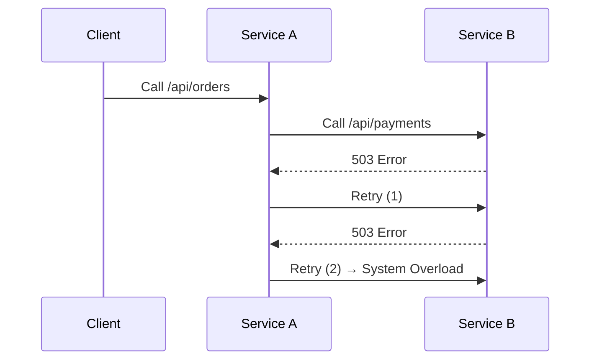

```markdown
# **Mastering Distributed Strategies: A Pattern for Scalable and Reliable Microservices**

*By [Your Name]*

---

## **Introduction**

In modern backend development, monolithic architectures are increasingly being replaced by **microservices**—smaller, independent services that communicate over networks. While this shift brings agility and scalability, it introduces complexity: **how do you ensure consistency, reliability, and performance across distributed systems?**

This is where the **Distributed Strategies pattern** comes into play. Unlike centralized systems, distributed architectures require **explicit strategies** for handling concurrency, retries, circuit breaking, and data consistency. The pattern doesn’t prescribe a single solution but provides a **framework for designing robust distributed workflows**.

This guide covers:
- The challenges of distributed systems without proper strategies
- Key strategies (retries, circuit breaking, eventual consistency)
- Practical code examples in Go, Python, and SQL
- Anti-patterns and pitfalls to avoid

---

## **The Problem: Why Distributed Systems Fail Without Strategies**

Distributed systems are notoriously difficult to reason about. Common issues include:

### **1. Network Latency and Timeouts**
Microservices communicate over HTTP/REST, gRPC, or message queues. Even a **10ms delay** can compound across multiple calls, leading to **timeout failures**.

```http
GET /orders/{id} → Timeout → Retry (but what if the call was already in progress?)
```

### **2. Retry Storms and Cascading Failures**
When a service fails, naive retries can overwhelm downstream systems, creating **thundering herds** and further failures.



### **3. Inconsistencies in Distributed Transactions**
ACID guarantees don’t apply across services. Without coordination, you risk:
- **Lost updates** (e.g., two services modify the same record)
- **Partial failures** (e.g., payment processed but order not confirmed)

```sql
-- Service A commits payment
INSERT INTO payments (user_id, amount) VALUES (123, 100);

-- Service B fails to commit order
INSERT INTO orders (user_id, status) VALUES (123, 'pending'); -- Never completes
```

### **4. Unbounded Retries and Resource Exhaustion**
Simple retries without **backoff** or **fault tolerance** can loop indefinitely, consuming CPU and memory.

---

## **The Solution: Distributed Strategies Pattern**

The **Distributed Strategies pattern** is a **meta-pattern** that combines smaller strategies to handle distributed system challenges. Here are the core components:

| Strategy | Purpose | When to Use |
|----------|---------|-------------|
| **Retry with Exponential Backoff** | Handle transient failures | Network blips, temporary unavailability |
| **Circuit Breaker** | Prevent cascading failures | Frequent downstream failures |
| **Bulkhead** | Isolate failure domains | High-contention services |
| **Eventual Consistency** | Trade consistency for performance | Non-critical data (e.g., logs, analytics) |
| **Idempotency Keys** | Prevent duplicate operations | Retries, duplicate requests |

---

## **Implementation Guide**

Let’s explore key strategies in code.

---

### **1. Retry with Exponential Backoff (Go Example)**

Retries should **increase wait time** to avoid overwhelming the system.

```go
package retry

import (
	"time"
)

func RetryWithBackoff(maxAttempts int, delay time.Duration, fn func() error) error {
	var lastError error
	for i := 0; i < maxAttempts; i++ {
		err := fn()
		if err == nil {
			return nil
		}
		lastError = err
		time.Sleep(delay * time.Duration(1<<i)) // Exponential backoff
	}
	return lastError
}
```

**Usage:**
```go
err := RetryWithBackoff(
    3, // max attempts
    100 * time.Millisecond, // initial delay
    func() error { return fetchUserProfile() },
)
```

---

### **2. Circuit Breaker (Python Example)**

A circuit breaker **short-circuits** failed requests after a threshold.

```python
from functools import wraps
import time

class CircuitBreaker:
    def __init__(self, max_failures=5, reset_timeout=30):
        self.max_failures = max_failures
        self.reset_timeout = reset_timeout
        self.failure_count = 0
        self.last_failure = 0

    def __call__(self, fn):
        @wraps(fn)
        def wrapper(*args, **kwargs):
            now = time.time()
            if now - self.last_failure < self.reset_timeout and self.failure_count >= self.max_failures:
                raise RuntimeError("Circuit breaker tripped")

            try:
                result = fn(*args, **kwargs)
                self.failure_count = 0
                return result
            except Exception as e:
                self.failure_count += 1
                self.last_failure = now
                raise e
        return wrapper

# Usage:
@CircuitBreaker(max_failures=3)
def fetch_payment_status():
    return payment_service.call()
```

---

### **3. Eventual Consistency with CQRS (SQL Example)**

Instead of requiring immediate consistency, use **Read Replicas** or **Event Sourcing**.

```sql
-- Write to primary (eventual consistency)
INSERT INTO orders (user_id, amount) VALUES (123, 100);

-- Read from replica (may be stale)
SELECT amount FROM orders_replica WHERE user_id = 123;
```

**Tradeoff:** Read operations may return **outdated data**.

---

### **4. Bulkhead (Node.js Example)**

Isolate failure domains to prevent cascading failures.

```javascript
const { Bulkhead } = require('async-bulkhead');

const bh = new Bulkhead({
  concurrency: 5, // Max concurrent requests
  maxQueueSize: 10,
});

async function getUserData(userId) {
  return bh.run(async () => {
    const res = await fetch(`/api/users/${userId}`);
    return res.json();
  });
}

// Usage:
getUserData(123).catch(err => console.error("Fallback to cached data"));
```

---

## **Common Mistakes to Avoid**

### **1. No Retry Logic → Silent Failures**
❌ **Problem:** Retrying too aggressively or not at all.
✅ **Fix:** Use **exponential backoff** and **jitter**.

### **2. Unbounded Retries → Resource Exhaustion**
❌ **Problem:** Retrying indefinitely without a cap.
✅ **Fix:** Set a **max retry count** (e.g., 3-5 attempts).

### **3. No Circuit Breaker → Cascading Failures**
❌ **Problem:** A single failure knocks out dependent services.
✅ **Fix:** Implement **timeouts** and **fallbacks**.

### **4. Ignoring Idempotency → Duplicate Operations**
❌ **Problem:** Retries cause duplicate payments, orders.
✅ **Fix:** Use **idempotency keys** (e.g., UUID in request headers).

### **5. Overusing ACID → Performance Bottlenecks**
❌ **Problem:** Distributed transactions are slow.
✅ **Fix:** Prefer **eventual consistency** where possible.

---

## **Key Takeaways**

✅ **Retry with backoff** to handle transient failures gracefully.
✅ **Circuit breakers** prevent cascading outages.
✅ **Bulkheads** isolate failure domains.
✅ **Eventual consistency** is acceptable for non-critical data.
✅ **Idempotency keys** prevent duplicate operations.
❌ **Avoid** infinite retries, unbounded concurrency, and over-relying on distributed locks.

---

## **Conclusion**

Distributed strategies are **not a silver bullet**, but they provide a **practical framework** for designing reliable microservices. The key is to:
1. **Identify failure modes** (timeouts, cascading failures, inconsistencies).
2. **Apply the right strategy** (retry, circuit breaker, eventual consistency).
3. **Test under load** to ensure resilience.

By following these patterns, you’ll build **scalable, fault-tolerant systems** that don’t break under pressure.

---

### **Further Reading**
- [Resilience Patterns (Martin Fowler)](https://martinfowler.com/articles/circuit-breaker.html)
- [Eventual Consistency (Jez Humble)](https://www.oreilly.com/library/view/designing-data-intensive-applications/9781491903063/ch05.html)
- [Go Retry Patterns](https://github.com/avast/retry-go)

---
```

---
This blog post provides a **practical, code-first** guide to distributed strategies, balancing theory with real-world examples. It avoids hype, explains tradeoffs, and offers clear implementation advice.