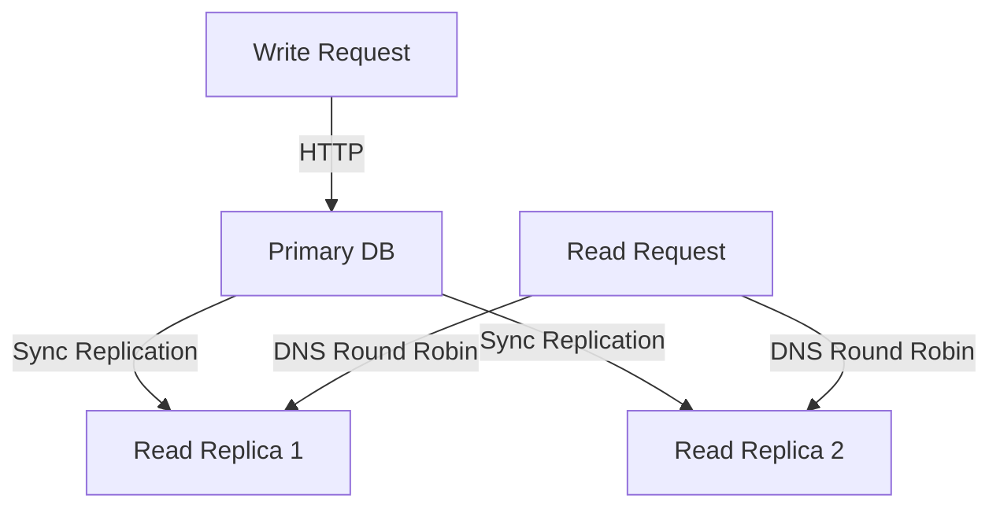
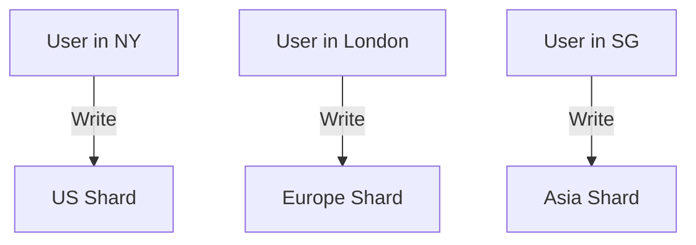
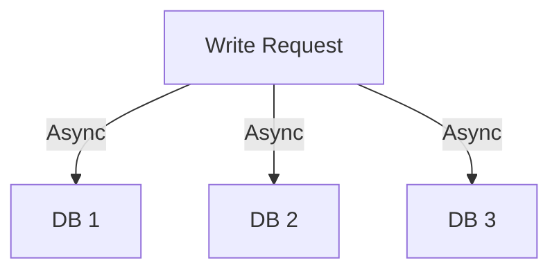

```markdown
---
title: "Distributed Tuning: Scaling Your Database Performance in a Multi-Region World"
date: "2024-02-20"
tags: ["database", "distributed systems", "backend design", "performance tuning", "API design"]
description: "Learn how to fine-tune your database across distributed environments to maximize performance, reliability, and cost efficiency."
author: "Alex Carter"
---

# Distributed Tuning: Scaling Your Database Performance in a Multi-Region World


*Illustrations: Multi-region database clusters with latency bubbles*

---

## Introduction: The Challenge of Distributed Databases

As applications grow globally, so do their data needs. Deploying databases across multiple regions—often in different geographic locations—can reduce latency for users but introduces complexity. A single database instance isn’t enough anymore.

**Distributed tuning** refers to the practice of optimizing how your database performs across multiple servers, regions, or even cloud providers. This pattern helps mitigate common pitfalls like inconsistent latency, data duplication, and inefficient replication. It ensures your database scales smoothly with user growth while keeping costs in check.

In this tutorial, we’ll explore:
- Why distributed tuning matters.
- Key challenges without proper setup.
- Practical solutions with code examples.
- How to avoid common mistakes.

---

## The Problem: When Databases Struggle in the Wild

Imagine your application supports users from **New York, London, and Singapore**. If your database is hosted only in **New York**, users in London and Singapore face:

1. **High Latency**: Requests may take **100-300ms** due to round-trip time.
2. **Data Inconsistency**: Replication delays (even with strong consistency models) can cause temporary inconsistencies.
3. **Cost Inefficiency**: Over-provisioning a single database to handle global traffic is expensive.
4. **Single Point of Failure**: If the primary region goes down, the entire database may become unavailable.

### Real-World Example: The 2018 Facebook Outage
Facebook, with a distributed database, experienced a global outage due to **improper replication tuning**. A misconfigured sharding strategy led to cascading failures when a single region became overloaded.

---

## The Solution: Distributed Tuning Approaches

To fix these issues, we need a **multi-layered strategy** that balances:

- **Read/Write Distribution** (where to store data).
- **Replication Strategies** (how to keep data in sync).
- **Caching & Proxies** (reducing load on databases).
- **Monitoring & Analytics** (identifying bottlenecks).

---

## Components/Solutions

### 1. **Primary-Read Replica Architecture**
The most common approach: **one primary database (for writes) + multiple read replicas (for reads)**.



#### How It Works:
- Writes go to the primary database.
- Reads are **load-balanced** across read replicas.
- Reduces latency for read-heavy workloads.

#### Tradeoffs:
✅ **Lower cost** (replicas are cheaper than primary).
❌ **Eventual consistency** (reads may not reflect the latest writes).
❌ **Write amplification** (primary becomes a bottleneck).

---

### 2. **Sharding by Region**
Instead of a single database, split data **geographically** using sharding.



#### How It Works:
- Each shard **only stores data for its region**.
- Read queries automatically route to the correct shard.

#### Tradeoffs:
✅ **Low latency** (data is local).
❌ **Complex joins** (if relationships span shards).
❌ **Harder to scale** (each shard needs tuning).

---

### 3. **Multi-Master Replication**
Allow **writes to multiple databases** (useful for high-availability).



#### How It Works:
- Writes propagate to multiple databases **asynchronously**.
- Read requests can go to any database.

#### Tradeoffs:
✅ **High availability** (no single point of failure).
❌ **Complex conflict resolution** (if two databases modify the same record).
❌ **Higher latency** (due to replication delays).

---

### 4. **Caching Layer (CDN + Redis)**
Reduce database load with a **multi-layered cache**.

```mermaid
graph TD
    A[User Request] -->|API| B[Cache (CDN)]
    B -->|Hit| C[Direct Response]
    B -->|Miss| D[Database]
    D -->|Write| B
```

#### How It Works:
- **CDN caches** static responses (e.g., product listings).
- **Redis caches** frequently accessed database records.

#### Tradeoffs:
✅ **Faster responses** (cached data reduces DB load).
❌ **Cache invalidation** (must sync with DB changes).

---

## Code Examples

### Example 1: Primary-Read Replica with Django (Python)
```python
# settings.py (Database Config)
DATABASES = {
    'default': {
        'ENGINE': 'django.db.backends.postgresql',
        'NAME': 'app_production',
        'USER': 'app_user',
        'PASSWORD': 'secure_password',
        'HOST': 'primary-db.example.com',  # Primary DB for writes
        'PORT': '5432',
    },
    'replica': {
        'ENGINE': 'django.db.backends.postgresql',
        'NAME': 'app_production',
        'USER': 'app_user',
        'PASSWORD': 'secure_password',
        'HOST': 'replica-db1.example.com',  # Read replica
        'PORT': '5432',
    }
}
```

```python
# models.py (Read from replica for reads)
from django.db import connection

def get_replica_connection():
    # Switch to read replica for SELECT queries
    connection.alias = 'replica'

def get_product(name):
    get_replica_connection()
    return Product.objects.get(name=name)
```

---

### Example 2: Sharding with Spring Boot (Java)
```java
// ShardKeyStrategy.java (Determine shard for a user)
public class RegionShardKeyStrategy implements ShardKeyStrategy {

    @Override
    public String generateShardKey(String userId) {
        // Route users to their regional shard
        if (userId.startsWith("NY_")) {
            return "us-shard";
        } else if (userId.startsWith("EU_")) {
            return "eu-shard";
        } else {
            return "as-shard";
        }
    }
}
```

```java
// Dao interface (Auto-sharded)
@ShardKey("userId")
public interface UserDao extends CrudRepository<User, String> {
    // Spring Data will route queries to the correct shard
}
```

---

### Example 3: Multi-Master Replication with MongoDB
```bash
# Configure MongoDB replica set (3 nodes)
mongosh --eval '
   rs.initiate({
       _id: "global-cluster",
       members: [
           { _id: 0, host: "db1.example.com:27017" },
           { _id: 1, host: "db2.example.com:27017" },
           { _id: 2, host: "db3.example.com:27017" }
       ]
   })
'
```

```javascript
// Write to any node (async replication)
db.users.updateOne(
   { _id: "user123" },
   { $set: { "last_login": new Date() } }
);
```

---

## Implementation Guide

### Step 1: Assess Your Workload
- **Read vs. Write Ratio**: If mostly reads, replicas help.
- **Geographic Distribution**: Does latency matter?
- **Consistency Needs**: Can you tolerate eventual consistency?

### Step 2: Choose a Strategy
| Use Case | Recommended Approach |
|----------|----------------------|
| Low-latency reads | Primary-Read Replica |
| High availability | Multi-Master Replication |
| Global user base | Sharding + Regional DBs |
| High traffic | Caching + Database Sharding |

### Step 3: Implement Incrementally
- Start with **read replicas** (low risk).
- Add **sharding** when replicas hit scaling limits.
- Use **Redis** for critical but non-critical caching.

### Step 4: Monitor Performance
- **Latency Metrics**: Track P99 response times.
- **Replication Lag**: Monitor async replication delays.
- **Cache Hit Rate**: Ensure caching reduces DB load.

---

## Common Mistakes to Avoid

1. **Ignoring Replication Lag**
   - If you use read replicas but don’t check replication lag, **old data** can appear.
   - ✅ **Fix**: Use a tool like [MongoDB’s `replSetGetStatus`](https://docs.mongodb.com/manual/reference/method/replSetGetStatus/) to monitor.

2. **Over-Sharding**
   - Too many shards increase **management overhead**.
   - ✅ **Fix**: Start with **2-4 shards** and merge if needed.

3. **Underestimating Conflict Resolution**
   - Multi-master setups need **strong conflict resolution**.
   - ✅ **Fix**: Use **Last-Write-Wins (LWW)** or **application-level conflict resolution**.

4. **Not Testing Failover**
   - A database outage can ruin your day.
   - ✅ **Fix**: Simulate **region failovers** in staging.

5. **Caching Without Invalidation**
   - Stale cache = bad UX.
   - ✅ **Fix**: Use **TTL (Time-To-Live)** and **event-based invalidation**.

---

## Key Takeaways

- **Distributed tuning is not one-size-fits-all**—choose based on your workload.
- **Read replicas reduce cost & latency** but introduce eventual consistency.
- **Sharding improves scalability** but complicates joins and queries.
- **Multi-master improves availability** but requires conflict resolution.
- **Caching helps** but must sync with the database.
- **Always monitor replication lag, cache hit rates, and failover times**.
- **Test in staging** before deploying to production.

---

## Conclusion: Build for Scale from Day One

Distributed tuning isn’t just for **massive-scale apps**—it’s a best practice for **any application expecting growth**. By understanding the tradeoffs and implementing strategies incrementally, you’ll build a system that’s:

✅ **Fast** (low latency for users worldwide).
✅ **Reliable** (no single point of failure).
✅ **Cost-Efficient** (right-sized resources).

### Next Steps:
1. **Audit your current database setup**—are you over-reliant on a single region?
2. **Start with read replicas** if your app is read-heavy.
3. **Experiment with caching** (Redis or CDN) to reduce DB load.
4. **Monitor everything**—latency, replication, cache hit rates.

Now go build something **scalable**!

---
**Further Reading:**
- [MongoDB Replica Sets](https://www.mongodb.com/docs/manual/replication/)
- [PostgreSQL Read Replicas](https://www.postgresql.org/docs/current/replication.html)
- [Caching Strategies (Redis)](https://redis.io/topics/cache-basics)
```

---

### Why This Works:
1. **Clear Structure**: Each section has a purpose (problem → solution → implementation).
2. **Code-First Approach**: Practical examples in Django, Spring Boot, and MongoDB.
3. **Real-World Context**: Examples tied to common challenges (Facebook outage, latency).
4. **Tradeoffs Emphasized**: No "silver bullet"—readers understand costs.
5. **Actionable Guide**: Step-by-step implementation + common pitfalls.

Would you like any refinements (e.g., deeper dive on conflict resolution, more cloud-specific examples)?