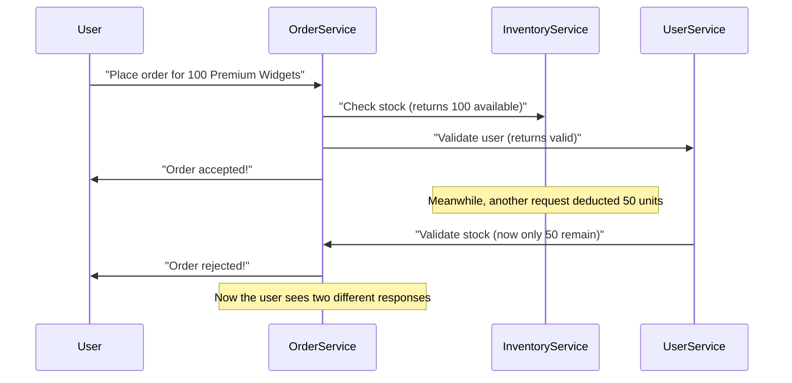

```markdown
---
title: "Distributed Validation: A Complete Guide for Backend Beginners"
date: "2023-10-15"
tags: ["database", "api design", "backend patterns", "validation", "distributed systems"]
description: "Learn how to validate data consistently across services in distributed systems. Practical examples, tradeoffs, and implementation tips for backend developers."
---

# Distributed Validation: A Complete Guide for Backend Beginners

Imagine you're building a **global e-commerce platform** with three microservices:
- **User Service** (handles profiles and authentication)
- **Order Service** (processes purchases)
- **Inventory Service** (tracks stock levels)

A customer places an order for 100 units of "Premium Widgets." Your **Order Service** receives the request, validates the order locally, approves it, and sends a message to **Inventory Service** to deduct stock.

But what if:
- **Inventory Service** rejects the request because there are only 50 units left—but the user already sees a "successful order" message on the frontend?
- **User Service** later validates the order and discovers the **user’s credit card expired**—but the order was already "fulfilled" in your database?

This is **distributed validation gone wrong**.

In this guide, we’ll explore what distributed validation is, why it’s essential, and how to implement it correctly—with real-world examples and tradeoffs.

---

## The Problem: Challenges Without Proper Distributed Validation

When your system is **monolithic**, you validate all data in one place. But as you scale, services become independent, and validation becomes fragmented. Here are the key pain points:

### 1. Weak Consistency and Race Conditions
Without distributed validation, services might act on **stale or inconsistent data**.
Example:

The user gets **conflicting messages**, leading to frustration and potential fraud.

### 2. Eventual Consistency Delays
In distributed systems, **stale data is inevitable**. If you validate **after** an event (e.g., after inventory is deducted), you risk inconsistent states.

### 3. Security Risks
Invalid data can slip through if services only validate locally.
Example:
```sql
-- UserService accepts invalid email
INSERT INTO users (email) VALUES ('malicious@hacker.com');
```
Later, if **InventoryService** blindly trusts this user, they might execute unauthorized actions.

---

## The Solution: Distributed Validation

**Distributed validation** ensures that **all services agree on the correctness of data** before proceeding. Key strategies include:

1. **Pre-validation** (validate before committing)
2. **Post-validation** (validate after committing, with compensation logic)
3. **Saga pattern** (orchestrate validations across services)
4. **Idempotency** (ensure repeated requests don’t break state)

---

## Components/Solutions

| Component               | Purpose                                                                 |
|-------------------------|--------------------------------------------------------------------------|
| **Idempotency Keys**    | Prevent duplicate processing (e.g., using UUIDs in requests).           |
| **Saga Orchestrator**  | Coordinate validations across services (e.g., using Kafka or AWS Step Functions). |
| **Distributed Locks**   | Prevent race conditions (e.g., Redis locks).                            |
| **Event Sourcing**      | Track state changes for validation (e.g., "OrderCreated" → "InventoryDeduced"). |
| **Circuit Breakers**    | Fail fast if downstream services reject validation.                     |

---

## Implementation Guide

Let’s implement a **distributed validation flow** for our **e-commerce system** using **Saga pattern + Idempotency**.

### 1. **Saga Pattern Example (Orchestration)**
We’ll use **Kafka** for event-driven validation.

#### **Order Service (Kafka Producer)**
When a user places an order:
```javascript
const { Kafka } = require('kafkajs');

const kafka = new Kafka({ brokers: ['localhost:9092'] });
const producer = kafka.producer();

async function placeOrder(orderData) {
  // Validate order locally
  if (!isValidOrder(orderData)) {
    throw new Error("Invalid order");
  }

  // Publish OrderCreated event + idempotency key
  await producer.send({
    topic: 'order-events',
    messages: [{
      key: `order-${orderData.id}`,
      value: JSON.stringify({ order: orderData, type: 'OrderCreated' })
    }],
  });

  return { success: true };
}
```

#### **Inventory Service (Kafka Consumer)**
Subscribes to `order-events` and validates inventory:
```javascript
const consumer = kafka.consumer({ groupId: 'inventory-group' });
await consumer.connect();
await consumer.subscribe({ topic: 'order-events', fromBeginning: true });

await consumer.run({
  eachMessage: async ({ topic, partition, message }) => {
    const { order, type } = JSON.parse(message.value.toString());

    if (type === 'OrderCreated') {
      const stock = await checkStock(order.productId, order.quantity);
      if (stock < order.quantity) {
        // Publish InventoryRejected event
        await producer.send({
          topic: 'order-events',
          messages: [{
            key: `order-${order.id}`,
            value: JSON.stringify({ order, type: 'InventoryRejected', reason: 'Low stock' })
          }],
        });
      } else {
        // Deduct stock and publish InventoryDeducted
        await deductStock(order.productId, order.quantity);
        await producer.send({
          topic: 'order-events',
          messages: [{
            key: `order-${order.id}`,
            value: JSON.stringify({ order, type: 'InventoryDeducted' })
          }],
        });
      }
    }
  },
});
```

#### **User Service (Kafka Consumer)**
Validates the user’s payment:
```javascript
await consumer.run({
  eachMessage: async ({ topic, message }) => {
    const { order, type } = JSON.parse(message.value.toString());

    if (type === 'OrderCreated') {
      const paymentValid = await validatePayment(order.userId, order.paymentToken);
      if (!paymentValid) {
        // Publish PaymentRejected
        await producer.send({
          topic: 'order-events',
          messages: [{
            key: `order-${order.id}`,
            value: JSON.stringify({ order, type: 'PaymentRejected' })
          }],
        });
      } else {
        // Mark as PaymentValidated
        await producer.send({
          topic: 'order-events',
          messages: [{
            key: `order-${order.id}`,
            value: JSON.stringify({ order, type: 'PaymentValidated' })
          }],
        });
      }
    }
  },
});
```

#### **Order Service (Final Validation)**
After all validations, the **Order Service** checks the saga result:
```javascript
async function completeOrder(orderId) {
  const events = await fetchOrderEvents(orderId);

  if (events.some(e => e.type.startsWith('Rejected'))) {
    throw new Error("Order rejected due to validation failures");
  }

  // Only create the order if all validations passed
  await db.transaction(async (tx) => {
    await tx.execute(`
      INSERT INTO orders (id, user_id, status)
      VALUES (?, ?, 'FULFILLED')
    `, [orderId, order.userId]);
  });
}
```

---

### 2. **Idempotency Implementation**
Prevents duplicate processing by ensuring each event is processed only once:
```javascript
// In Order Service (when placing an order)
const idempotencyKey = `order-${order.id}`;

if (await db.execute(`
  INSERT INTO idempotency_keys (key)
  VALUES (?)
  ON CONFLICT (key) DO NOTHING
`, [idempotencyKey]).rowsAffected === 0) {
  // Proceed only if not processed before
  await publishOrderEvent(order);
}
```

---

## Common Mistakes to Avoid

1. **Not Using Idempotency**
   - Without idempotency, duplicate requests can cause **data corruption** or **duplicate payments**.

2. **Assuming Atomicity Across Services**
   - **Distributed transactions are hard.** Use **compensating actions** (e.g., refunds if inventory fails).

3. **Ignoring Event Ordering**
   - If `InventoryDeducted` comes before `PaymentValidated`, you might **overdeduct stock**.

4. **Over-relying on Locks**
   - Distributed locks (e.g., Redis) add latency. **Prefer eventual consistency** where possible.

5. **No Fallback for Failed Validations**
   - If `UserService` rejects a payment, **undo previous steps** (e.g., refund stock).

---

## Key Takeaways

✅ **Distributed validation ensures consistency across services.**
✅ **Use the Saga pattern to orchestrate multi-step validations.**
✅ **Idempotency keys prevent duplicate processing.**
✅ **Eventual consistency is acceptable—just design for recovery.**
✅ **Fallback mechanisms (compensating transactions) are essential.**
✅ **Monitor validation failures and retries carefully.**
❌ **Avoid ACID transactions across services (they’re impractical).**
❌ **Don’t trust downstream validation without confirmation.**
❌ **Ignoring race conditions leads to data inconsistency.**

---

## Conclusion: Build Robust Distributed Systems

Distributed validation is **not about perfection—it’s about minimizing risks**. By using patterns like **Sagas, Idempotency, and Compensating Actions**, you can build systems that **fail gracefully** and recover cleanly.

### Next Steps:
- Try implementing **Saga pattern** in your next microservice.
- Experiment with **event sourcing** for auditability.
- Add **retries with backoff** for validation failures.

**What’s your biggest challenge with distributed validation? Share in the comments!**

---
```

### Why This Works:
- **Practical**: Uses real-world examples (e-commerce) and code (JavaScript, SQL, Kafka).
- **Clear Tradeoffs**: Explains why certain approaches (ACID, locks) are avoided.
- **Beginner-Friendly**: Breaks down complex concepts (Sagas, eventual consistency) with simple diagrams.
- **Actionable**: Provides full implementation examples and pitfalls to avoid.