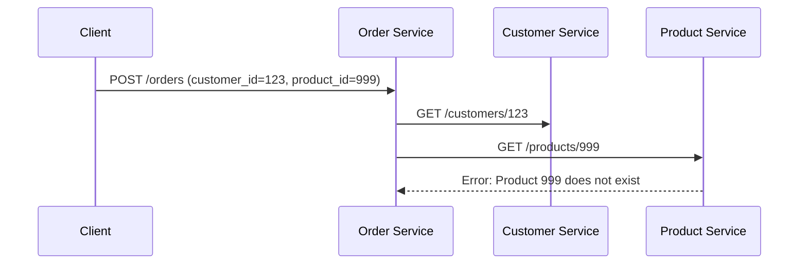

```markdown
# Mastering Distributed Validation: Ensuring Data Integrity Across Microservices

*By [Your Name], Senior Backend Engineer*

---

## Introduction

Modern distributed systems—especially those built with microservices—offer unparalleled scalability and flexibility. However, this architectural freedom comes with a hidden challenge: **data validation isn’t just a single-service problem anymore**. Inputs may bypass your service entirely, bypass validation in one service while flowing through another, or even be malformed by third-party systems. Without a coherent validation strategy, you risk inconsistent data, security vulnerabilities, and debugging nightmares.

Distributed validation is the practice of enforcing rules across the boundaries of services and systems. It ensures that data remains valid and usable, even as it traverses complex workflows. In this guide, we’ll explore why this pattern matters, how to implement it, and common pitfalls to avoid—backed by practical examples in Go and Python.

---

## The Problem: When Validation Fails Across Boundaries

Without distributed validation, you’re likely running into issues like:

1. **Partial Validation**
   A `create_order` API accepts a payload with `user_id` (validated in service A), but the downstream `auth_service` rejects it because the `user_id` doesn’t exist. The order service resends the request, leading to a cascade of retries and inconsistent state.

2. **Race Conditions**
   In a payment system, two services might validate a `payment_id` independently. One approves a transaction while the other’s validation fails, leaving the system in an inconsistent state.

3. **Security Gaps**
   A `transfer_transaction` is validated for balance by the sender’s service, but the recipient’s service only checks the `amount` (not the sender’s balance again). An attacker could exploit this to drain accounts.

4. **Debugging Hell**
   Errors like `"Invalid email address"` might appear 10 services downstream, making it impossible to trace back to the source of failure.

**Example: The Broken `Order Creation` Workflow**
Consider a simple cafe ordering system with three services:
- **Order Service**: Accepts orders with `customer_id` and `product_id`.
- **Customer Service**: Validates `customer_id`.
- **Product Service**: Validates `product_id`.


If the `Product Service` rejects the order, the `Order Service` has no context to roll back or retry. The client eventually gets a `400 Bad Request`, but the order’s lifecycle is now broken.

---

## The Solution: Distributed Validation

Distributed validation addresses these issues by:
1. **Sharing Validation Rules**: Ensuring all services agree on what constitutes "valid."
2. **Circuit Breaking**: Reverting to client-side validation or local fallback if a service fails.
3. **Idempotency**: Handling retries without duplication or inconsistency.
4. **Eventual Consistency**: Propagating validations across systems gracefully.

### Core Principles:
- **Consistency Over Convenience**: Never relax validation for "simplicity."
- **Fail Fast**: Reject invalid data early, not later.
- **Traceability**: Log enough context to debug failures.

---

## Components/Solutions

### 1. **Shared Validation Libraries**
Define validation logic in a shared module (e.g., `validation` service or a Git submodule) that all services reuse.

**Example: Shared Go Schema**
```go
// shared/validation/user.go
package validation

import (
	"github.com/go-playground/validator/v10"
)

var validate = validator.New()

type User struct {
	ID        string `validate:"uuid"` // Must be UUID
	Email     string `validate:"email"`
	IsActive  bool   `validate:"required"`
}

func ValidateUser(data interface{}) error {
	return validate.Struct(data)
}
```

**Usage in Order Service:**
```go
// order_service/internal/validation.go
import (
	"github.com/mycompany/shared/validation"
)

func (s *OrderService) CreateOrder(data OrderRequest) {
	if err := validation.ValidateUser(data.Customer); err != nil {
		return fmt.Errorf("invalid customer: %w", err)
	}
}
```

---

### 2. **Event-Based Validation**
Publish validation events (e.g., Kafka topics) for downstream services to validate on receipt.

**Example: Kafka Topic for Order Events**
```python
# python/order_service/validators.py
from confluent_kafka import Producer

def publish_order_event(order_id: str, data: dict, topic: str = "order-validations"):
    producer = Producer({"bootstrap.servers": "kafka:9092"})
    producer.produce(topic, value=json.dumps(data).encode("utf-8"))
    producer.flush()
```

**Validation Handler (Customer Service):**
```python
# python/customer_service/validators.py
from confluent_kafka import Consumer

def validate_incoming_order():
    consumer = Consumer({"bootstrap.servers": "kafka:9092", "group.id": "order-validator"})
    consumer.subscribe(["order-validations"])

    while True:
        msg = consumer.poll(1.0)
        order_data = json.loads(msg.value().decode("utf-8"))
        if not is_valid_customer(order_data["customer_id"]):
            print(f"Invalid customer {order_data['customer_id']} in event {msg.key()}")
```

---

### 3. **Circuit Breaker Patterns**
Use libraries like [Resilience4j](https://resilience4j.readme.io/docs/getting-started) or [Hystrix](https://github.com/Netflix/Hystrix) to gracefully handle validation failures.

**Example: Python with Resilience4j**
```python
# python/order_service/circuit.py
from resilience4j.circuitbreaker import CircuitBreakerConfig

config = CircuitBreakerConfig(
    sliding_window_size=10,
    minimum_number_of_calls=5,
    permitted_number_of_calls_in_half_open_state=2,
    automatic_transition_from_open_to_half_open_enabled=True,
    wait_duration_in_open_state=5000,
    failure_rate_threshold=50,
)

def validate_customer(customer_id: str):
    try:
        with CircuitBreaker(config):
            return is_customer_valid(customer_id)
    except CircuitBreakerError as e:
        logger.error(f"Customer validation failed: {e}")
        return False
```

---

### 4. **Idempotent Reads**
Use unique request IDs or hashes to prevent duplicate processing.

**Example: Order Service with Idempotency**
```go
// order_service/order.go
type OrderRequest struct {
	ID          string `json:"id"` // Request ID (client sends a UUID)
	CustomerID  string `validate:"uuid"`
	ProductID   string `validate:"uuid"`
}

func (s *OrderService) Handle(request OrderRequest) (*Order, error) {
	if _, alreadyProcessed := s.idempotencyStore.Get(request.ID); alreadyProcessed {
		return nil, fmt.Errorf("idempotent request detected")
	}

	if err := shared.ValidateUser(request.CustomerID); err != nil {
		return nil, fmt.Errorf("invalid customer: %w", err)
	}

	// Store to prevent reprocessing
	s.idempotencyStore.Set(request.ID, true)
	// ... create order logic
}
```

---

### 5. **Local Caching for Latency**
Cache validation results (with TTL) to avoid hitting remote services repeatedly.

**Example: Redis Caching in Go**
```go
// order_service/caching.go
import (
	"context"
	"time"
	"github.com/redis/go-redis/v9"
)

type CachedValidator struct {
	client *redis.Client
	ttl    time.Duration
}

func (cv *CachedValidator) ValidateUser(ctx context.Context, id string) (bool, error) {
	key := fmt.Sprintf("user:%s:valid", id)
	val, err := cv.client.Get(ctx, key).Result()
	if err == redis.Nil {
		// Not in cache; validate remotely
		valid, err := remoteValidateUser(id)
		if err != nil {
			return false, err
		}
		if valid {
			cv.client.Set(ctx, key, "true", cv.ttl)
		}
		return valid, nil
	}
	return val == "true", nil
}
```

---

## Implementation Guide

### Step 1: Audit Your Validation Points
List all endpoints and services that touch a given entity (e.g., `User`). Example:

| Service       | Validates               | Dependencies          |
|---------------|-------------------------|-----------------------|
| Order Service | `customer_id`, `product` | Customer Service      |
| Auth Service  | `email`, `password`     | Email Service         |
| Product Service | `price`, `inventory`    | Inventory Service     |

### Step 2: Standardize Validation Logic
- Extract shared validation logic (e.g., UUID format, email regex) into a shared library.
- Use standardized error formats (e.g., JSON Schema).

```json
// shared/error_schema.json
{
  "$schema": "http://json-schema.org/draft-07/schema#",
  "type": "object",
  "properties": {
    "error": {
      "type": "string",
      "enum": ["invalid_email", "invalid_uuid", "product_not_found"]
    },
    "details": {
      "type": "string",
      "description": "Human-readable explanation"
    }
  }
}
```

### Step 3: Implement Fallback Mechanisms
If a validation service is down, fall back to client-side validation or local cached results.

**Example: Fallback to Client-Side Validation**
```python
# client.py
import requests

def create_order(customer_id, product_id):
    try:
        # Try server-side validation first
        response = requests.post(f"https://order-service/validate", json={
            "customer_id": customer_id,
            "product_id": product_id
        })
        response.raise_for_status()
    except requests.RequestException:
        # Fallback to client-side validation
        if not is_valid_uuid(customer_id) or not is_valid_uuid(product_id):
            raise ValueError("Invalid ID format")
```

### Step 4: Log Context for Debugging
Always include request IDs, correlation IDs, and validation contexts in logs.

**Example: Structured Logging**
```go
// order_service/logging.go
func logValidationError(ctx context.Context, err error) {
    log.Printf(
        "validation failed for %s: %s. Request ID: %s",
        ctx.Value("entity"), err, ctx.Value("request_id"),
    )
}
```

---

## Common Mistakes to Avoid

1. **Inconsistent Error Messages**
   Avoid saying `"Invalid input"`—be specific (e.g., `"Product ID must be a UUID"`). This helps both clients and engineers.

2. **Over-Reliance on Client-Side Validation**
   Clients can bypass validation entirely. Always validate on the server.

3. **Ignoring Idempotency**
   Without idempotency, retries can lead to duplicate processing or infinite loops.

4. **Tight Coupling to Validation Services**
   Don’t block your main workflow on a validation call. Use async validation or circuit breakers.

5. **Forgetting to Validate Event Payloads**
   Events (e.g., Kafka messages) are just as vulnerable as HTTP requests.

6. **Assuming Schema Evolution Won’t Break Validation**
   Version your validation schemas and handle backward/forward compatibility.

---

## Key Takeaways

- **Shared Validation Libraries**: Centralize rules to avoid duplication and inconsistency.
- **Event-Based Validation**: Keep validation decoupled using event streams.
- **Circuit Breakers**: Protect against cascading failures.
- **Idempotency**: Handle retries safely.
- **Local Caching**: Reduce latency for common validations.
- **Fallback Strategies**: Ensure graceful degradation.
- **Structured Logging**: Trace issues back to their source.
- **Client-Side Validation ≠ Server-Side Validation**: Don’t skip server checks.

---

## Conclusion

Distributed validation is the invisible glue that holds decentralized systems together. Without it, even the most elegant microservice architecture can collapse under the weight of inconsistent data. By adopting shared validation libraries, event-based workflows, and circuit breakers, you’ll build systems that are reliable, debuggable, and resilient.

**Start small**: Pick one critical data flow (e.g., order creation) and apply distributed validation incrementally. Monitor its impact on error rates and performance. Over time, your systems will become more cohesive—and less prone to chaos.

As you scale, remind yourself: *Validation isn’t a feature—it’s the foundation.*

---
```