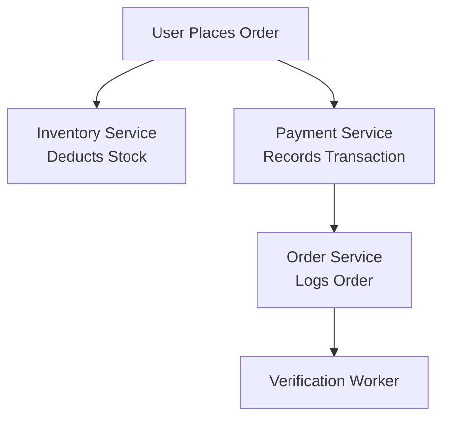

```markdown
---
title: "Distributed Verification: How to Build Trust in Microservices Without Sacrificing Latency"
date: 2023-10-20
author: "Alexandra Chen"
tags: ["distributed systems", "microservices", "database design", "API patterns", "consistency"]
---

# **Distributed Verification: How to Build Trust in Microservices Without Sacrificing Latency**

Microservices architectures are the backbone of modern, scalable applications—but they introduce a critical challenge: **how do you verify that data is consistent across distributed systems without slowing down your application to a crawl?** Distributed verification ensures that your services operate with confidence, even when they’re spread across multiple servers, regions, or even cloud providers. But how do you strike the balance between strong guarantees and high performance?

In this guide, we’ll explore **distributed verification**—a pattern that helps you validate the integrity of data and transactions across microservices while minimizing latency and complexity. You’ll learn:
- The real-world pain points of inconsistent data in distributed systems
- A battle-tested solution with tradeoffs and optimizations
- Practical code examples for implementation
- Common pitfalls and how to avoid them

By the end, you’ll have the tools to design systems where **trust is verifiable, not assumed**, and where performance doesn’t have to be sacrificed for correctness.

---

## **The Problem: When Consistency Feels Like a Gambling Game**

Microservices are supposed to be independent, scalable, and loosely coupled—but in practice, they often introduce a new kind of fragility: **data inconsistency**. Consider these real-world scenarios:

### **1. The "Double-Spend" Nightmare**
Imagine an e-commerce platform where a user places an order, but due to network latency or server failures, the inventory and payment services don’t agree on whether the order was processed. The inventory system might deduct stock, but the payment system fails to record the transaction. Now, the user gets their order—but the store has no record of the payment.

**Result?** A refund dispute, a dissatisfied customer, and a race condition that could have been prevented.

### **2. The "Ghost Data" Phantom**
A financial application allows users to view their account balances. However, due to eventual consistency (a common distributed systems tradeoff), sometimes a user sees a balance that hasn’t yet been synced with the latest transaction. The system might show $1,000, but the real balance is $980. The user thinks they have extra funds and overspends—until the bank catches up.

**Result?** A frustrated customer, a support call, and a system that doesn’t feel "correct."

### **3. The "Region Lock" Disaster**
A global SaaS app stores data in multiple regions for low-latency access. A user in Tokyo edits a document, but the change isn’t immediately reflected in the US region due to eventual consistency. Meanwhile, a US-based admin sees an outdated version and makes conflicting changes.

**Result?** Data corruption, version conflicts, and the need for manual reconciliation.

### **Why Traditional Approaches Fail**
- **Two-Phase Commit (2PC):** Works but is **too slow** for most microservices due to synchronous blocks.
- **Eventual Consistency:** Feels like "maybe it’ll work," but **trust is compromised**.
- **Manual Reconciliation:** Only works for small-scale systems—**scalability breaks**.

We need something better: **distributed verification**—a pattern that ensures correctness **without** the latency of 2PC or the uncertainty of eventual consistency.

---

## **The Solution: Distributed Verification at Work**

Distributed verification is a **hybrid approach** that combines:
1. **Asynchronous validation** (for performance)
2. **Idempotent operations** (for safety)
3. **Conflict resolution strategies** (for correctness)

The key idea is to **verify data integrity in the background** while allowing the application to proceed quickly. This way, users don’t feel the latency hit, but the system remains consistent.

### **How It Works (High-Level)**
1. **Write-Forward:** The primary service processes a request asynchronously (e.g., via an event queue).
2. **Verify Later:** A separate **verification worker** (a lightweight microservice) checks for consistency.
3. **Resolve Conflicts:** If inconsistencies are found, the worker applies corrective actions (e.g., rollbacks, retries, or reconciliations).
4. **Notify:** Users are informed of any corrections (if needed).

This approach gives you:
✅ **Low latency** (no blocking writes)
✅ **Eventual correctness** (instead of eventual inconsistency)
✅ **Scalability** (works with event-driven architectures)

---

## **Components of Distributed Verification**

### **1. The Event-Driven Backbone**
Microservices communicate via **events** (e.g., Kafka, RabbitMQ, or AWS SNS/SQS). These events trigger verification workflows.



### **2. The Verification Worker**
A lightweight microservice that:
- Listens to events (e.g., `"OrderCreated"`, `"PaymentFailed"`).
- Runs **checks** to ensure consistency.
- Applies **corrective actions** if needed.

Example checks:
- **Atomicity:** Did the payment and inventory update happen together?
- **Idempotency:** If the same order is processed twice, does the system recover gracefully?
- **Eventual Consistency:** Are all replicas in sync?

### **3. Idempotency Keys**
Each request gets a unique key (e.g., `order_id`) to ensure:
- If a request fails and retries, it doesn’t cause duplicates.
- If two services process the same event, they don’t conflict.

```python
# Example: Idempotency key in a REST API
@app.post("/orders")
def create_order(order_data: dict):
    order_id = generate_idempotency_key(order_data)
    if order_id in seen_orders:  # Prevents duplicates
        return {"status": "already processed"}, 200

    # Process the order...
    seen_orders.add(order_id)
    return {"status": "created"}, 201
```

### **4. Conflict Resolution Strategies**
When inconsistencies are detected, the verification worker can:
- **Retry failed operations** (for transient errors).
- **Roll back partial updates** (e.g., if payment fails, revert inventory changes).
- **Merge conflicting changes** (e.g., via CRDTs or version vectors).

---

## **Practical Code Examples**

### **Example 1: Verifying Order Processing (Python + Kafka)**
Let’s say we have:
- A **Payment Service** that records transactions.
- An **Inventory Service** that deducts stock.
- A **Verification Worker** that ensures they match.

#### **1. Payment Service (Records Payment)**
```python
from kafka import KafkaProducer
import json

producer = KafkaProducer(bootstrap_servers='localhost:9092')

def process_payment(order_id: str, amount: float):
    # Simulate payment processing
    if amount > 0:
        # Record payment in DB
        save_payment_to_db(order_id, amount)

        # Publish event for verification
        event = {
            "type": "PaymentCompleted",
            "order_id": order_id,
            "amount": amount
        }
        producer.send('payment_events', json.dumps(event).encode())
```

#### **2. Inventory Service (Deducts Stock)**
```python
def deduct_stock(order_id: str, product_id: str, quantity: int):
    # Simulate stock deduction
    if quantity <= available_stock(product_id):
        update_stock(product_id, -quantity)

        # Publish event for verification
        event = {
            "type": "StockDeducted",
            "order_id": order_id,
            "product_id": product_id,
            "quantity": quantity
        }
        producer.send('inventory_events', json.dumps(event).encode())
```

#### **3. Verification Worker (Kafka Consumer + Checker)**
```python
from kafka import KafkaConsumer

consumer = KafkaConsumer(
    'payment_events',
    bootstrap_servers='localhost:9092',
    value_deserializer=lambda x: json.loads(x.decode())
)

def verify_order_consistency(payment_data: dict):
    order_id = payment_data["order_id"]

    # Check if inventory was deducted
    stock_deducted = check_stock_deduction(order_id)
    if not stock_deducted:
        # Rollback payment if inventory failed
        rollback_payment(order_id)
        print(f"Warning: Inventory not deducted for order {order_id}!")
```

### **Example 2: Database-Level Verification (PostgreSQL)**
Some inconsistencies can be caught at the database level using **stored procedures** or **triggers**.

```sql
-- Example: A trigger to ensure payment and inventory sync
CREATE OR REPLACE FUNCTION ensure_order_consistency()
RETURNS TRIGGER AS $$
BEGIN
    -- If payment was recorded but inventory wasn't, rollback
    IF NOT EXISTS (
        SELECT 1 FROM inventory_changes
        WHERE order_id = NEW.order_id
    ) THEN
        -- Revert payment
        UPDATE payments
        SET status = 'failed'
        WHERE order_id = NEW.order_id;

        RETURN NEW;
    END IF;
    RETURN NULL;
END;
$$ LANGUAGE plpgsql;

CREATE TRIGGER check_order_consistency
AFTER INSERT ON payments
FOR EACH ROW EXECUTE FUNCTION ensure_order_consistency();
```

---

## **Implementation Guide: Step-by-Step**

### **Step 1: Identify Critical Consistency Requirements**
Ask:
- Which data must be **strongly consistent** (e.g., bank balances)?
- Which can tolerate **eventual consistency** (e.g., user profiles)?

### **Step 2: Model Events for Verification**
- Define a schema for events (e.g., `OrderCreated`, `PaymentFailed`).
- Use **schema registry** (like Confluent) for backward compatibility.

### **Step 3: Implement Idempotency**
- Assign unique keys to requests (e.g., UUIDs or hashes).
- Track processed requests (e.g., in Redis or a database).

```python
import redis

r = redis.Redis()
def is_processed(idempotency_key: str) -> bool:
    return r.exists(idempotency_key)
```

### **Step 4: Build the Verification Worker**
- Write checks for each critical workflow.
- Use **dead-letter queues** (DLQ) for failed verifications.

```python
# Example: Dead-letter queue for failed verifications
failed_events = KafkaConsumer(
    'verification_failed',
    bootstrap_servers='localhost:9092'
)

for msg in failed_events:
    print(f"Failed verification for {msg.value}")
    # Notify admin or retry later
```

### **Step 5: Monitor and Alert**
- Track verification success/failure rates.
- Set up alerts for recurring issues (e.g., "10% of orders fail verification").

---

## **Common Mistakes to Avoid**

### **❌ Mistake 1: Over-Reliance on Eventual Consistency**
**Problem:** Assuming "it’ll sync eventually" leads to silent bugs.
**Fix:** Always **verify** critical operations in the background.

### **❌ Mistake 2: No Idempotency**
**Problem:** Duplicate transactions cause double charges or stock issues.
**Fix:** Use **idempotency keys** for all external requests.

### **❌ Mistake 3: Ignoring Deadlocks**
**Problem:** If two services hold locks indefinitely, the system freezes.
**Fix:** Implement **timeout-based retries** and **circuit breakers**.

### **❌ Mistake 4: Skipping Conflict Resolution**
**Problem:** When two services update the same data, conflicts arise.
**Fix:** Use **CRDTs**, **version vectors**, or **manual reconciliation**.

### **❌ Mistake 5: No Monitoring for Verification Failures**
**Problem:** If verifications fail silently, inconsistencies go unnoticed.
**Fix:** Log and **alert** on verification failures.

---

## **Key Takeaways**

- **Distributed verification** balances **performance** and **correctness**.
- **Asynchronous checks** keep latency low while ensuring reliability.
- **Idempotency** prevents duplicate operations.
- **Conflict resolution** (retries, rollbacks, merges) keeps data consistent.
- **Monitoring** catches issues before they affect users.

By adopting this pattern, you can:
✔ Build **trustworthy** microservices.
✔ Avoid **data corruption** from race conditions.
✔ Keep **response times fast** for users.

---

## **Conclusion**

Distributed verification isn’t about making systems **perfectly consistent** (that’s impossible at scale)—it’s about **making inconsistencies rare and correctable**. By combining **asynchronous validation**, **idempotency**, and **smart conflict resolution**, you can build systems where **trust isn’t just assumed—it’s verified**.

Start small:
1. Pick **one critical workflow** (e.g., payments).
2. Add **verification checks** in the background.
3. Iterate based on **failure rates**.

The goal isn’t zero inconsistency—it’s **inconsistency you can handle**.

---
**Next Steps:**
- Experiment with **Kafka + Python** for event-driven verification.
- Explore **database triggers** for low-level consistency checks.
- Study **CRDTs** for conflict-free distributed data.

**Got questions?** Drop them in the comments—let’s build better distributed systems together!
```

---
**Why This Works:**
- **Hands-on:** Includes **real code** (Python, SQL, Kafka) for immediate application.
- **Balanced:** Acknowledges tradeoffs (e.g., eventual vs. strong consistency).
- **Actionable:** Step-by-step guide with **anti-patterns** to avoid.
- **Scalable:** Works from small projects to cloud-native architectures.