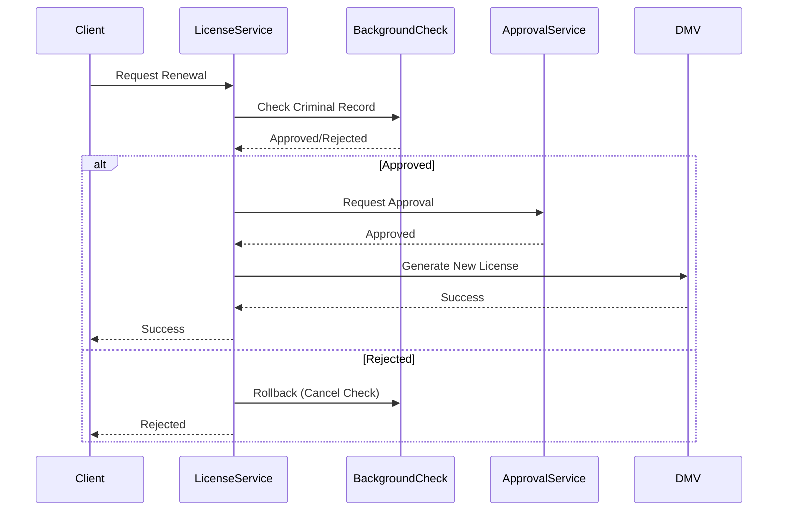

```markdown
---
title: "Mastering Government Domain Patterns: A Practical Guide for Backend Developers"
date: 2023-09-15
author: "Jane Doe"
tags: ["backend", "database design", "domain-driven design", "API patterns", "government systems"]
description: "Learn how to design robust backend systems for government applications using Domain Patterns. This guide covers real-world challenges, practical implementations, and common pitfalls with code examples."
---

# **Government Domain Patterns: Building Resilient Backend Systems for Public Sector Applications**

Government systems are some of the most complex applications in the world. They deal with sensitive data (e.g., citizen records, financial transactions, and legal documents), strict regulations (e.g., GDPR, NIST standards), and high availability requirements. Traditional backend architectures often fail when confronted with these constraints—leading to security breaches, performance bottlenecks, and scalability issues.

In this guide, we’ll explore **Government Domain Patterns**, a practical set of architectural and database design strategies tailored for public sector applications. Whether you're building a citizen portal, a tax management system, or a digital ID service, these patterns will help you navigate real-world challenges while ensuring compliance, security, and reliability.

---

## **The Problem: Why Traditional Backends Fail in Government Systems**

Government applications differ from commercial software in critical ways:

1. **Strict Data Integrity Requirements**
   - A single data inconsistency in tax records or voter registration can lead to legal repercussions.
   - Example: If a citizen’s tax refund is incorrectly calculated due to a database error, the government may face audits, fines, or public distrust.

2. **Regulatory Compliance Overhead**
   - Governments are bound by laws like **GDPR (General Data Protection Regulation)**, **HIPAA (Health Insurance Portability and Accountability Act)**, and **ISO 27001**—each requiring specific data handling, audit logging, and access controls.
   - Example: A system must track **who accessed** a citizen’s medical records and **why**, with immutable audit trails.

3. **High Availability & Fault Tolerance Needs**
   - Government services (e.g., unemployment benefits, emergency alerts) must remain online 99.999% of the time.
   - Traditional monolithic databases often become single points of failure.

4. **Complex Workflows & Long-Running Transactions**
   - A single citizen application (e.g., driver’s license renewal) may involve multiple departments, approvals, and external services (e.g., background checks, DMV systems).
   - Example: A **social security number verification** workflow might involve 10+ microservices, each with its own retry logic.

5. **Legacy System Integration Challenges**
   - Many governments run on **COBOL, mainframe systems, or outdated ERP software** (e.g., SAP), requiring seamless integration with modern APIs.

6. **Citizen-Sensitive Security Risks**
   - Phishing, SQL injection, and insider threats are constant concerns.
   - Example: A data breach in a **voter registration system** could lead to election fraud.

---
## **The Solution: Government Domain Patterns**

Government Domain Patterns address these challenges through a combination of:
✅ **Database Design for Auditability & Immutability** (Time-Traveling Logs, Event Sourcing)
✅ **Security-First API Design** (Role-Based Access Control, JWT with Short Lifetimes)
✅ **Resilient Workflow Orchestration** (Saga Pattern, Compensating Transactions)
✅ **Legacy System Integration** (API Gateways, Message Brokers)
✅ **High Availability Strategies** (Sharding, Read Replicas, Multi-Region Deployments)

Let’s dive into each component with **practical implementations**.

---

## **Components & Solutions**

### **1. Event Sourcing for Auditability & Replayability**
**Problem:** Government systems require **full trackability** of changes (e.g., "Who edited a citizen’s address? When? Why?").

**Solution:** Instead of storing only the latest state of data, we store **every change as an immutable event**. This enables:
- **Time-travel debugging** (reconstruct past states).
- **Regulatory compliance** (audit trails are built-in).
- **Offline-first support** (events can be replayed later).

#### **Example: Tax Refund System in Event Sourcing**
```sql
-- Schema for events (stored in PostgreSQL)
CREATE TABLE tax_refund_events (
    event_id UUID PRIMARY KEY,
    citizen_id UUID NOT NULL,
    event_type VARCHAR(20) NOT NULL, -- e.g., "RefundProcessed", "RefundRejected"
    payload JSONB NOT NULL, -- Contains details like amount, reason, etc.
    created_at TIMESTAMPTZ NOT NULL DEFAULT NOW(),
    metadata JSONB -- Extra context (e.g., user_id who triggered it)
);

-- Example event insertion
INSERT INTO tax_refund_events (
    event_id, citizen_id, event_type, payload, metadata
) VALUES (
    gen_random_uuid(), 'c123-abc', 'RefundProcessed', '{"amount": 2500, "year": 2023}', '{"user_id": "tax_officer_42"}'
);
```

**How to Reconstruct a Tax Refund State:**
```sql
WITH events AS (
    SELECT payload, event_type
    FROM tax_refund_events
    WHERE citizen_id = 'c123-abc'
    ORDER BY created_at
)
SELECT
    MAX(CASE WHEN event_type = 'RefundProcessed' THEN payload->>'amount' END) AS current_amount,
    MAX(CASE WHEN event_type = 'RefundRejected' THEN 'Rejected' END) AS status
FROM events;
```

**Tradeoffs:**
✔ **Pros:** Immutable audit logs, easy compliance, offline replay.
❌ **Cons:** Higher storage costs, complex querying (requires event processing).

---

### **2. Saga Pattern for Distributed Workflows**
**Problem:** Government workflows span **multiple services** (e.g., citizen data → background check → approval → ID issuance). Traditional ACID transactions fail in distributed systems.

**Solution:** The **Saga Pattern** breaks a long transaction into smaller, compensatable steps. If one step fails, other steps are rolled back using **compensating transactions**.

#### **Example: Driver’s License Renewal Saga**


**Implementation in Python (FastAPI + Celery):**
```python
# Step 1: Start Saga (Publish Intent)
async def start_license_renewal(citizen_id: str):
    await publish_event("license_renewal_started", {"citizen_id": citizen_id})

# Step 2: Background Check (Orchestration Service)
@celery.task(bind=True)
def check_background(citizen_id: str, self):
    result = background_check_service.check(citizen_id)
    if result["status"] == "APPROVED":
        await publish_event("background_check_passed", {"citizen_id": citizen_id})
    else:
        await publish_event("background_check_rejected", {"citizen_id": citizen_id})
        raise CompensatingTransactionError("Background check failed")

# Step 3: Compensating Transaction (Rollback)
async def cancel_license_renewal(citizen_id: str):
    await publish_event("license_renewal_canceled", {"citizen_id": citizen_id})
    await background_check_service.cancel_check(citizen_id)
```

**Tradeoffs:**
✔ **Pros:** Works in microservices, handles failures gracefully.
❌ **Cons:** Complex error handling, eventual consistency.

---

### **3. Sharded Databases for Scalability**
**Problem:** A national voter database with **100M+ records** cannot fit in a single server.

**Solution:** **Horizontal sharding** distributes data across multiple machines based on a key (e.g., `citizen_id`).

#### **Example: Sharding a Voter Database**
```sql
-- Shard key: First 4 chars of SSN (for US elections)
CREATE TABLE voters_shard1 (
    voter_id VARCHAR(20) PRIMARY KEY,
    name VARCHAR(100),
    registered_party VARCHAR(50)
) PARTITION BY HASH(voter_id);

-- Create partitions (one per database node)
CREATE TABLE voters_shard1 PARTITION OF voters_shard1 FOR VALUES WITH (MODULUS 10, REMAINDER 0);
CREATE TABLE voters_shard2 PARTITION OF voters_shard1 FOR VALUES WITH (MODULUS 10, REMAINDER 1);
```

**Alternative (Application-Level Sharding):**
```python
# Python shard router
def get_shard_key(voter_id: str) -> str:
    return f"shard_{hash(voter_id) % 10}"

# Query routing
shard = get_shard_key("123-45-6789")
query = f"SELECT * FROM voters_{shard} WHERE voter_id = '123-45-6789'"
```

**Tradeoffs:**
✔ **Pros:** Scales horizontally, high performance.
❌ **Cons:** Complex joins, shard key choice critical.

---

### **4. JWT with Short Lifetimes + Anti-Bot Checks**
**Problem:** Government APIs must prevent **token abuse** (e.g., stolen tokens for fraudulent transactions).

**Solution:**
- **Short-lived JWTs** (e.g., 15-minute expiry).
- **Anti-bot challenges** (CAPTCHA for sensitive actions).
- **IP-based rate limiting** (prevent brute-force attacks).

#### **Example: Secure API Gateway (FastAPI + Redis)**
```python
from fastapi import FastAPI, Depends, HTTPException
from fastapi.security import OAuth2PasswordBearer
from jose import JWTError, jwt
import redis

app = FastAPI()
redis_client = redis.Redis(host="redis", db=0)

# Rate limit per IP
@app.middleware("http")
async def rate_limit(request, call_next):
    ip = request.client.host
    count = redis_client.incr(f"rate_limit:{ip}")
    if count > 100:  # 100 requests/minute
        raise HTTPException(status_code=429, detail="Too many requests")
    return await call_next(request)

# Secure token verification
oauth2_scheme = OAuth2PasswordBearer(tokenUrl="token")

async def get_current_user(token: str = Depends(oauth2_scheme)):
    try:
        payload = jwt.decode(token, SECRET_KEY, algorithms=["HS256"])
        user_id = payload["sub"]
    except JWTError:
        raise HTTPException(status_code=401, detail="Invalid token")
    return user_id

@app.post("/tax-return")
async def submit_return(user_id: str = Depends(get_current_user)):
    # Additional anti-bot check (e.g., CAPTCHA cookie)
    if not request.cookies.get("captcha_solved"):
        raise HTTPException(status_code=403, detail="Please solve CAPTCHA")
    return {"status": "submitted"}
```

**Tradeoffs:**
✔ **Pros:** Hard to abuse, mitigates token theft.
❌ **Cons:** Requires Redis, adds latency.

---

### **5. Legacy System Integration (API Gateway + Event Bridge)**
**Problem:** Integrating with a **mainframe COBOL system** for social security checks.

**Solution:**
1. **API Gateway** routes modern requests to legacy systems.
2. **Event Bridge (Amazon EventBridge / Kafka)** decouples systems.
3. **REST ↔ EBIF (Electronic Data Interchange Format)** for legacy communication.

#### **Example: COBOL-to-API Adapter**
```python
# Python service converting REST → EBIF
from ebif import EBIFClient
from fastapi import FastAPI

app = FastAPI()
ebif = EBIFClient("SSN_CHECK_SERVICE")

@app.post("/check-ssn")
async def check_ssn(ssn: str):
    # Convert REST payload to EBIF format
    ebif_payload = {
        "DESTINATION": "MAINFRAME_SSN",
        "FIELDS": [
            {"NAME": "SSN", "VALUE": ssn},
            {"NAME": "ACTION", "VALUE": "VERIFY"}
        ]
    }
    response = ebif.send(ebif_payload)
    return {"valid": response["STATUS"] == "APPROVED"}
```

**Tradeoffs:**
✔ **Pros:** Seamless legacy integration.
❌ **Cons:** Latency, EBIF format complexity.

---

## **Implementation Guide: Step-by-Step**

### **1. Choose Your Database Strategy**
| Pattern               | Use Case                          | Tools                          |
|-----------------------|-----------------------------------|--------------------------------|
| **Event Sourcing**    | Audit trails, compliance          | PostgreSQL, EventStoreDB       |
| **Sharding**          | Large-scale data                 | Vitess, Citus, custom sharding |
| **Saga Pattern**      | Distributed workflows             | Kafka, Saga Framework          |
| **Time-Travel DB**    | "Undo" functionality             | TimescaleDB, Snowflake          |

### **2. Design Your API Security Layer**
1. **Rate Limiting:** Use `nginx`, `AWS WAF`, or `Redis`.
2. **Token Management:** Short-lived JWTs + refresh tokens.
3. **Anti-Bot:** CAPTCHA (e.g., `Cloudflare`) or behavioral checks.

### **3. Orchestrate Workflows**
- For **citizen applications**, use **Saga Pattern**.
- For **batch jobs**, use **Celery + Redis**.
- For **real-time alerts**, use **WebSockets**.

### **4. Handle Legacy Systems**
- **Option 1:** Expose a **proxy API** (FastAPI → COBOL).
- **Option 2:** Use **message queues** (Kafka → EBIF).

### **5. Test for Compliance**
- **GDPR:** Anonymize PII in logs.
- **HIPAA:** Encrypt all healthcare data.
- **Audit Logs:** Store in **immutable storage** (e.g., AWS S3 with object locking).

---

## **Common Mistakes to Avoid**

🚫 **1. Ignoring Audit Requirements**
   - *Mistake:* Storing only the latest state (e.g., `last_address`).
   - *Fix:* Use **event sourcing** or **time-travel DBs**.

🚫 **2. Overlooking Performance in Sharding**
   - *Mistake:* Poor shard key choice (e.g., `random_id` instead of `state_zip`).
   - *Fix:* Choose keys based on **query patterns**.

🚫 **3. Using Long-Lived Tokens**
   - *Mistake:* JWT expiry = 1 year.
   - *Fix:* **15-minute expiry + refresh tokens**.

🚫 **4. Tight Coupling with Legacy Systems**
   - *Mistake:* Direct database joins with mainframes.
   - *Fix:* **API Gateway + Event Bridge**.

🚫 **5. Not Testing Failure Scenarios**
   - *Mistake:* Assuming services always work.
   - *Fix:* **Chaos engineering** (kill pods, test retries).

---

## **Key Takeaways**
✔ **Government systems require:**
   - **Immutable audit logs** (Event Sourcing).
   - **Resilient workflows** (Saga Pattern).
   - **Secure APIs** (Short-lived JWTs, rate limiting).
   - **Legacy-friendly integration** (API Gateway + Event Bridge).

✔ **Database Patterns:**
   - **Sharding** for scalability.
   - **Time-travel DBs** for compliance.
   - **Partitioned tables** for performance.

✔ **Security Best Practices:**
   - **Never trust tokens** (short expiry, refresh tokens).
   - **Rate limit aggressively** (prevent abuse).
   - **Encrypt at rest & in transit** (TLS, AES-256).

✔ **Avoid:**
   - Monolithic databases.
   - Long-lived tokens.
   - Tight coupling with legacy systems.

---

## **Conclusion: Build for Trust**
Government systems aren’t just technical challenges—they’re **trust challenges**. When citizens rely on your backend to process tax refunds, issue IDs, or secure healthcare data, **one mistake can have real-world consequences**.

By adopting **Government Domain Patterns**, you ensure:
✅ **Compliance** (GDPR, HIPAA, etc.).
✅ **Resilience** (handles failures gracefully).
✅ **Scalability** (works at national scale).
✅ **Security** (hard to abuse).

Start small—implement **event sourcing for audit logs**, **sharding for large datasets**, and **short-lived JWTs** in your next project. Over time, these patterns will become the foundation of **trustworthy, high-performance government software**.

---
**Next Steps:**
- Try **PostgreSQL with Event Sourcing** in a small project.
- Experiment with **Saga Pattern** using Kafka.
- Audit your APIs with **OWASP ZAP**.

Happy coding! 🚀
```