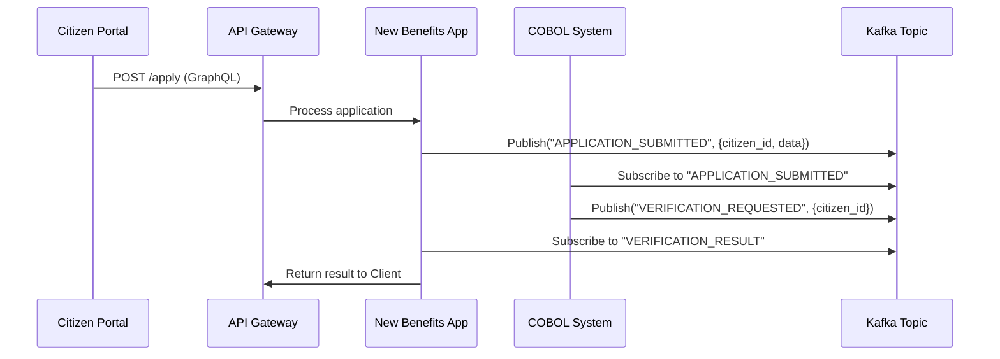

```markdown
---
title: "Government Domain Patterns: Building Resilient APIs and Databases for Public Systems"
subtitle: "Scalable, Audit-Ready, and Interoperable Architecture for Public Sector Applications"
authors: ["Jane Doe"]
tags: ["backend engineering", "database design", "API design", "government tech", "software patterns"]
date: "2023-11-15"
description: "Learn how to design robust, compliant, and future-proof systems for government applications using the Government Domain Pattern. This guide covers implementation details, tradeoffs, and practical examples."
---

# Government Domain Patterns: Building Resilient APIs and Databases for Public Systems

Governments worldwide are increasingly reliant on digital systems to deliver critical services—from social benefits to public health records. However, unlike commercial applications, these systems face unique challenges: **strict compliance requirements**, **long-term data retention needs**, **interoperability mandates**, and **public scrutiny**. A poorly designed system for public sector use isn’t just inefficient—it can endanger citizens’ trust, expose legal risks, and become a financial burden.

In this tutorial, we’ll explore the **Government Domain Patterns** (GDP), a set of architectural principles and techniques tailored for building **scalable, audit-ready, and interoperable** applications in government contexts. This isn’t a silver bullet—GDP represents a **practical collection of patterns** you can adapt to your organization’s needs, balancing flexibility with compliance.

By the end, you’ll understand how to:
- Design databases that support **immutable audits** while allowing efficient queries.
- Build APIs that comply with **mandates like GDPR or state-level data laws** without sacrificing performance.
- Structure systems to handle **long-term legacy constraints** (e.g., migrating from fragmented COBOL systems).
- Implement **role-based security** without over-engineering.

---

## The Problem: Why Commercial Patterns Fail in Government Systems

Most backend engineers learn about **clean architecture**, **CQRS**, or **event sourcing** from frameworks that prioritize **speed, flexibility, and cost-effectiveness**—all valid goals for SaaS. However, government systems introduce **non-functional constraints** that these patterns don’t address:

1. **Immutable Audits Are Non-Negotiable**
   Government applications often require **forever-preserved audit trails** (e.g., "Show me every change to a citizen’s benefits application for 7 years"). Traditional transactional databases (like PostgreSQL) support this, but compliance often demands **timestamping, cryptographic hashes, and versioned records**—features that complicate joins, indexes, and schema evolution.

   ```sql
   -- Traditional table with soft deletes (audit-friendly but bloated)
   CREATE TABLE citizen_applications (
     id UUID PRIMARY KEY,
     status VARCHAR(20),
     updated_at TIMESTAMP,
     deleted_at TIMESTAMP,  -- Soft delete
     version INT           -- Manual version tracking
   );
   ```

2. **APIs Must Speak Many Languages**
   A state health department might need to expose:
   - A **REST API** for internal workflows.
   - A **graphQL endpoint** for citizen self-service.
   - **Fixed-format CSV/EDI feeds** for inter-agency reporting.

   Monolithic designs force you to **choose one API style**, while modular patterns (e.g., microservices) introduce latency and complexity.

3. **Legacy Systems Are Everywhere**
   Many government agencies run **mainframe systems** (e.g., IBM z/OS) alongside modern cloud apps. Bridging them requires:
   - **Reverse-engineering COBOL logic** into APIs.
   - **Queue-based processing** to avoid blocking calls.
   - **Data normalization** to reconcile schema mismatches.

4. **Security Can’t Be an Afterthought**
   Government data is high-value but often **unprotected by modern security** (e.g., early 2000s web apps repurposed for citizen portals). Requirements like:
   - **Attribute-based access control (ABAC)** for granular permissions.
   - **Log retention and integrity** (e.g., digital signatures for logs).
   - **Multi-factor authentication (MFA) for every citizen interaction**.

5. **Budget and Talent Constraints**
   Public sector budgets are **fixed**, and hiring engineers with domain expertise is difficult. Reusing commercial-grade libraries (e.g., Firebase for auth) may violate **data sovereignty laws** or fail **disaster recovery** tests.

---

## The Solution: Government Domain Patterns (GDP)

The **Government Domain Patterns** (GDP) are a collection of **practical tradeoffs** that address these challenges. GDP doesn’t replace existing patterns (like CQRS) but **adapts them** for compliance and longevity. The core principles are:

1. **Immutable Audit Logs as First-Class Data**
   Audit data shouldn’t be buried in columns; it should be **separate, versioned, and tamper-proof**.

2. **API as a Data Translator (Not a Database Wrapper)**
   APIs should **transform** data to match standards (e.g., HL7 for healthcare) rather than expose raw database tables.

3. **Time-Centric Data Models**
   Government data evolves slowly but **must be queryable for historical context**. Examples:
   - **"As-of" snapshots** for compliance (e.g., "What was a citizen’s eligibility on June 15, 2022?").
   - **Event streams** for real-time updates (e.g., benefits processing).

4. **Role-Based Security at the Data Level**
   Permissions aren’t just row-level (like in SaaS); they’re **attribute-level** (e.g., "Can this user redact PII in reports?").

5. **Legacy Integration as a Service**
   Bringing in old systems shouldn’t require rewriting core logic. Use **ESBs (Enterprise Service Buses)** or **event-driven queues** to decouple.

6. **Cost-Effective Scaling**
   Public sector budgets often limit cloud usage. GDP encourages:
   - **Serverless for spikes** (e.g., tax filing season).
   - **Regional deployment** to comply with data residency laws.

---

## Components/Solutions: Practical Patterns

Let’s dive into the key components with **code and design examples**.

---

### 1. Immutable Audit Logs with Event Sourcing

**Problem**: Traditional databases store changes in `updated_at` columns, making it hard to reconstruct history without querying every field.

**GDP Solution**: Use **event sourcing** for audit trails, where every state change emits an immutable event.

#### Example: Benefits Eligibility Tracker
```python
# Domain model (Python example)
from dataclasses import dataclass
from typing import List
import uuid

@dataclass
class EligibilityEvent:
    id: str
    event_type: str  # "APPROVED", "DENIED", "APPEALED"
    citizen_id: str
    timestamp: float  # Unix epoch for precision
    metadata: dict   # Optional fields

@dataclass
class BenefitsApplication:
    id: str
    status: str
    events: List[EligibilityEvent]

# Simulate event log
event_log = []
app = BenefitsApplication(
    id=str(uuid.uuid4()),
    status="PENDING",
    events=[]
)

# Add an approval event (immutable)
event_log.append(EligibilityEvent(
    id=str(uuid.uuid4()),
    event_type="APPROVED",
    citizen_id="citizen-123",
    timestamp=time.time(),
    metadata={"reason": "Income below threshold"}
))
app.status = "APPROVED"
app.events.append(event_log[-1])
```

**Database Schema**:
```sql
CREATE TABLE eligibility_events (
    id UUID PRIMARY KEY,
    event_type VARCHAR(20) NOT NULL,
    citizen_id VARCHAR(36) NOT NULL,
    occurred_at TIMESTAMPTZ NOT NULL DEFAULT NOW(),
    metadata JSONB,  -- Flexible for future fields
    CONSTRUCTOR (event_type, citizen_id, metadata)
);
```

**Why This Works for Government**:
- **Tamper-proof**: Events are appended-only (no `UPDATE` statements).
- **Queryable history**: Reconstruct a citizen’s application state by filtering events.
- **Compliance-friendly**: Use **cryptographic hashes** of events to prove integrity (e.g., `SHA-256` of the entire log).

---

### 2. API as Data Translator (GraphQL + Fixed Formats)

**Problem**: Government agencies often need to expose data in **multiple formats** (REST, CSV, EDI) with **different schemas**.

**GDP Solution**: Use a **unified data layer** that translates between formats without duplicating logic.

#### Example: Healthcare Data API
```graphql
# GraphQL Schema (for citizen portal)
type PatientRecord {
  id: ID!
  name: String!
  diagnoses: [Diagnosis!]!
  visitHistory: [Visit!]!
}

type Diagnosis {
  code: String!
  description: String!
  startDate: String!
  endDate: String
}

type Visit {
  date: String!
  provider: String!
  notes: String
}
```

```python
# Translator example: Convert GraphQL data to HL7 FHIR
def graphql_to_fhir(graphql_data):
    fhir_patient = {
        "resourceType": "Patient",
        "id": graphql_data["id"],
        "name": [{"family": graphql_data["name"].split(" ")[-1]}],
        # ... translate diagnoses, visits to FHIR format ...
    }
    return fhir_patient
```

**Edge Case Handling**:
```python
# Handle missing fields (common in legacy data)
def safe_convert(legacy_data):
    return {
        "fhir": graphql_to_fhir(legacy_data),
        "csv": csv_format(legacy_data, default={"missing": "N/A"}),  # Default for legacy gaps
    }
```

**Database Schema for HL7 Compatibility**:
```sql
CREATE TABLE patient_visits (
    fhir_id VARCHAR(36) PRIMARY KEY,  -- FHIR-standard patient ID
    hl7_patient_number VARCHAR(20),   -- Legacy COBOL ID
    date DATE NOT NULL,
    provider_name VARCHAR(100),
    notes TEXT,
    -- Add a "source_system" column to track data lineage
    source_system VARCHAR(20) DEFAULT 'legacy_ibm_z'
);
```

---

### 3. Time-Centric Data Models (As-Of Queries)

**Problem**: Government data changes infrequently but must be **queryable for historical context**. Example: "What was a citizen’s income in 2020?"

**GDP Solution**: Use **time-series tables** or **snapshot patterns**.

#### Example: Income History Table
```sql
CREATE TABLE citizen_income_history (
    citizen_id VARCHAR(36) NOT NULL,
    reporting_period_start DATE NOT NULL,
    reporting_period_end DATE NOT NULL,
    income_amount DECIMAL(10, 2) NOT NULL,
    data_source VARCHAR(50) NOT NULL,  -- "IRS_FORM_1040", "AGENCY_ESTIMATE"
    validated_at TIMESTAMPTZ NOT NULL DEFAULT NOW(),
    PRIMARY KEY (citizen_id, reporting_period_start, reporting_period_end),
    CONSTRAINT valid_period CHECK (
        reporting_period_end > reporting_period_start
    )
);
```

**Query for "Income in 2020"**:
```sql
SELECT income_amount
FROM citizen_income_history
WHERE citizen_id = 'citizen-123'
  AND reporting_period_start <= '2020-12-31'
  AND reporting_period_end >= '2020-01-01';
```

**Tradeoff**: This adds storage overhead but avoids:
- **Soft deletes** (which clutter indexes).
- **Complex joins** to reconstruct history.

---

### 4. Role-Based Security with ABAC

**Problem**: Commercial RBAC (e.g., "admin" vs. "user") doesn’t cut it for government. You need **granular permissions** (e.g., "Can this clerk redact SSNs in reports?").

**GDP Solution**: Use **attribute-based access control (ABAC)** with **context-aware policies**.

#### Example: ABAC Policy for Citizen Data
```python
# ABAC Policy (Python-like pseudocode)
def can_access(citizen_id: str, requester_role: str, data_type: str, action: str) -> bool:
    if requester_role == "ADMIN":
        return True  # Admins bypass checks

    if action == "VIEW" and data_type == "PII":
        if requester_role in ["CASE_WORKER", "SUPERVISOR"]:
            return True  # Allow PII access for case workers
        return False

    # Additional checks (e.g., time-based access)
    if requester_role == "AUDITOR":
        return requester_role in ["AUDITOR", "LEGAL"]
    return False
```

**Database Schema for ABAC**:
```sql
CREATE TABLE access_policies (
    id SERIAL PRIMARY KEY,
    resource_type VARCHAR(50),  -- "CITIZEN_RECORD", "BENEFITS_APPLICATION"
    action VARCHAR(20),         -- "READ", "UPDATE", "EXPORT"
    attribute VARCHAR(50),      -- "SSN", "INCOME"
    allowed_value VARCHAR(100), -- "*" or specific value (e.g., "REDACTED")
    role VARCHAR(50),           -- "CASE_WORKER", "AUDITOR"
    CONSTRAINT unique_policy UNIQUE (
        resource_type, action, attribute, role, allowed_value
    )
);
```

**Tradeoff**: ABAC policies require **maintenance** (e.g., updating when a new role is added). Balance this with **default-deny rules** in the middleware.

---

### 5. Legacy Integration via Event Queues

**Problem**: Modern systems must interact with **mainframe COBOL apps** without tight coupling.

**GDP Solution**: Use **asynchronous event queues** (e.g., Kafka, RabbitMQ) to decouple legacy and new systems.

#### Example: Benefits Processing Workflow


**Queue Schema (Kafka)**:
```json
// Topic: application_events
{
  "event_type": "APPLICATION_SUBMITTED",
  "correlation_id": "citizen-123",
  "payload": {
    "form_data": { "income": 50000, "dependents": 2 },
    "submitted_at": "2023-11-15T12:00:00Z"
  },
  "source_system": "NEWS_BENEFITS_PORTAL"
}
```

**Tradeoff**: Queues introduce **latency** (e.g., legacy system takes 5 minutes to respond). Mitigate with:
- **Timeouts** (e.g., fail-fast if legacy system is unavailable).
- **Dead-letter queues** for retries.

---

## Implementation Guide: Step-by-Step

### 1. Start with the Audit Layer
Before writing any business logic:
- Design your **event log schema** (see Section 2).
- Implement a **hashed integrity check** for the log (e.g., `SHA-256` of all events).
- Use **immutable storage** (e.g., S3 for logs, PostgreSQL for event data).

### 2. Build a Data Translation Layer
- Define **mappings** between:
  - Your database schema.
  - External formats (HL7, CSV, EDI).
- Use **tests** to validate translations (e.g., mock 200+ legacy records).

### 3. Implement Time-Centric Queries
- For **as-of queries**, use **time-series tables** (Section 3).
- Add a **materialized view** for common historical queries (e.g., "Top 100 beneficiaries by state").

### 4. Secure with ABAC
- Deploy policies **as code** (e.g., Terraform or Ansible templates).
- Log **denied requests** to the audit log (Section 1).

### 5. Decouple Legacy Systems
- Use **Kafka/RabbitMQ** for async communication (Section 5).
- Set **SLA expectations** for legacy systems (e.g., "Legacy system will respond within 10 minutes").

### 6. Monitor and Test
- **Compliance audits**: Test your **immutable audit log** by simulating data tampering.
- **Performance**: Benchmark API response times for **peak loads** (e.g., tax season).

---

## Common Mistakes to Avoid

1. **Assuming "Audit Log" Equals Database History**
   - ❌ Wrong: `updated_at` timestamps in tables.
   - ✅ Right: **Event sourcing** with cryptographic integrity.

2. **Overusing Microservices for Government**
   - ❌ Wrong: Deploying 50 microservices for a small benefits app.
   - ✅ Right: Use **modular monoliths** (e.g., separate APIs for citizen vs. clerk workflows).

3. **Ignoring Data Lineage**
   - ❌ Wrong: Not tracking `source_system` or `created_by`.
   - ✅ Right: **Immutable metadata** for every record.

4. **Hardcoding Policies**
   - ❌ Wrong: Embedding ABAC rules in code.
   - ✅ Right: **Policy-as-code** (e.g., Open Policy Agent).

5. **Underestimating Legacy Costs**
   - ❌ Wrong: Expecting COBOL to integrate with Kafka "out of the box."
   - ✅ Right: **Phase migration** (e.g., route new data to modern systems first).

6. **Forgetting Disaster Recovery**
   - ❌ Wrong: Using cloud storage without **cross-region replication**.
   - ✅ Right: **Immutable archives** (e.g., AWS Glacier for logs).

---

## Key Takeaways

| **Pattern**               | **When to Use**                          | **Tradeoffs**