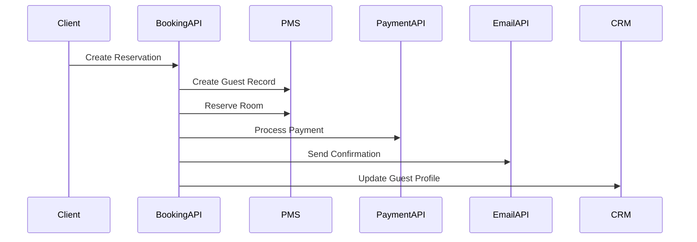

```markdown
# Designing Domain Patterns for Hospitality Applications: The "Hospitality Domain Pattern" Explained

*How hotels, resorts, and booking systems can leverage domain-driven design to create scalable, maintainable APIs*

---

## Introduction: Where Hospitality Meets Backend Engineering

Imagine you're building an API for a luxury resort chain. Your application needs to handle:
- **Dynamic pricing** based on seasonality, demand, and occupancy
- **Complex workflows** for reservation cancellations and modifications
- **Multi-lingual, multi-currency support** for global guests
- **Integration with third-party payment processors** with different success/failure states
- **Compliance requirements** like GDPR for guest data and local tax regulations

This is the reality of hospitality backend development. Unlike generic e-commerce or social media platforms, hospitality systems face unique challenges that demand architecture tailored to their specific domain needs.

**This is where the "Hospitality Domain Pattern" comes in**—a specialized application of Domain-Driven Design (DDD) principles specifically for the hospitality industry's domain complexity. This pattern helps you organize your codebase to better represent the real-world flow of reservations, customer interactions, and operational workflows that define the hospitality experience.

---

## The Problem: Why Standard Patterns Might Fail in Hospitality

Let's examine what happens when we apply traditional patterns without domain consideration:

### 1. The Reservation "God Object"

Here's a naive approach using a single `Reservation` entity that tries to handle everything:

```typescript
// ⚠️ The "God Object" approach - often seen in early-stage hospitality APIs
interface Reservation {
  id: string;
  roomId: string;
  guestCount: number;
  checkIn: Date;
  checkOut: Date;
  status: ReservationStatus; // CANCELLED, CHECKED_IN, etc.
  cancellationPolicy: CancellationPolicy;
  specialRequests: string[];
  payment: PaymentInfo;
  // ... 50+ more fields and methods
}

class ReservationService {
  async createReservation(data: Reservation) {
    // Validate business rules
    if (data.guestCount > room.getMaxOccupancy()) {
      throw new Error("Over capacity");
    }

    // Process payment
    const paymentResult = await paymentProcessor.charge(data.payment);

    // Update reservation status
    const reservation = await db.reservation.create({
      ...data,
      status: 'PAID',
      paymentReference: paymentResult.id
    });

    // Send confirmation email
    await emailService.send(reservation);

    return reservation;
  }
}
```

**Problems:**
- **Violation of Single Responsibility Principle**: The service tries to handle business logic, persistence, payments, and notifications.
- **Tight coupling**: Dependencies on DB, payment processors, and email services are exposed everywhere.
- **Poor testability**: Hard to mock all dependencies for unit testing.
- **Scalability issues**: Single massive class becomes a bottleneck for horizontal scaling.
- **Maintenance nightmare**: Changing one business rule (like cancellation policies) requires understanding the entire monolithic structure.

### 2. The Eventual Consistency Nightmare

In hospitality, several independent systems must stay "mostly in sync":



When something goes wrong:
- Payment fails but reservation is created
- Email is sent but payment was reverted
- Guest record exists but room is not reserved

This creates **inconsistent state** that's expensive to detect and recover from.

### 3. The Localization Quicksand

Hospitality systems need to handle:
- Multiple languages for UI
- Different date formats (DD/MM vs MM/DD)
- Local tax rates and regulations
- Currency conversions

Standard patterns often treat these as "configuration" rather than domain concerns:

```typescript
// ❌ Treating localization as afterthought
interface LocalizedText {
  en: string;
  fr: string;
  es: string;
}

// In your API:
app.get('/rooms/:id', (req, res) => {
  const room = getRoom(req.params.id);
  const localizedName = {
    en: room.name,
    fr: room.frenchName || room.name,
    es: room.spanishName || room.name
  };
  // ... serve the localized version
});
```

This leads to:
- Duplicate data (same property in 3 languages)
- Inconsistent translations
- Harder to maintain when adding new languages

---

## The Solution: Hospitality Domain Pattern Architecture

The Hospitality Domain Pattern applies DDD principles specifically for hospitality workflows:

1. **Separate bounded contexts** for core domains (Reservations, Pricing, Payments)
2. **Domain events** for internal communication
3. **Aggregate roots** for core entities (Reservation aggregates)
4. **Localization as first-class citizen** in the domain
5. **Idempotency** for external API calls
6. **State transition patterns** for workflows

Here's our refactored architecture:

```
┌───────────────────────────────────────────────────────┐
│                 API Gateway                           │
└───────────────┬───────────────┬───────────────────────┘
                │               │
┌───────────────▼───┐ ┌─────────▼───────────────────────┐
│ Reservation Domain │ │ Pricing Domain                │
│ ┌─────────────────┐ │ ┌─────────────────────────────┐ │
│ │ Reservation     │ │ │ SeasonalPricingCalculator │ │
│ │ Aggregate       │ │ │ DemandbasedPricing          │ │
│ └─────────────────┘ │ └─────────────────────────────┘ │
│ ┌─────────────────┐ │                                │
│ │ ReservationEvent│ │                                │
│ │ Publisher       │ │                                │
│ └─────────────────┘ │                                │
└─────────────────────┘ └───────────────────────────────┘
                │
┌───────────────▼───────────────────────────────────────┐
│ Payment Integration (Stripe, etc.)                     │
└───────────────────────────────────────────────────────┘
```

---

## Core Components of the Hospitality Domain Pattern

### 1. Reservation Aggregate Root

```typescript
// reservation/aggregate.ts
import { AggregateRoot } from '../domain/aggregate-root';
import { ReservationCreated } from './events';
import { RoomBookedEvent } from '../room/events';
import { PaymentSucceeded } from '../payment/events';
import { CancellationPolicy } from './value-objects';

export class Reservation extends AggregateRoot {
  constructor(
    private readonly roomId: string,
    private readonly guestCount: number,
    private readonly checkIn: Date,
    private readonly checkOut: Date,
    private readonly cancellationPolicy: CancellationPolicy,
    private readonly specialRequests: string[]
  ) {
    super();
    this.apply(new ReservationCreated(
      this.id,
      this.roomId,
      this.guestCount,
      this.checkIn,
      this.checkOut,
      this.cancellationPolicy,
      this.specialRequests
    ));
  }

  async bookRoom(roomRepository: RoomRepository) {
    const room = await roomRepository.find(this.roomId);
    if (room.isOccupied()) {
      this.apply(new RoomUnavailableError(this.id));
      return false;
    }

    await roomRepository.markAsBooked(this.roomId);
    this.apply(new RoomBookedEvent(this.id, this.roomId));
    return true;
  }

  async processPayment(
    paymentAmount: number,
    paymentProcessor: PaymentProcessor
  ): Promise<PaymentResult> {
    const result = await paymentProcessor.charge({
      amount: paymentAmount,
      reference: this.id,
      description: `Payment for reservation ${this.id}`
    });

    if (result.status === 'APPROVED') {
      this.apply(new PaymentSucceeded(this.id, result.id));
      return { success: true, paymentId: result.id };
    }

    this.apply(new PaymentFailed(this.id, result.error));
    return { success: false, error: result.error };
  }

  cancel(cancellationReason?: string) {
    if (this.cancellationPolicy.allowCancellation(this.status)) {
      this.apply(new ReservationCancelled(
        this.id,
        cancellationReason
      ));
      return true;
    }
    return false;
  }

  // Only expose what's needed to clients
  get clientData(): ClientReservationData {
    return {
      id: this.id,
      roomId: this.roomId,
      checkIn: this.checkIn,
      checkOut: this.checkOut,
      status: this.status,
      cancellationPolicy: this.cancellationPolicy,
      specialRequests: this.specialRequests
    };
  }
}
```

### 2. Cancellation Policy Value Object

```typescript
// reservation/value-objects.ts
export class CancellationPolicy {
  constructor(
    public fullRefundUntil: Date,
    public partialRefundUntil: Date,
    public noRefundAfter: Date,
    public feePercent: number
  ) {}

  allowCancellation(status: ReservationStatus): boolean {
    if (status === 'CANCELLED' || status === 'CHECKED_IN') {
      return false;
    }

    const now = new Date();
    if (now >= this.noRefundAfter) {
      return false;
    }

    if (now < this.fullRefundUntil) {
      return true;
    }

    if (now < this.partialRefundUntil) {
      return true;
    }

    return false;
  }

  calculateRefundAmount(originalAmount: number, status: ReservationStatus): number {
    if (status === 'CANCELLED') {
      return this.feePercent > 0
        ? originalAmount * (1 - this.feePercent/100)
        : originalAmount;
    }

    if (status === 'PARTIALLY_REFUNDED') {
      return originalAmount * (1 - this.feePercent/100);
    }

    return 0;
  }
}
```

### 3. Domain Events for Workflow Communication

```typescript
// reservation/events.ts
export abstract class ReservationEvent {
  constructor(
    public timestamp: Date,
    public aggregateId: string
  ) {}
}

export class ReservationCreated extends ReservationEvent {
  constructor(
    aggregateId: string,
    public roomId: string,
    public guestCount: number,
    public checkIn: Date,
    public checkOut: Date,
    public cancellationPolicy: CancellationPolicy,
    public specialRequests: string[]
  ) {
    super(new Date(), aggregateId);
  }
}

export class RoomBookedEvent extends ReservationEvent {
  constructor(
    aggregateId: string,
    public roomId: string
  ) {
    super(new Date(), aggregateId);
  }
}

export class PaymentSucceeded extends ReservationEvent {
  constructor(
    aggregateId: string,
    public paymentId: string
  ) {
    super(new Date(), aggregateId);
  }
}
```

### 4. Localization Pattern Implementation

```typescript
// localization/translations.ts
export type LanguageCode = 'en' | 'fr' | 'es' | 'de' | 'it' | 'zh';

export interface LocalizedString {
  value: string;
  language: LanguageCode;
}

export class TranslationRepository {
  private translations: Map<string, Map<LanguageCode, string>> = new Map();

  constructor(initialTranslations: Record<string, Record<LanguageCode, string>>) {
    for (const [key, values] of Object.entries(initialTranslations)) {
      const valueMap = new Map<LanguageCode, string>();
      for (const [lang, translation] of Object.entries(values)) {
        valueMap.set(lang as LanguageCode, translation);
      }
      this.translations.set(key, valueMap);
    }
  }

  get(key: string, language: LanguageCode): string {
    const translations = this.translations.get(key);
    if (!translations) {
      throw new Error(`Translation for key "${key}" not found`);
    }

    const translation = translations.get(language);
    if (!translation) {
      return key; // Fallback to key if no translation
    }

    return translation;
  }

  addTranslation(key: string, language: LanguageCode, value: string): void {
    let translations = this.translations.get(key);
    if (!translations) {
      translations = new Map();
      this.translations.set(key, translations);
    }
    translations.set(language, value);
  }
}

// Example usage with Reservation
class LocalizedReservation {
  constructor(private reservation: Reservation, private translations: TranslationRepository) {}

  get localizedDescription(language: LanguageCode): string {
    return [
      this.translations.get('reservation_id', language) + ': ' + this.reservation.id,
      this.translations.get('room_id', language) + ': ' + this.reservation.roomId,
      this.translations.get('check_in', language) + ': ' + this.formatDate(this.reservation.checkIn, language),
      this.translations.get('check_out', language) + ': ' + this.formatDate(this.reservation.checkOut, language)
    ].join('\n');
  }

  private formatDate(date: Date, language: LanguageCode): string {
    // Use date-fns or similar to format differently by language
    // ...
  }
}
```

### 5. API Layer with Idempotency

```typescript
// api/reservations.ts
import { Router } from 'express';
import { ReservationService } from '../domain/reservation-service';
import { validate } from '../validation';
import { createIdempotencyKey } from '../idempotency';

const router = Router();
const reservationService = new ReservationService();
const idempotencyStore = new MemoryIdempotencyStore();

router.post('/', async (req, res) => {
  try {
    const { idempotencyKey } = req.headers;
    const requestId = createIdempotencyKey(idempotencyKey);

    const existing = idempotencyStore.get(requestId);
    if (existing) {
      return res.status(304).end(); // Not Modified
    }

    const data = await validate(req.body, reservationSchema);
    const reservation = await reservationService.createReservation(data);

    idempotencyStore.set(requestId, {
      status: 'created',
      id: reservation.id
    });

    res.status(201).json(reservation.clientData);
  } catch (error) {
    res.status(400).json({ error: error.message });
  }
});

router.put('/:id/cancel', async (req, res) => {
  try {
    const { id } = req.params;
    const { idempotencyKey } = req.headers;
    const requestId = createIdempotencyKey(idempotencyKey);

    const existing = idempotencyStore.get(requestId);
    if (existing && existing.status === 'cancelled') {
      return res.status(304).end();
    }

    await reservationService.cancelReservation(id);

    idempotencyStore.set(requestId, {
      status: 'cancelled',
      id
    });

    res.status(200).json({ success: true });
  } catch (error) {
    res.status(400).json({ error: error.message });
  }
});

export default router;
```

---

## Implementation Guide: Step-by-Step

### Step 1: Define Your Bounded Contexts

Start by identifying the core domains in your hospitality application. Common ones include:

1. **Reservation Management**
2. **Pricing & Rate Plans**
3. **Payment Processing**
4. **Guest Management (CRM)**
5. **Housekeeping Operations**
6. **Maintenance & Facilities**
7. **Loyalty Programs**

Each context should have:
- Its own model definitions
- Its own domain language
- Clear boundaries with other contexts

### Step 2: Implement Aggregates for Core Entities

Focus first on your most complex aggregates:
1. **Reservation** (as shown above)
2. **Room** (with its capacity, type, amenities, etc.)
3. **PaymentTransaction** (for tracking payment flows)

Example `Room` aggregate:

```typescript
// room/aggregate.ts
import { AggregateRoot } from '../domain/aggregate-root';
import { RoomOccupiedEvent } from './events';

export class Room extends AggregateRoot {
  constructor(
    public readonly id: string,
    public readonly type: RoomType,
    public readonly floor: number,
    public readonly capacity: number,
    public readonly amenities: string[],
    public readonly basePrice: number,
    public readonly description: string,
    public readonly isAvailable: boolean = true
  ) {
    super();
  }

  markAsOccupied() {
    this.isAvailable = false;
    this.apply(new RoomOccupiedEvent(this.id));
  }

  release() {
    this.isAvailable = true;
  }
}
```

### Step 3: Create Domain Services

Services that don't belong to any aggregate should be domain services:

```typescript
// domain-services/pricing-service.ts
import { Season } from '../pricing/value-objects';

export class PricingService {
  constructor(
    private readonly ratePlans: RatePlanRepository,
    private readonly demandCalculator: DemandCalculator
  ) {}

  async calculateRoomRate(
    room: Room,
    checkIn: Date,
    checkOut: Date,
    guestCount: number,
    season: Season
  ): Promise<number> {
    // Get base rate plan for room type
    const ratePlan = await this.ratePlans.findByRoomType(room.type);

    // Calculate demand factor
    const demandFactor = await this.demandCalculator.calculate(
      room.id,
      checkIn,
      checkOut
    );

    // Apply seasonal adjustments
    const seasonalAdjustment = this.applySeasonalAdjustment(
      ratePlan.baseRate,
      season
    );

    // Apply occupancy limits
    const occupancyAdjustment = this.applyCapacityAdjustment(
      seasonalAdjustment,
      room.capacity,
      guestCount
    );

    // Apply demand-based pricing
    return this.applyDemandPricing(occupancyAdjustment, demandFactor);
  }

  private applySeasonalAdjustment(baseRate: number, season: Season): number {
    // Season-specific adjustments
    switch (season) {
      case 'peak':
        return baseRate * 1.5;
      case 'shoulder':
        return baseRate * 1.2;
      default:
        return baseRate;
    }
  }

  // ... other private methods
}
```

### Step 4: Design for Localization

1. Create a `Translation` entity that manages all localized strings
2. Use a specialized repository for translations
3