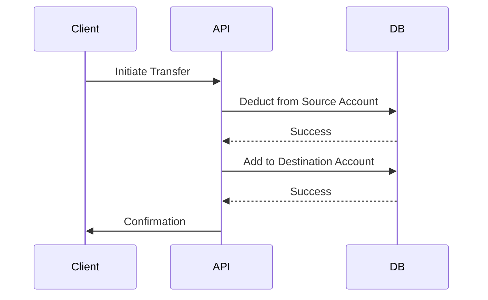
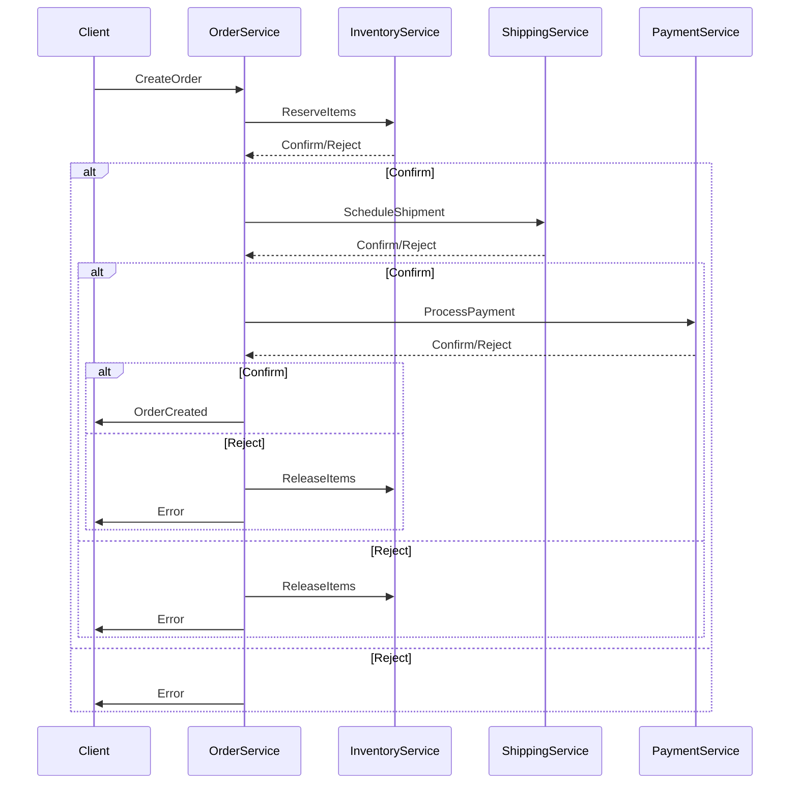

```markdown
---
title: "Durability Conventions: Ensuring Data Consistency Without the Headaches"
date: 2023-11-15
author: Jane Doe
tags: [database, patterns, api-design, durability, backend-engineering]
---

# Durability Conventions: Ensuring Data Consistency Without the Headaches

Every backend engineer has that moment: you push a feature to production, it looks great in staging, but then—*something* goes wrong. Perhaps your database gets corrupted after a crash, or your system loses transactions during a failure. These are the dark days of **durability issues**, where your application can't recover its state as expected.

Durability is the cornerstone of reliable systems. Without it, your data integrity is at risk, leading to lost transactions, inconsistent states, or even total system failure. But how do you ensure durability without over-engineering? How do you strike that delicate balance between safety and performance?

In this guide, we’ll explore the **Durability Conventions** pattern, a set of practical conventions and patterns for ensuring data consistency across distributed systems. This isn’t a "magic bullet"—it’s a collection of strategies, tradeoffs, and real-world lessons learned. By the end, you’ll have a clear roadmap for implementing durability in your systems, whether you're working with SQL databases, NoSQL, or distributed transactions.

---

## The Problem: When Durability Goes Wrong

Let’s start with a familiar scenario. You’re building a fintech application where users transfer money between accounts. Your system looks something like this:



### The Vulnerabilities
1. **Partial Updates**: If the system crashes between deducting and adding, the source account is debited, but the destination account is not credited—a classic [tombstone problem](https://en.wikipedia.org/wiki/Tombstone_(computer_science)).
2. **Race Conditions**: Concurrent operations might interfere, leading to inconsistent states (e.g., two transfers deducting from the same account before the second update).
3. **Network Failures**: A transient network error could leave the system in an inconsistent state.
4. **Retry Storms**: If your application retries failed transactions without coordination, you might end up with duplicate operations or infinite loops.

### The Consequences
- **Financial Loss**: Imagine a user loses money because their bank account was debited but never credited.
- **Reputation Damage**: Users lose trust in your system if it behaves unpredictably.
- **Operational Overhead**: Debugging and recovering from inconsistent states consumes dev time and resources.

Without deliberate patterns for durability, these issues are inevitable. The Durability Conventions pattern is designed to address exactly these challenges.

---

## The Solution: Durability Conventions

**Durability Conventions** are not a single technology but a collection of design principles and patterns to ensure that:
1. Changes to data persist reliably.
2. The system can recover from failures gracefully.
3. Transactions are either fully applied or not applied at all.
4. Concurrency is handled predictably.

These conventions are rooted in **transactional integrity**, **atomicity**, and **consistency**, but they go beyond just using `BEGIN/COMMIT` in SQL. They include:
- **Idempotency**: Ensuring operations can be safely retried.
- **Saga Pattern**: For long-running transactions across services.
- **Event Sourcing**: For auditing and recovery.
- **Transactional Outbox**: For reliable event publishing.
- **Optimistic Locking**: For concurrency control.

Together, these conventions provide a framework for building durable systems. Let’s dive into the key components.

---

## Components/Solutions: Building Blocks of Durability

### 1. **Atomic Transactions (ACID)**
For simple, local operations, **ACID-compliant transactions** are the gold standard. Here’s how they work in practice:

#### Example: SQL Transaction with Retry Logic
```python
import sqlite3
from tenacity import retry, stop_after_attempt, wait_exponential

@retry(stop=stop_after_attempt(3), wait=wait_exponential(multiplier=1, min=4, max=10))
def transfer_money(source_account_id, dest_account_id, amount):
    conn = sqlite3.connect("bank.db")
    try:
        cursor = conn.cursor()
        cursor.execute("BEGIN TRANSACTION")

        # Deduct from source
        cursor.execute(
            "UPDATE accounts SET balance = balance - ? WHERE id = ?",
            (amount, source_account_id)
        )

        # Add to destination
        cursor.execute(
            "UPDATE accounts SET balance = balance + ? WHERE id = ?",
            (amount, dest_account_id)
        )

        conn.commit()
    except Exception as e:
        conn.rollback()
        raise e
    finally:
        conn.close()
```

**Tradeoffs**:
- ✅ **Strong consistency**: All changes succeed or fail together.
- ❌ **Performance overhead**: Long-running transactions can block resources.
- ❌ **Limited scope**: Only works within a single database.

### 2. **Idempotency Keys**
Idempotency ensures that retrying the same operation with the same input produces the same result. This is critical for:
- Retry mechanisms (e.g., after network failures).
- External APIs (e.g., payment processing).

#### Example: Idempotency in an API
```python
# FastAPI Example
from fastapi import FastAPI, HTTPException
from pydantic import BaseModel
import hashlib

app = FastAPI()

class TransferRequest(BaseModel):
    source: str
    dest: str
    amount: float
    idempotency_key: str  # Unique key for the request

# In-memory cache for idempotency (replace with Redis in production)
idempotency_cache = {}

@app.post("/transfer")
def transfer(request: TransferRequest):
    # Generate a hash of the request (excluding idempotency_key for uniqueness)
    request_hash = hashlib.md5(
        f"{request.source}{request.dest}{request.amount}".encode()
    ).hexdigest()

    if request_hash in idempotency_cache:
        return {"status": "already_processed"}

    # Process the transfer (simplified)
    if not process_transfer(request.source, request.dest, request.amount):
        raise HTTPException(status_code=500, detail="Transfer failed")

    idempotency_cache[request_hash] = True
    return {"status": "success"}
```

**Tradeoffs**:
- ✅ **Retry safety**: Avoids duplicate operations.
- ❌ **Storage overhead**: Requires tracking keys (use distributed cache like Redis for scale).
- ❌ **Complexity**: Need to design keys carefully to avoid collisions.

### 3. **Saga Pattern**
For distributed transactions (e.g., across microservices), **Saga** pattern breaks the transaction into a sequence of local transactions with compensating actions.

#### Example: Saga for Order Processing


**Implementation with Python (Pseudocode)**:
```python
from typing import Callable, Optional

def saga_step(step_func: Callable, compensating_func: Callable) -> Optional[Exception]:
    try:
        step_func()
        return None
    except Exception as e:
        compensating_func()
        raise e

def create_order_saga(order: Order):
    def reserve_items():
        inventory.reserve(order.items)

    def release_items():
        inventory.release(order.items)

    def schedule_shipment():
        shipping.schedule(order)

    def cancel_shipment():
        shipping.cancel(order)

    def process_payment():
        payment.charge(order.total)

    def refund_payment():
        payment.refund(order.total)

    # Execute saga steps
    saga_step(reserve_items, release_items)
    saga_step(schedule_shipment, cancel_shipment)
    saga_step(process_payment, refund_payment)
```

**Tradeoffs**:
- ✅ **Flexibility**: Works across services.
- ❌ **Complexity**: Harder to debug and manage.
- ❌ **Eventual consistency**: Steps may execute out of order.

### 4. **Event Sourcing**
Event Sourcing stores state changes as a sequence of immutable events. This is useful for:
- Auditing.
- Replaying state from scratch.
- Handling failures by reprocessing events.

#### Example: Event Sourcing with PostgreSQL
```sql
-- Schema for events
CREATE TABLE events (
    id SERIAL PRIMARY KEY,
    event_type VARCHAR(50) NOT NULL,
    payload JSONB NOT NULL,
    occurred_at TIMESTAMP NOT NULL DEFAULT NOW(),
    aggregate_id VARCHAR(100) NOT NULL
);

-- Schema for state projection
CREATE TABLE account_balance (
    account_id VARCHAR(100) PRIMARY KEY,
    balance DECIMAL(10, 2) NOT NULL
);

-- Function to project state from events
CREATE OR REPLACE FUNCTION project_account_balance() RETURNS TRIGGER AS $$
BEGIN
    -- Clear current balance (simplified; use a versioned table in production)
    DELETE FROM account_balance WHERE account_id = NEW.aggregate_id;

    -- Replay events for this account
    INSERT INTO account_balance (account_id, balance)
    SELECT NEW.aggregate_id, SUM(
        CASE
            WHEN NEW.event_type = 'Deposit' THEN NEW.payload.amount
            WHEN NEW.event_type = 'Withdrawal' THEN -NEW.payload.amount
            ELSE 0
        END
    )
    FROM events
    WHERE aggregate_id = NEW.aggregate_id
    AND occurred_at <= NEW.occurred_at;

    RETURN NEW;
END;
$$ LANGUAGE plpgsql;

-- Create trigger for event insertion
CREATE TRIGGER after_event_insert
AFTER INSERT ON events
FOR EACH ROW EXECUTE FUNCTION project_account_balance();
```

**Tradeoffs**:
- ✅ **Auditability**: Full history of changes.
- ✅ **Recovery**: Can replay events to rebuild state.
- ❌ **Storage bloat**: Events accumulate over time.
- ❌ **Complexity**: Requires event processing logic.

### 5. **Transactional Outbox**
For reliable event publishing (e.g., sending notifications after a transaction), use an **outbox pattern**:
1. Write events to a local table.
2. Use a background worker to publish them asynchronously.
3. Mark events as processed only after successful publishing.

#### Example: Transactional Outbox in PostgreSQL
```sql
-- Outbox table
CREATE TABLE event_outbox (
    id SERIAL PRIMARY KEY,
    event_type VARCHAR(50) NOT NULL,
    payload JSONB NOT NULL,
    created_at TIMESTAMP NOT NULL DEFAULT NOW(),
    processed_at TIMESTAMP,
    status VARCHAR(20) DEFAULT 'pending' CHECK (status IN ('pending', 'processed', 'failed'))
);

-- Trigger to write to outbox when a transaction commits
CREATE OR REPLACE FUNCTION log_outbox_event() RETURNS TRIGGER AS $$
BEGIN
    INSERT INTO event_outbox (event_type, payload)
    VALUES (NEW.event_type, NEW.payload::JSONB);
    RETURN NEW;
END;
$$ LANGUAGE plpgsql;

-- Create trigger for successful transactions
CREATE TRIGGER after_transaction_commit
AFTER COMMIT ON transactions
FOR EACH ROW EXECUTE FUNCTION log_outbox_event();
```

**Background Worker (Python)**:
```python
import time
from psycopg2 import pool

pg_pool = pool.ThreadedConnectionPool(minconn=1, maxconn=5, dbname="your_db")

def publish_events():
    conn = pg_pool.getconn()
    try:
        with conn.cursor() as cur:
            cur.execute("""
                UPDATE event_outbox
                SET processed_at = NOW(), status = 'processed'
                WHERE status = 'pending'
                RETURNING *
            """)
            for event in cur.fetchall():
                # Publish event (e.g., to Kafka, RabbitMQ, etc.)
                publish_to_kafka(event['event_type'], event['payload'])
    except Exception as e:
        # Handle failure (e.g., mark as failed and retry later)
        print(f"Failed to process event: {e}")
    finally:
        conn.close()

while True:
    publish_events()
    time.sleep(5)  # Polling interval
```

**Tradeoffs**:
- ✅ **Reliability**: Events are not lost even if the system crashes.
- ✅ **Decoupling**: Async publishing doesn’t block transactions.
- ❌ **Latency**: Events may be delayed.
- ❌ **Complexity**: Requires monitoring and retry logic.

### 6. **Optimistic Locking**
For high-concurrency scenarios, **optimistic locking** assumes conflicts are rare and handles them at commit time.

#### Example: Optimistic Locking in SQL
```sql
-- Account table with version column
CREATE TABLE accounts (
    id VARCHAR(100) PRIMARY KEY,
    balance DECIMAL(10, 2) NOT NULL,
    version INTEGER NOT NULL DEFAULT 0
);

-- Update with optimistic lock
UPDATE accounts
SET balance = balance - 100,
    version = version + 1
WHERE id = 'account123'
AND version = 3  -- Check current version
RETURNING version;
```

**Tradeoffs**:
- ✅ **Scalability**: Reduces locking overhead.
- ❌ **Conflict handling**: Requires retry logic for failed updates.
- ❌ **Stale reads**: May cause unnecessary retries.

---

## Implementation Guide: Putting It All Together

Here’s a step-by-step guide to implementing Durability Conventions in a real-world scenario:

### 1. **Start with ACID Transactions**
For simple, local operations:
- Use `BEGIN/COMMIT/ROLLBACK` for all write operations.
- Retry failed transactions with exponential backoff.

### 2. **Add Idempotency**
- Generate idempotency keys for external requests.
- Cache processed requests to avoid duplicates.

### 3. **Design for Failure**
- Use **circuit breakers** (e.g., Hystrix) to prevent cascading failures.
- Implement **dead letter queues** for failed events.

### 4. **Choose the Right Pattern**
| Scenario                     | Recommended Pattern               |
|------------------------------|-----------------------------------|
| Single-service transactions  | ACID + Retries                    |
| Distributed transactions     | Saga Pattern                      |
| Event-driven workflows       | Event Sourcing + Outbox           |
| High-concurrency writes      | Optimistic Locking + Retries      |

### 5. **Monitor and Audit**
- Log all durability-critical operations.
- Set up alerts for failed transactions or events.
- Regularly audit event logs and transaction histories.

---

## Common Mistakes to Avoid

1. **Assuming ACID is Enough**:
   - ACID works for single-database operations, but not for distributed systems. Don’t assume it solves all problems.

2. **Ignoring Idempotency**:
   - Without idempotency, retries can lead to duplicate operations, which is especially dangerous for payments or inventory.

3. **Keeping Long-Running Transactions**:
   - Long transactions block resources and increase the risk of crashes. Keep them short and use compensating transactions for long workflows.

4. **Not Testing Failure Scenarios**:
   - Always test how your system recovers from:
     - Database crashes.
     - Network partitions.
     - Service failures.
   Use tools like Chaos Monkey to simulate failures.

5. **Overcomplicating with Event Sourcing**:
   - Event Sourcing is great for auditing and recovery, but it’s not free. Avoid it unless you need the full history or replayability.

6. **Forgetting About Concurrency**:
   - Always account for concurrent operations. Use optimistic locking, pessimistic locks, or Saga patterns to handle conflicts.

7. **Skipping the Outbox Pattern**:
   - If you rely on async events (e.g., notifications), always use an outbox to ensure events are not lost on crashes.

---

## Key Takeaways

- **Durability is a combination of patterns**, not a single solution. Choose the right tools for your scenario.
- **ACID is your friend for local transactions**, but don’t rely on it alone for distributed systems.
- **Idempotency is non-negotiable** for retryable operations.
- **Sagas and Event Sourcing** are powerful for distributed workflows but come with complexity.
- **Always design for failure**. Assume your system will crash, and plan for recovery.
- **Monitor everything**. Durability issues often go unnoticed until they cause outages.
- **Tradeoffs are inevitable**. Balance consistency, availability, and partition tolerance (CAP Theorem) carefully.

---

## Conclusion

Durability is not an afterthought—it’s the foundation of reliable systems. The **Durability Conventions** pattern provides a toolkit for ensuring your data remains consistent even in the face of failures, network issues, or retries.

Start by applying the simplest conventions (ACID + idempotency) to your local operations. As your system grows, introduce patterns like Sagas or Event Sourcing for distributed workflows. Always test failure scenarios, and don’t forget to monitor your durability mechanisms.

In the end, the goal isn’t to build a system that never fails—but to build one that recovers gracefully when it does. That’s the true hallmark of a robust backend.

**Further Reading**:
- [Saga Pattern: Transaction Management in Microservices](https://microservices.io/patterns/data/saga.html)
- [Event Sourcing](https://martinfowler.com/eaaDev/EventSourcing.html)
- [CAP Theorem](https://en.wikipedia.org/wiki/CAP_theorem)
- [Tenacity Retry Library](https://tenacity.readthedocs.io/en/latest/) (for robust retry logic)

Happy coding, and may your transactions always commit successfully!
```