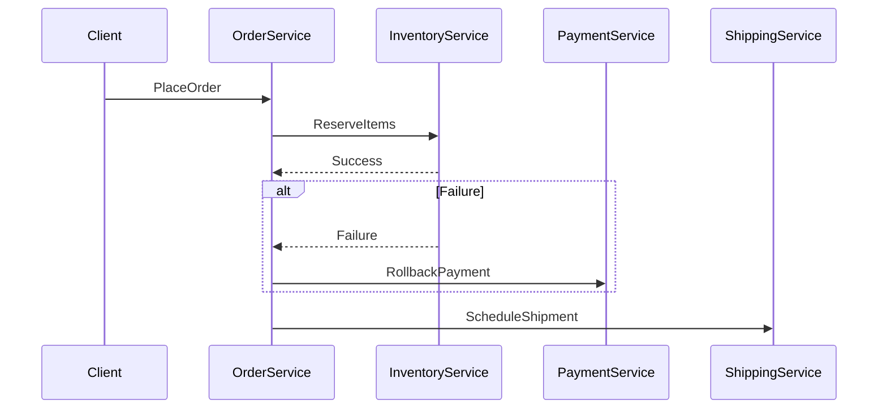

```markdown
---
title: "Durability Integration: Building APIs That Last Through Storms"
date: 2024-06-15
author: "Alex Carter"
description: "A guide to integrating database durability into your API design, with real-world code examples and tradeoff considerations."
tags: ["database design", "api patterns", "durability", "backend engineering"]
---

# Durability Integration: Building APIs That Last Through Storms


*Even the calmest seas can turn stormy. Learn how to make your APIs weather-proof with proper durability integration.*

---

## Introduction

Imagine this: your application is live, traffic spikes unexpectedly, and your database starts receiving thousands of writes per second. After an hour, you notice transactions are failing intermittently with timeouts. Then, after a system update, you see that *some* data got lost—critical orders, user payments, or inventory updates that should never disappear. Welcome to the world of **durability challenges** in real-world applications.

Durability—the guarantee that data persists even after system failures—isn’t just an academic concept. It’s the difference between a mission-critical system and a fragile one. Yet, many APIs today are built with durability as an afterthought, leading to lost revenue, frustrated users, and technical debt that accumulates silently. This guide will equip you with practical knowledge to integrate durability into your API design *proactively*, not reactively.

By the end of this post, you’ll understand:
- Why durability isn’t just about the database (and how APIs complicate things)
- How to structure your system to guarantee data persistence
- Code-level patterns for retrying, transaction management, and event handling
- Common pitfalls and how to avoid them

Let’s begin.

---

## The Problem: When Durability Fails to Behave

Durability is the **5th ACID property**—your data *must* survive crashes, network issues, and server reboots. But in APIs, things get messy because:

1. **Distributed Systems Are Unreliable**
   Distributed systems fail in ways that monolithic ones don’t. A single node crash or network partition can disrupt data consistency. This is what **CAP Theorem** tells us: you can’t have all three of consistency, availability, and partition tolerance simultaneously. APIs, by their nature, are distributed—they span services, databases, and potentially multiple data centers.

2. **Retry Logic Breaks Things**
   If you don’t handle retries carefully, you risk:
   - Duplicate transactions (e.g., processing the same payment twice)
   - Lost transactions (e.g., a retry happens after the event was already processed)
   - Deadlocks or cascading failures

3. **Eventual Consistency Can Become a Black Hole**
   Many modern systems use eventual consistency (e.g., Kafka, Redis streams). While this improves scalability, you risk losing data if the system doesn’t properly back up or retry failed events.

4. **APIs Are Stateless by Default**
   Statelessness is a good thing for scalability, but it means your API layer doesn’t retain information about failures. If a request fails halfway, you might not recover automatically.

### Real-World Example: The $1M Order Fiasco
A mid-sized e-commerce company deployed a new API to process orders. Traffic surged during a holiday sale, and the database started timing out on writes. The developers added retries, but because the code wasn’t structured to handle transient failures, some orders were processed twice. The business detected only a subset of duplicates—others were lost entirely. The result? A $1M chargeback from a customer, and a week of debugging.

---

## The Solution: Building Durable APIs

The key to durability lies in **defensively programming** your API layer and database interactions. Here’s the foundation:

### 1. **Embrace Explicit Durability Guarantees**
   - Use databases with strong consistency (e.g., PostgreSQL, MySQL) for critical data.
   - For event-driven systems, combine strong consistency with idempotency keys.

### 2. **Structure Data Flow for Recovery**
   - Avoid direct writes to the database from APIs. Use **command queues** or **sagas** to manage operations.
   - Implement **retries with dead-letter queues** for failed operations.

### 3. **Leverage Database-Specific Patterns**
   - Use transactions for groups of related operations.
   - Implement **snapshotting** or **micro-batching** to batch writes and reduce failures.

### 4. **Design for Failure**
   - Assume the system will crash. Implement **fast failover** and **checkpointing**.
   - Use **circuit breakers** to prevent cascading failures.

---

## Components/Solutions

### Durability Layer 1: Database Transactions
**Use Case:** Strong consistency guarantees for critical operations.
**Tradeoff:** Performance overhead, but essential for financial or inventory systems.

#### Example: Bank Transfer with Transactions
```sql
-- PostgreSQL example
BEGIN;
UPDATE accounts SET balance = balance - 100 WHERE id = 'sender_account';
UPDATE accounts SET balance = balance + 100 WHERE id = 'receiver_account';
DELETE FROM transfer_logs WHERE id = (SELECT MAX(id));
COMMIT;
```
If the transaction fails halfway, PostgreSQL rolls it back automatically.

#### Key Considerations:
- Keep transactions short to avoid locks.
- Use **optimistic concurrency control** (e.g., `SELECT ... FOR UPDATE`) for high contention.

---

### Durability Layer 2: Idempotency Keys
**Use Case:** Prevent duplicate processing of API requests.
**Tradeoff:** Adds complexity to your API design.

#### Example: Idempotent Order Creation
```go
// Go pseudocode
func CreateOrder(ctx context.Context, order OrderRequest) (OrderResponse, error) {
    // Generate a unique idempotency key
    idempotencyKey := generateIdempotencyKey(order)

    // Try to insert or update using the key
    existingOrder, err := db.Query(
        `INSERT INTO orders (idempotency_key, ...)
         VALUES ($1, ...)
         ON CONFLICT (idempotency_key) DO UPDATE
         SET status='duplicate', updated_at=NOW()
         RETURNING *`,
        idempotencyKey,
    )
    if err != nil {
        return OrderResponse{}, err
    }

    return orderToResponse(existingOrder), nil
}
```
- **Why this works:** If the same request is retried, the database either processes it again or ignores it (with a status update).

---

### Durability Layer 3: Saga Pattern
**Use Case:** Distributed transactions across services.
**Tradeoff:** More complex to implement; requires event sourcing or compensating transactions.

#### Example: Shipping Saga


#### Implementation:
```python
# Pseudocode for a saga orchestrator
async def place_order(order):
    try:
        # Step 1: Reserve items
        inventory_reservation = await inventory.reserve(order.items)
        if not inventory_reservation.success:
            raise InventoryError("Reservation failed")

        # Step 2: Process payment
        payment_success = await payment.process(order.total)
        if not payment_success:
            await inventory.release(order.items)  # Compensating transaction
            raise PaymentError("Payment failed")

        # Step 3: Schedule shipping
        await shipping.schedule(order)
    except Exception as e:
        # Log and notify
        pass
```

---

### Durability Layer 4: Event Sourcing with Dead Letter Queues
**Use Case:** Handling failed events in event-driven systems.
**Tradeoff:** Requires Kafka/RabbitMQ + monitoring.

#### Example: Kafka Dead-Letter Queue (DLQ)
```python
# Python pseudocode
def process_order_event(event: OrderEvent):
    try:
        result = db.process_event(event)
        if not result.success:
            dlq = DeadLetterQueue(event.topic, event.key)
            dlq.append(event, result.error)
            raise ProcessingError("Event failed")
    except Exception as e:
        logger.error(f"Failed to process event: {e}")
```

---

## Implementation Guide

### Step 1: Audit Your API’s Durability Needs
- Identify **critical operations** (e.g., payments, inventory changes).
- Decide whether you need **strong consistency** (transactions, idempotency) or **eventual consistency** (event sourcing).

### Step 2: Add Idempotency Keys to All Write APIs
- Use UUIDs or hashes of request data as keys.
- Add a `Retry-After` header to API responses if retries are needed.

#### API Example (OpenAPI/Swagger):
```yaml
paths:
  /orders:
    post:
      summary: Create an order (idempotent)
      requestBody:
        content:
          application/json:
            schema:
              $ref: '#/components/schemas/OrderRequest'
      responses:
        '201':
          description: Order created
          headers:
            Idempotency-Key:
              schema:
                type: string
              description: "Key for retries"
```

### Step 3: Implement Retry Logic with Backoffs
- Use exponential backoff to avoid overwhelming systems.
- Track failed retries to prevent infinite loops.

#### Example: Retry with Backoff
```typescript
// Node.js example
const retry = async (fn: Function, maxAttempts = 5, delay = 100) => {
    let attempt = 0;
    let lastError;

    while (attempt < maxAttempts) {
        try {
            return await fn();
        } catch (error) {
            lastError = error;
            attempt++;
            if (attempt < maxAttempts) {
                await new Promise(resolve => setTimeout(resolve, delay * Math.pow(2, attempt)));
            }
        }
    }
    throw lastError;
};

// Usage with a database write
await retry(async () => {
    await db.execute("UPDATE accounts SET balance = balance - 100 WHERE id = $1", [userId]);
});
```

### Step 4: Add Monitoring for Durability Failures
- Track:
  - Failed transactions
  - Duplicate events
  - Dead-letter queue size
- Use tools like Prometheus + Grafana or Datadog.

#### Example Alert Rule:
```yaml
# Prometheus alert for failed transactions
- alert: HighTransactionFailures
  expr: rate(db_transaction_failures_total[5m]) > 10
  for: 5m
  labels:
    severity: critical
  annotations:
    summary: "High transaction failures: {{ $value }} failures per minute"
```

---

## Common Mistakes to Avoid

1. **Assuming Retries Fix Everything**
   - Retries *can* work, but they must be combined with idempotency keys. Otherwise, you risk duplicate processing.

2. **Ignoring Database Timeout Limits**
   - Many databases (e.g., PostgreSQL) have configurable timeouts. Set them high enough for your workload but not so high that they hold up your entire system.

3. **No Dead-Letter Queues for Events**
   - Without a DLQ, failed events vanish into oblivion. Always log or store them for later analysis.

4. **Overusing Transactions**
   - Long-running transactions lock rows and slow down performance. Keep them short and focused.

5. **Not Testing Failure Scenarios**
   - Kill your database mid-transaction. Simulate network partitions. Ensure your application recovers gracefully.

---

## Key Takeaways

- **Durability is not just a database concern—it’s an API design problem.** Your API layer must handle retries, idempotency, and failures explicitly.
- **Idempotency keys are your best friend.** Use them for all write operations.
- **Transactions are great, but keep them short.** Long transactions hurt performance.
- **Failures will happen. Plan for them.** Retries, DLQs, and monitoring are non-negotiable.
- **Tradeoffs exist.** Strong consistency is slower; eventual consistency is scalable but riskier. Choose wisely.

---

## Conclusion

Durability integration is the difference between a robust API and one that crumbles under pressure. By adopting patterns like idempotency, sagas, and dead-letter queues, you can build systems that survive crashes, network issues, and even human errors.

Remember: **There’s no silver bullet.** Durability is a spectrum, and your choices depend on your tradeoffs. Whether you’re processing payments, managing inventory, or handling user data, treat durability as a first-class citizen in your API design.

Start small—add idempotency keys to your critical APIs. Then layer in retries and monitoring. Over time, you’ll build a system that’s as durable as the stormiest sea.

Now go forth and make your APIs weatherproof.

---
```