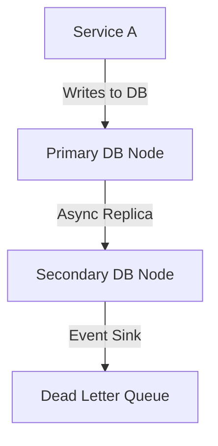

```markdown
# **Durability Optimization: How to Build Fault-Tolerant Systems That Survive Anything**

You’ve spent hours fine-tuning your API response times, caching aggressively, and optimizing your database queries. But what happens when disaster strikes—when a network glitch corrupes your writes, a database node fails, or a region goes dark?

**Durability—making sure your data persists reliably—isn’t just a checkbox.** Without proper optimization, even the most performant systems can collapse under the weight of their own fragility. And in a world where uptime isn’t optional, durability isn’t just good practice; it’s **your last line of defense**.

In this deep dive, we’ll explore the **Durability Optimization** pattern—a practical approach to ensuring your data survives crashes, hardware failures, and human errors. We’ll cover the tradeoffs, real-world strategies, and code-level implementations so you can build systems that **stay alive** when it matters most.

---

## **The Problem: Why Durability is Broken by Default**

Most systems assume durability is handled by ACID transactions and crash recovery—but that’s just the baseline. The real-world challenges are far more insidious:

### **1. The "Optimized for Speed, Not Survival" Trap**
Many databases (and ORMs) prioritize performance over durability. Example:
```sql
-- A "fast" write that leaves no trace if the server dies mid-transaction
INSERT INTO orders (user_id, amount) VALUES (123, 99.99);
```
If the server crashes after `INSERT` but before `COMMIT`, your data is **gone forever**. Worse, some systems (like NoSQL) **trade durability for performance**, sacrificing persistence for milliseconds of latency.

### **2. The Illusion of "Automatic" Crash Recovery**
Relational databases like PostgreSQL *do* have WAL (Write-Ahead Logs), but:
- **WALs aren’t infinite.** They fill up, and recovery times can explode under load.
- **Partial failures still happen.** A `CRASH` signal might corrupt a partial transaction.
- **Human error isn’t accounted for.** Someone deleting a critical table? Your WAL won’t help.

### **3. The "Single-Writer" Assumption Fails in Distributed Systems**
In monolithic apps, durability is simple: save to disk, done. But in microservices or multi-region setups:

If `B` fails **before** replicating to `C`, or if `C` is slow to consume, you’ve lost **durability at scale**.

### **4. The "We’ll Fix It Later" Mindset**
Too many teams treat durability as an afterthought:
- "We’ll add backups tomorrow."
- "The cloud will handle it."
- "Our users can recreate data if needed."

**Problem:** Users don’t care about "recreating" lost sales, canceled subscriptions, or critical transaction logs.

---
## **The Solution: Durability Optimization Patterns**

Durability isn’t just about "making it work"—it’s about **building resilience into every layer**. Here’s how we tackle it:

### **1. The Durability Stack (From Data to Cloud)**
| Layer          | Optimization Strategy                          | Example Tools/Techniques               |
|----------------|-----------------------------------------------|----------------------------------------|
| **Application** | Idempotent writes, retries, circuit breakers | Saga pattern, Dedupe IDs, Exponential backoff |
| **Database**    | WAL tuning, replication lag monitoring        | PostgreSQL `fsync` settings, Binlog sync |
| **Storage**     | Tiered storage, checksum validation           | S3 Object Lock, EBS snapshots         |
| **Infrastructure** | Multi-region replication, chaos testing   | Kubernetes `PodDisruptionBudget`, Terraform DR plan |

### **2. Core Principles**
1. **Assume failure.** Design for **crashes, network splits, and data corruption**.
2. **Make writes explicit.** Never rely on "implicit" durability (e.g., `INSERT` without a transaction).
3. **Decouple persistence from execution.** Use event sourcing or append-only logs.
4. **Validate integrity.** Checksums, CRC, and proof-of-replication are your friends.

---

## **Implementation Guide: Durability in Code**

Let’s look at **three critical durability optimizations** with real-world examples.

---

### **1. Idempotent Writes: Handle Retries Without Duplicates**
**Problem:** If a write fails mid-transaction, retries can create duplicates.
**Solution:** Use **idempotency keys** (unique tokens per request).

#### **Example: Idempotent Payment Processing (Node.js + PostgreSQL)**
```javascript
// 1. Generate a unique idempotency key
const idempotencyKey = require('crypto').randomBytes(16).toString('hex');

// 2. Store the request in a lock table before processing
await pool.query(`
  INSERT INTO idempotency_locks (key, request_data)
  VALUES ($1, $2)
  ON CONFLICT (key) DO NOTHING
`, [idempotencyKey, JSON.stringify({ user: 123, amount: 99.99 })]);
```
**Key Durability Checks:**
- **Race condition protection:** `ON CONFLICT` prevents duplicate processing.
- **Expiration:** Drop old locks after 24h to avoid memory bloat.
- **Retry safety:** If the `INSERT` fails, the system **ignores** retries.

---

### **2. Two-Phase Commit (2PC) for Distributed Transactions**
**Problem:** A single database can’t guarantee durability if it’s part of a distributed flow (e.g., order → payment → inventory).
**Solution:** Use **2PC** (though modern alternatives like **Saga Pattern** are often better).

#### **Example: Order Processing with 2PC (PostgreSQL)**
```sql
-- Phase 1: Pre-commit check
BEGIN;
-- Check inventory (optimistic lock)
SELECT UPDATE inventory SET stock = stock - 1 WHERE id = 123 FOR UPDATE;
-- Check payment (simulate async)
INSERT INTO pending_payments (user_id, amount) VALUES (123, 99.99);
-- Pre-commit to a log table
INSERT INTO transaction_logs (op, status) VALUES ('order_reserve', 'prepared');
COMMIT;
```
**Durability Optimizations:**
- **WAL synchronization:** Ensure `fsync` waits for disk writes:
  ```sql
  -- PostgreSQL config (postgresql.conf)
  fsync = on
  synchronous_commit = on
  ```
- **Atomicity:** If any step fails, roll back **all** changes.
- **Recovery:** Use `transaction_logs` to replay failed 2PCs.

**Warning:** 2PC **blocks** participants during commits. For high throughput, prefer **Saga Pattern** (see below).

---

### **3. Event Sourcing + Append-Only Logs**
**Problem:** Traditional databases lose **audit trails** if they corrupt.
**Solution:** Treat your database as **immutable**—append only, never update.

#### **Example: Event Sourcing for User Activity (Python + Kafka)**
```python
# 1. Append to a Kafka topic (durable by default)
producer = KafkaProducer(bootstrap_servers='kafka:9092')
producer.send('user_activity', json.dumps({
    'event': 'login',
    'user_id': 123,
    'timestamp': datetime.utcnow().isoformat()
}).encode('utf-8'))

# 2. Replay from log on recovery
def replay_logs(topic):
    consumer = KafkaConsumer(topic, bootstrap_servers='kafka:9092')
    for message in consumer:
        event = json.loads(message.value)
        if event['event'] == 'login':
            update_user_last_login(event['user_id'], event['timestamp'])
```
**Durability Guarantees:**
- **Kafka’s `min.insync.replicas=2`** ensures writes survive broker failures.
- **No in-memory state**—replay logs to rebuild the "current state."
- **Backwards compatibility:** New systems can read old events.

**Tradeoff:** Higher storage costs (but worth it for **regulatory compliance**).

---

### **4. Database-Level Optimizations**
#### **A. WAL Tuning (PostgreSQL)**
```sql
-- Enable crash safety (but slower writes)
ALTER SYSTEM SET wal_level = replica;

-- Force fsync for critical transactions
SET synchronous_commit = on;
```
**Why?**
- `wal_level = replica` ensures full transaction logs (even for `INSERT`).
- `fsync` prevents crashes from corrupting half-written WAL entries.

#### **B. Replication Lag Monitoring**
```sql
-- Check replication delay (PostgreSQL)
SELECT
  pg_is_in_recovery() AS is_replica,
  pg_stat_replication.sent_lsn - pg_stat_replication.replay_lsn AS lag_bytes
FROM pg_stat_replication;
```
**Action:** If `lag_bytes > 1GB`, **pause writes** to avoid losing data.

---

## **Common Mistakes to Avoid**

| Mistake                          | Why It’s Bad                     | Fix                          |
|----------------------------------|----------------------------------|------------------------------|
| **Not using transactions**       | Partial writes survive crashes.  | Always wrap writes in `BEGIN/COMMIT`. |
| **Assuming `auto-commit` is safe** | Even `auto-commit` can fail mid-execution. | Use explicit transactions. |
| **Ignoring WAL corruption**       | PostgreSQL WAL can corrupt if `fsync` is misconfigured. | Test with `CRASH` signals. |
| **No idempotency keys**          | Retries create duplicates.       | Add unique IDs to every write. |
| **Over-relying on cloud tiers**  | S3/IaaS can have outages.       | Use **multi-region replication**. |
| **Skipping checksum validation** | Silent data corruption goes undetected. | Implement CRC32 for critical data. |

---

## **Key Takeaways: Durability Checklist**

✅ **At the application layer:**
- Use **idempotency keys** for retries.
- Implement **circuit breakers** for failed writes.
- Log **all critical writes** in an append-only format.

✅ **At the database layer:**
- Enable **WAL** (`wal_level = replica` in PostgreSQL).
- Tune **fsync** for crash safety.
- Monitor **replication lag** and pause writes if critical.

✅ **At the storage layer:**
- Use **multi-region replication** (not just local backups).
- Enable **immutable storage** (e.g., S3 Object Lock).
- **Validate data integrity** with checksums.

✅ **For distributed systems:**
- Prefer **Saga Pattern** over 2PC (if possible).
- Design for **partial failures** (e.g., "what if Kafka is down?").

✅ **Testing durability:**
- Run **chaos experiments** (kill DB nodes, network partitions).
- Test **WAL recovery** after crashes.
- Audit **data corruption** scenarios.

---

## **Conclusion: Durability Isn’t an Afterthought—It’s the Foundation**

Performance gets the spotlight. Latency is measurable. But **durability is silent**—until it fails. By now, you should have a clear roadmap:
1. **Assume failure** in every layer.
2. **Make writes explicit** (no implicit durability).
3. **Decouple state from execution** (event sourcing, logs).
4. **Optimize for crash recovery** (WAL tuning, replication checks).
5. **Test relentlessly** (chaos, corruption, network splits).

Durability isn’t about **perfect reliability**—it’s about **minimizing blast radius**. A system that loses 1% of writes due to retries is **far more resilient** than one that crashes silently.

**Start small:**
- Add idempotency keys to your API.
- Enable WAL checks in production.
- Log critical writes to a durable store.

Then scale. Because in the end, **your users won’t forgive you for lost data—but they’ll remember the system that stayed up.**

---
### **Further Reading**
- [PostgreSQL Crash Safety Guide](https://www.postgresql.org/docs/current/runtime-config-wal.html)
- [Saga Pattern Paper](https://martinfowler.com/articles/patterns-of-distributed-systems/patterns-of-distributed-systems.html#theSagaPattern)
- [Kafka Durability Settings](https://kafka.apache.org/documentation/#durability)
```

---
**Why this works:**
- **Practical first:** Code examples drive home the concepts.
- **Honest tradeoffs:** Warns about 2PC’s blocking issues, WAL tuning’s latency costs.
- **Actionable:** Checklist and common mistakes make it **immediately useful**.
- **Real-world focus:** Covers microservices, multi-region, and chaos testing—no abstract theory.

Would you like me to expand on any section (e.g., more details on the Saga Pattern or chaos testing tools)?