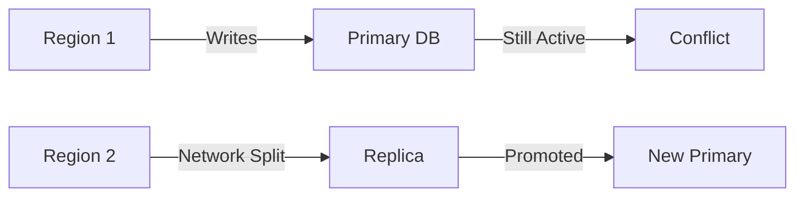

```markdown
# **Durability Troubleshooting: How to Fix Data Loss and Inconsistency in Production Databases**

You’ve built a rock-solid API. Your application handles 10K+ requests per second. Your database is sharded, replicated, and optimized for performance. But when disaster strikes—whether it’s a sudden crash, a misconfigured backup, or a silent corruption—your data might vanish or become inconsistent. **That’s where durability troubleshooting comes in.**

Durability isn’t just about "theoretical" persistence—it’s about *real-world* resilience against failures. A well-tested durability strategy ensures your data survives across:
- Hardware failures (SSD failures, power outages)
- Software misconfigurations (incorrect backup schedules, orphaned transactions)
- Human errors (accidental `DROP TABLE`, delete-all scripts)
- Distributed system quirks (leader elections, network partitions)

In this guide, we’ll cover:
- **Why durability failures happen** (and how they differ from "normal" failures)
- **The debugging workflow** (from logs to confirmations)
- **Proactive tools & patterns** (checksums, WAL analysis, binary log auditing)
- **Post-mortem strategies** (forensic recovery, rollback transactions)

---

## **The Problem: When Durability Fails**

Durability failures aren’t about "errors"—they’re about *hidden silent failures*. Unlike 404s or timeouts, data loss often goes unnoticed until it’s too late. Here’s how it manifests:

### **1. The Silent "Data Disappeared" Bug**
You deploy a new feature. Users report "my order is missing." You check the database—nothing. **But the logs show no errors.**

```bash
# No crash logs, no DB errors, yet data is gone
# Common culprits:
# - Uncommitted transactions (e.g., app crash mid-transaction)
# - Corrupted WAL (Write-Ahead Log) or binary logs (MySQL)
# - Incorrect `fsync` settings (OS-level durability lag)
```

### **2. Replication Lag Leads to Inconsistent Reads**
Your app reads from a replica, but it’s 5 minutes out of sync. A user sees stale data, and a concurrent update overwrites it. **Now both states exist.**

```sql
-- Example: User A deletes a record; User B reads stale version
SELECT * FROM orders WHERE user_id = 123;
-- Returns "Record exists" (stale replica)
DELETE FROM orders WHERE user_id = 123;
-- Later: Primary replica catches up and shows "Record missing"
```

### **3. Backups Fail Without Warning**
You rely on hourly backups. One backup fails silently due to a full disk. You don’t notice until you need to restore. **Game over.**

```bash
# Logs show nothing obvious, but the backup job failed:
2024-05-20T14:00:01Z [pg_dump] ERROR: Failed to write to /mnt/backup/db_20240520.sql
# No alert, no retries—just missing data
```

### **4. Distributed Systems Split-Brain**
In a multi-region setup, a network partition splits your cluster. One region keeps writing, the other fails over—but **neither knows the other’s state.**



---
## **The Solution: A Durability Debugging Workflow**

Durability issues require a **multi-step investigative approach**. Here’s how to diagnose and fix them:

### **Step 1: Check for Crash Recovery Evidence**
Most durability failures start with an unflushed write. Tools to investigate:
- **Database-specific crash recovery logs**
- **OS-level disk checks** (`fsck`, `dmesg`)
- **WAL/redo logs** (PostgreSQL) or binary logs (MySQL)

#### **Example: PostgreSQL WAL Analysis**
```bash
# Find the most recent WAL segment that wasn’t flushed
pg_waldump -f /var/lib/postgresql/data/pg_wal/000000010000000000000001
```

#### **Example: MySQL Binary Log Check**
```sql
-- Check for incomplete transactions
SHOW BINLOG EVENTS IN 'mysql-bin.000003' WHERE Info LIKE '%Start%';
```

### **Step 2: Verify Transaction Logs**
If a transaction wasn’t committed, **check if it was ever written to disk**.

#### **PostgreSQL: `pg_statio_all_tables`**
```sql
SELECT relname, heap_blks_read, heap_blks_hit
FROM pg_statio_all_tables
WHERE relname = 'orders';
```

#### **MySQL: `INFORMATION_SCHEMA.INNODB_METRICS`**
```sql
SELECT * FROM INFORMATION_SCHEMA.INNODB_METRICS
WHERE name LIKE '%log%';
```

### **Step 3: Reconstruct Lost Data (If Possible)**
If the data was never committed, **reapply transaction logs** from backups or audit logs.

#### **PostgreSQL: Recover from WAL + Backup**
```bash
# Recover database from backup with WAL replay
pg_ctl -D /var/lib/postgresql/data -o "-c config_file=/etc/postgresql/main.conf" restore
```

#### **MySQL: Reconstruct from Binary Logs**
```bash
# Replay binary logs to a fresh DB
mysqlbinlog --start-datetime="2024-05-20 00:00:00" mysql-bin.000003 | mysql -u root
```

### **Step 4: Fix Underlying Issues**
- **Disable `fsync` (if acceptable for your SLAs)** – *But beware: Data loss risk!*
  ```ini
  # PostgreSQL postgresql.conf
  fsync = off  # Only for testing!
  ```
- **Enable `innodb_flush_log_at_trx_commit=2` (MySQL)** – *Tradeoffs: Minor latency vs. durability.*
  ```ini
  [mysqld]
  innodb_flush_log_at_trx_commit=2
  ```
- **Use `CRASH_SAFE` mode (SQLite)** – Ensures no data corruption on abrupt shutdowns.

---

## **Implementation Guide: Proactive Durability Checks**

### **1. Enable Durability Logging**
Most databases log durability events. **Turn them on and monitor them.**

#### **PostgreSQL: `synchronous_commit`**
```ini
# postgresql.conf
synchronous_commit = on  # Ensures commits are durable
```

#### **MySQL: `log-bin` + `binlog_format=ROW`**
```ini
[mysqld]
log-bin = /var/log/mysql/mysql-bin.log
binlog_format = ROW
```

### **2. Test Crash Recovery Manually**
Before production, **force a crash and verify recovery.**

#### **PostgreSQL: Simulate Crash**
```bash
# Terminate PostgreSQL gracefully
pkill -15 postmaster
# Force crash (simulate power failure)
pkill -9 postmaster
# Check recovery logs
journalctl -u postgresql -b
```

#### **MySQL: Crash Test (Linux)**
```bash
# Simulate power loss (use `dd` to fill disk)
dd if=/dev/zero of=/var/lib/mysql/ibdata1 bs=1M count=1024
# Recover from backup
mysqld_safe --innodb-force-recovery=4
```

### **3. Use Checksums for Data Integrity**
Databases don’t always detect corruption. **Add checksums to critical tables.**

#### **PostgreSQL: `pg_checksums` (PostgreSQL 13+)**
```sql
-- Enable checksums globally
ALTER TABLE orders VALIDATE CHECKSUM;
-- Verify later
SELECT pg_checksum_table('orders');
```

#### **MySQL: `CHECKSUM TABLE`**
```sql
CHECKSUM TABLE orders;
-- Compare with backup
SELECT TABLE_NAME, CHECKSUM TABLE orders;
```

### **4. Automate Durability Audits**
Schedule **weekly durability checks** to catch issues early.

#### **Example: PostgreSQL Durability Check Script**
```bash
#!/bin/bash
# Check if PostgreSQL is durable (fsync + WAL)
pg_isready -U postgres
pg_settings | grep -E "fsync|synchronous_commit"
tail -n 5 /var/log/postgresql/postgresql-*.log | grep "duration"
```

#### **Example: MySQL Replication Lag Alert**
```bash
#!/bin/bash
# Alert if replication lag > 5 minutes
REPLICA_LAG=$(mysql -e "SHOW SLAVE STATUS" | grep "Seconds_Behind_Master")
if [ "$REPLICA_LAG" -gt 300 ]; then
  echo "WARNING: High replication lag: $REPLICA_LAG" | mail admin@example.com
fi
```

---

## **Common Mistakes to Avoid**

| **Mistake** | **Why It’s Bad** | **How to Fix** |
|-------------|------------------|----------------|
| **Disabling `fsync` in production** | Data loss on crashes | Use `fsync=on` or `innodb_flush_log_at_trx_commit=1` |
| **Ignoring replication lag** | Stale reads, lost updates | Monitor `Seconds_Behind_Master` (MySQL) or `pg_isready -p` (PostgreSQL) |
| **Not testing crash recovery** | False sense of security | Simulate crashes in staging |
| **Over-relying on backups** | Corruption in backups too | Use **checksums** + **differential backups** |
| **Using `NO SYNC` for writes** | Data loss on OS crashes | Avoid `NO_SYNC` unless absolutely necessary |

---

## **Key Takeaways**

✅ **Durability ≠ Performance Guarantee**
- You can’t have zero-downtime writes + maximum durability. **Tradeoffs exist.**
- `fsync=off` speeds up inserts but risks data loss.

✅ **Logs Are Your Best Friend**
- Database logs (`pg_waldump`, `SHOW BINLOG EVENTS`) often hold the truth.
- **Always check `dmesg`/`journalctl` after crashes.**

✅ **Automate Recovery Tests**
- Simulate crashes, power failures, and disk corruption in staging.
- **Assume your database will fail—plan for it.**

✅ **Use Checksums for Critical Data**
- PostgreSQL: `pg_checksums`
- MySQL: `CHECKSUM TABLE`
- **Manual verification beats blind trust.**

✅ **Monitor Replication Lag**
- MySQL: `SHOW SLAVE STATUS`
- PostgreSQL: `pg_isready -p` (check `sync_priority`)
- **A 10-minute lag means stale reads.**

---

## **Conclusion: Durability Is a Skill, Not a Switch**

Durability isn’t about checking a box—it’s about **understanding failure modes** and **testing your assumptions**. The best teams:

1. **Assume the worst** (OS crash, disk failure, human error).
2. **Log everything** (database logs, OS logs, application logs).
3. **Test recovery** (simulate crashes, verify backups).
4. **Monitor proactively** (replication lag, checksum failures).

Next time you design a database-backed system:
- **Ask:** *"What happens if the disk dies mid-write?"*
- **Answer:** *"We’ll detect it via WAL checks, log it, and recover from backup."*

Durability isn’t optional—it’s the difference between a **blip** and a **disaster**.

---
**Further Reading:**
- [PostgreSQL Crash Recovery Docs](https://www.postgresql.org/docs/current/crash-recovery.html)
- [MySQL Binary Logging](https://dev.mysql.com/doc/refman/8.0/en/replication-options-binary-log.html)
- [SQLite Crash Recovery](https://sqlite.org/c3ref/crash_safe.html)

**Got questions? Drop them in the comments!** 🚀
```