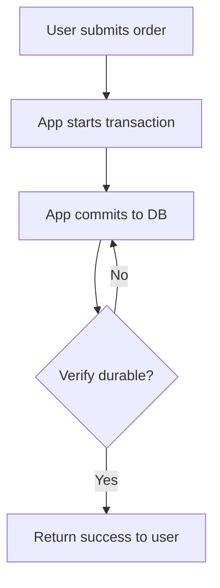

```markdown
# **Durability Verification: Ensuring Your Data Lives When It Matters**

*By [Your Name], Senior Backend Engineer*

---

## **Introduction**

When you ship critical data—like financial transactions, medical records, or order confirmations—you expect it to remain *durable*: intact, available, and recoverable even after failures. Yet, despite best-laid designs, durability breaches happen. A server crashes. A database replicates inconsistently. An unhandled exception during commit leaves your database in an ambiguous state. Without proper verification, you might not even detect these failures until it’s too late—when your users are complaining, or worse, when regulators ask why their sensitive data disappeared.

In this guide, we’ll explore the **Durability Verification** pattern—a practical, code-driven approach to ensure your writes are persisted reliably. We’ll cover:

- Why durability isn’t guaranteed by default
- How verification works in practice
- Key patterns and tradeoffs
- Real-world code examples (PostgreSQL, MySQL, and async primitives)
- Anti-patterns that sabotage your efforts

Let’s start with the problem.

---

## **The Problem: Durability Without Verification**

Durability is a common requirement, but many systems *assume* it works—until it doesn’t.

### **1. "It Worked Locally" (Local Testing Lies)**
During development, writes appear atomic and immediate. However, in production:
- Network partitions delay replication
- Writes fail silently due to disk I/O errors
- Your application crashes mid-transaction

Without verification, you might ship code that *appears* to work, but silently leaks durability.

### **2. Silent Failures in Distributed Systems**
A single-node database might retry writes until success. But distributed systems are messier:
```sql
-- Node A commits a transaction...
BEGIN;
UPDATE accounts SET balance = balance - 100 WHERE id = 1;

-- ...while Node B is down. The write fires and succeeds on Node A.
-- Later, the system returns "success," but Node B never saw it.
COMMIT;
```
The write may appear to succeed, but it’s lost if Node A fails before replication.

### **3. The Transaction “Success” Illusion**
Most languages report success immediately after `commit()`. But:
- The write may not be durable yet (e.g., PostgreSQL’s `fsync` may lag)
- Network partitions or disk failures can still corrupt the WAL

**Example:** In a high-latency deployment, your app returns "success" before the OS actually commits to disk.

---

## **The Solution: Durability Verification**

Durability verification ensures writes are **physically written to non-volatile storage** before acknowledging success. This involves:

1. **Explicit post-commit verification** (e.g., checking FSYNC logs)
2. **Asynchronous confirmation** (e.g., polling a durability-proof endpoint)
3. **Redundant checks** (e.g., verifying across replicas)

The core idea: *Assume nothing. Verify everything.*

---

## **Components/Solutions**

### **1. Durability Granularity**
- **Transaction-based**: Verify after committing the entire transaction.
- **Record-based**: Verify each write individually (overkill for small transactions).
- **Write-ahead log (WAL)**: Cache writes in volatile memory and verify WAL before acknowledging.

### **2. Verification Methods**
| Method               | Pros                          | Cons                          |
|----------------------|-------------------------------|-------------------------------|
| **OS file sync**     | No additional infrastructure   | Race conditions possible       |
| **Replica validation** | Detects replication lag        | Adds latency                    |
| **Data checksums**   | Detects corruption             | Not real-time                  |
| **Database flags**   | Simple to implement            | Requires DB tweaks             |

### **3. Practical Patterns**
- **Synchronous verification**: Block until durability is confirmed.
- **Asynchronous verification**: Return "tentative success" and later poll for confirmation.
- **Exponential backoff**: Retry verification if the system is overloaded.

---

## **Code Examples**

### **Example 1: PostgreSQL with fsync Verification**
PostgreSQL provides `pg_wal_lsn_diff()` to check WAL position, but we can extend it:

```go
// pseudo-Go example for PostgreSQL
func VerifyDurability(conn *sql.DB) error {
    _, err := conn.Exec("BEGIN; INSERT INTO orders (...) VALUES (...); COMMIT;")
    if err != nil {
        return fmt.Errorf("commit failed: %w", err)
    }

    // Verify WAL is synced to disk
    var lsn int64
    if err := conn.QueryRow("SELECT pg_current_wal_lsn()").Scan(&lsn); err != nil {
        return fmt.Errorf("query failed: %w", err)
    }

    // Check if the WAL position is synced (simplified)
    // In practice, check OS sync status or use a replication monitor
    if !isWalSynced(lsn) {
        return errors.New("durability check failed: WAL not synced")
    }

    return nil
}
```

**Tradeoff**: This adds latency, but ensures you don’t return success until the WAL is synced.

---

### **Example 2: Asynchronous Verification (Retry with Backoff)**

```python
# Python asyncio example
from aiohttp import ClientSession
import asyncio

async def verify_write(session: ClientSession, order_id: int):
    async with session.post("/api/orders/duration-check", json={"order_id": order_id}) as resp:
        if resp.status == 200:
            return True
        elif resp.status == 409:  # "Not durable yet"
            await asyncio.sleep(1)  # Exponential backoff would be better
            return verify_write(session, order_id)
        else:
            return False
```

**Tradeoff**: Adds complexity, but avoids blocking the user.

---

### **Example 3: Multi-Replica Validation**

```bash
# CLI script using pg_isready with durability checks
#!/bin/bash
DB_HOSTS=("db-primary" "db-replica1" "db-replica2")

for host in "${DB_HOSTS[@]}"; do
    if ! pg_isready -h "$host" -p 5432 -U user; then
        echo "Error: $host is not ready" >&2
        exit 1
    fi
done

# After commit, verify all replicas acknowledge the write
# (In practice, use a dedicated durability service)
psql -h primary -c "SELECT pg_notify('durability_check', 'write_done');"
```

**Tradeoff**: Requires coordination across replicas but catches silent failures.

---

## **Implementation Guide**

### **Step 1: Define Your Durability SLAs**
- How much time can you tolerate between commit and verification?
- What’s your tolerance for minor corruption?

### **Step 2: Choose Verification Strategy**
| Scenario                  | Recommended Approach               |
|---------------------------|-------------------------------------|
| Local database only        | OS-level fsync checks               |
| Replicated database        | Multi-replica validation            |
| Global microservices       | Async confirmation polling          |

### **Step 3: Instrument the Write Flow**


### **Step 4: Handle Failure Cases**
- **Transient failures**: Retry with backoff.
- **Permanent failures**: Notify ops, log, and notify users.
- **Ambiguous states**: Use compensating transactions (e.g., rollback if verification fails).

---

## **Common Mistakes to Avoid**

1. **Assuming `COMMIT` = Durability**
   - Just because SQL says success doesn’t mean the data is durable. Always verify.

2. **Ignoring Network Partitions**
   - If your app checks a single DB node, a partition may hide replication lag.

3. **Over-syncing**
   - Verify only what’s critical. For example, a "pending payment" may not need immediate durability.

4. **Not Testing in Failure Scenarios**
   - Use tools like `pg_rewind` or `mysqlfaultinjector` to simulate disk failures.

5. **Assuming "Eventual Consistency" = Durability**
   - Eventual consistency *doesn’t* guarantee durability. It guarantees *eventual* consistency, not *immediate* safety.

---

## **Key Takeaways**
✅ **Durability ≠ Success**: Just because a transaction commits doesn’t mean it’s durable.
✅ **Verify Explicitly**: Use OS syncs, replica checks, or async polling.
✅ **Trade Latency for Safety**: Verification adds overhead—balance it with your needs.
✅ **Test Failures**: Assume *everything* can fail. Test partition recovery.
✅ **Log Everything**: Without logs, you’ll never know if a write was truly durable.

---

## **Conclusion**

Durability verification is an often-overlooked but critical part of reliable systems. Without it, you’re flying blind: assuming writes are safe when they might not be. The good news? Implementing verification is practical with today’s tools—whether you’re using OS-level syncs, multi-replica checks, or async confirmation.

**Start small**: Add verification to one critical workflow, measure latency, and iterate. Over time, your system will become less fragile—and your users will thank you when their data doesn’t vanish after a failure.

---
**Further Reading**
- [PostgreSQL WAL Docs](https://www.postgresql.org/docs/current/wal-configuration.html)
- [CAP Theorem Explained](https://www.allthingsdistributed.com/files/osdi02.pdf)
- [Durability in Distributed Systems (GitLab)](https://about.gitlab.com/blog/2018/01/15/gitlab-10-2-durability/)

**What’s your biggest durability challenge?** Share in the comments!
```

---