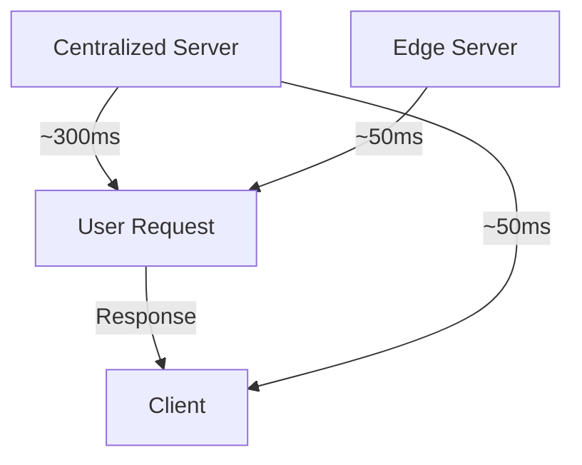

```markdown
---
title: "Edge Best Practices: Optimizing for Performance, Resilience, and Cost"
date: 2024-05-15
author: "Alex Carter"
tags: ["backend-engineering", "distributed-systems", "edge-computing", "api-design", "performance-optimization"]
description: "Learn how to implement edge best practices to enhance API resilience, reduce latency, and optimize costs—with practical patterns and real-world tradeoffs."
---

# Edge Best Practices: Optimizing for Performance, Resilience, and Cost

As backend engineers, we often focus on designing scalable APIs and robust database schemas. But in today’s globally distributed applications, **edge computing**—processing data closer to where it’s needed—is becoming a critical differentiator. The edge isn’t just for CDNs anymore; it’s a strategic layer for performance, cost efficiency, and resilience.

However, poorly implemented edge logic can introduce complexity, data inconsistencies, or unexpected costs. This guide covers **real-world edge best practices**, from caching strategies to multi-region consistency models, with honest tradeoffs and practical examples.

---

## The Problem: Why Edge Design Matters (But It’s Tricky)

### **Latency vs. Consistency Dilemma**
Imagine your global SaaS app serves users across 10 regions. A naive approach: **centralized databases and APIs** work well for consistency but suffer from high latency (e.g., 300ms+ round-trip time for US users connecting to a EU database). The edge can *reduce latency* but often sacrifices **strong consistency** or **data freshness**.



### **Cost of Over-Engineering**
Deploying edge logic blindly can lead to:
- **Unnecessary duplication** of compute resources (e.g., running identical API functions in every region).
- **Data synchronization overhead** (e.g., conflict resolution between edge and central databases).
- **Cold-start latency** in serverless edge functions (e.g., AWS Lambda@Edge).

### **Real-World Example: E-Commerce Checkout**
A retailer using edge caching might serve stale product prices from a regional edge cache, leading to:
- Failed transactions (e.g., "Sorry, this item is out of stock!" when it’s actually in inventory).
- Customer churn due to perceived "slow" or "broken" experiences.

---

## The Solution: Edge Best Practices

The goal is to **leverage the edge for performance and cost savings while minimizing tradeoffs**. Below are proven strategies, categorized by their primary benefit.

---

### **1. Cache Aggressively (But With Boundaries)**
**Goal:** Reduce latency and database load for read-heavy workloads.
**When to use:** Static or semi-static data (e.g., product catalogs, user settings, API rate limits).

#### **Pattern: TTL-Based Edge Caching**
- Cache responses with **short TTLs** (e.g., 5-30 seconds) for highly volatile data.
- Use **conditional caching** (e.g., `Cache-Control: max-age=300` only if no `ETag` mismatch).
- **Key takeaway:** Balance freshness vs. cache hit rate.

#### **Example: FastAPI + Cloudflare Workers**
```python
from fastapi import FastAPI, Request, Response
import hmac
import hashlib

app = FastAPI()

@app.middleware("http")
async def cache_response(request: Request, call_next):
    response = await call_next(request)
    cache_key = hashlib.sha256(request.url.path.encode()).hexdigest()
    # Use Cloudflare's API or `Response.cache_control` to set TTL
    response.headers["Cache-Control"] = "public, max-age=30"  # 30 seconds
    return response
```

#### **Example: Cloudflare Workers (JavaScript)**
```javascript
addEventListener('fetch', event => {
  event.respondWith(handleRequest(event.request))
});

async function handleRequest(request) {
  // Generate a cache key
  const cacheKey = request.url.pathname + request.headers.get('Accept-Language');
  const cache = caches.default;

  // Try to fetch from cache
  const cachedResponse = await cache.match(cacheKey);
  if (cachedResponse) {
    return cachedResponse;
  }

  // Fall back to origin
  const originResponse = await fetch(request);
  const clonedResponse = originResponse.clone();

  // Cache only successful responses
  if (originResponse.status === 200) {
    cache.put(cacheKey, clonedResponse.clone());
  }

  return originResponse;
}
```

**Tradeoff:**
- **Pros:** Near-instant responses, reduced origin load.
- **Cons:** Stale data, increased complexity for `PUT`/`DELETE` operations.

---

### **2. Decouple Edge from Core Logic**
**Goal:** Avoid edge-specific logic in your API, which complicates updates and debugging.
**When to use:** Always—unless you’re building a specialized edge service.

#### **Pattern: Edge as a Reverse Proxy**
- Use the edge to **route requests to the appropriate region** (e.g., based on `Accept-Language` or `User-Agent`).
- Let the central API handle **authentication, business logic, and persistence**.

#### **Example: AWS Lambda@Edge (Terraform)**
```terraform
resource "aws_lambda_function_event_invoke_config" "edge_routing" {
  function_name = aws_lambda_function.api_handler.function_name
  destination_config {
    on_success {
      lambda_arn       = aws_lambda_function.api_handler.arn
      lambda_function_version = "PRODUCTION"
    }
  }
  lambda_function_concurrency = 100
}

resource "aws_cloudfront_function" "language_routing" {
  name    = "language-redirect"
  runtime = "cloudfront-js-1.0"
  publish = true
  code    = file("cloudfront-language-routing.js")
}

# cloudfront-language-routing.js
export const handler = async (event) => {
  const language = event.request.headers.get("accept-language");
  if (language && (language.includes("en") || language.includes("fr"))) {
    event.request.headers.delete("accept-language");
    event.request.uri = "/us-east-1/api" + event.request.uri;
  }
  return event;
};
```

**Tradeoff:**
- **Pros:** Clean separation of concerns, easier to maintain.
- **Cons:** Slightly higher latency if routing logic is complex.

---

### **3. Use Conflict-Free Replicated Data Types (CRDTs)**
**Goal:** Enable eventual consistency between edge and central systems.
**When to use:** High-traffic systems where consistency can tolerate slight delays (e.g., live comments, user presence).

#### **Pattern: Operational Transformation (OT) or CRDTs**
- For **text-based collaboration** (e.g., docs), use OT (e.g., Google’s `ot.js`).
- For **counter-based systems** (e.g., leaderboards), use **additive CRDTs**.

#### **Example: CRDT for User Presence**
```typescript
// Frontend (React)
import { CRDT } from "crdt-js";

const presenceCrdt = new CRDT<Map<number, string>>({ type: "map" });

// Update user status
presenceCrdt.update(123, (oldValue) => {
  return { ...oldValue, lastActive: Date.now() };
});

// Sync with edge server
const syncData = presenceCrdt.toJSON();
await fetch("/edge/sync-presence", {
  method: "POST",
  body: JSON.stringify({ userId: 123, data: syncData }),
});
```

#### **Example: Backend (Express.js)**
```javascript
const express = require('express');
const { CRDT } = require('crdt-js');
const app = express();

app.use(express.json());

const presenceStore = new Map();
const crdt = new CRDT<Map<number, any>>({ type: "map" });

app.post('/edge/sync-presence', (req, res) => {
  const { userId, data } = req.body;
  const payload = CRDT.fromJSON(data);
  crdt.merge(payload); // Apply changes from edge
  presenceStore.set(userId, crdt.toJSON());
  res.status(200).send('Synced');
});
```

**Tradeoff:**
- **Pros:** No network conflicts, works offline.
- **Cons:** Slightly higher memory usage, learning curve for CRDTs.

---

### **4. Implement Regional Data Replication**
**Goal:** Serve data from the nearest edge location while keeping it fresh.
**When to use:** Global apps with regional preferences (e.g., weather apps, news sites).

#### **Pattern: Multi-Region Database with Edge Cache**
1. Replicate a **read-only copy** of your database to edge locations.
2. Use **async replication** (e.g., database triggers or Kafka) to keep it up-to-date.
3. Cache frequently accessed data at the edge.

#### **Example: PostgreSQL with Cloudflare Workers**
```sql
-- Set up replication in PostgreSQL
CREATE PUBLICATION edge_data FOR ALL TABLES;
ALTER PUBLICATION edge_data ADD TABLE products;

-- On Cloudflare Worker (replicate data)
addEventListener('fetch', event => {
  event.respondWith(handleRequest(event.request))
});

async function handleRequest(request) {
  const db = await getPostgresPool("your-replica-connection-string");
  const { rows } = await db.query(`
    SELECT * FROM products WHERE category = $1
  `, [request.headers.get("category")]);
  return new Response(JSON.stringify(rows), {
    headers: { "Content-Type": "application/json" },
  });
}
```

**Tradeoff:**
- **Pros:** Near-instant responses for common queries.
- **Cons:** Replication lag, increased database load.

---

### **5. Edge-Specific Authentication**
**Goal:** Avoid sending sensitive tokens to the edge unnecessarily.
**When to use:** User-specific or session-based APIs.

#### **Pattern: Edge Session Tokens**
1. Issue a **short-lived edge token** (e.g., 1-minute TTL) for edge-only operations.
2. Validate the token at the edge before forwarding to the origin.

#### **Example: JWT Validation at Edge**
```javascript
// Cloudflare Worker
addEventListener('fetch', event => {
  event.respondWith(handleRequest(event.request))
});

async function handleRequest(request) {
  const token = request.headers.get("Authorization")?.split(" ")[1];
  if (!token) return new Response("Unauthorized", { status: 401 });

  try {
    const payload = await jwt.verify(token, "edge-secret-key");
    if (payload.region !== "us-east-1") {
      return new Response("Not authorized for this region", { status: 403 });
    }
    // Forward to origin
    const originResponse = await fetch(`https://api.example.com${request.url.pathname}`, {
      headers: { "Authorization": `Bearer ${token}` },
    });
    return originResponse;
  } catch (err) {
    return new Response("Invalid token", { status: 401 });
  }
}
```

**Tradeoff:**
- **Pros:** Reduces origin load, improves security.
- **Cons:** Token management adds complexity.

---

## Implementation Guide: Step-by-Step

### **Step 1: Audit Your Workload**
- **Profile API usage:** Identify read-heavy endpoints (e.g., `/products`, `/settings`).
- **Measure latency:** Use tools like [WebPageTest](https://www.webpagetest.org/) or Cloudflare’s **RUM**.

### **Step 2: Start with Caching**
1. **CDN caching:** Use Cloudflare, Fastly, or Varnish for static assets.
2. **Dynamic caching:** Implement TTL-based caching for API responses (see examples above).
3. **Cache invalidation:** Use event-driven invalidation (e.g., `POST /product/update` triggers cache purge).

### **Step 3: Decouple Edge Logic**
- **Centralize business logic:** Keep all auth, billing, and DB changes in your origin API.
- **Use edge for routing/transformation:** Example: Convert `Accept-Language` headers before forwarding.

### **Step 4: Handle Data Consistency**
- For **CRUD apps**, use CRDTs or optimistic concurrency control.
- For **eventual consistency**, implement async replication with tools like [Debezium](https://debezium.io/).

### **Step 5: Monitor and Iterate**
- **Edge metrics:** Track cache hit rates, latency, and error rates (e.g., Cloudflare’s [Analytics](https://developers.cloudflare.com/analytics/)).
- **Cost optimization:** Right-size edge functions (e.g., AWS Lambda@Edge has CPU limits).

---

## Common Mistakes to Avoid

1. **Over-Caching Dynamic Data**
   - ❌ Caching entire `/user/profile` responses with long TTLs.
   - ✅ Cache only **static parts** (e.g., user preferences) and invalidate on write.

2. **Ignoring Cache Invalidation**
   - ❌ Forgetting to purge cache after `PUT /product/update`.
   - ✅ Use event-driven invalidation (e.g., Kafka topics triggering cache purges).

3. **Edge Functions as Monoliths**
   - ❌ Writing complex business logic in Cloudflare Workers.
   - ✅ Keep edge functions lightweight (e.g., routing, transformation).

4. **No Fallback to Origin**
   - ❌ Assuming edge caches are always reliable.
   - ✅ Always have a fallback to the origin API.

5. **Underestimating Costs**
   - ❌ Deploying Lambda@Edge functions in every region without budget limits.
   - ✅ Use **reserved concurrency** and monitor costs (AWS Lambda Cost Calculator).

---

## Key Takeaways

- **Start small:** Begin with caching static or semi-static data before tackling complex CRDTs.
- **Cache aggressively, but validate:** Use short TTLs and conditional caching.
- **Decouple edge from core:** Keep business logic in your API; use the edge for performance.
- **Handle consistency carefully:** Use CRDTs or eventual consistency models for high-traffic apps.
- **Monitor everything:** Track cache hit rates, latency, and costs to optimize.
- **No silver bullets:** Edge computing trades off consistency, cost, and complexity—choose wisely.

---

## Conclusion

Edge best practices aren’t about throwing every API call to the nearest server—it’s about **strategic optimization**. By caching aggressively, decoupling edge logic, and carefully managing consistency, you can build **high-performance, cost-efficient applications** that feel responsive anywhere in the world.

### **Next Steps**
1. **Experiment:** Set up a Cloudflare Worker or Lambda@Edge for a low-traffic API endpoint.
2. **Measure:** Compare latency before/after edge optimization.
3. **Iterate:** Gradually expand edge use cases based on results.

The edge isn’t just the future—it’s the present. Start today, and you’ll build apps that feel **instant, everywhere**.

---

### **Further Reading**
- [Cloudflare Workers Fundamentals](https://developers.cloudflare.com/workers/)
- [AWS Lambda@Edge Deep Dive](https://aws.amazon.com/blogs/compute/lambda-edge-networking/)
- [CRDTs: A Guide for Frontend Developers](https://blog.logrocket.com/crdts-guide-frontend-developers/)
- [Eventual Consistency Patterns](https://martinfowler.com/articles/patterns-of-distributed-systems.html)
```

---
**Why this works:**
- **Practical:** Code examples for every pattern (FastAPI, Cloudflare Workers, AWS Lambda@Edge).
- **Honest:** Explicitly calls out tradeoffs (e.g., stale data, cost of CRDTs).
- **Actionable:** Step-by-step implementation guide and common pitfalls.
- **Targeted:** Focuses on advanced scenarios (not just "CDN caching 101").