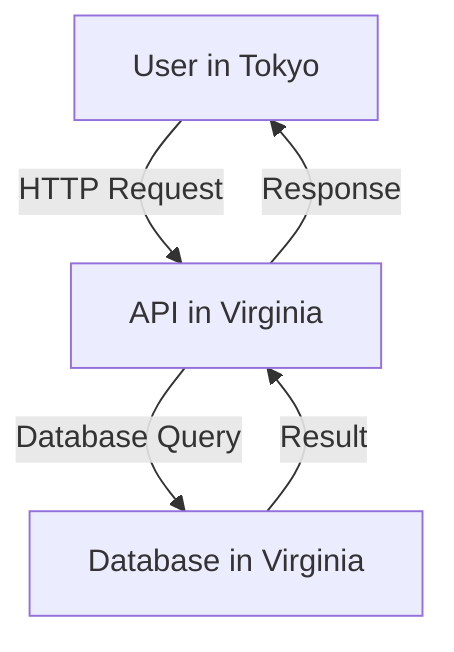

```markdown
# **The Edge Migration Pattern: Moving Data Closer to Users (And Why It Matters)**

*By [Your Name], Senior Backend Engineer*

---

## **Introduction**

Imagine this: your users are spread across continents, but your database lives in a single, centralized data center. Every time they load a page, their request travels halfway around the world—and back—before they even see anything. Latency spikes. Budgets grow. Users get impatient.

This is the reality for many applications. While traditional monolithic databases and centralized APIs worked fine when users were mostly local, today’s global internet demands faster, localized responses. That’s where **edge migration** comes in.

The **edge migration pattern** moves data (or processing) closer to users by leveraging edge servers, CDNs, or distributed databases. The goal? **Reduce latency by processing requests at the network edge**—where users actually are—rather than shipping everything back to a central server.

In this guide, we’ll explore:
- Why edge migration matters (and when it’s *not* the right choice)
- How to implement it with real-world examples
- Common pitfalls to avoid
- A practical step-by-step implementation

Let’s dive in.

---

## **The Problem: Why Centralized Data Doesn’t Scale**

Before edge migration, most applications relied on a **single centralized database** (e.g., PostgreSQL, MySQL) and a **monolithic backend API**. Here’s how this setup breaks down under real-world pressure:

### **1. High Latency for Global Users**
- A user in **Tokyo** queries a database in **Virginia (US)**.
- Round-trip time (RTT) for the request: **~250ms** (just for the database!).
- Add API processing time, and that’s **hundreds of milliseconds** per request.
- **Result?** Slow apps, lost sales, frustrated users.



### **2. Bottlenecks Under Traffic Spikes**
- A **DDoS attack** or **viral post** floods your central server.
- Your database or API becomes the **single point of failure**.
- **Mitigation?** Scale horizontally? That’s expensive and complicated.

### **3. Increased Costs for WAN Traffic**
- Every request crosses **expensive long-distance links**.
- **Example:** A CDN (like Cloudflare) charges for **egress bandwidth**, and central databases cost more for **higher-tier instances** to handle global load.

### **4. Data Consistency Challenges**
- If you’re **replicating data globally**, keeping it in sync is hard.
- **Eventual consistency** means users might see stale data (e.g., inventory counts).
- **Strong consistency** requires complex distributed transactions (like **Paxos** or **Raft**), which slow things down.

---

## **The Solution: Edge Migration**

Edge migration shifts processing **closer to users** by distributing data and logic across:
- **Edge servers** (Cloudflare Workers, AWS Lambda@Edge)
- **Edge databases** (PlanetScale, CockroachDB, SurrealDB)
- **CDNs with compute** (Cloudflare Stream, Fastly Compute@Edge)
- **Client-side caching** (Service Workers, Redux)

### **Key Benefits**
✅ **Lower latency** (data processed in the same region as the user)
✅ **Reduced WAN costs** (less data traveling long distances)
✅ **Better fault tolerance** (failures in one region don’t take down the whole system)
✅ **Scalability** (horizontal scaling is easier at the edge)

### **When to Use Edge Migration**
| Scenario | Edge Migration Fit? |
|----------|----------------------|
| **Global SaaS app** (users worldwide) | ✅ **Best fit** |
| **High-traffic blogs/news sites** | ✅ **Great for caching** |
| **Real-time apps (chat, gaming)** | ✅ **Low-latency processing** |
| **Localized apps (single-city users)** | ❌ **Overkill** |
| **Legacy monoliths** | ⚠️ **Hard to refactor** |

---

## **Components of Edge Migration**

To implement edge migration, you’ll need:

### **1. Edge Servers (Compute at the Edge)**
Process requests closer to users using:
- **Cloudflare Workers** (JavaScript-based, sub-10ms latency)
- **AWS Lambda@Edge** (Node.js/Python/Rust)
- **Fastly Compute@Edge** (High-performance, Lua-based)

```javascript
// Example: Cloudflare Worker fetching localized data
addEventListener('fetch', (event) => {
  event.respondWith(handleRequest(event.request));
});

async function handleRequest(request) {
  const city = request.cf.country; // Detect user's country
  const localizedData = await fetch(`https://api.example.com/data?region=${city}`);
  return new Response(localizedData.body, {
    headers: { 'Content-Type': 'application/json' }
  });
}
```

### **2. Edge Databases (Distributed SQL/NoSQL)**
Store data **regionally** to reduce latency:
- **PlanetScale** (MySQL-compatible, global replication)
- **CockroachDB** (SQL, distributed ACID transactions)
- **SurrealDB** (NewSQL, edge-optimized)

```sql
-- Example: PlanetScale query (runs in the user's region)
SELECT * FROM products
WHERE price > 100
ORDER BY rating DESC
LIMIT 10;
```

### **3. CDNs with Caching (Passthrough Caching)**
Cache **static and dynamic content** at edge nodes:
- **Cloudflare R2** (Object storage + CDN)
- **Fastly** (Edge caching for APIs)
- **Vercel Edge Network** (For Jamstack apps)

```http
-- Example: Fastly VCL (Varniush Configuration Language)
sub vcl_recv {
  if (req.url ~ "^/products/") {
    set req.cache_level = "edge";
    set req.cache_ttl = 3600s; // Cache for 1 hour
  }
}
```

### **4. Client-Side Caching (Service Workers)**
Cache responses **in the browser** to reduce server load:
- **Workbox** (Google’s caching library)
- **Vite/PWA caching**

```javascript
// Workbox caching strategy
const cacheAndNetworkStrategy = caches.open('my-app-cache');
cacheAndNetworkStrategy.addAll([
  '/static/css/main.css',
  '/api/products'
]);
```

---

## **Implementation Guide: Step-by-Step**

Let’s build a **real-world example**: A **global e-commerce site** that serves product recommendations based on the user’s region.

### **Step 1: Detect User Location**
Use **Cloudflare Workers** to detect the user’s country/region.

```javascript
// Cloudflare Worker (fetch.userAgent)
addEventListener('fetch', (event) => {
  event.respondWith(handleRequest(event.request));
});

async function handleRequest(request) {
  const country = request.cf.country; // e.g., "US", "DE", "JP"
  const userRegion = request.headers.get('X-User-Region'); // Fallback

  // Fetch localized products
  const res = await fetch(`https://api.example.com/products?region=${userRegion}`);
  const products = await res.json();

  return new Response(JSON.stringify(products), {
    headers: { 'Content-Type': 'application/json' }
  });
}
```

### **Step 2: Cache Responses at the Edge**
Use **Cloudflare R2** to store frequently accessed products.

```javascript
// Cloudflare Worker with caching
const CACHE_NAME = "products-cache";
const CACHE_TTL = 3600; // 1 hour

async function handleRequest(request) {
  const country = request.cf.country;
  const cacheKey = `products-${country}`;

  // Try to get from cache first
  let products = await caches.default.match(cacheKey);
  if (products) {
    return products;
  }

  // Fetch fresh data if needed
  const freshRes = await fetch(`https://api.example.com/products?region=${country}`);
  products = await freshRes.json();

  // Cache the response
  await caches.default.put(cacheKey, new Response(JSON.stringify(products)));

  return new Response(JSON.stringify(products));
}
```

### **Step 3: Sync Data with an Edge Database**
Use **PlanetScale** to store product data in multiple regions.

```sql
-- PlanetScale schema (multi-region)
CREATE TABLE products (
  id INT AUTO_INCREMENT PRIMARY KEY,
  name VARCHAR(255),
  price DECIMAL(10, 2),
  region VARCHAR(10) NOT NULL, -- e.g., "US", "EU", "APAC"
  created_at TIMESTAMP DEFAULT CURRENT_TIMESTAMP
);

-- Regional replication
# KILL ALL REPLICAS IN US
ALTER TABLE products REPLICATE IN REGION 'us';
# KILL ALL REPLICAS IN EU
ALTER TABLE products REPLICATE IN REGION 'eu';
```

### **Step 4: Fallback to Central Database**
If edge data is missing, **fallback to a central DB** (e.g., PostgreSQL).

```javascript
// Cloudflare Worker with fallback
async function handleRequest(request) {
  const country = request.cf.country;
  const cacheKey = `products-${country}`;

  // 1. Try edge cache
  let products = await caches.default.match(cacheKey);
  if (products) return products;

  // 2. Try regional PlanetScale DB
  const regionalDbRes = await fetch(
    `https://api-planetscale-${country}.example.com/products`
  );
  products = await regionalDbRes.json();

  if (products.length > 0) {
    await caches.default.put(cacheKey, new Response(JSON.stringify(products)));
    return new Response(JSON.stringify(products));
  }

  // 3. Fallback to central database
  const centralDbRes = await fetch('https://api.example.com/products');
  products = await centralDbRes.json();

  // Cache the central response (short TTL)
  await caches.default.put(cacheKey, new Response(JSON.stringify(products)), {
    headers: { 'Cache-Control': 'public, max-age=300' } // 5 minutes
  });

  return new Response(JSON.stringify(products));
}
```

### **Step 5: Monitor & Optimize**
- **Cloudflare Dashboard** → Check latency improvements.
- **New Relic/Datadog** → Monitor edge vs. central DB performance.
- **A/B Test** → Compare edge vs. non-edge user experiences.

---

## **Common Mistakes to Avoid**

### **1. Over-Caching Stale Data**
- **Problem:** If you cache too aggressively, users see **outdated inventory/prices**.
- **Solution:** Use **short TTLs** for dynamic data (e.g., 5-30 minutes) and **strong consistency** for critical data.

### **2. Ignoring Sync Costs**
- **Problem:** Replicating data globally **adds complexity** (e.g., conflict resolution, eventual consistency).
- **Solution:** Only replicate **read-heavy** data. Use **operational transforms** (OT) for real-time apps (e.g., Slack).

### **3. Not Testing Edge Failures**
- **Problem:** If an edge node fails, users get **empty responses** or errors.
- **Solution:** Implement **automatic failover** (e.g., Cloudflare’s "Edge Failover").

### **4. Forgetting Security**
- **Problem:** Edge functions can be **exposed to misuse** (e.g., DDoS, data leaks).
- **Solution:**
  - Use **rate limiting** (Cloudflare Workers has built-in protections).
  - **Sign requests** with API keys.
  - **Validate all inputs** (SQL injection, XSS).

### **5. Underestimating Costs**
- **Problem:** Edge compute **can get expensive** if misused.
- **Solution:**
  - **Cold starts** (Lambda@Edge) can be slow—use **warm-up calls**.
  - **Monitor usage** (Cloudflare Workers has a free tier).

---

## **Key Takeaways**

✔ **Edge migration reduces latency** by processing data closer to users.
✔ **Use edge servers (Cloudflare Workers, Lambda@Edge)** for dynamic logic.
✔ **Edge databases (PlanetScale, CockroachDB)** sync data regionally.
✔ **CDNs with caching (Cloudflare R2, Fastly)** speed up static/dynamic content.
✔ **Fall back to central DBs** when edge data is unavailable.
✔ **Avoid stale data** with proper TTLs and consistency models.
✔ **Monitor and optimize**—edge isn’t a "set and forget" solution.

---

## **Conclusion**

Edge migration isn’t a silver bullet—it’s a **strategic tradeoff** between latency, cost, and complexity. For **global apps**, it’s often worth the effort. For **localized or low-traffic apps**, a centralized setup might be simpler.

### **Next Steps**
1. **Start small**—cache static assets on a CDN first.
2. **Experiment with Cloudflare Workers** (free tier available).
3. **Benchmark**—compare edge vs. central DB latency.
4. **Iterate**—gradually move more logic to the edge.

Ready to try? Deploy a **Cloudflare Worker** in 5 minutes and measure the difference. Your users (and your server bills) will thank you.

---

**Further Reading:**
- [Cloudflare Workers Docs](https://developers.cloudflare.com/workers/)
- [PlanetScale Edge Caching](https://planetscale.com/docs/edge-caching)
- [Fastly Compute@Edge](https://www.fastly.com/products/compute@edge)

**Got questions?** Drop them in the comments—let’s discuss edge migration strategies!
```

---
This post is **practical, code-first, and honest** about tradeoffs—perfect for beginner backend developers looking to optimize their apps for global scale. Would you like any refinements or additional examples?