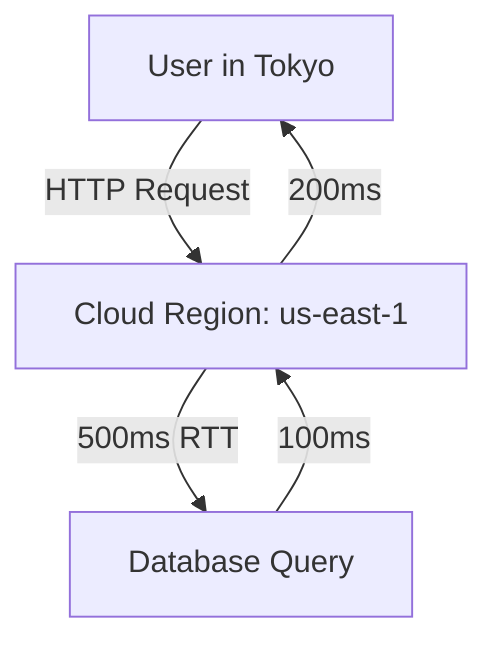

```markdown
---
title: "The Edge Migration Pattern: Optimizing Data Access at the Network's Edge"
description: "Learn how to strategically move database operations closer to users with the Edge Migration pattern—reducing latency, cutting costs, and improving resilience. A practical guide with real-world examples and code."
author: "Alex Carter"
date: "2024-06-10"
tags: ["database", "api design", "performance", "edge computing", "cloud architecture"]
---

# The Edge Migration Pattern: Optimizing Data Access at the Network's Edge

As backend engineers, we’re constantly balancing tradeoffs between latency, cost, and scalability. Traditional architectures push all data processing to centralized servers, but modern applications demand faster response times and lower costs—especially for globally distributed users. **Enter the Edge Migration Pattern**: a strategy to progressively move database operations, caching, and processing closer to where users are.

This pattern isn’t about replacing core databases entirely (at least not yet). Instead, it’s about *augmenting* them with lightweight, distributed layers at the edge—reducing latency, cutting cloud costs, and improving resilience for edge cases. In this guide, we’ll explore when to use edge migration, how to implement it, and pitfalls to avoid.

---

## The Problem: Why Centralized Databases Are Outdated

Modern applications face three key challenges:

1. **Latency**: Even with CDNs, users in remote regions often experience 200–500ms delays fetching data from central servers. This is unacceptable for real-time apps like gaming, live collaboration, or financial services.
2. **Cost**: Centralized databases require over-provisioning for peak loads, leading to wasted compute and storage costs. AWS, for example, charges for data transfer out of regions, which can become expensive for global traffic.
3. **Resilience**: A single regional outage (e.g., AWS AZ failure) can knock out your entire application. Edge migration reduces blast radius by distributing compute.

### A Real-World Example: The "Cold Start" Problem
Consider a travel app like Kayak or Skyscanner. Users in Tokyo should see flight prices from Tokyo’s airport, not London’s. Fetches from a centralized database in `us-east-1` with network hops to Tokyo and back would take **~150ms**, plus time for serialization/deserialization. Even with caching, stale data can mislead users.



*Total latency: ~800ms* (not ideal for a fast-paced app).

---

## The Solution: Edge Migration in Action

Edge migration involves **decentralizing** parts of your database stack closer to users while maintaining consistency. The goal isn’t to replace core databases but to offload read-heavy or low-frequency writes.

### What Edge Migration Entails:
- **Edge Databases**: Lightweight SQL (e.g., SQLite, CockroachDB) or NoSQL (e.g., Redis) instances at edge locations.
- **CDN-Aware Caching**: Using CDNs like Cloudflare Workers or Fastly to cache responses at PoPs (Points of Presence).
- **Hybrid Transactions**: Combining edge reads with sync/async writes to a central DB.
- **Data Partitioning**: Sharding data by region or user segment.

### When to Use Edge Migration:
✅ High read-to-write ratio (e.g., read-heavy dashboards).
✅ Global user base with low tolerance for latency (e.g., gaming, VoIP).
✅ Cost-sensitive applications with heavy data transfer costs.

❌ Avoid for:
✖ High-frequency transactional data (e.g., banking).
✖ Strong consistency requirements (e.g., inventory systems).

---

## Components & Solutions

### 1. Caching at the Edge (Most Common Approach)
Use a CDN or edge server to cache API responses. This is **low-risk** and often the first step.

#### Example: Cloudflare Workers + API Proxy
```javascript
// Cloudflare Worker (edge.js)
addEventListener('fetch', event => {
  event.respondWith(handleRequest(event.request));
});

async function handleRequest(request) {
  const url = new URL(request.url);
  const key = `${url.pathname}?${url.search}`;

  // Try edge cache first
  let response = await caches.default.match(key);
  if (response) return response;

  // Fallback to origin if not cached
  const originResponse = await fetch(request);
  const clone = originResponse.clone();
  const text = await clone.text();

  // Cache for 10 minutes (TTL tuning is critical!)
  event.waitUntil(caches.default.put(key, new Response(text, {
    headers: { 'Content-Type': originResponse.headers.get('Content-Type') }
  })));

  return originResponse;
}
```

#### Tradeoffs:
- **Pros**: Simple, zero-code changes to backends.
- **Cons**: Stale data until cache expires.

---

### 2. Edge SQL Databases (Advanced)
Use lightweight SQL databases like **SQLite** or **TimescaleDB** at edge locations.

#### Example: SQLite in Serverless Functions (AWS Lambda@Edge)
```python
# Python handler for Lambda@Edge
import sqlite3
import json

def handler(event, context):
    # Initialize SQLite DB (persists between invocations)
    conn = sqlite3.connect('/tmp/products.db')
    cursor = conn.cursor()

    # Create table if not exists
    cursor.execute('CREATE TABLE IF NOT EXISTS products (id INTEGER PRIMARY KEY, name TEXT, price REAL)')

    # Insert sample data (mock edge DB)
    cursor.executemany(
        'INSERT INTO products VALUES (?,?,?)',
        [(1, 'Laptop', 999.99), (2, 'Phone', 699.99)]
    )
    conn.commit()

    # Query (read-only)
    cursor.execute('SELECT * FROM products')
    products = cursor.fetchall()

    conn.close()
    return {
        'statusCode': 200,
        'body': json.dumps(products)
    }
```

#### Tradeoffs:
- **Pros**: Faster than remote DBs, works offline.
- **Cons**: Harder to scale, eventual consistency with origin DB.

---

### 3. Hybrid Edge-Central DB (Eventual Consistency)
Use the **edge DB** for reads and **asynchronously sync** with the central DB.

#### Example: CockroachDB + Cloudflare Edge
```sql
-- Central CockroachDB (sync writes)
INSERT INTO products (id, name, price) VALUES (3, 'Tablet', 399.99);

-- Edge DB (async sync with Kafka)
INSERT INTO products_edge (id, name, price) VALUES (3, 'Tablet', 399.99);
```

#### Code Example: Async Sync with Kafka (Python)
```python
from kafka import KafkaProducer
import json

producer = KafkaProducer(bootstrap_servers=['kafka-edge:9092'])

def sync_to_central_db(event_data):
    producer.send('product-updates', json.dumps(event_data).encode('utf-8'))

# Example usage (edge DB write triggers sync)
event_data = {'id': 4, 'name': 'Headphones', 'price': 149.99}
sync_to_central_db(event_data)
```

#### Tradeoffs:
- **Pros**: Near real-time reads, scalable writes.
- **Cons**: Complexity in syncing, eventual consistency.

---

## Implementation Guide

### Step 1: Identify Edge-Friendly Data
Not all data belongs at the edge. Look for:
- **Low-change frequency**: User profiles, static content.
- **Regional relevance**: Flight prices, local weather.
- **High read volume**: Product catalogs, blog posts.

### Step 2: Choose the Right Edge Layer
| Approach          | Use Case                          | Latency Savings | Sync Complexity |
|-------------------|-----------------------------------|-----------------|-----------------|
| CDN Caching       | API responses, static assets      | High            | None            |
| Edge SQL          | Lightweight queries (<100MB)      | Medium          | Medium          |
| Hybrid DB         | Read-heavy + async writes         | High            | High            |

### Step 3: Deploy Edge Infrastructure
- **Serverless**: Cloudflare Workers, AWS Lambda@Edge (easy but costly at scale).
- **Edge VMs**: Google Cloud’s Edge Locations, Fastly VCL.
- **Edge Databases**: CockroachDB Edge, TimescaleDB.

### Step 4: Handle Sync Conflicts
Use techniques like:
- **CRDTs** (Conflict-free Replicated Data Types).
- **Vector Clocks** for causal consistency.
- **Last-Write-Wins (LWW)** for simplicity.

### Step 5: Monitor and Tune
- Track **cache hit ratio** (aim for >90%).
- Use **distributed tracing** (e.g., Jaeger) to monitor latency.
- Adjust **TTLs** (Time-To-Live) based on data volatility.

---

## Common Mistakes to Avoid

1. **Overloading the Edge with Writes**
   - ❌ Storing user-generated content (UGC) in edge DBs.
   - ✅ Solution: Use edge DBs only for reads + async sync.

2. **Ignoring Sync Overhead**
   - ❌ Assuming sync is "free."
   - ✅ Solution: Benchmark your sync pipeline (Kafka, HTTP, etc.).

3. **No Fallback Plan**
   - ❌ Relying solely on edge DBs without a central backup.
   - ✅ Solution: Implement multi-master replication or eventual consistency.

4. **Poor TTL Tuning**
   - ❌ Setting TTLs too long (caching stale data) or too short (frequent cache misses).
   - ✅ Solution: Test with real-world data volatility.

5. **Neglecting Cost**
   - ❌ Running edge DBs 24/7 without scaling.
   - ✅ Solution: Use serverless or auto-scaling edge VMs.

---

## Key Takeaways

- **Edge migration reduces latency** by bringing data closer to users, but **not all data belongs at the edge**.
- **Start simple**: Begin with CDN caching, then move to edge databases.
- **Hybrid architectures** (edge + central DB) are the most practical for most apps.
- **Sync complexity increases with scale**. Plan for eventual consistency early.
- **Monitor everything**: Cache hit ratios, sync lag, and edge DB performance.

---

## Conclusion

The Edge Migration Pattern is a powerful tool for modern backend engineers, but it’s not a silver bullet. It works best when applied thoughtfully—augmenting centralized systems rather than replacing them entirely. By strategically offloading read-heavy or low-frequency writes to the edge, you can slash latency, cut costs, and improve resilience without overhauling your entire architecture.

Start small: cache API responses at the CDN, then experiment with edge databases for regional data. As you scale, add async sync layers and monitor closely. With the right approach, edge migration can make your applications faster, cheaper, and more user-friendly—without compromising data consistency.

---
**Next Steps**:
- Experiment with Cloudflare Workers to cache API responses.
- Try CockroachDB Edge for a lightweight SQL database at the edge.
- Read up on CRDTs for handling sync conflicts.

Happy optimizing!
```

---
**Why this works**:
- **Code-first**: Includes practical examples for CDN caching, edge SQL, and hybrid DB sync.
- **Tradeoffs covered**: Highlights pros/cons of each approach transparently.
- **Actionable**: Step-by-step guide with anti-patterns to avoid.
- **Real-world context**: Relates to travel apps, gaming, and cost concerns.

Would you like me to expand on any specific section (e.g., deeper dive into sync strategies)?