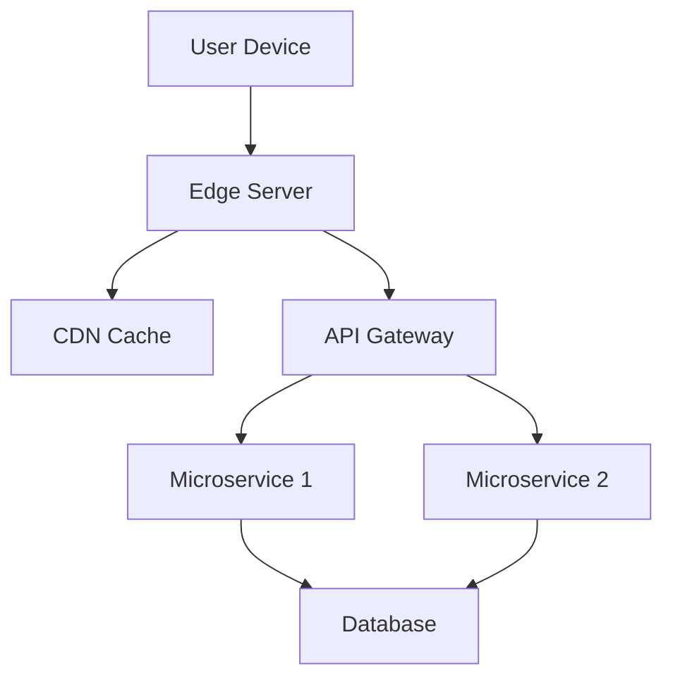

```markdown
# Mastering Edge Observability: Debugging and Monitoring Distributed Systems at the Edge

## Introduction

In today's backend engineering world, applications rarely run in isolated, self-contained environments. Instead, they're distributed across cloud regions, edge locations, and even on-premises servers, interacting with a myriad of microservices and external APIs. This distributed nature brings unprecedented scalability and resilience—but also introduces complexity, particularly when it comes to observability.

Observability isn't just about logging what happens inside your data centers; it's about understanding what's happening *wherever your application touches users*. That's where **edge observability** comes in. Unlike traditional monitoring that focuses on centralized components like API gateways or application servers, edge observability gives you visibility into the performance and behavior of your infrastructure across all edge locations—content delivery networks (CDNs), edge servers, IoT devices, mobile apps, and even the user's device itself.

In this guide, we'll explore why edge observability is critical for modern applications, how to implement it effectively, and what pitfalls to avoid along the way. We'll cover practical solutions with code examples, tools, and frameworks that you can apply to your next project or improve in your existing distributed systems.

---

## The Problem: Why Traditional Observability Fails at the Edge

Let's start with why your current observability stack might not be sufficient for edge systems.

### The Distributed Complexity Problem

Consider a typical modern application architecture with these components:



In this architecture:
- The user's request might touch multiple edge locations before reaching your application
- Each edge location could be in a different geographical region
- Data might be cached at various points along the way
- Different components might use different protocols (HTTP/1.1, HTTP/2, gRPC, WebSockets)
- Some components might be serverless functions or event-driven services

With traditional monitoring focused primarily on your servers and data centers, you might:
- Miss latency issues happening at the CDN level
- Not detect cache misses or stale content at the edge
- Lose visibility into how mobile network conditions affect your users
- Be blind to regional performance differences
- Struggle to trace errors that originate at the edge but propagate through your system

### The Data Volume Challenge

Edge systems generate massive amounts of data:
- Millions of user interactions per second
- Thousands of edge servers worldwide
- Complex request paths with hundreds of microservices

Your observability stack must be:
- **Efficient**: Lightweight enough to run at the edge
- **Scalable**: Able to handle petabytes of data
- **Real-time**: Capable of processing and analyzing streams as they arrive

### The Real-world Impact

The lack of proper edge observability can lead to:
- Suboptimal content delivery (e.g., serving stale content from caches)
- Poor user experiences due to undiscovered latency spikes in edge regions
- Inability to effectively A/B test content delivery strategies
- Security blind spots (e.g., not detecting DDoS attacks at the edge)

Let's explore how to address these challenges with edge observability patterns.

---

## The Solution: Edge Observability Patterns

Edge observability isn't a single tool or technology—it's a combination of patterns and practices that give you visibility into your application's behavior across all edge locations. The key components include:

1. **Distributed Tracing** for request flows across all components
2. **Edge-specific Metrics** for CDNs, edge servers, and client devices
3. **Real-time Event Streaming** to process edge data immediately
4. **Client-side Monitoring** to collect data from user devices
5. **Context Propagation** to maintain request context across edge locations
6. **Lightweight Instrumentation** that doesn't impact performance

Let's dive into each of these with practical examples.

---

## Implementation Guide: Building Your Edge Observability System

### 1. Distributed Tracing Across the Edge

Distributed tracing helps you understand the complete journey of a user request through your system, including all edge components. Here's how to implement it:

#### JavaScript Example: Instrumenting Edge Server (Node.js)

```javascript
// Using OpenTelemetry for distributed tracing

const { NodeTracerProvider } = require('@opentelemetry/sdk-trace-node');
const { JaegerExporter } = require('@opentelemetry/exporter-jaeger');
const { getNodeAutoInstrumentations } = require('@opentelemetry/auto-instrumentations-node');

const provider = new NodeTracerProvider();
provider.addSpanProcessor(new BatchSpanProcessor(
  new JaegerExporter({
    endpoint: 'https://jaeger-collector:14268/api/traces',
    serviceName: 'edge-server'
  })
));

// Automatically instrument HTTP servers
provider.register(new getNodeAutoInstrumentations());

// Custom instrumentation for edge-specific operations
const { trace } = require('@opentelemetry/api');
const { SpanStatusCode } = require('@opentelemetry/sdk-traces-base');

function fetchFromCDN(url) {
  // Start a span for CDN operation
  const span = trace.getSpan(context.active());
  const cdnSpan = span.startChild({
    name: 'CDN Fetch',
    kind: SpanKind.CLIENT
  });

  // Simulate CDN fetch
  const response = await fetch(url);
  const content = await response.text();

  // Record metrics about the CDN operation
  cdnSpan.setAttribute('http.status_code', response.status);
  cdnSpan.setAttribute('http.method', response.request.method);
  cdnSpan.setAttribute('cdn.cache_hit', response.headers.get('X-CDN-Cache') === 'HIT');
  cdnSpan.setStatus({
    code: response.status >= 400 ? SpanStatusCode.ERROR : SpanStatusCode.OK
  });

  cdnSpan.end();
  return content;
}
```

#### Cloudflare Workers Example: Edge Function Tracing

```javascript
// workers-site.js
addEventListener('fetch', event => {
  const tracer = createTracer();
  const span = tracer.startSpan('fetchEvent');

  event.respondWith(handleRequest(event, span));
});

async function handleRequest(event, span) {
  const clientSpan = span.startChild({ name: 'clientRequest' });
  clientSpan.setAttribute('http.method', event.request.method);
  clientSpan.setAttribute('request.url', event.request.url);

  try {
    // Process request and interact with other edge resources
    const response = await fetch('https://api.example.com/data', {
      headers: { 'X-Trace-ID': span.spanContext().traceId }
    });

    clientSpan.setAttribute('http.status', response.status);
    clientSpan.setStatus({ code: 'OK' });

    return new Response(response.body, {
      status: response.status,
      headers: response.headers
    });
  } catch (error) {
    clientSpan.setAttribute('error.type', error.name);
    clientSpan.setStatus({ code: 'ERROR' });
    throw error;
  } finally {
    clientSpan.end();
    span.end();
  }
}
```

### 2. Edge-specific Metrics Collection

You need metrics that are specific to edge environments. Here's what to collect:

#### Metrics to Track at the Edge

| Metric Category          | Example Metrics                          | Purpose                                  |
|--------------------------|------------------------------------------|------------------------------------------|
| CDN Performance          | Cache hit ratio, TTFB, Object size       | Measure content delivery efficiency       |
| Network Conditions       | Latency, Packet loss, Bandwidth          | Understand network impact on performance  |
| Client Device            | Device type, OS, Browser, Connection type| Segment users for targeted monitoring     |
| Edge Function Performance| Execution time, Memory usage, Invocations | Monitor serverless edge functions        |

#### Prometheus + Grafana Example

```yaml
# edge_metrics_config.yml - Configuration for scraping edge metrics

scrape_configs:
  - job_name: 'edge_functions'
    metrics_path: '/metrics'
    static_configs:
      - targets: ['edge-function-1:8080', 'edge-function-2:8080']
    relabel_configs:
      - source_labels: [__meta_azure_container_name]
        target_label: instance
        regex: 'edge-(.*)'

  - job_name: 'cdn_performance'
    file_sd_configs:
      - files: ['edge_cdn_sources.json']
    relabel_configs:
      - source_labels: [__address__]
        target_label: __tmp_address__
      - source_labels: [__tmp_address__]
        regex: '(.*):.+'
        target_label: __address__
        replacement: '$1:8000'
      - target_label: instance
        replacement: '${1}_cdn'
```

### 3. Real-time Event Streaming

Edge data needs to be processed in real-time to provide timely insights. Here's how to implement event streaming:

#### Kafka Streams Example (Java)

```java
// EdgeMetricsProcessor.java
import org.apache.kafka.streams.*;
import org.apache.kafka.streams.kstream.*;

public class EdgeMetricsProcessor {
    public static void main(String[] args) {
        StreamsBuilder builder = new StreamsBuilder();

        // Read from edge metrics topics
        KStream<String, EdgeMetrics> edgeMetricsStream = builder.stream("edge-metrics",
            Consumed.with(Serdes.String(), EdgeMetricsSerde.class));

        // Process metrics in real-time
        KTable<String, Double> cacheHitRatioTable = edgeMetricsStream
            .filter((key, metrics) -> metrics.getCacheHits() > 0)
            .groupBy((key, metrics) -> "global")
            .aggregate(
                () -> 0.0,
                (key, value, aggregate) ->
                    (double) (value.getCacheHits() * 100) /
                    (value.getCacheHits() + value.getCacheMisses()),
                Materialized.with(Serdes.String(), Serdes.Double())
            );

        // Write processed metrics to analytics topic
        cacheHitRatioTable.toStream()
            .to("cache-hit-ratio-analytics", Produced.with(Serdes.String(), Serdes.Double()));

        KafkaStreams streams = new KafkaStreams(builder.build(),
            StreamsConfig.fromProps(config));
        streams.start();
    }
}
```

### 4. Client-side Monitoring

Collect data from user devices to understand the complete user journey:

#### React Example: Client Performance Monitoring

```javascript
// src/components/PerfMonitor.js
import { useEffect } from 'react';
import { initTracing } from './tracing';

const PerfMonitor = ({ pageName }) => {
  useEffect(() => {
    // Initialize tracing with page context
    const tracer = initTracing({
      pageName,
      userAgent: navigator.userAgent,
      connectionType: navigator.connection ? navigator.connection.effectiveType : 'unknown'
    });

    // Set up performance measurement
    const performanceEntries = performance.getEntriesByType('navigation');
    const navigationPerformance = performanceEntries[0];

    // Send initial page load metrics
    tracer.trace('pageLoad', {
      type: 'pageLoad',
      time: navigationPerformance.responseStart - navigationPerformance.startTime,
      duration: navigationPerformance.duration
    });

    // Monitor subsequent requests
    const originalFetch = window.fetch;
    window.fetch = async function(...args) {
      const [url] = args;
      const span = tracer.trace('fetch', { url });

      try {
        const start = performance.now();
        const response = await originalFetch.apply(this, args);
        const duration = performance.now() - start;

        span.setAttribute('duration', duration);
        span.setAttribute('http.status', response.status);
        span.end();
        return response;
      } catch (error) {
        span.setAttribute('error', error.message);
        span.setStatus({ code: 'ERROR' });
        throw error;
      }
    };

    return () => {
      // Cleanup tracer when component unmounts
      tracer.shutdown();
    };
  }, [pageName]);

  return null;
};

export default PerfMonitor;
```

### 5. Context Propagation

Maintaining request context as it moves through edge locations is crucial:

#### Example: Context Propagation in Serverless Functions

```javascript
// context-propagation.js (example using AWS Lambda)
exports.handler = async (event, context, callback) => {
  // Extract existing context from headers
  const requestContext = {
    traceId: event.headers['x-request-id'],
    sessionId: event.headers['x-session-id'],
    userId: event.headers['x-user-id']
  };

  // Add context to new outbound requests
  const options = {
    headers: {
      'x-request-id': requestContext.traceId || context.awsRequestId,
      'x-session-id': requestContext.sessionId,
      'x-user-id': requestContext.userId
    }
  };

  // Example: Call another edge function
  const downstreamResponse = await fetch('https://edge-function.region.amazonaws.com',
    {
      method: 'POST',
      body: JSON.stringify(event),
      ...options
    });

  // Return with enriched context
  const response = {
    statusCode: downstreamResponse.status,
    body: JSON.stringify({
      ...event,
      metadata: {
        processedAt: new Date().toISOString(),
        region: context.invokedFunctionArn.split(':')[3]
      }
    }),
    headers: {
      'x-request-id': options.headers['x-request-id'],
      'Content-Type': 'application/json'
    }
  };

  callback(null, response);
};
```

### 6. Lightweight Instrumentation

Edge instrumentation must be minimal to avoid impacting performance:

#### Example: Minimal Tracing Wrapper

```javascript
// lightweight-tracing.js
class LightweightTracer {
  constructor(serviceName) {
    this.serviceName = serviceName;
    this.activeSpans = new Map();
  }

  trace(operationName, attributes = {}) {
    if (!this.isValidOperation(operationName)) return null;

    const spanId = crypto.randomUUID();
    const traceId = this.activeSpans.size > 0 ?
      this.activeSpans.values().next().value.traceId :
      crypto.randomUUID();

    const span = {
      id: spanId,
      traceId,
      name: operationName,
      startTime: performance.now(),
      attributes,
      children: []
    };

    if (this.activeSpans.size > 0) {
      const parentSpan = this.activeSpans.values().next().value;
      parentSpan.children.push(span);
    }

    this.activeSpans.set(spanId, span);
    return span;
  }

  end(spanId) {
    const span = this.activeSpans.get(spanId);
    if (span) {
      span.endTime = performance.now();
      this.activeSpans.delete(spanId);
      return span;
    }
    return null;
  }

  getSpan(spanId) {
    return this.activeSpans.get(spanId);
  }

  // Keep only essential methods for minimal footprint
  isValidOperation(operationName) {
    // Simple validation - could be enhanced
    return operationName && typeof operationName === 'string' && operationName.length <= 100;
  }
}

// Initialize for edge environment
const tracer = new LightweightTracer('edge-server');
module.exports = { tracer };
```

---

## Common Mistakes to Avoid

When implementing edge observability, be aware of these common pitfalls:

1. **Over-instrumenting**: Adding too many metrics or traces can slow down edge functions and increase costs.

   - *Solution*: Focus on key paths and metrics that provide the most value. Use sampling for high-volume operations.

2. **Ignoring Edge-specific Context**: Treating edge data the same as server data leads to missing insights.

   - *Solution*: Design metrics and traces specifically for edge scenarios that include edge-specific attributes (region, CDN cache status, client device info).

3. **Poor Context Propagation**: Failing to maintain request context through edge hops makes tracing incomplete.

   - *Solution*: Implement consistent context propagation headers across all edge components.

4. **Underestimating Data Volume**: Edge systems generate massive amounts of data that can overwhelm your observability stack.

   - *Solution*: Implement data sampling, aggregation, and retention policies appropriate for edge data.

5. **Centralized Processing Bottlenecks**: Sending all edge data to a central location can create performance issues.

   - *Solution*: Implement edge-side processing where possible and only send aggregated or filtered data to centralized systems.

6. **Not Testing Edge Scenarios**: Observability systems that work well in development may fail under real edge conditions.

   - *Solution*: Test with realistic edge loads and scenarios including network partitions, high latency, and device constraints.

7. **Security Blind Spots**: Edge environments often have different security requirements than centralized systems.

   - *Solution*: Implement secure data collection at the edge and encrypt all observability data in transit and at rest.

---

## Key Takeaways

Here are the essential lessons from implementing edge observability:

- **Visibility is key**: Edge observability gives you visibility into the complete user journey across all edge components, not just your servers.
- **Context matters**: Maintain request context as it moves through edge locations to provide complete tracing.
- **Instrumentation must be lightweight**: Edge components have different performance constraints than traditional servers.
- **Different metrics for different edges**: CDNs, mobile apps, and edge servers require different sets of metrics.
- **Real-time processing is essential**: Edge data often requires immediate processing to be useful.
- **Security must be built in**: Edge observability data needs protection from the same threats as your application data.
- **Start small**: Begin with critical edge paths and metrics, then expand based on what provides the most value.
- **Test thoroughly**: Edge environments introduce unique challenges that aren't present in traditional data centers.

---

## Conclusion

Edge observability represents a paradigm shift in how we monitor and understand distributed applications. As applications move closer to users and spread across more diverse environments, the importance of edge observability will only grow.

The key to successful implementation is to:
1. Start with clear goals of what you want to understand about your edge infrastructure
2. Choose the right tools and instrumentation for each edge component
3. Implement context propagation to maintain request visibility across all edge locations
4. Process data at the edge where possible to reduce volume
5. Continuously test and refine your observability system as your application evolves

By implementing the patterns and practices described in this guide, you'll gain a comprehensive view of your application's performance and behavior across all edge locations, leading to better user experiences, more efficient resource usage, and more robust applications.

As you build out your edge observability system, remember that it will evolve alongside your application. What seems sufficient today might need enhancement tomorrow as your architecture changes or as new edge components are added. Embrace this iterative approach, and you'll be well on your