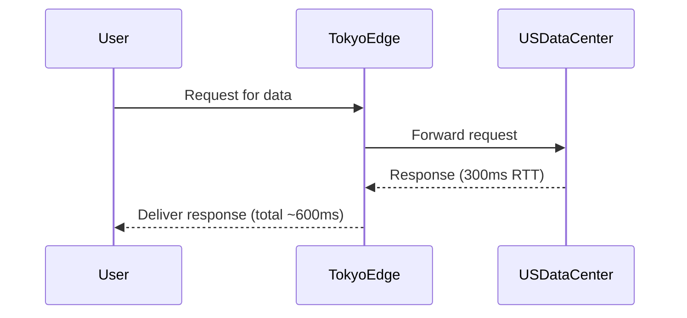

```markdown
# **Edge Optimization: Reducing Latency by Bringing Data Closer to Users**

*How to deploy your API and database logic at the network edge for faster responses, lower costs, and resilient global applications*

---

## **Introduction**

In today’s global, multi-cloud world, users expect sub-100ms response times—no matter their location. Traditional backend architectures, where all requests flow through centralized data centers, struggle to meet these expectations due to latency, bandwidth constraints, and scalability bottlenecks.

**Edge optimization** addresses this by distributing computation, caching, and storage closer to end-users. By offloading processing to edge nodes—geographically distributed servers between users and your main infrastructure—you can reduce latency, save bandwidth, and improve resilience.

But implementing edge optimization isn’t just about throwing more servers at the problem. It requires thoughtful design around **caching strategies, dynamic routing, and partial offloading** of logic to avoid consistency pitfalls. This guide covers:
- When and why to use edge optimization
- Key components (CDNs, edge functions, edge databases)
- Practical tradeoffs and real-world examples
- Implementation best practices and common mistakes

Let’s dive in.

---

## **The Problem: Why Edge Optimization Matters**

### **1. Latency Kills Performance**
Consider a user in Tokyo accessing an API hosted in a US data center:

Even with optimized networks, the roundtrip time (RTT) from Japan to the US adds **300–500ms**. For a single API call, this isn’t critical—but for a **SPA with 20+ API calls**, latency compounds, creating a perceived slowdown.

### **2. Bandwidth Costs Plummet Under High Traffic**
High-traffic APIs (e.g., a global e-commerce site) can incur **significant egress costs** when users fetch the same static assets repeatedly. Without caching, every request hits your origin server, blowing up bills:
```bash
# Example AWS bill for 1TB egress at $0.09/GB:
$0.09 × 1,000 = **$90 per month**
```
Edge caching (e.g., Cloudflare Workers, CloudFront) reduces this by serving cached copies from nearby locations.

### **3. Resilience Improves User Experience**
Relying on a single region creates single points of failure. Edge optimization distributes traffic across multiple locations, ensuring users stay connected even if one region goes down.

---

## **The Solution: Key Components of Edge Optimization**

Edge optimization combines **multiple techniques** to reduce latency and offload workloads. Here’s how they fit together:

| **Component**          | **Purpose**                                                                 | **Example Providers**                     |
|------------------------|-----------------------------------------------------------------------------|-------------------------------------------|
| **Edge Caching**       | Store static/dynamic content closer to users.                              | Cloudflare Cache, Fastly Edge Cache      |
| **Edge Functions**     | Run lightweight scripts (e.g., auth, transformations) at the edge.        | Cloudflare Workers, Vercel Edge Functions |
| **Edge Databases**     | Deploy lightweight databases (e.g., Redis) at the edge for fast reads.   | PlanetScale Edge DBs, Supabase Edge DB   |
| **Geographic Routing** | Direct users to the nearest API/DB instance.                              | AWS Global Accelerator, Fastly Edge      |
| **Edge API Gateways**  | Route requests to the optimal backend (e.g., regional APIs).               | Kong Ingress Controller, Apigee Edge      |

---

## **Code Examples: Implementing Edge Optimization**

### **1. Edge Caching with Cloudflare Workers**
Cache API responses dynamically to avoid hitting your backend:
```javascript
// Cloudflare Worker (edge.js)
addEventListener('fetch', event => {
  event.respondWith(handleRequest(event.request))
})

async function handleRequest(request) {
  // Check cache first (TTL: 5 minutes)
  const cache = caches.default;
  const cachedResponse = await cache.match(request);

  if (cachedResponse) {
    return cachedResponse;
  }

  // Fall back to origin if not cached
  const originResponse = await fetch(request);
  const clone = originResponse.clone();

  // Cache response with dynamic metadata
  await cache.put(request, clone);
  return originResponse;
}
```

### **2. Edge-First API with Vercel Edge Functions**
Deploy lightweight API logic at the edge to reduce latency:
```javascript
// Vercel Edge Function (edge-api.js)
export default async function handler(req, { next }) {
  // Example: Validate JWT before forwarding to backend
  const token = req.headers.authorization?.split(' ')[1];
  if (!token || !isValidToken(token)) {
    return new Response('Unauthorized', { status: 401 });
  }

  // Offload non-critical logic to the edge
  const userId = decodeToken(token).userId;

  // Proxy request to regional backend
  const backendUrl = getRegionalBackendURL(req);
  const response = await fetch(backendUrl, {
    headers: { 'X-User-ID': userId },
  });
  return response;
}
```

### **3. Edge Database with PlanetScale**
Deploy a lightweight SQL database at the edge for fast reads:
```sql
-- Deploy a PlanetScale Edge DB (example schema)
CREATE TABLE products (
  id VARCHAR(36) PRIMARY KEY,
  name TEXT NOT NULL,
  price DECIMAL(10, 2) NOT NULL,
  created_at TIMESTAMP NOT NULL DEFAULT CURRENT_TIMESTAMP
);

-- Edge-specific query: Read from the nearest replica
SELECT * FROM products WHERE id = '123e4567-e89b-12d3-a456-426614174000'
-- Runs on the edge node closest to the user.
```

### **4. Dynamic Geographic Routing with AWS Global Accelerator**
Route users to the nearest API endpoint:
```yaml
# AWS Global Accelerator configuration
Resources:
  EdgeOptimizationGateway:
    Type: AWS::GlobalAccelerator::Accelerator
    Properties:
      Enabled: true
      IpAddressType: IPv4
      Name: MyEdgeOptimizedAPI
      Listeners:
        - PortRanges:
            - Min: 80
              Max: 80
          Protocol: HTTP
          ClientAffinity: SOURCE_IP
          EndpointGroups:
            - EndpointConfigurations:
                - EndpointId: !RefRegionalEndpoint1
                  Weight: 100
                - EndpointId: !RefRegionalEndpoint2
                  Weight: 50
```

---

## **Implementation Guide**

### **Step 1: Audit Your Workload for Edge Potential**
Not all workloads benefit from edge optimization. Ask:
- **Is this request read-heavy?** (Caching works well.)
- **Is the logic lightweight?** (Edge functions have limited compute.)
- **Does the user care about latency?** (Mobile users > desktop.)

For example:
- **Good for edge:** Static assets, auth tokens, simple transformations.
- **Avoid edge:** Heavy ML inference, long-running DB queries.

### **Step 2: Start with Edge Caching**
Begin with **static caching** (e.g., images, CSS) using a CDN like Cloudflare or Fastly. Example:
```bash
# Cloudflare Cache Rules (Zones > Page Rules)
Example: Cache all `/static` requests for 1 year
```
Measure impact with tools like [WebPageTest](https://www.webpagetest.org/).

### **Step 3: Offload Simple Logic to Edge Functions**
Move non-critical business logic to edge functions. Example:
```javascript
// Edge function: Validate JWT and reformat user data
addEventListener('fetch', event => {
  const token = event.request.headers.get('Authorization');
  const user = decodeJWT(token);

  // Reformat for consistency
  event.respondWith(new Response(JSON.stringify({
    id: user.sub,
    name: user.given_name,
    email: user.email
  })));
});
```

### **Step 4: Deploy Edge Databases for Fast Reads**
Use edge databases like **Supabase Edge Functions** or **PlanetScale Edge** for low-latency reads:
```javascript
// Supabase Edge Function (example)
async function getProductById(id) {
  const { data, error } = await supabase
    .from('products')
    .select('*')
    .eq('id', id)
    .edge(); // Runs on the nearest edge node
  return data;
}
```

### **Step 5: Implement Geographic Routing**
Use a service like **AWS Global Accelerator** or **Fastly Edge** to route users to the nearest backend:
```javascript
// Logic to pick the nearest backend (example pseudocode)
function getNearestBackend(userLocation) {
  const regions = [
    { name: 'us-east-1', dist: calculateDistance(userLocation, 'us-east-1') },
    { name: 'eu-west-1', dist: calculateDistance(userLocation, 'eu-west-1') }
  ];
  return regions.sort((a, b) => a.dist - b.dist)[0].name;
}
```

### **Step 6: Monitor and Optimize**
Track edge performance with:
- **Edge latency metrics** (e.g., Cloudflare Workers `hitRate`, `cacheRatio`).
- **End-user latency** (RUM tools like Datadog, Google Analytics).
- **Cost vs. benefit** (e.g., edge caching savings vs. compute costs).

---

## **Common Mistakes to Avoid**

### **1. Over-Optimizing Without Measuring**
❌ **Mistake:** Offloading everything to the edge without benchmarking.
✅ **Fix:** Start with **low-risk** optimizations (e.g., static caching) and measure impact.

### **2. Ignoring Cache Invalidation**
❌ **Mistake:** Caching API responses indefinitely, causing stale data.
✅ **Fix:** Use **short TTLs** (e.g., 5–30 minutes) or **purge-based invalidation**:
```javascript
// Cloudflare Worker: Invalidate cache on write
addEventListener('fetch', event => {
  if (event.request.url.includes('/api/products/123')) {
    await caches.default.delete(event.request);
  }
});
```

### **3. Edge Functions for Heavy Computation**
❌ **Mistake:** Running complex logic (e.g., ML models) at the edge.
✅ **Fix:** Keep edge functions **<100ms** and offload heavy work to your main backend.

### **4. No Fallback to Origin**
❌ **Mistake:** Relying entirely on edge caching without a fallback.
✅ **Fix:** Always **check cache first**, then fall back:
```javascript
// Edge function with fallback
async function fetchWithFallback(url) {
  try {
    const cache = caches.default;
    const cached = await cache.match(url);
    if (cached) return cached;

    const response = await fetch(url);
    cache.put(url, response.clone());
    return response;
  } catch (error) {
    console.error('Cache fallback failed:', error);
    return fetch(url); // Hit origin
  }
}
```

### **5. Underestimating Costs**
❌ **Mistake:** Assuming edge optimization is "free" (e.g., infinite edge cache hits).
✅ **Fix:** Monitor **edge egress costs** (e.g., Cloudflare Workers charges per request).

---

## **Key Takeaways**

✅ **Edge optimization reduces latency** by bringing data closer to users.
✅ **Start with caching** (static assets → dynamic responses → edge DBs).
✅ **Use edge functions for simple logic** (auth, transformations).
✅ **Geographic routing improves resilience** and performance.
✅ **Always measure impact**—not every workload benefits.
✅ **Avoid edge for heavy computation**—offload to your main backend.
✅ **Invalidate caches properly** to prevent stale data.
✅ **Monitor costs**—edge services can incur hidden expenses.

---

## **Conclusion**

Edge optimization is **not a one-size-fits-all solution**, but it’s a powerful tool for **low-latency, resilient global applications**. By strategically deploying caching, lightweight functions, and edge databases, you can:
- **Reduce latency** from 300ms to <50ms.
- **Cut bandwidth costs** by 50–90%.
- **Improve fault tolerance** with multi-region deployment.

**Start small:**
1. Cache static assets.
2. Offload simple auth/logic to edge functions.
3. Deploy edge databases for read-heavy workloads.

Then scale based on **real metrics**, not assumptions. The edge isn’t just for tech giants—it’s a practical tool for any global application.

**Next steps:**
- Try [Cloudflare Workers](https://workers.cloudflare.com/) for caching.
- Experiment with [Vercel Edge Functions](https://vercel.com/docs/functions/edge-functions).
- Read up on [ PlanetScale’s Edge DBs](https://planetscale.com/docs/edge-databases).

Happy optimizing!
```

---
**Further Reading:**
- [Cloudflare’s Guide to Edge Computing](https://developers.cloudflare.com/workers/)
- [AWS Edge Optimization Best Practices](https://aws.amazon.com/architecture/edge-optimization/)
- [Edge Functions vs. Serverless: When to Use Each](https://supabase.com/blog/edge-functions-vs-serverless)