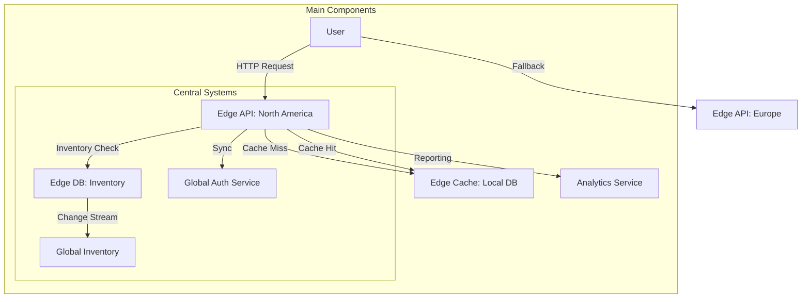

```markdown
---
title: "Edge Setup Pattern: Building Performant APIs for Distributed Architectures"
date: "2023-11-15"
tags: ["database design", "api design", "distributed systems", "cloud-native", "backend engineering", "performance optimization"]
---

# Edge Setup Pattern: Building Performant APIs for Distributed Architectures

## Introduction

In today’s cloud-native and multi-region applications, your users interact with services that span continents—sometimes imperceptibly to them, but with significant complexity behind the scenes. Your backend can’t wait for data to travel across the globe or slow down because every request must pass through a central monolithic API. The **Edge Setup Pattern** is a strategic approach to distributing your computation and data access logic closer to your users, reducing latency, improving reliability, and scaling your infrastructure efficiently.

This pattern isn’t about slapping a CDN in front of your API and leaving it at that. It’s about **intentionally designing your backend to operate at multiple "edges"**—locations where your application can make local decisions with minimal dependency on a centralized backend. Think of it as the difference between solving problems with a single powerful CPU core vs. leveraging a multi-core cluster or even a distributed system where each core can handle specific tasks autonomously.

In this post, we’ll explore how to architect and implement the Edge Setup Pattern for APIs. We’ll cover its components, tradeoffs, real-world applications, and practical code examples—so you can apply this pattern to your own systems. Whether you’re working with microservices, serverless functions, or traditional APIs, understanding how to deploy logic at the edge can transform your system’s performance and resilience.

---

## The Problem

Without proper edge setup, distributed systems suffer from critical inefficiencies and reliability issues:

1. **High Latency**: Users in different regions experience delays because every request must travel to a central data center or API endpoint. Even with a low-latency backbone (e.g., AWS Global Accelerator), a round-trip time (RTT) to a distant region can add hundreds of milliseconds—felt as slow or unresponsive UIs.
   ```mermaid
   graph LR
     User(A) -->|HTTP Request| CentralAPI(B)
     CentralAPI(B) -->|Query DB| Database(C)
     Database(C) -->|Response| CentralAPI(B)
     CentralAPI(B) -->|Response| User(A)
     subgraph Legacy Design
       B & C
     end
   ```
   This traditional approach forces all traffic through a single bottleneck, whether it's an API server or a database in one region.

2. **Single Point of Failure**: Relying on a centralized backend means downtime in one region can affect users globally. For example, an API outage in one region will cascade to all clients unless you have redundant systems.

3. **Scaling Challenges**: Centralized APIs and databases require horizontal scaling, which can be costly and complex. Each additional region adds infrastructure overhead, whether in the cloud or on-premises.

4. **Real-World Example: E-commerce Traffic Surge**
   Imagine a company like ASOS, which experiences traffic spikes during flash sales. During a sale, users across Europe, the US, and Asia generate overwhelming demand. If the backend API is hosted in a single region (e.g., US), users in Europe experience noticeably slower response times, leading to abandoned carts. Meanwhile, the US servers are overwhelmed, causing outages. A centralized design fails to balance the load geographically.

5. **Data Inconsistency**: Distributed systems often struggle with **eventual consistency** when data must be updated across multiple locations. The CAP theorem reminds us that in distributed systems, you can't always have both consistency and partition tolerance.

6. **Egress Costs**: Transferring data between regions or across clouds incurs network costs. For example, fetching user data from a database in Auckland for a user in London adds latency and potential egress charges.

These issues aren’t just theoretical—they’re tangible problems that can lead to bad user experiences, higher operational costs, and maintenance nightmares.

---

## The Solution

The Edge Setup Pattern addresses these challenges by distributing computation and data access closer to end users. Here’s how it works:

### Core Idea
The Edge Setup Pattern involves **decentralizing** your application’s logic and data access to multiple "edges" or regions. Each edge acts as a localized instance of your application, handling requests and data access independently while coordinating with a central system for critical operations (such as authentication or global state updates).

This pattern relies on two key principles:
1. **Local-first processing**: Handle as much logic as possible at the edge (e.g., caching, data validation, transformation, or even simple business logic).
2. **Selective synchronization**: Minimize the need for constant synchronization between edges by leveraging techniques like conflict resolution, optimistic concurrency, or eventual consistency.

### Components of the Edge Setup Pattern

| Component          | Description                                                                                                                                             | Example Use Cases                                                                                         |
|--------------------|---------------------------------------------------------------------------------------------------------------------------------------------------------|-----------------------------------------------------------------------------------------------------------|
| **Edge API**       | Lightweight API endpoints deployed close to users, handling requests with minimal backend interaction.                                                 | Routing logic, rate limiting, basic authentication, or simple analytics.                                |
| **Edge Cache**     | In-memory or local storage for frequently accessed data, reducing latency and offloading backend databases.                                             | User profiles, product catalogs, or session data.                                                        |
| **Edge Database**  | Replicated or distributed databases optimized for low-latency reads and writes in specific regions.                                                   | Storing user preferences or regional content.                                                           |
| **Global Sync**    | Mechanisms to synchronize data between edges (e.g., Kafka, CQRS, or change data capture).                                                          | Handling updates to user accounts or inventory in real time.                                           |
| **Fallback Logic** | Strategies for handling edge failures, such as routing to another edge or degrading to a minimal service.                                          | Redirecting users to a backup CDN if the primary edge cache fails.                                      |

By combining these components, you create a system where most user interactions are handled locally, reducing the need for cross-region communication.

---

## Practical Implementation Guide

Let’s break down how to implement the Edge Setup Pattern in a real-world scenario, using a **multi-region e-commerce platform**. We’ll focus on:
1. Deploying an edge API for user product searches.
2. Implementing an edge cache for frequently searched products.
3. Handling eventual consistency for inventory.

---

### Architecture Overview



---

### Step 1: Edge API Deployment

We’ll use **FastAPI** (a Python framework) to demonstrate an edge API that handles product searches. The goal is to minimize backend calls by serving cached results.

#### Code: Edge API for Product Search

```python
# edge_server/edge_api/main.py
from fastapi import FastAPI, Request
from fastapi.responses import JSONResponse
from typing import Dict, List, Optional
import httpx  # HTTP client for backend calls

app = FastAPI()
# Mock edge cache (in-memory)
edge_cache: Dict[str, List] = {}

# Central backend API endpoint (for fallback)
CENTRAL_API_URL = "https://backend.example.com/api/products/"

async def fetch_from_central_api(product_id: str) -> List:
    """Fetch product details from central backend if cache miss."""
    async with httpx.AsyncClient() as client:
        response = await client.get(f"{CENTRAL_API_URL}{product_id}")
        response.raise_for_status()
        return response.json()

@app.get("/products/{product_id}")
async def search_product(product_id: str, request: Request):
    """
    Search for a product:
    1. Check edge cache.
    2. If cache miss, fetch from central API.
    3. Return result (or fallback if central API fails).
    """
    # Check edge cache first
    if product_id in edge_cache:
        return JSONResponse(content=edge_cache[product_id])

    try:
        product_data = await fetch_from_central_api(product_id)
        # Cache for 5 minutes (adjust TTL as needed)
        edge_cache[product_id] = product_data
        return product_data
    except Exception as e:
        # Fallback: Return a degraded response or redirect
        return JSONResponse(
            status_code=503,
            content={"error": "Service unavailable, try again later."}
        )
```

#### Edge API Deployment (Terraform Example)
To deploy this API globally, we’ll use Terraform to provision AWS CloudFront (edge caching) and Lambda@Edge (for custom logic). Here’s how to configure it:

```hcl
# terraform/main.tcf
variable "region" {
  type = string
  default = "us-west-2"
}

provider "aws" {
  region = var.region
}

resource "aws_cloudfront_distribution" "edge_api" {
  origin {
    domain_name = "lambda-url.${data.aws_lambda_function.edge_api.function_arn}.on.aws"
    origin_id   = "edge-api-origin"
  }

  enabled             = true
  default_root_object = "index.html"

  default_cache_behavior {
    allowed_methods  = ["GET"]
    cached_methods   = ["GET"]
    target_origin_id = "edge-api-origin"

    viewer_protocol_policy = "redirect-to-https"

    min_ttl     = 0
    default_ttl = 3600
    max_ttl     = 86400

    forwarded_values {
      query_string = true
    }
  }

  restrictions {
    geo_restriction {
      restriction_type = "none"
    }
  }
}

resource "aws_lambda_function" "edge_api" {
  function_name = "edge-product-search"
  runtime       = "python3.9"
  handler       = "lambda_function.lambda_handler"
  role          = aws_iam_role.lambda_role.arn

  filename      = "edge_api_lambda.zip"
  source_code_hash = filebase64sha256("edge_api_lambda.zip")

  environment {
    variables = {
      CENTRAL_API_URL = "https://backend.example.com/api/products/"
    }
  }
}
```

**Notes:**
- The `edge_api_lambda.zip` contains the FastAPI server wrapped for Lambda.
- CloudFront acts as a global cache for the edge API responses.
- This setup ensures users are served from the nearest CloudFront edge location.

---

### Step 2: Edge Cache Implementation

For more advanced caching, we’ll use **Redis on AWS ElastiCache**. We’ll deploy a Redis cluster in each region to cache frequently accessed products.

#### Code: Redis Cache Strategy

```python
# edge_server/edge_api/redis_cache.py
import redis
import json
from typing import Optional

class RedisCache:
    def __init__(self, host: str, port: int, db: int = 0, ttl: int = 300):
        self.client = redis.Redis(host=host, port=port, db=db)
        self.ttl = ttl  # Cache TTL in seconds

    def get(self, key: str) -> Optional[str]:
        """Retrieve cached data by key."""
        return self.client.get(key)

    def set(self, key: str, value: str) -> None:
        """Set cached data with TTL."""
        self.client.setex(key, self.ttl, value)

    def delete(self, key: str) -> None:
        """Remove a key from cache."""
        self.client.delete(key)
```

**Update `main.py` to use Redis:**
```python
from edge_server.edge_api.redis_cache import RedisCache

# Initialize Redis cache
edge_cache = RedisCache(host="redis.example.com", port=6379)

# Modify search_product to use Redis
@app.get("/products/{product_id}")
async def search_product(product_id: str):
    # Cache key format: product:{id}
    cache_key = f"product:{product_id}"

    # Check Redis cache
    cached_data = edge_cache.get(cache_key)
    if cached_data:
        return JSONResponse(content=json.loads(cached_data))

    try:
        product_data = await fetch_from_central_api(product_id)
        edge_cache.set(cache_key, json.dumps(product_data))
        return product_data
    except Exception as e:
        return JSONResponse(status_code=503, content={"error": "Service unavailable."})
```

---

### Step 3: Inventory Management with Eventual Consistency

For inventory, we need to handle updates across regions. Here’s how we can implement this:

1. **Edge Inventory**: Each region has a local inventory database.
2. **Change Streams**: Global inventory updates propagate to all edges via Kafka or similar.
3. **Conflict Resolution**: Use optimistic concurrency or versioned updates.

#### Code: Inventory Update Flow

```python
# edge_server/edge_inventory/inventory_service.py
from typing import Dict, Optional
import json
import requests

class InventoryService:
    def __init__(self, region: str, kafka_broker: str):
        self.region = region
        self.kafka_broker = kafka_broker
        self.local_db = {}  # Mock local inventory DB

    def update_local_inventory(self, product_id: str, quantity: int) -> bool:
        """Update inventory in the local region."""
        if product_id not in self.local_db:
            self.local_db[product_id] = 0
        self.local_db[product_id] += quantity
        self._publish_inventory_change(product_id)
        return True

    def _publish_inventory_change(self, product_id: str) -> None:
        """Send change event to Kafka topic."""
        change_event = {
            "product_id": product_id,
            "region": self.region,
            "quantity": self.local_db[product_id]
        }
        # In a real system, use a Kafka client (e.g., confluent_kafka)
        print(f"Publishing inventory change: {json.dumps(change_event)}")

    def get_inventory(self, product_id: str) -> int:
        """Check inventory in local region."""
        return self.local_db.get(product_id, 0)
```

#### Handling Global Inventory Sync

Use a Kafka consumer to handle incoming inventory changes across all edges:

```python
# edge_server/inventory_sync/kafka_consumer.py
import json
from confluent_kafka import Consumer

class InventorySync:
    def __init__(self, region: str, bootstrap_servers: str):
        self.region = region
        self.consumer = Consumer({
            'bootstrap.servers': bootstrap_servers,
            'group.id': f"inventory-sync-{region}",
            'auto.offset.reset': 'earliest'
        })
        self.consumer.subscribe(['inventory-changes'])

    def run(self):
        """Sync inventory changes from Kafka."""
        while True:
            msg = self.consumer.poll(1.0)
            if msg is None:
                continue
            if msg.error():
                print(f"Error: {msg.error()}")
                continue

            change_event = json.loads(msg.value().decode('utf-8'))
            print(f"Received change: {change_event}")

            # Update local inventory if the change is for a different region
            if self.region != change_event['region']:
                # Optimistic concurrency: Assume no conflicts
                self._update_local_inventory(change_event['product_id'], change_event['quantity'])

    def _update_local_inventory(self, product_id: str, quantity: int) -> None:
        """Update local inventory with sync data."""
        # In a real system, use a local DB
        print(f"Syncing inventory for {product_id} (new value: {quantity})")
```

---

## Common Mistakes to Avoid

Implementing the Edge Setup Pattern correctly requires careful planning. Here are common pitfalls to avoid:

1. **Overloading the Edge with Complex Logic**
   - Avoid running monolithic services at the edge. Instead, keep logic simple and delegate complex operations to centralized services.
   - **Mitigation**: Use lightweight edge functions (e.g., Lambda@Edge) for filtering, caching, or transformation.

2. **Ignoring Cache Invalidation**
   - Not properly invalidating caches when data changes can lead to stale data.
   - **Mitigation**: Implement a pub/sub system (e.g., Kafka) to notify all edges of data changes.

3. **Inconsistent Data Between Edges**
   - Without proper synchronization, edges may diverge, leading to data conflicts.
   - **Mitigation**: Use conflict-free replicated data types (CRDTs) or last-write-wins with timestamps.

4. **Underestimating Costs**
   - Deploying edges in multiple regions incurs infrastructure costs, and synchronization may add complexity.
   - **Mitigation**: Start with a single region, monitor costs, and scale incrementally.

5. **Not Testing Edge Failures**
   - Assume edges will fail. Always design for graceful degradation.
   - **Mitigation**: Use chaos engineering to test resilience (e.g., [Gremlin](https://www.gremlin.com/)).

6. **Overcomplicating the Sync Mechanism**
   - Simple sync strategies (e.g., manual polling) can work for low-traffic systems, but complex systems need a robust ETL pipeline.
   - **Mitigation**: Start with a basic Kafka consumer or change data capture (CDC) tool like Debezium.

7. **Neglecting Monitoring and Observability**
   - Without logs, metrics, and tracing, you won’t know how your edges are performing.
   - **Mitigation**: Use tools like Datadog, Grafana, or Prometheus to monitor edge latency, cache hit rates, and sync delays.

---

## Key Takeaways

| Takeaway                                                                                     | Why It Matters                                                                                      |
|---------------------------------------------------------------------------------------------|---------------------------------------------------------------------------------------------------|
| **Adopt local-first processing**                                                             | Reduces latency and offloads centralized systems.                                                  |
| **Use edge caching**                                                                    | Improves performance by serving requests from nearby locations.                                    |
| **Synchronize data selectively**                                                           | Prioritize data that must be consistent vs. data that can tolerate slight delays.                  |
| **Design for failure**                                                                    | Assume edges will fail; implement fallback mechanisms.                                            |
| **Monitor everything**                                                                    | Understand how your edges perform under load, latency, and failure scenarios.                     |
| **Start small and iterate**                                                                | Begin with a single edge, validate the approach, then scale