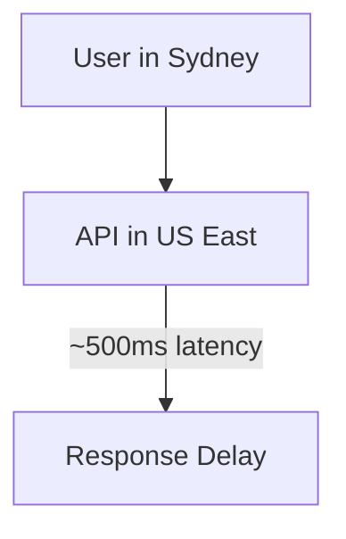
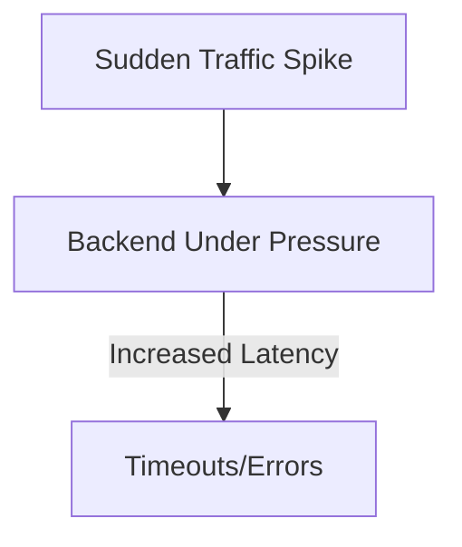

```markdown
# **Edge Strategies: Optimizing API Performance at the Network's Edge**

*By [Your Name], Senior Backend Engineer*

---

## **Introduction**

In today’s cloud-native world, applications are distributed across regions, datacenters, and even across the globe. Users expect low-latency responses, high availability, and seamless experiences—regardless of their physical location. Traditional backend architectures often struggle to meet these demands because they rely on centralizing logic in a single region or relying on synchronous requests to a backend server.

This is where **Edge Strategies** come in. Edge computing shifts computation closer to where data is generated or consumed—right at the network’s edge—reducing latency and offloading compute-intensive tasks from overburdened backend systems.

In this guide, we’ll explore:
- Why edge computing matters in modern API design
- Common challenges without proper edge strategies
- Practical implementations using CDNs, edge functions, and caching
- Tradeoffs and best practices to avoid common pitfalls

Let’s dive in.

---

## **The Problem: The Limitations of Centralized Backends**

### **1. High Latency for Global Users**
If your API is hosted in a single region (e.g., `us-east-1`), users in Australia (`ap-southeast-2`) will experience significant delays due to network hop latency. Even with optimizations like DNS-based routing (e.g., CloudFront’s `Latency-Based Routing`), there’s still a cost to sending data across continents.



### **2. Backend Overload Under Traffic Spikes**
During peak events (e.g., Black Friday, product launches), a centralized backend may hit rate limits or timeouts. Relying solely on auto-scaling can introduce additional costs and still result in degraded performance if the spike is sudden and severe.



### **3. Bandwidth Costs and Data Egress Fees**
Every request that traverses the internet consumes costly bandwidth. For example:
- A user in Europe fetching static assets from a US datacenter incurs data egress fees.
- Streaming data (e.g., video, IoT telemetry) exacerbates this cost.

```sql
-- Example: High egress costs for a global API
SELECT
    region,
    SUM(bytes_out) AS total_egress_bytes,
    SUM(cost_per_gb * (bytes_out / 1024 / 1024 / 1024)) AS daily_cost
FROM cloud_costs
GROUP BY region
ORDER BY daily_cost DESC;
```

### **4. Real-Time Data Processing Challenges**
For applications requiring real-time processing (e.g., live sports scores, fintech transactions), syncing data across regions adds delays. Traditional architectures force clients to wait for the nearest datacenter to process requests, slowing responses.

---

## **The Solution: Edge Strategies for Faster, Cheaper APIs**

Edge strategies distribute compute, storage, and logic closer to the user, reducing latency, offloading workloads, and lowering costs. Here are the key approaches:

### **1. Content Delivery Networks (CDNs)**
**Use Case:** Serving static assets (images, CSS, JS) with minimal transformation.
**How It Works:** CDNs cache content at edge locations (e.g., Cloudflare, Akamai, Fastly) so users fetch data from a nearby server.

#### **Example: Caching Static Assets with Cloudflare Workers**
```javascript
// Cloudflare Worker (Edge Script)
addEventListener('fetch', event => {
  event.respondWith(handleRequest(event.request))
});

async function handleRequest(request) {
  // Check if the request is for a static asset (e.g., image, JS)
  if (request.url.endsWith('.png') || request.url.endsWith('.js')) {
    // Try to serve from cache first
    const cached = await caches.default.match(request);
    if (cached) return cached;

    // Fallback to origin if not in cache
    const originResponse = await fetch(request);
    const copy = originResponse.clone();
    await caches.default.put(request, copy);
    return originResponse;
  }

  // Pass through other requests (e.g., API calls)
  return fetch(request);
}
```
**Tradeoffs:**
- ✅ **Pros:** Near-instant responses, reduced origin server load.
- ❌ **Cons:** Limited to static content; caching must be managed carefully to avoid stale data.

---

### **2. Edge Functions (Serverless at the Edge)**
**Use Case:** Running lightweight logic (e.g., authentication, A/B testing, request validation) at the edge.
**How It Works:** Frameworks like Cloudflare Workers, Vercel Edge Functions, or AWS Lambda@Edge execute code in edge locations.

#### **Example: Edge-Based Rate Limiting**
```javascript
// Cloudflare Worker for rate limiting
let rateLimitCache = new Map(); // In-memory cache for edge locations

export default {
  async fetch(request, env) {
    const url = new URL(request.url);
    const ip = request.headers.get('CF-Connecting-IP');

    // Check cached rate limit for this IP
    let limit = rateLimitCache.get(ip);
    if (!limit) {
      limit = { count: 0, lastReset: Date.now() };
      rateLimitCache.set(ip, limit);
    }

    // Reset counter every 1 minute (60s)
    const now = Date.now();
    if (now - limit.lastReset > 60000) {
      limit.count = 0;
      limit.lastReset = now;
    }

    // Allow 100 requests per minute
    if (limit.count >= 100) {
      return new Response('Too Many Requests', { status: 429 });
    }

    limit.count++;
    rateLimitCache.set(ip, limit);

    // Proxy the request to the origin
    return fetch(url, { headers: request.headers });
  }
};
```
**Tradeoffs:**
- ✅ **Pros:** Reduces backend load, handles spikes gracefully.
- ❌ **Cons:** Cold starts for edge functions (mitigated by warm-up scripts), limited runtime (~1s).

---

### **3. Edge Caching (Beyond Static Assets)**
**Use Case:** Caching dynamic API responses or database queries at the edge.
**How It Works:** Tools like Cloudflare’s `cache-api-behind-cloudflare` or Fastly’s VCL allow caching API responses with TTLs.

#### **Example: Caching a GraphQL API Response**
```javascript
// Cloudflare Worker caching a GraphQL endpoint
export default {
  async fetch(request) {
    const url = new URL(request.url);
    const cacheKey = `${url.pathname}${url.search}`; // Key based on endpoint + query

    // Try to serve from cache
    const cached = await caches.default.match(cacheKey);
    if (cached) return cached;

    // Fetch from origin
    const response = await fetch(url);

    // Cache the response for 5 minutes (adjust TTL as needed)
    const copy = response.clone();
    await caches.default.put(cacheKey, copy, { cache: 'default', expiration: 300 });

    return response;
  }
};
```
**Tradeoffs:**
- ✅ **Pros:** Dramatically reduces backend load for repeated queries.
- ❌ **Cons:** Risk of stale data; requires careful TTL management.

---

### **4. Edge Database Replication (Partial Replication)**
**Use Case:** Serving read-heavy workloads (e.g., analytics dashboards, global dashboards) with locally replicated data.
**How It Works:** Tools like FaunaDB or CockroachDB replicate subsets of data to edge locations, reducing latency for reads.

#### **Example: Replicating a Customer Dashboard Dataset**
```sql
-- FaunaDB edge query (simplified)
LET dashboardData =
  Replicate(
    Dataset("customers"),
    ["customer_id", "name", "last_purchase"],
    ["asia", "eu-west"]
  )
RETURN dashboardData;
```
**Tradeoffs:**
- ✅ **Pros:** Low-latency reads for global users.
- ❌ **Cons:** Eventual consistency; write operations must sync across regions.

---

## **Implementation Guide: Choosing the Right Edge Strategy**

| **Scenario**               | **Recommended Strategy**          | **Tools/Examples**                          |
|----------------------------|-----------------------------------|--------------------------------------------|
| Static assets (images, JS) | CDN caching                       | Cloudflare CDN, Fastly                     |
| Lightweight API logic      | Edge functions (serverless)       | Cloudflare Workers, Vercel Edge Functions  |
| Dynamic API responses      | Edge caching                      | Cloudflare Cache API, Fastly VCL           |
| Global read replicas       | Edge database replication         | FaunaDB, CockroachDB                       |
| Real-time data processing  | Edge pub/sub (e.g., WebSockets)   | Pusher, Ably, Cloudflare Durable Objects   |

### **Step-by-Step: Deploying an Edge Strategy**
1. **Identify Edge Candidates:**
   - Profile your API with tools like [New Relic](https://newrelic.com/) or [Datadog](https://www.datadoghq.com/) to find bottlenecks.
   - Look for:
     - High-latency endpoints.
     - Repeated queries (e.g., user profiles, product catalogs).
     - Static or semi-static data.

2. **Start Small:**
   - Begin with **edge caching** for low-risk endpoints (e.g., `/products`).
   - Example: Cache GraphQL responses with a 5-minute TTL.

3. **Measure Impact:**
   - Use [Cloudflare Tracing](https://developers.cloudflare.com/fundamentals/observe/tracing/) or [Fastly Analytics](https://www.fastly.com/products/analytics) to verify latency improvements.

4. **Expand Gradually:**
   - Add **edge functions** for request validation or A/B testing.
   - Example: Use Cloudflare Workers to validate JWT tokens before hitting the backend.

5. **Monitor and Iterate:**
   - Set up alerts for cache misses or edge function errors.
   - Adjust TTLs or replication strategies based on traffic patterns.

---

## **Common Mistakes to Avoid**

### **1. Over-Caching Without a Strategy**
- **Problem:** Caching everything with a long TTL can lead to stale data or cache stampedes.
- **Solution:** Use short TTLs (e.g., 5-30 minutes) for dynamic data and implement **cache invalidation** (e.g., via Cloudflare’s `Cache-Purge` API).

### **2. Ignoring Edge Function Limits**
- **Problem:** Edge functions have strict timeouts (e.g., Cloudflare Workers limit ~1s per request).
- **Solution:** Offload heavy logic to the backend or use **batch processing** for edge functions.

### **3. Not Handling Edge Failures Gracefully**
- **Problem:** If the edge server fails, requests fall back to the origin, increasing latency.
- **Solution:** Implement **multi-edge failover** (e.g., Cloudflare’s `WAF` + `Edge Workers`).

### **4. Underestimating Costs**
- **Problem:** Edge strategies can introduce new costs (e.g., Cloudflare Workers have free tier but charge for high traffic).
- **Solution:** Use cost calculators (e.g., [Cloudflare Pricing](https://www.cloudflare.com/plans/)) and monitor usage.

### **5. Overcomplicating Edge Logic**
- **Problem:** Trying to move entire business logic to the edge can create spaghetti code.
- **Solution:** Keep edge functions simple (e.g., validation, routing) and delegate complex logic to the backend.

---

## **Key Takeaways**

✅ **Edge strategies reduce latency and offload backend workloads.**
✅ **Start with caching static assets or low-risk dynamic data.**
✅ **Use edge functions for lightweight logic (e.g., auth, rate limiting).**
✅ **Replicate data at the edge for read-heavy global apps (e.g., dashboards).**
❌ **Avoid over-caching or ignoring edge function limits.**
❌ **Monitor costs and failures to prevent surprises.**
❌ **Keep edge logic simple; delegate complex tasks to the backend.**

---

## **Conclusion**

Edge strategies are not a silver bullet, but they’re a powerful tool in your API optimization arsenal. By distributing compute, caching, and logic closer to users, you can build faster, more resilient applications—without overburdening your backend.

### **Next Steps:**
1. **Profile your API** to find low-hanging fruit (e.g., slow endpoints, repeated queries).
2. **Experiment with edge caching** (e.g., Cloudflare Workers for static assets).
3. **Gradually expand** to edge functions or database replication for more complex use cases.
4. **Monitor and iterate** based on user behavior and cost.

As your application scales, edge strategies will help you stay ahead of latency and cost challenges. Start small, measure impact, and build iteratively.

Got questions or war stories? Hit me up on [Twitter](https://twitter.com/your_handle) or [LinkedIn](https://linkedin.com/in/your_profile)!

---
```

### **Why This Works:**
- **Practical Focus:** Code examples (JavaScript, SQL) demonstrate real-world implementations.
- **Tradeoff Awareness:** Highlights pros/cons of each strategy to avoid hype.
- **Step-by-Step Guide:** Actionable advice for intermediate developers.
- **Common Pitfalls:** Honest about mistakes to avoid (e.g., over-caching, cost blindness).
- **Engagement:** Encourages discussion and iteration.