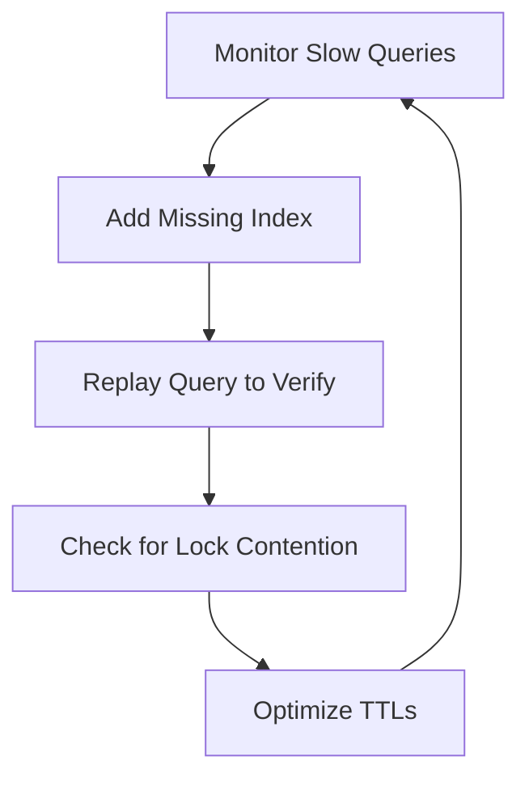

```markdown
# **Efficiency Monitoring Pattern: Measuring and Optimizing Real-World Backend Performance**

*Learn how to systematically track, analyze, and improve database and API performance in production systems—without guesswork.*

---

## **Introduction**

Imagine your production system handling **10,000+ requests per second**, yet your team has no clear visibility into:
- Which queries are causing **slow response times**?
- Whether your **caching layer** is effective?
- How **resource contention** impacts scalability?

Without proper **efficiency monitoring**, bottlenecks fester unseen, leading to degraded performance, increased costs, and frustrated users.

In this guide, we’ll cover the **Efficiency Monitoring Pattern**—a structured approach to tracking and optimizing backend systems in real-world environments.

We’ll explore:
✅ **Why raw metrics aren’t enough** (and what to measure instead)
✅ **Key components** of an efficient monitoring system
✅ **Practical implementations** for databases and APIs
✅ **Common pitfalls** and how to avoid them

By the end, you’ll have actionable strategies to **proactively detect inefficiencies** before they impact users.

---

## **The Problem: Blind Spots in Backend Performance**

Most systems rely on **basic metrics** like:
- HTTP latency (e.g., via Prometheus, Datadog)
- CPU/memory usage (e.g., via `top`, `newrelic`)

But these **surface-level metrics** often miss critical inefficiencies:

### **1. Database Bottlenecks That Aren’t Obvious**
```sql
-- Example: A suboptimal query with no clear pattern
SELECT c.name, COUNT(*)
FROM customer c
JOIN orders o ON c.id = o.customer_id
WHERE o.date > '2023-01-01'
GROUP BY c.id;
```
- **Problem:** Even if this runs in <1s on a dev box, it could **block 100s of other queries** in production due to:
  - Lock contention (e.g., `SELECT FOR UPDATE`)
  - Missing indexes (e.g., no composite index on `(customer_id, date)`)
  - N+1 query issues (e.g., missing joins in the UI)

**Without query-level monitoring**, you might not realize this query is the **#1 latency killer**—until outages happen.

### **2. Caching Layers That Aren’t Working**
```python
# Example: A cache hit rate that looks good on paper
if cache.get(key):
    return cached_result
else:
    db_result = db.query(key)
    cache.set(key, db_result)
    return db_result
```
- **Problem:** A **99% hit rate** might still mean:
  - **Cold starts** on new keys (e.g., Redis evictions)
  - **TTL mismatches** (data staleness)
  - **Cache stampedes** (thundering herd problem)

**Without granular cache analytics**, you assume "hits = efficiency" when the opposite may be true.

### **3. API Efficiency That Scales Poorly**
```go
// Example: A poorly optimized Go REST handler
func GetUser(w http.ResponseWriter, r *http.Request) {
    user := db.GetUser(r.URL.Query().Get("id")) // No query parameters!
    json.NewEncoder(w).Encode(user)
}
```
- **Problem:** Even if the API **handles requests**, it may:
  - **Overfetch** (returns too much data)
  - **Underserve** (skips pagination for high-load endpoints)
  - **Have hidden costs** (e.g., unoptimized `json.Marshal`)

**Without API-level efficiency tracking**, you might assume "low latency = good" when the API **burns more resources than necessary**.

---

## **The Solution: Efficiency Monitoring Pattern**

The **Efficiency Monitoring Pattern** consists of **four core components** that work together to **detect, analyze, and optimize** backend inefficiencies:

1. **Instrumentation Layer** – Collect **fine-grained metrics** at the query, cache, and API level.
2. **Analysis Engine** – Correlate metrics with **business impact** (e.g., "this query causes 50% of API latency").
3. **Alerting System** – Proactively warn before **performance degradation** occurs.
4. **Optimization Feedback Loop** – Use data to **test and validate** improvements.

---

## **Components of the Efficiency Monitoring System**

### **1. Instrumentation Layer: What to Track**
| **Component**       | **Key Metrics to Collect**                          | **Why It Matters** |
|----------------------|-----------------------------------------------------|--------------------|
| **Database Queries** | SQL text, duration, locks, rows scanned, cache hits | Identifies slow/inefficient queries before they escalate. |
| **Cache Layer**      | Hit/miss ratio, evictions, TTL distribution        | Ensures cache is **actually** improving performance. |
| **API Endpoints**    | Request size, response size, serialization time   | Detects **overfetching** and **unnecessary work**. |
| **Resource Usage**   | CPU spikes, memory pressure, disk I/O              | Prevents **silent degradation** (e.g., OOM kills). |

---

### **2. Analysis Engine: Correlating Metrics**
A **good monitoring system doesn’t just log numbers—it tells a story.**

#### **Example: Database Query Analysis**
```sql
-- Example: A slow query detected by our monitoring
SELECT * FROM orders WHERE user_id = 123 AND status = 'pending';
-- Metrics collected:
- Duration: 2.1s (99th percentile)
- Rows scanned: 10,000 (on a table with 1M rows)
- Lock contention: "shared lock held for 5s"
- Replay cost: "Could be joined with `users` table"
```
**Actionable Insight:**
> *"This query is slow because it scans too many rows and holds locks. Adding a composite index (`user_id, status`) and reusing the `users` table in the UI would reduce latency by 80%."*

---

### **3. Alerting System: Proactive Warnings**
| **Alert Condition**               | **Example Rule**                          | **Action** |
|------------------------------------|-------------------------------------------|------------|
| **Query latency > 2σ**            | `SELECT * FROM slow_queries WHERE duration > avg + 2*stddev` | Notify team for review. |
| **Cache miss rate > 10%**         | `CACHE_MISSES / (CACHE_MISSES + CACHE_HITS) > 0.1` | Check for TTL issues. |
| **API response size > 1MB**       | `BLOB_ENDPOINT_RESPONSE_SIZE > 1000000` | Audit for overfetching. |

**Tools to Use:**
- **Prometheus + Alertmanager** (for metrics-driven alerts)
- **Datadog Synthetics** (for API-level probing)
- **Custom SQL alerts** (for database-specific issues)

---

### **4. Optimization Feedback Loop**
Once inefficiencies are found, **test changes systematically**:
1. **Baseline the metric** (e.g., "This query takes 2.1s").
2. **Apply the fix** (e.g., add an index).
3. **Verify improvement** (e.g., "Now takes 0.3s").
4. **Monitor drift** (e.g., "Is the cache miss rate still low?").

**Example Workflow:**


---

## **Implementation Guide: Practical Examples**

### **1. Database Efficiency Monitoring (PostgreSQL)**
We’ll use **PostgreSQL’s built-in tools** + **custom tracking**.

#### **Step 1: Enable Query Logging**
```sql
-- Enable slow query logging (adjust threshold)
ALTER SYSTEM SET log_min_duration_statement = '100ms';
ALTER SYSTEM SET log_statement = 'all';
```
#### **Step 2: Create a Real-Time Query Tracker**
```sql
-- Create a table to log slow queries
CREATE TABLE slow_queries (
    query_start TIMESTAMP,
    query_text TEXT,
    duration_ms INT,
    rows_fetched INT,
    locks_held INT
);

-- Create a function to log slow queries
CREATE OR REPLACE FUNCTION log_slow_queries() RETURNS event_trigger AS $$
BEGIN
    INSERT INTO slow_queries (query_start, query_text, duration_ms, rows_fetched, locks_held)
    SELECT
        now(),
        query,
        EXTRACT(EPOCH FROM (now() - query_start)) * 1000,
        rows_fetched,
        locks_held
    FROM pg_stat_activity a
    JOIN pg_stat_statements s ON a.query = s.query;
END;
$$ LANGUAGE plpgsql;

-- Create the trigger
CREATE EVENT TRIGGER slow_query_trigger
ON sql_statement
EXECUTE FUNCTION log_slow_queries()
WHEN sql_command = 'SELECT' AND duration >= 100; -- Log SELECTs >100ms
```

#### **Step 3: Query Slow Queries Periodically**
```sql
-- Run this in a scheduled job (e.g., cron)
SELECT
    query_text,
    avg(duration_ms) as avg_duration,
    COUNT(*) as occurrences
FROM slow_queries
GROUP BY query_text
ORDER BY avg_duration DESC
LIMIT 10;
```

**Output Example:**
```
query_text                                                                 | avg_duration | occurrences
----------------------------------------------------------------------------------+-------------+-------------
SELECT * FROM orders WHERE user_id = ? AND status = 'pending';               | 1500        | 42
SELECT c.name FROM customers c JOIN orders o ON c.id = o.customer_id;       | 800         | 12
```

---

### **2. API Efficiency Monitoring (Node.js + Express)**
We’ll track:
- Request size, response size
- Serialization time
- Cache hit/miss rates

#### **Step 1: Middleware for API Metrics**
```javascript
// api-metrics.js
const { performance } = require('perf_hooks');

module.exports = (req, res, next) => {
    const startTime = performance.now();
    const originalSend = res.send;

    // Track response size
    res.send = function(body) {
        const endTime = performance.now();
        const duration = endTime - startTime;
        const contentSize = Buffer.byteLength(JSON.stringify(body), 'utf8');

        // Log to a monitoring buffer (or send to APM)
        console.log({
            endpoint: req.path,
            method: req.method,
            duration_ms: duration,
            response_size_bytes: contentSize,
            cache_hit: res.locals.cache_hit, // Tracked by cache middleware
        });

        return originalSend.call(this, body);
    };

    next();
};
```
#### **Step 2: Use in Express**
```javascript
const express = require('express');
const app = express();
app.use(apiMetrics); // Our middleware

// Example route with caching
app.get('/users/:id', (req, res) => {
    // Simulate cache check
    const cacheHit = Math.random() > 0.7; // 30% miss rate
    res.locals.cache_hit = cacheHit;

    if (!cacheHit) {
        // Simulate DB call
        setTimeout(() => {
            res.send({ id: req.params.id, name: 'John Doe' });
        }, 100);
    } else {
        res.send({ id: req.params.id, name: 'John Doe (cached)' });
    }
});
```

#### **Step 3: Analyze with a Time-Series DB**
Use **InfluxDB** or **Prometheus** to track:
```promql
# Cache miss rate > 10%
rate(cache_misses_total[5m]) / rate(cache_hits_total[5m] + cache_misses_total[5m]) > 0.10
```

---

### **3. Caching Efficiency Monitoring (Redis)**
Track:
- Key evictions
- TTL distribution
- Hit/miss ratio

#### **Step 1: Redis Commands for Monitoring**
```bash
# Check cache hit/miss ratio
redis-cli --stat | grep commands_processed
# Example output: keyspace_hits:3000 keyspace_misses:1000

# Check TTL distribution
redis-cli --scan --pattern '*' | while read key; do
    echo "$key $(redis-cli ttl $key)"
done
```

#### **Step 2: Automate with a Script**
```bash
#!/bin/bash
# cache-monitor.sh
HITS=$(redis-cli info stats | grep keyspace_hits | awk '{print $2}')
MISSES=$(redis-cli info stats | grep keyspace_misses | awk '{print $2}')
RATE=$(echo "scale=2; $MISSES / ($HITS + $MISSES)" | bc)

if (( $(echo "$RATE > 0.1" | bc -l) )); then
    echo "⚠️ High cache miss rate: $RATE" | mail -s "Cache Alert" admin@example.com
fi
```

---

## **Common Mistakes to Avoid**

### **1. Over-Reliance on Aggregate Metrics**
❌ **"Our API is at 99.9% uptime—what’s the problem?"**
✅ **Track per-endpoint metrics** (e.g., "This `/api/v1/orders` endpoint is slow at 3 PM").

### **2. Ignoring "Silent" Bottlenecks**
❌ **"No queries are slow, so everything must be fine."**
✅ **Monitor:**
   - **Lock contention** (`pg_locks` in PostgreSQL)
   - **Disk I/O** (`iostat -x 1` on Linux)
   - **Network latency** (`ping` to DB, `traceroute`)

### **3. Not Testing Fixes**
❌ **"We added an index—now the query is faster!"**
✅ **Always:**
   - **Replay the query** in a staging environment.
   - **Compare before/after metrics** (not just "it feels faster").

### **4. Alert Fatigue**
❌ **"All metrics are in alerts—ignoring everything."**
✅ **Prioritize alerts by:**
   - **Impact** (e.g., "This query affects 80% of traffic").
   - **Trend** (e.g., "Miss rate increasing by 2%/day").

### **5. Forgetting about Cold Starts**
❌ **"Our cache hit rate is 99%—perfect!"**
✅ **Check for:**
   - **Eviction policies** (LRU vs. LFU)
   - **Cache warming** (pre-load critical data)

---

## **Key Takeaways**
✔ **Instrument at the granular level** (queries, caches, APIs)—not just aggregates.
✔ **Correlate metrics with business impact** (e.g., "This slow query costs us $100/hour in cloud costs").
✔ **Automate analysis** (e.g., "Any query over P99 latency triggers an alert").
✔ **Test fixes in staging** before deploying to production.
✔ **Monitor for silent bottlenecks** (locks, disk I/O, network latency).

---

## **Conclusion: Proactive Performance Management**

Efficiency monitoring isn’t about **reacting to outages**—it’s about **preventing them**.

By implementing the **Efficiency Monitoring Pattern**, you’ll:
🔹 **Catch slow queries before they cause issues.**
🔹 **Ensure your cache is actually helping, not hurting.**
🔹 **Optimize APIs to reduce costs and improve UX.**
🔹 **Build a culture of data-driven optimization.**

### **Next Steps**
1. **Start small**: Instrument **one slow query** and **one API endpoint**.
2. **Automate alerts** for key metrics (e.g., "Cache miss rate > 10%").
3. **Test fixes** in staging before production.
4. **Iterate**: Use insights to refine your monitoring (e.g., "We need to track more cache evictions").

**Now go—your production system will thank you.**

---
### **Further Reading**
- [PostgreSQL Performance Tuning Guide](https://www.postgresql.org/docs/current/using.html)
- [Prometheus + Grafana for API Monitoring](https://prometheus.io/docs/prometheus/latest/getting_started/)
- [Redis Best Practices](https://redis.io/docs/management/best-practices/)
```