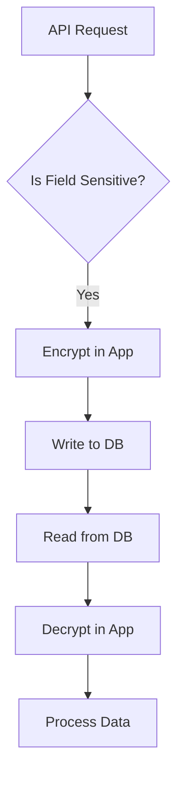

```markdown
# Mastering Encryption Conventions: Secure Your API Data Without the Headache

*By [Your Name] – Senior Backend Engineer*

---

## **Introduction**

So, you’ve built a rock-solid API. It handles traffic like a champ, scales when needed, and even has a sleek microservices architecture. But wait—have you stopped to consider what happens when confidential data (credit card numbers, passwords, PII) moves between your service and the database? Or worse, when it’s stored long-term?

Encryption isn’t just a checkbox—it’s a **design pattern** that ensures security without sacrificing usability. The problem isn’t *that* you need encryption; it’s *how* you implement it. That’s where **Encryption Conventions** come in. This pattern standardizes where, when, and how data should be encrypted, reducing inconsistencies, improving maintainability, and—most importantly—keeping your users’ trust intact.

In this guide, we’ll dissect why encryption conventions matter, walk through a practical implementation, and equip you with tools to avoid common pitfalls. By the end, you’ll have a clear, actionable strategy for securing your data—without turning your codebase into a cryptographic spaghetti bowl.

---

## **The Problem: Chaos Without Conventions**

Security isn’t just about bolt-on solutions like VPNs or firewalls. It’s deeply embedded in how you design systems. Without clear encryption conventions, you might end up with a recipe for disaster:

### **1. Inconsistent Encryption**
Imagine your team members are encrypting data in different ways:
- Some developers XOR sensitive fields with a hardcoded key.
- Others use AES-256 but only for certain tables.
- A third team logs raw passwords in JSON logs but encrypts them in the database.
Result? A security audit finds every inconsistency, and you’re left with a messy cleanup.

### **2. Over- or Under-Encryption**
Encrypting *everything* is as bad as encrypting *nothing*. Over-encryption bloats storage, slows down queries, and makes debugging a nightmare. Meanwhile, under-encryption—leaving sensitive fields (like email hashes or API keys) in plaintext—is a one-way ticket to a breach.

### **3. Key Management Nightmares**
Keys are the heart of encryption. Without a standardized key lifecycle (generation, rotation, revocation), you risk:
- Using weak keys (e.g., a static key hardcoded in the config).
- Losing access to keys when rotating them manually.
- Accidentally exposing keys in logs or version control (hello, `git commit -A`).

### **4. Performance Pitfalls**
Encryption isn’t free. Poorly optimized cryptographic operations can:
- Create bottlenecks in high-throughput APIs.
- Make DB queries slower due to late encryption (e.g., encrypting *after* sorting).
- Increase latency, affecting user experience.

### **5. Compliance Nightmares**
Regulations like **GDPR**, **HIPAA**, or **PCI DSS** don’t just *ask* for encryption—they *require* it in specific ways. Without conventions, you might accidentally violate compliance by:
- Storing encryption metadata (like salt or IV) improperly.
- Not logging decryption attempts.
- Failing to provide mechanisms for data deletion (e.g., purging keys).

---
## **The Solution: Encryption Conventions**

The **Encryption Conventions** pattern addresses these issues by defining rules *upfront* for:
1. **What** data to encrypt (fields, messages, logs).
2. **When** to encrypt (at rest, in transit, in memory).
3. **How** to encrypt (algorithms, keys, serialization).
4. **Who** manages keys (automated rotation, auditing).
5. **Where** to document the rules (READMEs, code comments, databases).

By standardizing these choices, you:
- Reduce security gaps.
- Improve auditability.
- Lower operational overhead.

---

## **Core Components of Encryption Conventions**

### **1. Define an Encryption Policy**
Start with a **policy document** (even a simple one) outlining:
- **Encryption Scope**: Which data is sensitive? (e.g., PII, payment details, tokens).
- **Algorithms**: AES-256 for symmetric, RSA-2048 for asymmetric.
- **Key Rotation**: Every 90 days for secrets, longer for non-sensitive data.
- **Key Storage**: Secrets Manager (AWS Secrets, HashiCorp Vault) vs. local files.
- **Key Derivation**: Use **Argon2** or **PBKDF2** for passwords, never weak hashing.

**Example Policy Snippet**:
```json
{
  "encryption": {
    "symmetric": {
      "algorithm": "AES-256-CBC",
      "key_rotation": "90d",
      "key_storage": "aws_kms",
      "fields": ["credit_card_number", "ssn", "api_key"]
    },
    "asymmetric": {
      "algorithm": "RSA-2048",
      "use_case": "SSH keys, TLS certs"
    },
    "hashing": {
      "algorithm": "Argon2id",
      "use_case": "password storage"
    }
  }
}
```

### **2. Choose Encryption Triggers**
Decide *when* to encrypt data:
- **At Rest**: Always encrypt sensitive fields in databases.
- **In Transit**: Use TLS 1.3 for all API calls.
- **In Memory**: Encrypt sensitive objects before serialization (e.g., JSON logs).
- **In Transit (Logs)**: Mask sensitive fields in logs (e.g., `user_id` → `****`).

**Example Table for Encryption Triggers**:
| Data Type          | At Rest? | In Transit? | In Memory? | Logs?          |
|--------------------|----------|--------------|------------|----------------|
| Credit Card        | ✅        | ✅ (TLS)     | ✅         | ❌ (Masked)    |
| Password Hash      | ❌        | ✅ (TLS)     | ❌         | ❌ (Hashed)    |
| API Key            | ✅        | ✅ (TLS)     | ✅         | ❌ (Redacted)  |

### **3. Implement Standardized Encryption/Decryption**
Use a **library** to abstract encryption logic. Avoid reinventing the wheel with custom code.

#### **Option A: Database-Level Encryption (DLE)**
Many databases support built-in encryption:
- **PostgreSQL**: `pgcrypto`
- **MySQL**: `AES_ENCRYPT`, `AES_DECRYPT`
- **MongoDB**: Field-level encryption with `Client-Side Field-Level Encryption (CSFLE)`

**Example: PostgreSQL `pgcrypto`**
```sql
-- Create a function to encrypt a field
CREATE OR REPLACE FUNCTION encrypt_text(text_value text)
RETURNS bytea AS $$
BEGIN
  RETURN pgp_sym_encrypt(text_value, 'your_key_here');
END;
$$ LANGUAGE plpgsql SECURITY DEFINER;

-- Usage in a table
CREATE TABLE users (
  id SERIAL PRIMARY KEY,
  name TEXT,
  credit_card_encrypted BYTEA,
  CONSTRAINT check_encryption CHECK (credit_card_encrypted IS NOT NULL)
);

-- Insert encrypted data
INSERT INTO users (name, credit_card_encrypted)
VALUES ('John Doe', encrypt_text('4111111111111111'));
```

#### **Option B: Application-Level Encryption**
Encrypt data in code before storing/transmitting it.

**Example: Python (PyCryptodome)**
```python
from Crypto.Cipher import AES
from Crypto.Util.Padding import pad, unpad
import base64

def encrypt_data(plaintext: str, key: bytes) -> str:
    cipher = AES.new(key, AES.MODE_CBC)
    ct_bytes = cipher.encrypt(pad(plaintext.encode(), AES.block_size))
    iv = base64.b64encode(cipher.iv).decode()
    ct = base64.b64encode(ct_bytes).decode()
    return f"{iv}:{ct}"

def decrypt_data(ciphertext: str, key: bytes) -> str:
    iv, ct = ciphertext.split(':')
    cipher = AES.new(key, AES.MODE_CBC, iv=base64.b64decode(iv))
    pt = unpad(cipher.decrypt(base64.b64decode(ct)), AES.block_size)
    return pt.decode()

# Example usage
key = b'this_is_a_secret_key123'  # In production, use a secure key management system!
encrypted = encrypt_data("1234567890123456", key)
print(encrypted)  # Output: "AQIDBAUGBwgJCgsMDQ4PE..." (example IV + ciphertext)
```

#### **Option C: Hybrid Approach (Recommended)**
Combine database encryption with application-level encryption for sensitive fields:
1. Encrypt data in the app before writing to the DB.
2. Decrypt on read, then encrypt again for logs/memory.

**Example Flow**:


---

## **Implementation Guide: Step-by-Step**

### **Step 1: Document Your Policy**
Create a `SECURITY.md` file in your repo:
```markdown
# Encryption Policy

## Scope
All PII, payment data, and API keys must be encrypted "at rest" and "in transit."

## Algorithms
- **Symmetric**: AES-256-CBC (for DB fields, secrets)
- **Asymmetric**: RSA-2048 (for TLS, SSH)
- **Hashing**: Argon2id (for passwords)

## Key Management
- Keys stored in **AWS KMS**.
- Rotation: Every 90 days for secrets, annually for non-sensitive data.
```

### **Step 2: Set Up Key Management**
Use a service like:
- **AWS KMS** (for AWS)
- **HashiCorp Vault** (multi-cloud)
- **Azure Key Vault** (Azure)

**Example: Fetching a Key from AWS KMS**
```python
import boto3

def get_kms_key():
    client = boto3.client('kms')
    response = client.decrypt(
        CiphertextBlob=b'...',  # Your encrypted key material
        KeyId='alias/my-app-key'
    )
    return response['Plaintext']
```

### **Step 3: Encrypt Data Before Storage**
Modify your model/ORM to auto-encrypt sensitive fields.

**Example: Django Model with Encryption**
```python
from django.db import models
from django.contrib.postgres.fields import EncryptedTextField
from Crypto.Cipher import AES
import base64

class User(models.Model):
    name = models.CharField(max_length=100)
    credit_card = EncryptedTextField(  # Built-in encryption
        encrypt_key="your-encryption-key",
        help_text="AES-256 encrypted"
    )

    # Or manual encryption
    @property
    def masked_log(self):
        return f"{self.name} (****)"
```

### **Step 4: Encrypt Logs and API Responses**
Use middleware to sanitize logs before shipping.

**Example: Flask Logging Middleware**
```python
import logging
import json

logger = logging.getLogger(__name__)

def mask_sensitive_data(data):
    if isinstance(data, dict):
        return {k: mask_sensitive_data(v) for k, v in data.items()}
    elif isinstance(data, str):
        if "password" in data.lower() or "credit_card" in data.lower():
            return "*****"
        return data
    return data

@app.after_request
def log_response(response):
    response_data = mask_sensitive_data(response.get_json())
    logger.info("Response: %s", json.dumps(response_data))
    return response
```

### **Step 5: Audit and Rotate Keys**
Schedule key rotations and audit access.

**Example: Automated Key Rotation (AWS Lambda)**
```python
# Pseudocode for Lambda to rotate keys
def lambda_handler(event, context):
    client = boto3.client('kms')
    client.update_grant(
        KeyId='alias/my-app-key',
        Grants=[{
            'TargetKeyId': 'alias/my-app-key',
            'Constraints': {
                'Operations': ['Decrypt']
            }
        }]
    )
    return {"status": "Key rotated"}
```

---

## **Common Mistakes to Avoid**

### **1. Over-Reliance on Database Encryption**
❌ **Mistake**: Assuming the DB handles everything.
✅ **Fix**: Encrypt *before* storing—defense in depth!

### **2. Hardcoding Keys**
❌ **Mistake**: Storing keys in `.env` or code.
✅ **Fix**: Use a secrets manager (AWS KMS, Vault).

### **3. Ignoring Key Rotation**
❌ **Mistake**: Never rotating keys.
✅ **Fix**: Automate with CI/CD (e.g., GitHub Actions).

### **4. Encrypting Before Hashing**
❌ **Mistake**: Encrypting a password *before* hashing it.
✅ **Fix**: Always hash first (Argon2id), then encrypt if needed.

### **5. Forgetting IVs/CBC Modes**
❌ **Mistake**: Using ECB mode (predictable patterns).
✅ **Fix**: Always use **CBC** or **GCM** with random IVs.

### **6. Not Testing Failover**
❌ **Mistake**: Assuming encryption works without testing.
✅ **Fix**: Write unit tests for decryption failure cases.

---

## **Key Takeaways**

- **Standardize**: Define clear encryption rules in a policy document.
- **Automate**: Use libraries (PyCryptodome, `pgcrypto`) and key managers (KMS).
- **Defense in Depth**: Encrypt in app, DB, and logs.
- **Rotate Keys**: Automate key rotation and auditing.
- **Test**: Validate encryption/decryption in CI/CD.
- **Document**: Update security docs for new team members.

---

## **Conclusion**

Encryption isn’t about locking down every nook and cranny of your system—it’s about **intentionally applying security where it matters most**. The **Encryption Conventions** pattern gives you the structure to:
- Avoid inconsistent security practices.
- Balance security with performance.
- Stay compliant with minimal overhead.

Start small: pick one sensitive field, encrypt it, and document the process. Then expand systematically. Remember, security is a *continuum*—your conventions should evolve as threats do.

Now go forth and encrypt responsibly!
```

---
**Appendix (Bonus)**
- [AWS KMS Documentation](https://docs.aws.amazon.com/kms/latest/developerguide/)
- [PostgreSQL `pgcrypto`](https://www.postgresql.org/docs/current/pgcrypto.html)
- [OWASP Encryption Cheat Sheet](https://cheatsheetseries.owasp.org/cheatsheets/Encryption_Cheat_Sheet.html)