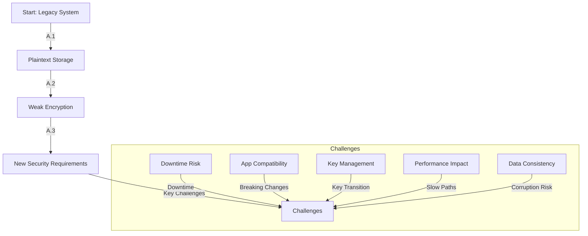
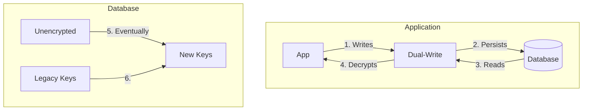

```markdown
---
title: "Encryption Migration: A Practical Guide to Securely Upgrading Your Data"
date: "2024-02-20"
author: "Alex Chen"
description: "Learn how to migrate encryption in production systems without downtime, balancing security and availability in this comprehensive guide."
tags: ["database", "security", "encryption", "migration", "backend", "pattern"]
---

# Encryption Migration: A Practical Guide to Securely Upgrading Your Data

You're responsible for a legacy payment processing system that stores customer credit card data in plaintext. Your CISO just informed you that PCI compliance audits will fail again unless you implement encryption *within 90 days*. The requirements:

- Encrypt all sensitive fields *without breaking existing applications*
- Minimize downtime during migration
- Ensure backward compatibility with old, unencrypted data
- Achieve minimal performance impact

This is a classic encryption migration challenge: how to incrementally adopt stronger encryption policies while keeping systems operational.

This guide will walk you through the **Encryption Migration Pattern**, a practical approach for:
- Seamlessly transitioning from weak to strong encryption
- Managing keys securely during the transition
- Minimizing business disruption
- Handling data declassification

We'll cover the actual implementation using PostgreSQL for data storage and AWS KMS for key management, but the patterns apply to any database and encryption system.

---

## The Problem: Why Encryption Migration is Hard

Before diving into solutions, let's examine why encryption migrations are so tricky:



### 1. Application Downtime
Most migration approaches require stopping services to rewrite all data. For e-commerce systems, even minutes of downtime can cost thousands in lost sales.

### 2. Application Compatibility
New encryption schemes break existing code that expects plaintext fields. You can't just flip a switch—applications must support both old and new formats.

### 3. Key Management Complexity
You need to coordinate between:
- Old encryption keys (for reading legacy data)
- New encryption keys (for writing new data)
- Transitional keys (for encrypting newly decrypted data)

### 4. Performance Overhead
Adding encryption to frequently accessed data can slow queries by 2-5x, especially if done at the wrong layer.

### 5. Data Consistency Risks
Partial migrations lead to:
- A few records encrypted, others not
- Inconsistent decryption between reads
- Potential data corruption from failed operations

---

## The Solution: Encryption Migration Pattern

The **Encryption Migration Pattern** follows these key principles:

1. **Dual-Write Transition**: Write both encrypted and plaintext versions simultaneously
2. **Lazy Decryption**: Decrypt only when actually needed
3. **Phased Rollout**: Gradually shift read operations to encrypted data
4. **Key Rotation Strategy**: Plan for minimal key overlap during transition
5. **Fallback Mechanism**: Maintain access to legacy data during migration

Here's the high-level architecture:



### Core Components

| Component          | Purpose                                                                 |
|--------------------|-------------------------------------------------------------------------|
| **Transitional Writes** | Write both encrypted and plaintext versions during transition            |
| **Selective Encryption** | Encrypt only sensitive fields during migration                          |
| **Legacy Key Vault**   | Secure storage for old encryption keys                                  |
| **Key Rotation Service**| Manages key transitions and validation                                 |
| **Decryption Proxy**  | Handles decryption logic transparently                                  |
| **Data Migration Job**| Periodically cleans up unencrypted data                                  |

---

## Code Examples: Implementation in Action

Let's implement this pattern using **PostgreSQL** and **AWS KMS** for a payment processing system. Our migration will:

1. Encrypt sensitive payment data
2. Maintain backward compatibility
3. Eventually phase out plaintext storage

### 1. Database Schema Versioning

```sql
-- Version 1: Initial schema (v1)
CREATE TABLE payments_v1 (
    id SERIAL PRIMARY KEY,
    amount DECIMAL,
    card_number TEXT,
    expiry_date TEXT,
    cvv TEXT,
    created_at TIMESTAMP
);

-- Version 2: Adds encrypted fields (v2)
CREATE TABLE payments_v2 (
    id SERIAL PRIMARY KEY,
    amount DECIMAL,
    encrypted_card_number BYTEA,
    encrypted_expiry_date BYTEA,
    encrypted_cvv BYTEA,
    created_at TIMESTAMP
);
```

### 2. Dual-Write Implementation (Application Layer)

```python
import boto3
from cryptography.fernet import Fernet
from datetime import datetime
import json

class PaymentRepository:
    def __init__(self, db_connection):
        self.db = db_connection
        self.kms = boto3.client('kms')
        self.legacy_key = 'arn:aws:kms:us-east-1:123456789012:key/abc123'
        self.new_key = 'arn:aws:kms:us-east-1:123456789012:key/def456'

    def _encrypt(self, data: str, key_arn: str) -> bytes:
        """Encrypt data using KMS"""
        response = self.kms.encrypt(
            KeyId=key_arn,
            Plaintext=data.encode()
        )
        return response['CiphertextBlob']

    def _decrypt(self, ciphertext: bytes, key_arn: str) -> str:
        """Decrypt data using KMS"""
        response = self.kms.decrypt(
            CiphertextBlob=ciphertext
        )
        return response['Plaintext'].decode()

    def create_payment(self, amount: float, card_data: dict) -> int:
        """Dual-write payment to both versions"""
        # Create encrypted versions
        encrypted_card = self._encrypt(json.dumps(card_data), self.new_key)
        encrypted_expiry = self._encrypt(card_data['expiry'], self.new_key)
        encrypted_cvv = self._encrypt(card_data['cvv'], self.new_key)

        with self.db.cursor() as cur:
            # Write to v2 table (encrypted)
            cur.execute(
                """
                INSERT INTO payments_v2
                (amount, encrypted_card_number, encrypted_expiry_date,
                 encrypted_cvv, created_at)
                VALUES (%s, %s, %s, %s, %s)
                RETURNING id
                """,
                (amount, encrypted_card, encrypted_expiry, encrypted_cvv, datetime.utcnow())
            )
            new_id = cur.fetchone()[0]

            # Write to v1 table (plaintext) for backward compatibility
            cur.execute(
                """
                INSERT INTO payments_v1
                (id, amount, card_number, expiry_date, cvv, created_at)
                VALUES (%s, %s, %s, %s, %s, %s)
                """,
                (new_id, amount, card_data['number'], card_data['expiry'],
                 card_data['cvv'], datetime.utcnow())
            )

            self.db.commit()
            return new_id
```

### 3. Lazy Decryption Read Handler

```python
class PaymentService:
    def __init__(self, repo: PaymentRepository):
        self.repo = repo

    def get_payment(self, payment_id: int) -> dict:
        """Lazy decryption - only decrypt when needed"""
        with self.db.cursor() as cur:
            # First try v2 (encrypted)
            cur.execute("""
                SELECT amount, encrypted_card_number, encrypted_expiry_date,
                       encrypted_cvv FROM payments_v2 WHERE id = %s
            """, (payment_id,))

            result = cur.fetchone()

            if result:
                return self._process_v2_payment(result)

            # Fallback to v1 (unencrypted)
            cur.execute("""
                SELECT amount, card_number, expiry_date, cvv
                FROM payments_v1 WHERE id = %s
            """, (payment_id,))

            return self._process_v1_payment(cur.fetchone())

    def _process_v2_payment(self, encrypted_data):
        """Decrypt and process v2 payment"""
        amount = encrypted_data[0]
        card_data = {
            'number': self.repo._decrypt(encrypted_data[1], self.repo.new_key),
            'expiry': self.repo._decrypt(encrypted_data[2], self.repo.new_key),
            'cvv': self.repo._decrypt(encrypted_data[3], self.repo.new_key)
        }
        return {'amount': amount, 'card': card_data}

    def _process_v1_payment(self, plaintext_data):
        """Return v1 payment as-is"""
        return {
            'amount': plaintext_data[0],
            'card': {
                'number': plaintext_data[1],
                'expiry': plaintext_data[2],
                'cvv': plaintext_data[3]
            }
        }
```

### 4. Migration Job (Database Layer)

```python
def migrate_unencrypted_payments():
    """Periodically migrate unencrypted payments to encrypted format"""
    with db.cursor() as cur:
        # Batch processing with progress tracking
        cur.execute("""
            SELECT id, card_number, expiry_date, cvv FROM payments_v1
            WHERE encrypted_card_number IS NULL
            LIMIT 1000 FOR UPDATE
        """)

        while True:
            batch = cur.fetchmany(1000)
            if not batch:
                break

            for payment in batch:
                payment_id, card_num, expiry, cvv = payment

                # Encrypt new version
                encrypted_card = repo._encrypt(card_num, new_key)
                encrypted_expiry = repo._encrypt(expiry, new_key)
                encrypted_cvv = repo._encrypt(cvv, new_key)

                # Update v2 table
                cur.execute("""
                    INSERT INTO payments_v2
                    (id, amount, encrypted_card_number, encrypted_expiry_date,
                     encrypted_cvv) SELECT id, amount, %s, %s, %s
                    FROM payments_v1 WHERE id = %s
                """, (encrypted_card, encrypted_expiry, encrypted_cvv, payment_id))

                # Mark as migrated
                cur.execute("""
                    UPDATE payments_v1 SET migrated_at = NOW()
                    WHERE id = %s
                """, (payment_id,))

            db.commit()

            print(f"Processed {len(batch)} payments")
```

### 5. Key Rotation Strategy

```python
class KeyRotationService:
    def __init__(self):
        self.current_key = 'arn:aws:kms:us-east-1:123456789012:key/abc123'
        self.new_key = 'arn:aws:kms:us-east-1:123456789012:key/def456'
        self.rotation_window = 7  # Days of overlap

    def should_use_new_key(self, payment_date: datetime) -> bool:
        """
        Determine which key to use based on creation date and rotation window
        """
        days_since_creation = (datetime.utcnow() - payment_date).days
        return days_since_creation > self.rotation_window

    def get_decryption_key(self, payment_date: datetime) -> str:
        """Get appropriate key for historical data"""
        if self.should_use_new_key(payment_date):
            return self.new_key
        return self.current_key
```

---

## Implementation Guide

### Phase 1: Preparation (Week 1-2)
1. **Assess Current State**:
   -Inventory all sensitive data fields
   -Document access patterns (read/write frequency)
   -Identify dependent systems

2. **Key Infrastructure**:
   ```bash
   # Example AWS KMS setup
   aws kms create-key --description "Payment data encryption"
   aws kms enable-key-rotation --key-id YOUR_NEW_KEY_ARN
   ```

3. **Application Changes**:
   -Add encryption/decryption interfaces
   -Implement versioned data access
   -Set up monitoring for encryption status

### Phase 2: Dual-Write Implementation (Week 3-4)
1. **Write Changes**:
   -Modify write operations to dual-write
   -Implement encryption for new sensitive fields only
   -Add progress tracking tables

2. **Database Changes**:
   ```sql
   -- Add migration tracking column
   ALTER TABLE payments_v1 ADD COLUMN IF NOT EXISTS migrated_at TIMESTAMP;

   -- Create encrypted version table
   CREATE TABLE payments_v2 (
       id INTEGER REFERENCES payments_v1(id),
       encrypted_data JSONB,
       encrypted_at TIMESTAMP
   );
   ```

### Phase 3: Read Transition (Week 5-8)
1. **Application Changes**:
   -Modify read operations to prefer encrypted data
   -Implement fallback logic
   -Add performance monitoring

2. **Key Rotation**:
   -Transition to new keys for new data
   -Set up key validation service
   -Test with sample data

### Phase 4: Cleanup (Week 9-10)
1. **Data Cleanup**:
   ```sql
   -- After verification, remove unencrypted data
   UPDATE payments_v1
   SET card_number = NULL, expiry_date = NULL, cvv = NULL
   WHERE migrated_at IS NOT NULL;

   -- Or delete entirely after testing
   -- DELETE FROM payments_v1 WHERE migrated_at IS NOT NULL;
   ```

2. **Validation**:
   -Run data verification tests
   -Monitor encryption status
   -Update all dependent systems

---

## Common Mistakes to Avoid

1. **Skipping the Dual-Write Phase**:
   -❌ Directly replacing old with new encrypted data
   -Why: Breaks all applications that don't support encryption
   -✅ Solution: Always maintain backward compatibility during transition

2. **Poor Key Management**:
   -❌ Using single keys for all encryption
   -Why: Single point of failure; harder to rotate
   -✅ Solution: Use key hierarchies with proper rotation (AWS KMS/Azure Key Vault)

3. **Ignoring Performance**:
   -❌ Adding encryption at the application layer for simple queries
   -Why: Overhead of network calls to KMS can be significant
   -✅ Solution: Use transparent data encryption (TDE) where possible

4. **No Migration Tracking**:
   -❌ No way to know which records are encrypted
   -Why: Hard to verify completion or debug issues
   -✅ Solution: Add migration status columns to all tables

5. **Premature Cleanup**:
   -❌ Removing unencrypted data before all systems support encryption
   -Why: Can break applications during transition
   -✅ Solution: Keep unencrypted data available until all consumers are ready

6. **Overcomplicating the Migration**:
   -❌ Trying to encrypt all data at once
   -Why: Increases risk and complexity
   -✅ Solution: Selectively encrypt by:
     -Data sensitivity
     -Access patterns
     -Business priority

---

## Key Takeaways

✅ **Dual-Write is Mandatory**: Always maintain backward compatibility during transition

✅ **Lazy Decryption Works**: Only decrypt when you actually need the data

✅ **Key Rotation Needs Planning**: Coordinate key transitions carefully

✅ **Measure Performance**: Encryption adds overhead - profile early

✅ **Monitor Progress**: Track migration status at database level

✅ **Test Thoroughly**: Especially with edge cases and failures

✅ **Document Everything**: Future developers will thank you

✅ **Have a Rollback Plan**: Be prepared to revert if issues arise

---

## Conclusion: Beyond the Migration

Successfully implementing the Encryption Migration Pattern gives you more than just compliance—it establishes a **secure data foundation** for future requirements:

1. **Future-Proof Design**: Your system now handles encryption transitions gracefully
2. **Improved Security Posture**: Sensitive data is systematically protected
3. **Operational Resilience**: You've practiced large-scale changes without downtime
4. **Trust Building**: Customers and regulators see your commitment to security

Remember that encryption migration is an **ongoing process**, not a one-time event. Consider implementing:

- **Automated Encryption Policies**: Enforce encryption for new sensitive fields
- **Key Rotation Schedules**: Regular key refresh to minimize risk
- **Data Classification**: Identify new sensitive data as it emerges
- **Monitoring**: Track encryption status and access patterns

The migration you've just completed wasn't just about fixing PCI compliance—it was about **building security into your development lifecycle**. That mindset change will pay dividends as your organization grows and your data becomes increasingly valuable.

Now go celebrate—you've just made your data significantly more secure while keeping your business running smoothly!
```

---
**Further Reading:**
- [AWS KMS Developer Guide](https://docs.aws.amazon.com/kms/latest/developerguide/)
- [PostgreSQL Transparent Data Encryption](https://www.postgresql.org/docs/current/encrypting.html)
- [OWASP Encryption Cheat Sheet](https://cheatsheetseries.owasp.org/cheatsheets/Encryption_Cheat_Sheet.html)
- [Database Encryption Patterns (Microsoft)](https://docs.microsoft.com/en-us/azure/architecture/patterns/)