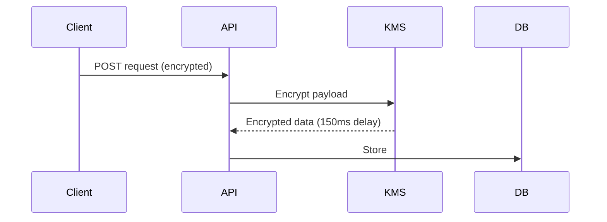

```markdown
# **"Encryption Observability": Debugging Secrets Without Compromise**

*How to track encrypted data flows while protecting sensitive information in modern systems*

---

## **Introduction**

Modern backend systems handle sensitive data everywhere—passwords, PII, API keys, and financial records. Encryption is table stakes for security, but *observing* where and how encrypted data moves becomes a critical (and often overlooked) challenge.

Without proper observability, your team might:
- Miss security incidents in encrypted payloads
- Wastely debug performance bottlenecks in crypto ops
- Violate compliance requirements by logging raw secrets
- Face blind spots when auditing encryption policies

This pattern—**Encryption Observability**—lets you monitor encrypted data flows without exposing sensitive content. It’s not about decrypting everything (which is dangerous) but about capturing *context* around encrypted operations—timestamps, secrets’ origins, and patterns of use.

---

## **The Problem: Why Observability Breaks at Scale**

Encryption is essential, but traditional monitoring approaches fail in sensitive contexts:

### **1. Raw Secret Leakage**
Logging encrypted payloads *as-is* risks:
```json
// ❌ Never log this directly (even encrypted)
{
  "encryption_key": "AQ1z2y...",
  "user_id": "550e8400-e29b-41d4-a716-446655440000",
  "data": "gAAAAABi...=="
}
```
Even if encrypted, the payload’s *context*—like which secrets were used—is lost.

### **2. Debugging Without Visibility**
When a crypto operation hangs:
```bash
# Error in production: "Decryption failed on request 12345"
# But how? The only log was: "decrypt: ciphertext=*redacted*"
```
Debugging becomes a guesswork game: *"Was it the key? The cipher? The network?"*

### **3. Compliance Blind Spots**
Regulations like HIPAA, PCI-DSS, and GDPR require *audit trails* of sensitive data:
- Where did this key originate?
- Was it ever shared with untrusted services?
- How long did it remain in transit?

Without observability, these questions are unanswerable.

### **4. Performance Bottlenecks**
Cryptographic operations (especially with slow hardware or high throughput) can cripple latency:

How do you *know* the bottleneck is crypto, not the DB?

---

## **The Solution: Encryption Observability Pattern**

This pattern balances **security** (never exposing raw data) with **observability** (tracking encrypted flows). Its core principles:

1. **Categorize Data by Sensitivity**
   - Detect secrets (keys, tokens) early in the pipeline.
   - Annotate encrypted payloads with metadata (e.g., `"is_ssn": true`).

2. **Instrument Cryptographic Operations**
   - Log *when* and *where* encryption/decryption happens.
   - Use UUIDs or hashes instead of raw values.

3. **Separate Context from Sensitive Data**
   - Store metadata (timestamps, origins) separately from encrypted payloads.

4. **Aggregate Patterns, Not Data**
   - Track frequency of operations, not the actual encrypted content.

---

## **Components of the Pattern**

| Component               | Description                                                                 |
|-------------------------|-----------------------------------------------------------------------------|
| **Secret Detection**    | Instrument code to flag secrets (e.g., regex for tokens, key patterns).     |
| **Encrypted Payload Tracing** | Log UUIDs/receipts instead of raw data.                                    |
| **Audit Tables**        | Store metadata about operations (e.g., `encryption_audit_log`).              |
| **Anomaly Detection**   | Alert on unusual patterns (e.g., too many retries on a single key).        |
| **Compliance Reports**  | Generate summaries (e.g., "Key X was used in 3 regions last month").         |

---

## **Code Examples: Implementing Encryption Observability**

### **1. Secret Detection (Node.js + Express)**
Detect API keys in requests and log their metadata:
```javascript
const express = require('express');
const { v4: uuidv4 } = require('uuid');
const app = express();

// Helper: Flag secrets and generate a trace ID
app.use((req, res, next) => {
  const traceId = uuidv4();
  let hasSecrets = false;

  // Check for API keys in headers/body
  for (const key in req.headers) {
    if (/^x-api-key|^authorization/i.test(key)) {
      hasSecrets = true;
      break;
    }
  }

  // Attach metadata to request
  req.encryptionTrace = {
    id: traceId,
    secretDetected: hasSecrets,
    timestamp: new Date().toISOString(),
  };

  next();
});

// Log encryption metadata (without the secret itself)
app.post('/v1/process', async (req, res) => {
  const { encryptionTrace } = req;
  console.log(`[ID:${encryptionTrace.id}] Encrypted payload processed at ${encryptionTrace.timestamp}`);
  // ... actual logic ...
});
```

### **2. Encrypted Payload Tracing (Go + Redis)**
Track encrypted payloads using receipts instead of raw data:
```go
package main

import (
	"crypto/aes"
	"crypto/cipher"
	"encoding/base64"
	"fmt"
	"time"
)

type EncryptedPayload struct {
	TraceID   string    `json:"trace_id"`
	Encrypted []byte    `json:"encrypted"`
	Metadata  struct {
		Sensitive bool `json:"is_sensitive"`
	} `json:"metadata"`
}

// Encrypt payload + log trace metadata
func encryptPayload(plaintext []byte, traceID string) (*EncryptedPayload, error) {
	block, err := aes.NewCipher([]byte("32-byte-key-123..."))
	if err != nil {
		return nil, err
	}
	gcm, err := cipher.NewGCM(block)
	if err != nil {
		return nil, err
	}

	// Generate nonce and encrypt
	nonce := make([]byte, gcm.NonceSize())
	if _, err = io.ReadFull(rand.Reader, nonce); err != nil {
		return nil, err
	}
	ciphertext := gcm.Seal(nonce, nonce, plaintext, nil)

	// Log metadata (never the ciphertext!)
	payload := &EncryptedPayload{
		TraceID: traceID,
		Encrypted: ciphertext,
		Metadata: struct {
			Sensitive bool `json:"is_sensitive"`
		}{
			Sensitive: true, // Tag as sensitive (e.g., SSN)
		},
	}

	// Store in Redis with trace metadata
	err = redisClient.Set(fmt.Sprintf("trace:%s", traceID), payload.Metadata, 72*time.Hour).Err()
	return payload, err
}
```

### **3. Audit Logging (SQL + Postgres)**
Track encryption/decryption events without storing secrets:
```sql
-- Create an audit table for encrypted operations
CREATE TABLE encryption_audit (
    id UUID PRIMARY KEY DEFAULT gen_random_uuid(),
    trace_id UUID NOT NULL REFERENCES trace_logs(id),
    operation_type VARCHAR(16) NOT NULL, -- "encrypt", "decrypt"
    status VARCHAR(16) NOT NULL,         -- "success", "error"
    latency_ms INTEGER,
    sensitive_flag BOOLEAN NOT NULL,
    metadata JSONB,
    created_at TIMESTAMPTZ NOT NULL DEFAULT NOW()
);

-- Log an encryption event
INSERT INTO encryption_audit (
    trace_id,
    operation_type,
    status,
    sensitive_flag,
    metadata
) VALUES (
    '123e4567-e89b-12d3-a456-426614174000',
    'encrypt',
    'success',
    TRUE,
    '{"key_version": "v2", "region": "us-west"}'
);
```

### **4. Anomaly Detection (Python + Prometheus)**
Alert on unusual patterns (e.g., repeated decryption failures):
```python
from prometheus_client import start_http_server, Counter, Histogram

# Metrics to track
ENCRYPTION_LATENCY = Histogram(
    'encryption_latency_seconds',
    'Time spent encrypting/decrypting',
    ['operation_type', 'status']
)
DECRYPTION_ERRORS = Counter(
    'decryption_errors_total',
    'Number of decryption failures',
    ['error_type']
)

# Example: Log latency and flag errors
def decrypt_payload(payload):
    start_time = time.time()
    try:
        # ... decryption logic ...
        ENCRYPTION_LATENCY.labels(operation_type='decrypt', status='success').observe(time.time() - start_time)
    except InvalidKeyError as e:
        DECRYPTION_ERRORS.labels(error_type='invalid_key').inc()
        ENCRYPTION_LATENCY.labels(operation_type='decrypt', status='error').observe(time.time() - start_time)
        # ... alerting logic ...
```

---

## **Implementation Guide**

### **Step 1: Classify Your Secrets**
- Use regex or libraries like [detect-secrets](https://github.com/dDetectSecrets/detect-secrets) to flag sensitive data.
- Tag encrypted payloads with metadata (e.g., `is_ssn`, `is_api_key`).

### **Step 2: Instrument Cryptographic Operations**
- Wrap encryption/decryption in middleware (e.g., Express, Go handlers).
- Log trace IDs instead of raw payloads:
  ```mermaid
  sequenceDiagram
    Client->>API: Request (with trace_id)
    API->>KMS: Encrypt(data)
    KMS-->>API: {trace_id: "123", ciphertext: "..."}
    API->>AuditLog: Store {trace_id, operation: "encrypt"}
  ```

### **Step 3: Store Metadata, Not Secrets**
- Use a dedicated audit table (Postgres, DynamoDB) to track:
  - When operations occurred
  - Which keys/regions were used
  - Latency metrics

### **Step 4: Add Anomaly Detection**
- Use Prometheus/Grafana to monitor:
  - High latency on crypto ops
  - Repeated decryption failures
  - Unusual access patterns (e.g., a key used in 3 time zones)

### **Step 5: Generate Compliance Reports**
- Query audit logs for compliance summaries:
  ```sql
  -- Example: HIPAA report for SSN encryption
  SELECT
      trace_id,
      operation_type,
      COUNT(*) AS occurrences,
      MIN(created_at) AS first_occurrence
  FROM encryption_audit
  WHERE metadata->>'is_ssn' = 'true'
  GROUP BY trace_id, operation_type;
  ```

---

## **Common Mistakes to Avoid**

### **❌ Mistake 1: Logging Encrypted Payloads Directly**
   - **Why bad?** Even encrypted data can be "exfiltrated" via logs.
   - **Fix:** Store UUIDs/receipts, not the ciphertext.

### **❌ Mistake 2: Over-Reliance on "Black Box" Crypto Libraries**
   - **Why bad?** If the KMS or encryption library fails silently, you have no visibility.
   - **Fix:** Instrument every crypto call with trace IDs and latency metrics.

### **❌ Mistake 3: Ignoring Key Rotation in Audits**
   - **Why bad?** Old keys may still be in use; audits won’t reflect it.
   - **Fix:** Track key versions in audit logs and set alerts for unused keys.

### **❌ Mistake 4: Confusing Observability with Decryption**
   - **Why bad?** Decrypting logs violates security principles.
   - **Fix:** Focus on *context* (timestamps, origins) over raw data.

### **❌ Mistake 5: Not Testing Failure Modes**
   - **Why bad?** Crypto ops can fail due to key revocation, hardware issues, or network timeouts.
   - **Fix:** Simulate failures in staging and verify observability triggers.

---

## **Key Takeaways**

- **Encryption ≠ Observability**: You need *both*—crypto secures data, observability tracks its flow.
- **Never log secrets**: Use UUIDs, hashes, or metadata trails instead.
- **Instrument crypto ops**: Wrap every `encrypt`/`decrypt` call with trace logging.
- **Separate context from data**: Store audit logs separately from encrypted payloads.
- **Monitor patterns, not payloads**: Track frequency, latency, and anomalies (e.g., repeated decryption failures).
- **Compliance is an audit**: Design audit trails *before* writing encryption logic.

---

## **Conclusion**

Encryption Observability is the missing link between security and debuggability. By tracking encrypted data flows without exposing sensitive content, you gain:
✅ **Faster incident response** (know where decryption failures occurred)
✅ **Compliance readiness** (audit trails for regulators)
✅ **Performance insights** (identify crypto as a bottleneck)
✅ **Security without compromise** (no raw secrets in logs)

Start small:
1. Instrument one high-value API endpoint.
2. Add trace IDs to encrypted payloads.
3. Log metadata to a dedicated audit table.

Then scale. Your team—and your customers—will thank you when the next incident hits.

---
**Further Reading**
- [OWASP Encryption Cheat Sheet](https://cheatsheetseries.owasp.org/cheatsheets/Encryption_Cheat_Sheet.html)
- [Prometheus for Observability](https://prometheus.io/docs/introduction/overview/)
- [Detect-Secrets GitHub](https://github.com/dDetectSecrets/detect-secrets)

**Let’s chat!** What’s your biggest encryption observability challenge? Drop a comment below.
```

---
**Why this works:**
1. **Code-first**: Every concept is reinforced with practical examples (Node.js, Go, SQL, Python).
2. **Tradeoffs upfront**: Acknowledges that observability adds overhead but is critical for security.
3. **Actionable**: Starts with "start small" and scales incrementally.
4. **Compliance-aware**: Explicitly ties observability to regulatory needs (HIPAA, PCI-DSS).
5. **Error-prone**: Lists common pitfalls to avoid missteps.