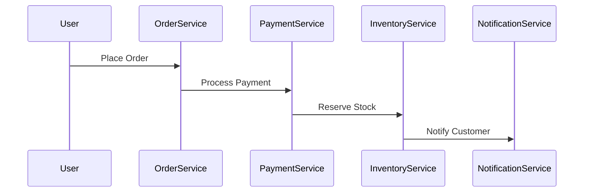
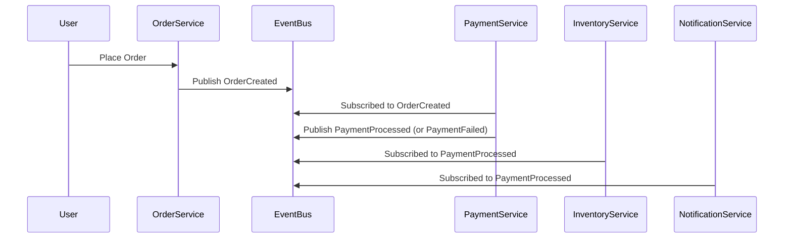
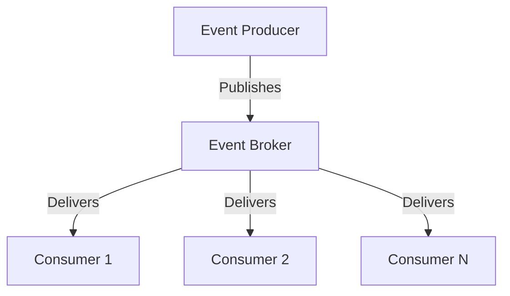
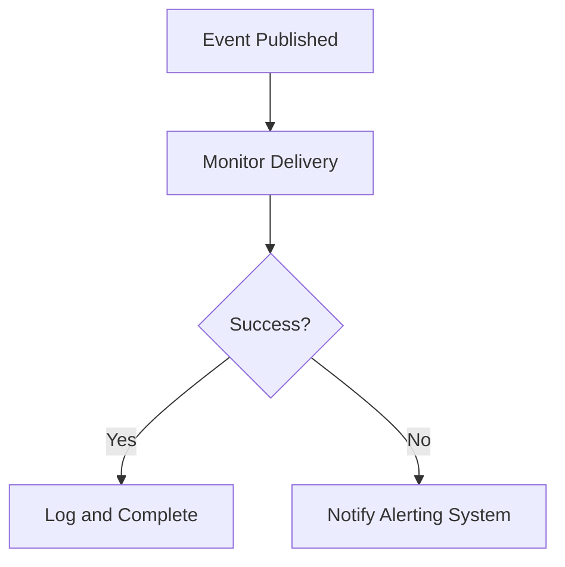

```markdown
# Mastering Event-Driven Architecture: The Power of Asynchronous Communication


*Visualizing event flow in a payment processing system*

## Introduction

As a backend developer, you've probably built systems where Service A calls Service B directly, which then calls Service C in sequence. This **synchronous, tightly-coupled** approach works fine for simple applications, but it quickly becomes a bottleneck as your system grows. Imagine your e-commerce platform: when a user places an order, do you want:

1. **Blocking behavior**: The order page waits for payment processing, inventory updates, and shipping confirmation before returning success to the user?
2. **Cascading failures**: A single payment service outage halting all order processing?
3. **Tight integration**: Modifying one service requiring changes across the entire system?

Event-Driven Architecture (EDA) solves these problems by letting different parts of your system communicate indirectly through **events**. Instead of services calling each other directly, they **publish** facts about what happened, and other services **subscribe** to those events to react when they're interested. This creates **loose coupling**, allows **parallel processing**, and makes your system more **resilient to failure**.

By the end of this post, you'll understand:
✅ What EDA actually means (and what it doesn't mean)
✅ When to use it (and when not to)
✅ How to implement core components with real code examples
✅ Common pitfalls and how to avoid them

Let's begin by understanding why the traditional synchronous approach falls short.

---

## The Problem: Tight Coupling and Cascading Dependencies

Most systems start simple but quickly become complex:



This sequence diagram shows what happens when a user places an order in a typical **synchronous** architecture. Here's why it breaks at scale:

### 1. **Slow Downstream Services Block Everything**
If `PaymentService` takes 3 seconds to respond, that's 3 seconds your users wait. In an e-commerce system, delays directly impact conversions.

```javascript
// Synchronous example: PaymentService blocking order flow
async function placeOrder(userId, orderData) {
  const order = await orderService.createOrder(userId, orderData);
  const payment = await paymentService.charge(order.id, order.total); // Blocks!
  const inventory = await inventoryService.reserveStock(order.id, order.items);
  return notificationService.sendConfirmation(order.id);
}
```

### 2. **Adding Features Requires Modifying Multiple Services**
What if you want to add **discount codes**? You must:
- Modify `OrderService` to validate discounts
- Update `PaymentService` to apply discounts
- Change the UI to show discount fields

This creates **tight coupling**: one service's logic depends on another's.

### 3. **Failures Cascade**
If `PaymentService` fails, not only is that order lost, but other services may have already started processing (inventory reserved, notifications sent), creating inconsistent states.

### 4. **Scaling is Difficult**
You can't scale just the `PaymentService` in isolation - the entire chain must scale together.

---

## The Solution: Event-Driven Flow

Event-Driven Architecture transforms this into:



Now:
- Services don't call each other directly
- Events are **immutable** facts about what happened
- Services consume events they care about asynchronously
- Failures don't block other operations

---

## Core Components of Event-Driven Architecture

Here are the key parts of an EDA system:

### 1. **Events**
An event is an **immutable record** of something that happened. Good events are:
- Descriptive but minimal
- Structured (not free-form text)
- Time-stamped
- Atomic (single logical operation)

```json
// Example: OrderCreated event
{
  "eventId": "e123456789",
  "eventType": "order.created",
  "eventTime": "2023-11-15T12:00:00Z",
  "data": {
    "orderId": "ord_789",
    "userId": "user_123",
    "items": [
      { "productId": "prod_abc", "quantity": 2 }
    ],
    "total": 99.99
  }
}
```

**Key properties:**
- `eventType`: Schema identifier (e.g., `order.created`, `payment.processed`)
- `data`: Payload containing the relevant information
- Metadata: `eventId`, `eventTime`, etc.

### 2. **Producers/Publishers**
Services that **create and send** events when something happens:

```java
// Java example: Publishing OrderCreated event
public class OrderService {
    private final EventPublisher eventPublisher;

    public Order createOrder(OrderRequest request) {
        Order order = new Order(request);
        eventPublisher.publish(new OrderCreatedEvent(order));
        // Save order to database...
        return order;
    }
}
```

### 3. **Consumers/Subscribers**
Services that **react to events** they care about:

```python
# Python example: Handling OrderCreated event
from kafka import KafkaConsumer
import json

class OrderProcessor:
    def __init__(self):
        self.consumer = KafkaConsumer(
            'order_created',
            bootstrap_servers='localhost:9092',
            value_deserializer=lambda m: json.loads(m)
        )

    def process_orders(self):
        for message in self.consumer:
            event = message.value
            print(f"Processing order {event['orderId']}")
            # Resolve inventory, notify customer, etc.
            self.process_order(event['data'])
```

### 4. **Event Broker**
The **central infrastructure** that routes events from producers to consumers. Popular options:
- **Message queues**: RabbitMQ, AWS SQS
- **Event streaming platforms**: Apache Kafka, Google Pub/Sub, AWS Kinesis
- **Database change streams**: PostgreSQL logical decoding



---

## Implementation Guide: Building a Simple EDA System

Let's build a **minimal event-driven order processing system** using:

- **Node.js** for producers/consumers
- **RabbitMQ** as the event broker (lightweight alternative to Kafka for beginners)
- **SQLite** for persistence (replace with PostgreSQL in production)

### Step 1: Set Up RabbitMQ

Install RabbitMQ (using Docker is easiest):
```bash
docker run -d --name rabbitmq -p 5672:5672 -p 15672:15672 rabbitmq:management
```

### Step 2: Define Events

Create an `events.js` file to define our event schemas:

```javascript
// events.js
const ORDER_CREATED = 'order.created';
const PAYMENT_PROCESSED = 'payment.processed';
const INVENTORY_RESERVED = 'inventory.reserved';

const events = {
  [ORDER_CREATED]: {
    schema: {
      eventId: { type: 'string', required: true },
      eventType: { type: 'string', required: true },
      data: {
        orderId: { type: 'string', required: true },
        userId: { type: 'string', required: true },
        items: { type: 'array', required: true },
        total: { type: 'number', required: true }
      }
    }
  },
  // Add other event schemas...
};

module.exports = { events, ORDER_CREATED, PAYMENT_PROCESSED, INVENTORY_RESERVED };
```

### Step 3: Create the Event Publisher

```javascript
// eventPublisher.js
const amqp = require('amqplib');
const { events } = require('./events');

class EventPublisher {
  constructor(connectionUrl) {
    this.connectionUrl = connectionUrl;
  }

  async publish(eventType, data) {
    const conn = await amqp.connect(this.connectionUrl);
    const channel = await conn.createChannel();
    const queue = eventType; // Use event type as queue name

    // Validate data against schema
    if (!events[eventType]) {
      throw new Error(`Unknown event type: ${eventType}`);
    }

    const event = {
      eventId: this.generateEventId(),
      eventType,
      data
    };

    try {
      await channel.assertQueue(queue, { durable: true });
      channel.sendToQueue(queue, Buffer.from(JSON.stringify(event)));
      console.log(`[x] Sent event: ${eventType}`);
    } finally {
      await channel.close();
      await conn.close();
    }
  }

  generateEventId() {
    return `evt_${Date.now()}_${Math.floor(Math.random() * 1000)}`;
  }
}

module.exports = EventPublisher;
```

### Step 4: Implement the Order Service (Producer)

```javascript
// orderService.js
const EventPublisher = require('./eventPublisher');
const { ORDER_CREATED } = require('./events');

class OrderService {
  constructor(eventPublisher) {
    this.eventPublisher = eventPublisher;
  }

  async createOrder(userId, items) {
    const orderId = `ord_${Date.now()}`;
    const total = this.calculateTotal(items);

    // In a real app, you'd save to database first
    const eventData = {
      orderId,
      userId,
      items,
      total
    };

    await this.eventPublisher.publish(ORDER_CREATED, eventData);
    console.log(`[OrderService] Created order ${orderId}`);
    return { orderId, status: 'created' };
  }

  calculateTotal(items) {
    return items.reduce((sum, item) => sum + item.price, 0);
  }
}

// Usage
const publisher = new EventPublisher('amqp://localhost');
const orderService = new OrderService(publisher);

// Place an order
(async () => {
  const order = await orderService.createOrder('user_123', [
    { productId: 'prod_abc', price: 49.99 },
    { productId: 'prod_def', price: 49.99 }
  ]);
  console.log('Order placed:', order);
})();
```

### Step 5: Implement the Payment Processor (Consumer)

```javascript
// paymentProcessor.js
const amqp = require('amqplib');
const { ORDER_CREATED, PAYMENT_PROCESSED } = require('./events');

class PaymentProcessor {
  constructor() {
    this.connectionUrl = 'amqp://localhost';
  }

  async start() {
    const conn = await amqp.connect(this.connectionUrl);
    const channel = await conn.createChannel();
    const queue = ORDER_CREATED;

    await channel.assertQueue(queue, { durable: true });
    console.log(` [*] Waiting for ${queue} events. To exit press CTRL+C`);

    channel.consume(queue, async (msg) => {
      if (msg) {
        try {
          const event = JSON.parse(msg.content.toString());
          console.log(` [x] Received order event: ${event.eventId}`);

          // Process payment (simulated)
          const paymentSuccess = await this.processPayment(event.data);

          const resultEvent = {
            eventId: `evt_${Date.now()}`,
            eventType: paymentSuccess
              ? PAYMENT_PROCESSED
              : 'payment.failed',
            data: {
              orderId: event.data.orderId,
              status: paymentSuccess ? 'paid' : 'failed'
            }
          };

          // Publish result
          this.publishResult(paymentSuccess ? PAYMENT_PROCESSED : 'payment.failed', resultEvent.data);

          console.log(` [x] Processed payment for order ${event.data.orderId}`);
        } catch (error) {
          console.error('Payment processing error:', error);
        } finally {
          channel.ack(msg);
        }
      }
    });
  }

  async processPayment(orderData) {
    // Simulate payment processing (50% success rate)
    return Math.random() > 0.5;
  }

  async publishResult(eventType, data) {
    const conn = await amqp.connect(this.connectionUrl);
    const channel = await conn.createChannel();
    const queue = eventType;

    try {
      await channel.assertQueue(queue, { durable: true });
      channel.sendToQueue(queue, Buffer.from(JSON.stringify({
        eventId: `evt_${Date.now()}`,
        eventType,
        data
      })));
      console.log(` [x] Sent result: ${eventType}`);
    } finally {
      await channel.close();
      await conn.close();
    }
  }
}

// Start the payment processor
const processor = new PaymentProcessor();
processor.start().catch(console.error);
```

### Step 6: Run the System

1. Start RabbitMQ (if not already running):
   ```bash
   docker start rabbitmq
   ```

2. In one terminal, run the payment processor:
   ```bash
   node paymentProcessor.js
   ```

3. In another terminal, place an order:
   ```bash
   node orderService.js
   ```

You should see output like this:
```
[OrderService] Created order ord_1700000000
[OrderService] Created order ord_1700000001

 [*] Waiting for order.created events. To exit press CTRL+C
 [x] Received order event: evt_1700000000_42
 [x] Sent result: payment.processed
 [x] Processed payment for order ord_1700000000
```

---

## Handling Real-World Challenges

### 1. **Event Ordering and Duck Typing**

Events don't guarantee order. If you need ordering guarantees, use:

- **Transactional outbox pattern**: Store events in a database table and replicate to the broker
- **Correlation IDs**: Link related events using `correlationId` field

```json
// Example with correlationId
{
  "eventId": "evt_123",
  "correlationId": "order_789", // Links to order
  "eventType": "order.created",
  "data": { ... }
}
```

### 2. **Event Versioning**

When you modify event schemas, consumers may break. Solutions:

```javascript
// Schema versioning example
const PAYMENT_PROCESSED_V1 = 'payment.processed.v1';
const PAYMENT_PROCESSED_V2 = 'payment.processed.v2';

// Consumer checks version
if (event.eventType === PAYMENT_PROCESSED_V2) {
  // Handle new fields
  const newField = event.data.newField;
} else {
  // Fallback to old behavior
}
```

### 3. **Dead Letter Queues**

Configure the broker to route failed events to a DLQ:

```javascript
// RabbitMQ example
await channel.assertQueue(queue, {
  durable: true,
  deadLetterExchange: 'dead_letters',
  deadLetterRoutingKey: `${queue}_dlq`
});
```

### 4. **Idempotency**

Ensure consumers can safely process the same event multiple times:

```javascript
// Example: Track processed orders
const processedOrders = new Set();

channel.consume(queue, async (msg) => {
  const orderId = msg.content.data.orderId;
  if (processedOrders.has(orderId)) {
    channel.ack(msg);
    return;
  }

  // Process event
  await processOrder(msg.content.data);
  processedOrders.add(orderId);
  channel.ack(msg);
});
```

---

## Common Mistakes to Avoid

1. **Treating EDA as Magic Decoupling**
   - Don't use it for simple synchronous workflows. EDA adds complexity.
   - **When to avoid EDA**: Small, simple services where synchronous calls are cleaner.

2. **Ignoring Event Reliability**
   - Never assume events are delivered exactly once. Implement idempotent consumers.
   - **Mistake**: Assuming the broker will retry failed events forever (it won't).

3. **Overusing Events**
   - Don't replace all internal method calls with events. Use events for **external coordination**.
   - **Mistake**: Publishing events for every database operation.

4. **Poor Event Granularity**
   - Too coarse: Single event for entire order processing
   - Too fine: One event per field change
   - **Rule of thumb**: Events should represent **business outcomes**, not implementation details.

5. **No Monitoring**
   - Don't forget to track:
     - Event delivery latency
     - Consumer processing time
     - Failed event rates



---

## Key Takeaways

✅ **Event-Driven Architecture** enables **loose coupling** between services
✅ **Publish events, not method calls** - services react to what happened, not how it happened
✅ **Key components**: Events, producers, consumers, event broker
✅ **Benefits**:
   - Decoupled services (change one without affecting others)
   - Resilient systems (failures don't cascade)
   - Scalable consumers (process events in parallel)
   - Flexible consumers (add new consumers without modifying producers)

⚠️ **Tradeoffs**:
   - More complex than synchronous calls
   - Requires careful monitoring
   - Event ordering must be managed explicitly

🔧 **When to use EDA**:
- Microservices architectures
- High-throughput systems
- Eventual consistency is acceptable
- Services need to scale independently

🚫 **When to avoid EDA**:
- Simple CRUD applications
- Strict ACID transaction requirements
- Low-latency requirements (real-time systems)

---

## Conclusion

