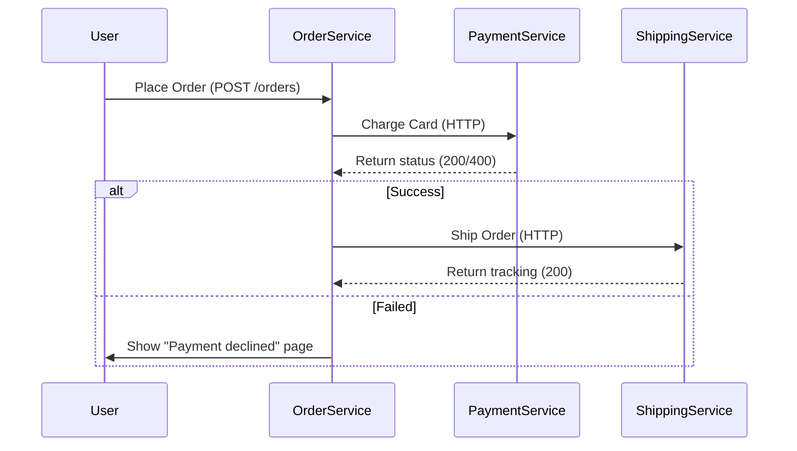

```markdown
---
title: "Event-Driven Architecture: Building Resilient Systems That Scale"
date: "2023-11-15"
description: "Learn how event-driven architecture decouples systems, improves scalability, and builds resilient software. Practical examples, implementation patterns, and pitfalls to avoid."
tags: ["backend", "architecture", "event-driven", "microservices", "scalability"]
---

# Event-Driven Architecture: Building Resilient Systems That Scale


*Events flow between decoupled services, enabling asynchronous communication and resilience.*

---

## Introduction

Imagine building a digital marketplace where users place orders, receive payments, and products get fulfilled—all in real-time. Traditional synchronous architectures force these services to call each other directly, creating tight coupling and fragile dependencies. If the payment service crashes, the order processing halts. If you later need to add shipping notifications, you must modify the ordering service.

**Event-Driven Architecture (EDA)** solves this by decoupling services through events. Instead of services calling each other, they publish *what happened* (an event) and let other services react. This approach unlocks **scalability**, **resilience**, and **flexibility**—key traits for modern systems.

In this guide, we’ll explore:
- Why synchronous APIs lead to painful bottlenecks
- How EDA transforms communication between services
- Practical implementations using real-world examples
- Common pitfalls and how to avoid them

By the end, you’ll understand how to design event-driven systems and when to use them (and when to avoid them).

---

---

## The Problem: Why Tight Coupling Breaks Systems

Let’s start with a familiar scenario: a user in your e-commerce app places an order. Here’s how it *doesn’t* work well:

### Synchronous Flow Example (Bad)


#### Problems with this approach:
1. **Blocking Calls**: The order service waits for payment to complete before shipping. If payment fails, the entire operation fails.
2. **Cascading Failures**: A single failure (e.g., payment service downtime) slows down or halts orders.
3. **Tight Coupling**: If shipping logic changes, the order service must be updated. If you later add "invoice generation," you must modify the order service again.
4. **Scaling Pain**: If payment processing spikes, it blocks order creation—and vice versa.
5. **Debugging Hell**: Events are tangled across service logs, making troubleshooting harder.

### Real-World Example: The "Christmas Day Outage"
In 2018, Starbucks’ global mobile app crashed on Black Friday due to ** payment service timeouts**. The root cause? A single synchronous call between the order and payment services blocked everything.

---

---

## The Solution: Event-Driven Architecture

EDA replaces synchronous calls with **asynchronous events**. Instead of:
```plaintext
Order Service → Payment Service → Shipping Service
```

We simplify to:
```plaintext
Order Service → (publish OrderCreated event)
Payment Service → (subscribes to OrderCreated, publishes PaymentProcessed)
Shipping Service → (subscribes to PaymentProcessed, ships)
```

### Key Components
1. **Event**: An immutable record of something that happened.
   Example:
   ```json
   {
     "event_id": "evt_123",
     "type": "OrderCreated",
     "timestamp": "2023-11-15T12:00:00Z",
     "data": {
       "order_id": "ord_456",
       "user_id": "usr_789",
       "items": [{"product_id": "prod_1", "quantity": 2}]
     }
   }
   ```
2. **Producer/Publisher**: A service that publishes events (e.g., Order Service).
3. **Consumer/Subscriber**: A service that reacts to events (e.g., Shipping Service).
4. **Event Broker**: Routes events (e.g., Apache Kafka, AWS SNS/SQS, RabbitMQ).

### The Flow
1. A user places an order → **OrderCreated event** is published.
2. Payment Service listens for `OrderCreated` events, processes payment, and publishes `PaymentProcessed`.
3. Shipping Service listens for `PaymentProcessed`, confirms shipping, and publishes `OrderShipped`.
4. User Service listens for `OrderShipped` and sends a confirmation email.

**Result**: No blocking calls, decoupled services, and resilience to failures.

---

## Implementation Guide: From Theory to Code

Let’s build a small example using **AWS SNS/SQS** (simple) and **Kafka** (scalable). You’ll need Docker for Kafka.

---

### 1. Simple Example: AWS SNS/SQS (Synchronous-Like)
Imagine a **Order Service** that publishes events to SQS, and **Payment Service** consumes them.

#### Order Service (Publisher)
```python
# order_service.py
import json
import boto3
from datetime import datetime

sqs = boto3.client('sqs', region_name='us-east-1')

def publish_order_created(order_id, user_id, items):
    event = {
        "event_id": f"evt_{order_id}",
        "type": "OrderCreated",
        "timestamp": datetime.utcnow().isoformat(),
        "data": {
            "order_id": order_id,
            "user_id": user_id,
            "items": items
        }
    }

    # Send event to SQS queue
    response = sqs.send_message(
        QueueUrl="https://sqs.us-east-1.amazonaws.com/123456789012/orders-created-queue",
        MessageBody=json.dumps(event)
    )
    return response

# Example usage
publish_order_created("ord_789", "usr_123", [{"product_id": "prod_1", "quantity": 1}])
```

#### Payment Service (Consumer)
```python
# payment_service.py
import json
import boto3
from datetime import datetime

sqs = boto3.client('sqs', region_name='us-east-1')

def process_orders(queue_url):
    response = sqs.receive_message(
        QueueUrl=queue_url,
        MaxNumberOfMessages=10,
        WaitTimeSeconds=2  # Long polling
    )

    if 'Messages' not in response:
        return

    for message in response['Messages']:
        event = json.loads(message['Body'])
        print(f"Processing order: {event['data']['order_id']}")

        # Simulate payment processing
        payment_processed = {
            "event_id": f"evt_{event['data']['order_id']}_payment",
            "type": "PaymentProcessed",
            "timestamp": datetime.utcnow().isoformat(),
            "data": {
                "order_id": event['data']['order_id'],
                "status": "completed"
            }
        }

        # Publish payment event (here, we'd use SNS or another SQS queue)
        sqs.send_message(
            QueueUrl="https://sqs.us-east-1.amazonaws.com/123456789012/payments-processed-queue",
            MessageBody=json.dumps(payment_processed)
        )

        sqs.delete_message(
            QueueUrl=queue_url,
            ReceiptHandle=message['ReceiptHandle']
        )

# Example usage (would run as a Lambda or EC2 instance)
process_orders("https://sqs.us-east-1.amazonaws.com/.../orders-created-queue")
```

#### Key Takeaways from This Example
- **Decoupled**: Order Service doesn’t wait for Payment Service.
- **Scalable**: SQS handles queueing and retries automatically.
- **Simple**: No complex infrastructure needed.

---

### 2. Advanced Example: Kafka (Scalable)
For high-throughput systems, **Apache Kafka** is a robust choice. Let’s rebuild the example.

#### Prerequisites
- Docker (to run Kafka locally)
- Python + `confluent-kafka` library:
  ```bash
  pip install confluent-kafka
  ```

#### Kafka Setup with Docker
```bash
# Start Kafka in Docker
docker run -d --name kafka -p 9092:9092 -p 29092:29092 bitnami/kafka:latest
```

#### Order Service (Producer)
```python
# order_kafka_producer.py
from confluent_kafka.admin import AdminClient, NewTopic
from confluent_kafka.producer import Producer
import json
import time

# Define Kafka topics
TOPICS = ["orders.created", "payments.processed"]

def create_topics():
    admin = AdminClient({"bootstrap.servers": "localhost:9092"})
    topics = [NewTopic(topic, num_partitions=1, replication_factor=1) for topic in TOPICS]
    admin.create_topics(new_topics=topics)
    admin.close()

# Initialize Kafka producer
conf = {'bootstrap.servers': 'localhost:9092'}
producer = Producer(conf)

def publish_order_created(order_id, user_id, items):
    event = {
        "event_id": f"evt_{order_id}",
        "type": "OrderCreated",
        "timestamp": time.strftime("%Y-%m-%dT%H:%M:%SZ", time.gmtime()),
        "data": {
            "order_id": order_id,
            "user_id": user_id,
            "items": items
        }
    }

    # Publish to Kafka
    producer.produce(
        topic="orders.created",
        value=json.dumps(event).encode('utf-8')
    )
    producer.flush()  # Wait for message to be sent

# Example usage
create_topics()  # Only needed once
publish_order_created("ord_456", "usr_789", [{"product_id": "prod_1", "quantity": 1}])
```

#### Payment Service (Consumer)
```python
# payment_kafka_consumer.py
from confluent_kafka import Consumer, KafkaException
import json
import threading

def run_consumer():
    conf = {
        'bootstrap.servers': 'localhost:9092',
        'group.id': 'payment-group',
        'auto.offset.reset': 'earliest'
    }

    consumer = Consumer(conf)
    consumer.subscribe(["orders.created"])

    try:
        while True:
            msg = consumer.poll(1.0)
            if msg is None:
                continue
            if msg.error():
                raise KafkaException(msg.error())

            event = json.loads(msg.value().decode('utf-8'))
            print(f"Processing order: {event['data']['order_id']}")

            # Simulate payment processing
            payment_processed = {
                "event_id": f"evt_{event['data']['order_id']}_payment",
                "type": "PaymentProcessed",
                "timestamp": time.strftime("%Y-%m-%dT%H:%M:%SZ", time.gmtime()),
                "data": {
                    "order_id": event['data']['order_id'],
                    "status": "completed"
                }
            }

            # Publish payment event
            producer = Producer({'bootstrap.servers': 'localhost:9092'})
            producer.produce(
                topic="payments.processed",
                value=json.dumps(payment_processed).encode('utf-8')
            )
            producer.flush()

    except KeyboardInterrupt:
        pass
    finally:
        consumer.close()

if __name__ == "__main__":
    run_consumer()
```

#### Key Advantages of Kafka
- **Scalability**: Handles millions of events per second.
- **Persistence**: Events are stored durably.
- **Ordering**: Guarantees event ordering per partition.
- **Parallelism**: Multiple consumers can process events concurrently.

---

### 3. Database-Driven Events
Sometimes, you don’t want to add an event broker. Instead, you can **poll the database for changes** (the "Materialized Event Pattern").

#### Example: PostgreSQL Change Data Capture (CDC)
With tools like **Debezium**, you can capture database changes and publish them as events.

```sql
-- Example table change (PostgreSQL)
INSERT INTO orders (order_id, user_id, status)
VALUES ('ord_123', 'usr_456', 'created');
```

Debezium can capture this change and publish it to Kafka like this:
```json
{
  "event_id": "evt_123",
  "type": "OrderCreated",
  "database": "postgres",
  "table": "orders",
  "data": {
    "order_id": "ord_123",
    "user_id": "usr_456",
    "status": "created",
    "old": null,
    "op": "c"  # "c" = created
  }
}
```

**Pros**: No extra infrastructure if you already use PostgreSQL.
**Cons**: Slower than direct events; less flexible.

---

---

## Common Mistakes to Avoid

### 1. Overusing Events for Everything
**Problem**: Not all use cases are suited for events.
- **Bad**: Triggering a complex business logic from an event (events should be simple facts).
- **Good**: Use events for **decoupled notifications** (e.g., "OrderCreated") but keep synchronous calls for transactions.

### 2. Not Handling Event Ordering
**Problem**: If you publish `EventA` then `EventB`, but `EventB` subscribers run first, you may miss dependencies.
- **Solution**: Use Kafka partitions or event IDs to enforce ordering.

### 3. Ignoring Event Idempotency
**Problem**: If an event is processed twice, your system may duplicate side effects (e.g., sending multiple emails).
- **Solution**: Design consumers to be idempotent (e.g., check duplicate `event_id` before processing).

### 4. No Retry/Dead Letter Queues
**Problem**: If a consumer fails, the event gets lost or reprocessed indefinitely.
- **Solution**: Use **SQS Dead Letter Queues** or **Kafka retries** with exponential backoff.

### 5. Tight Coupling to Event Schema
**Problem**: If you hardcode JSON paths in consumers, schema changes break things.
- **Solution**: Use **event schemas** (e.g., Avro) or strict validation.

---

---

## Key Takeaways

✅ **Decoupling**: Publishers don’t need to know about subscribers.
✅ **Scalability**: Services scale independently.
✅ **Resilience**: Failures in one service don’t halt others.
✅ **Flexibility**: Add new features by writing consumers, not modifying publishers.

⚠️ **Tradeoffs**:
- **Complexity**: More moving parts → harder to debug.
- **Eventual consistency**: Consumers may not process events instantly.
- **Performance overhead**: Extra network hops vs. synchronous calls.

🛠️ **When to Use EDA**:
- High-throughput systems (e.g., social media, e-commerce).
- Decoupled microservices.
- Resilient architectures (e.g., financial systems).

🚫 **When to Avoid EDA**:
- Simple, low-latency APIs (e.g., internal tools).
- Strictly sequential workflows (e.g., form submissions).
- Teams unfamiliar with async programming.

---

## Conclusion

Event-Driven Architecture empowers you to build **scalable, resilient systems** without tight coupling. By publishing facts and letting services react, you future-proof your architecture for growth and complexity.

### Next Steps:
1. Start small: Add an event broker to one service chain.
2. Instrument events: Use tools like **Datadog APM** or **Prometheus** to monitor event flows.
3. Iterate: Gradually replace synchronous calls with events.

**Resources**:
- [Kafka Documentation](https://kafka.apache.org/)
- [AWS SNS/SQS Guide](https://docs.aws.amazon.com/sns/latest/dg/welcome.html)
- [Event Storming for EDA](https://eventstorming.com/)

Now go build a resilient system—one event at a time!

---
```