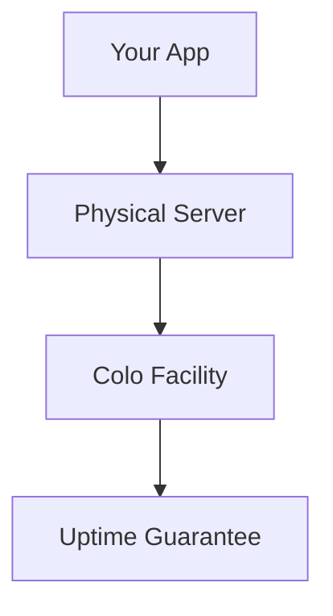
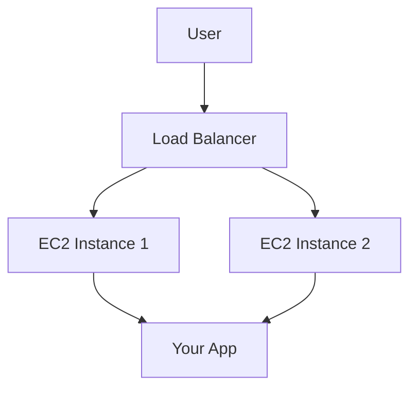
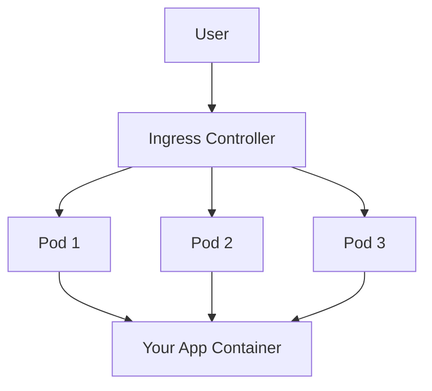
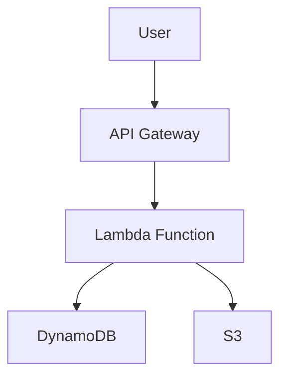

```markdown
# **From Co-Location to Serverless: The Cloud Evolution Journey for Backend Developers**


Back in the early 2000s, deploying an application meant physically managing servers in a data center, scheduling power outages for hardware upgrades, and worrying about rack space in a colocation facility. Fast forward to today, and backend engineers can spin up a server with a single click, scale effortlessly, and focus on writing code rather than infrastructure. The shift from **colocation to serverless** represents one of the most transformative journeys in software engineering—one that has democratized development and redefined how we think about scalability, cost, and reliability.

This blog post explores this evolution step-by-step, using real-world examples and code snippets to illustrate each stage. We’ll cover the **problems** each approach solved, the **tradeoffs** you should consider, and how modern serverless platforms (like AWS Lambda, Azure Functions, or Google Cloud Functions) have reduced infrastructure concerns to near-zero. By the end, you’ll have a clear understanding of why serverless is the current golden child of cloud computing—and when it *might not* be the right fit.

---

## **The Problem: Why Did We Need Cloud Computing?**

Let’s start with a hypothetical scenario: You’re a small startup in 2005 with a growing web app. Your users love it, but your traffic is spiking unpredictably. Here’s how things used to work (and why they sucked):

### **1. The Colocation Nightmare (2000s)**
- **Problem**: You bought a physical server and placed it in a colocation facility (like Equinix). If traffic spiked, you either:
  - **Upgraded hardware manually** (expensive, time-consuming).
  - **Ran hot servers** (inefficient, risky).
- **Pain Points**:
  - **No elasticity**: You paid for capacity whether you used it or not.
  - **No redundancy**: A single hardware failure could take your app down.
  - **Hardware management**: You had to handle everything—OS updates, security patches, even cooling fans.

**Example**: If your app gets a viral post on Reddit, your server crashes under load. You have to physically swap in a bigger machine.

### **2. The Virtualization Era (2005–2010)**
- **Problem**: Colocation was too rigid. You needed a way to share hardware efficiently.
- **Solution**: **Virtual Machines (VMs)** (e.g., AWS EC2 launched in 2006).
  - Now, you could **rent virtual servers** on demand.
  - Still, you had to:
    - **Provision and manage VMs** (OS, patches, scaling).
    - **Pay for idle capacity** (even if traffic was low).

**Example**: You spin up 3 EC2 instances for $0.10/hour each. But if you under-provision, your app crashes during traffic spikes. If you over-provision, you waste money.

---

## **The Solution: A Step-by-Step Evolution**

Let’s break down how each stage solved (or partially solved) the problems above.

---

### **1. Colocation (2000–2005)**
**What it was**: Renting physical space in a data center where you owned the hardware.
**Pros**:
- Full control over hardware.
- No shared resources (better security isolation).
**Cons**:
- **No scalability**: You had to buy more hardware.
- **No redundancy**: Single points of failure.
- **High cost**: Pay for uptime whether you used it or not.

**Example Architecture**:


**When to use today?**
Almost never. Only for extreme custom hardware needs (e.g., AI inference boxes).

---

### **2. Virtual Machines (VMs) – AWS EC2 (2006–Present)**
**What it was**: Renting virtualized instances on shared hardware.
**How it worked**:
- You could **spin up VMs** on demand (e.g., t2.micro for $5/month).
- Still, you managed:
  - **OS updates**
  - **Scaling** (you had to pre-provision)
  - **Networking** (subnets, security groups)

**Example (Deploying a Node.js App on EC2)**:
1. Launch an EC2 instance (Ubuntu 22.04, 1 vCPU, 1GB RAM).
2. SSH in and install Node.js:
   ```bash
   sudo apt update && sudo apt install nodejs -y
   git clone https://github.com/your-app.git
   npm install
   npm start &
   ```
3. Set up a load balancer (ELB) to distribute traffic.

**Pros**:
- **Pay-as-you-go**: Only pay for what you use.
- **Elasticity**: Spin up/down instances.
**Cons**:
- **Operational overhead**: You’re responsible for the VM itself.
- **Cold starts**: Booting a VM takes minutes.

**Example Architecture**:


**When to use today?**
- Long-running services (e.g., a backend API that stays up 24/7).
- When you need **predictable performance** (e.g., a database node).

---

### **3. Containers & Kubernetes (2010–Present)**
**What it was**: Lightweight VMs (containers) that share the host OS kernel.
**How it worked**:
- **Docker** let you package apps + dependencies into containers.
- **Kubernetes (K8s)** automated scaling, load balancing, and failover.
- You still managed:
  - **Cluster configuration** (node pools, storage).
  - **Networking** (ingress controllers).
  - **Scaling policies** (HPA, Cluster Autoscaler).

**Example (Deploying a Containerized App on ECS/K8s)**:
1. Dockerize your app (`Dockerfile`):
   ```dockerfile
   FROM node:18
   WORKDIR /app
   COPY . .
   RUN npm install
   CMD ["npm", "start"]
   ```
2. Deploy to **Amazon ECS** or **Kubernetes**:
   ```yaml
   # Example Kubernetes Deployment (deploy.yaml)
   apiVersion: apps/v1
   kind: Deployment
   metadata:
     name: my-app
   spec:
     replicas: 3
     template:
       spec:
         containers:
         - name: app
           image: my-app:latest
           ports:
           - containerPort: 3000
   ```
3. Scale to 10 replicas:
   ```bash
   kubectl scale deployment my-app --replicas=10
   ```

**Pros**:
- **Portability**: Run anywhere (AWS, GCP, on-prem).
- **Efficient resource use**: Containers share OS resources.
**Cons**:
- **Complexity**: Managing clusters is hard.
- **Learning curve**: Need to know YAML, networking, etc.

**Example Architecture**:


**When to use today?**
- Microservices architectures.
- When you need **fine-grained control** over scaling.

---

### **4. Serverless (2015–Present)**
**What it is**: Abstracting away servers entirely. You **only write code**; the cloud handles everything else.
**How it works**:
- **Event-driven**: Functions run in response to triggers (HTTP requests, database changes, timers).
- **Automatic scaling**: Zero to thousands of instances in seconds.
- **Pay-per-use**: Billed only for execution time (not idle resources).

**Example (AWS Lambda + API Gateway)**:
1. Write a **serverless function** (Node.js):
   ```javascript
   // index.js
   exports.handler = async (event) => {
     return {
       statusCode: 200,
       body: JSON.stringify({ message: "Hello from Serverless!" })
     };
   };
   ```
2. Deploy with **SAM** or **Serverless Framework**:
   ```yaml
   # template.yml (AWS SAM)
   Resources:
     HelloWorldFunction:
       Type: AWS::Serverless::Function
       Properties:
         CodeUri: .
         Handler: index.handler
         Runtime: nodejs18.x
   ```
3. Deploy:
   ```bash
   sam build && sam deploy --guided
   ```
4. Expose via **API Gateway**:
   ```bash
   sam deploy --guided --capabilities CAPABILITY_IAM
   ```
5. Now, your function is reachable at `https://<api-id>.execute-api.<region>.amazonaws.com/Prod/hello`.

**Pros**:
- **No infrastructure management**: No VMs, clusters, or patches.
- **Auto-scaling**: Handles 1000+ requests per second automatically.
- **Pay-per-execution**: Cheaper for sporadic workloads.

**Cons**:
- **Cold starts**: First invocation takes ~100–500ms.
- **Vendor lock-in**: AWS Lambda ≠ Azure Functions.
- **Limited runtime**: Max execution time (15 mins for Lambda).

**Example Architecture**:


**When to use today?**
- **Event-driven workloads** (e.g., processing uploads, real-time notifications).
- **Sporadic traffic** (e.g., a marketing campaign spike).
- **Prototyping** (fastest way to go from code to live endpoint).

---

## **Implementation Guide: Choosing the Right Approach**

| **Use Case**               | **Colocation** | **EC2 (VMs)** | **Kubernetes** | **Serverless** |
|----------------------------|----------------|---------------|-----------------|----------------|
| Long-running backend       | ❌ No          | ✅ Yes        | ✅ Yes          | ❌ No          |
| Microservices              | ❌ No          | ⚠️ Possible   | ✅ Best         | ⚠️ Possible   |
| Event-driven processing    | ❌ No          | ❌ No         | ⚠️ Complex     | ✅ Best        |
| Prototyping                | ❌ No          | ⚠️ Slow      | ❌ Overkill     | ✅ Fastest     |
| Predictable workloads      | ❌ No          | ✅ Yes        | ✅ Yes          | ⚠️ Expensive  |

---

## **Common Mistakes to Avoid**

### **1. Assuming Serverless = Free**
- **Mistake**: Deploying a serverless API without testing cold starts.
- **Fix**: Use **provisioned concurrency** (AWS) or **warm-up requests** to reduce latency.

### **2. Overusing Serverless for Everything**
- **Mistake**: Putting a stateful database in Lambda.
- **Fix**: Use **serverless + managed databases** (e.g., DynamoDB, Aurora Serverless).

### **3. Ignoring Vendor Lock-In**
- **Mistake**: Writing Lambda functions with AWS-specific APIs.
- **Fix**: Use **multi-cloud serverless** (e.g., Firebase for cross-platform).

### **4. Not Monitoring Costs**
- **Mistake**: Let a serverless function run indefinitely without timeouts.
- **Fix**: Set **execution time limits** and **monitor CloudWatch**.

---

## **Key Takeaways**
✅ **Colocation** → Best for extreme custom hardware needs (rare today).
✅ **EC2** → Best for predictable, long-running workloads.
✅ **Kubernetes** → Best for microservices with complex scaling needs.
✅ **Serverless** → Best for event-driven, sporadic, or prototype workloads.

🔥 **Serverless is the future… but not for everything.**
- **Good for**: APIs, async processing, event handlers.
- **Avoid for**: High-performance computing, long-running tasks.

---

## **Conclusion: The Future is Hybrid**
The evolution from colocation to serverless shows how cloud computing has **shifted responsibility from engineers to cloud providers**. While serverless is powerful, the best modern architectures often **combine approaches**:
- **Serverless for variable workloads** (e.g., user requests).
- **Kubernetes for predictable services** (e.g., databases).
- **EC2 for custom needs** (e.g., GPU workloads).

As a backend developer, your job isn’t just to **write code**—it’s to **choose the right tool** for the job. Next time you’re designing a system, ask:
- *Is this workload sporadic or predictable?*
- *Do I need fine-grained control, or can I offload infrastructure?*
- *Am I okay with a few hundred ms of cold start?*

The cloud has given us **more power than ever before**—now it’s up to us to use it wisely.

---
**Further Reading**:
- [AWS Serverless Landscaping](https://serverless-land.io/)
- [Kubernetes Deep Dive](https://kubernetes.io/docs/tutorials/)
- [Serverless Design Patterns](https://github.com/_serverless/serverless-patterns)

**Try It Yourself**:
1. Deploy a **Lambda function** in 5 minutes: [AWS Lambda Quickstart](https://aws.amazon.com/lambda/getting-started/)
2. Run a **Kubernetes cluster locally**: [Minikube](https://minikube.sigs.k8s.io/docs/start/)
3. Experiment with **EC2**: [AWS Free Tier](https://aws.amazon.com/free/)
```