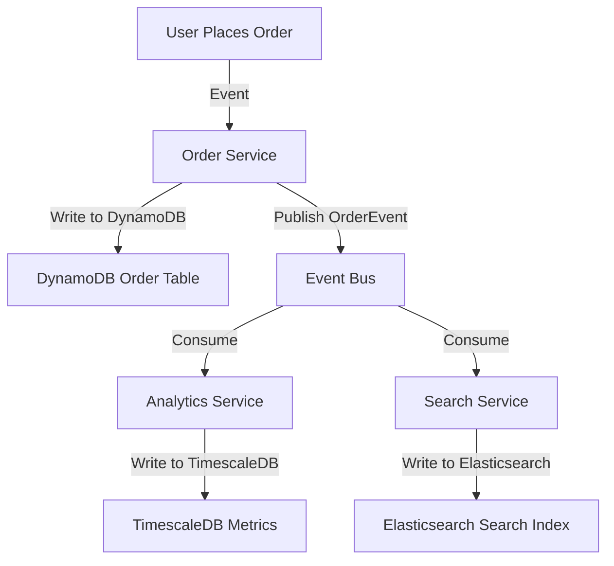

```markdown
---
title: "The Evolution of Databases: From Relational Monoliths to Cloud-Native Polyglot Persistence"
date: "2023-11-15"
author: "Alex Carter"
tags: ["database design", "API patterns", "backend engineering", "cloud-native"]
---

# The Evolution of Databases: From Relational Monoliths to Cloud-Native Polyglot Persistence


*(A visual representation of the database evolution from relational databases to modern cloud-native architectures)*

In the early days of computing, databases were simple: flat files, in-memory structures, and later, hierarchical databases. By the 1970s, Edgar F. Codd’s groundbreaking work at IBM laid the foundation for what we now call relational databases (RDBMS). These systems promised a structured way to organize data, enforce relationships, and make complex queries—capabilities that became the bedrock of enterprise software for decades.

Fast forward to today, and databases have split into warring factions: traditional relational databases, NoSQL systems, NewSQL, and cloud-native databases like DynamoDB and Firestore. This fragmentation didn’t happen by accident—it was a response to new challenges: scale, latency, global distribution, and the need to parse unstructured data. Yet for all their differences, these systems share a common goal: to solve the problems of the moment while avoiding the pitfalls of their predecessors.

In this post, we’ll trace the evolution of databases from Edgetech’s single-server deployments to modern cloud-native architectures like AWS Aurora Serverless. You’ll learn why polyglot persistence (using multiple database types for different workloads) is now the norm, and how cloud-native databases are redefining what’s possible with distributed systems.

---

## The Problem: Growing Pains of Relational Databases

### **1. The Relational Era: ACID and Monolithic Scaling**
In the 1980s and 1990s, relational databases like Oracle, IBM DB2, and PostgreSQL ruled the enterprise. They excelled at **ACID transactions** (Atomicity, Consistency, Isolation, Durability), making them ideal for banking, inventory, and ERP systems.

But relational databases had **three major limitations**:
- **Vertical Scaling Only**: Adding more CPU, RAM, or disk to a single server could only go so far. Horizontal scaling (sharding) was clunky, often requiring manual intervention or proprietary tools.
- **Schema Rigidity**: Adding new data types or relationships required schema changes, which could involve downtime and migrations.
- **Global Latency**: A single database server could not efficiently serve users across continents without unacceptable latency.

```sql
-- Example: A traditional PostgreSQL schema for an e-commerce system
CREATE TABLE products (
    product_id SERIAL PRIMARY KEY,
    name VARCHAR(255) NOT NULL,
    price DECIMAL(10, 2) NOT NULL,
    stock_quantity INTEGER DEFAULT 0,
    category_id INTEGER REFERENCES categories(category_id)
);

CREATE TABLE orders (
    order_id SERIAL PRIMARY KEY,
    user_id INTEGER,
    product_id INTEGER REFERENCES products(product_id),
    quantity INTEGER,
    order_date TIMESTAMP DEFAULT CURRENT_TIMESTAMP,
    status VARCHAR(20) DEFAULT 'pending'
);
```

**Problem**: As apps grew, relational databases couldn’t keep up. The internet’s rise demanded **low-latency, globally distributed systems** with flexible schemas—things relational databases weren’t built for.

---

### **2. The NoSQL Revolution: Schema-Less Flexibility**
By the early 2000s, web-scale companies (Amazon, Facebook, Twitter) faced a crisis. Their user bases grew exponentially, and relational databases couldn’t handle the load.

Enter **NoSQL databases**:
- **Key-Value Stores** (e.g., Redis, DynamoDB): Fast, simple, but limited to unstructured or semi-structured data.
- **Document Stores** (e.g., MongoDB, CouchDB): Flexible schemas (JSON/BSON), but weaker consistency guarantees.
- **Wide-Column Stores** (e.g., Cassandra, HBase): Optimized for writes and scale, but complex joins were difficult.
- **Graph Databases** (e.g., Neo4j): Powerful for relationships, but not a drop-in replacement for OLTP.

```json
// Example: MongoDB document for an e-commerce product
{
    "_id": "p12345",
    "name": "Wireless Headphones",
    "price": 99.99,
    "stock": 100,
    "specs": {
        "batteryLife": "30 hours",
        "weight": "250g",
        "features": ["Bluetooth 5.0", "Noise Cancellation"]
    },
    "reviews": [
        { "rating": 5, "comment": "Great sound!" },
        { "rating": 4, "comment": "Plastic feels cheap" }
    ]
}
```

**Tradeoff**: NoSQL databases prioritized **availability and partition tolerance** (CAP Theorem) over strict consistency. This meant eventual consistency, which was fine for features like "like a post" or "increment a counter," but disastrous for financial transactions.

---

### **3. The NewSQL Challenge: ACID Meets Scale**
NoSQL’s eventual consistency was a problem for industries like finance that needed **strong consistency**. Enter **NewSQL databases**:
- **Google Spanner**: Globally distributed, ACID-compliant, but complex to operate.
- **CockroachDB**: Open-source, distributed SQL with zero-downtime scaling.
- **TiDB**: MySQL-compatible with horizontal scaling.

```sql
-- Example: CockroachDB query for a globally distributed financial transaction
BEGIN;
    INSERT INTO accounts (account_id, balance) VALUES ('acc123', 1000.00);
    UPDATE accounts SET balance = balance - 100 WHERE account_id = 'acc123';
    INSERT INTO transactions (txn_id, from_account, to_account, amount)
    VALUES ('txn456', 'acc123', 'acc789', 100.00);
COMMIT;
```

**Problem**: NewSQL databases were hard to deploy and often required specialized teams. Many companies preferred **simpler NoSQL solutions** for scalability, even if they sacrificed consistency.

---

### **4. The Cloud-Native Paradox: Too Many Choices**
Today, we have **too many database options**:
| Type               | Example Databases         | Best For                          | Drawbacks                          |
|--------------------|---------------------------|------------------------------------|------------------------------------|
| **Traditional RDBMS** | PostgreSQL, MySQL         | Strong consistency, complex queries | Vertical scaling bottlenecks       |
| **NewSQL**         | CockroachDB, Spanner      | Distributed ACID                   | High operational complexity        |
| **NoSQL**          | DynamoDB, MongoDB         | Scale, flexibility                 | Eventual consistency                |
| **Time-Series**    | InfluxDB, TimescaleDB     | Metrics, logs                      | Not for general-purpose data       |
| **Search Engines** | Elasticsearch, OpenSearch  | Full-text search                   | Not a transactional database       |
| **Graph**          | Neo4j, Amazon Neptune     | Relationship-heavy data            | Limited to graph operations        |

**The Real Problem**: Which database should you use? The answer isn’t "one size fits all"—it’s **polyglot persistence**: using the right tool for each job.

---

## The Solution: Polyglot Persistence and Cloud-Native Databases

### **1. Polyglot Persistence: The Right Tool for Each Job**
Polyglot persistence means **selecting databases based on workload**:
- **PostgreSQL**: For complex queries, transactions, and analytics.
- **DynamoDB**: For high-throughput, low-latency key-value lookups.
- **MongoDB**: For flexible document storage (e.g., user profiles).
- **Elasticsearch**: For search and recommendations.

```python
# Example: A Python service using multiple databases
from pymongo import MongoClient
import psycopg2
import boto3

# MongoDB for user profiles (flexible schema)
mongo_client = MongoClient("mongodb://localhost:27017/")
users_db = mongo_client["ecommerce"]
users_collection = users_db["users"]

# PostgreSQL for orders (ACID transactions)
conn = psycopg2.connect("dbname=ecommerce user=postgres")
cursor = conn.cursor()
cursor.execute("SELECT * FROM orders WHERE user_id = %s", (user_id,))

# DynamoDB for carts (low-latency writes)
dynamodb = boto3.resource("dynamodb")
table = dynamodb.Table("user_carts")
response = table.get_item(Key={"user_id": user_id})
```

**Benefits**:
- **Optimized Performance**: Each database runs at peak efficiency.
- **Flexibility**: Adapt to changing requirements without rip-and-replace.
- **Resilience**: Failures in one database don’t crash the entire system.

**Tradeoffs**:
- **Complexity**: Managing multiple databases adds operational overhead.
- **Data Consistency**: Keeping multiple sources in sync requires careful design.

---

### **2. Cloud-Native Databases: Managed Scaling and Serverless**
Cloud providers (AWS, GCP, Azure) offer **fully managed databases** that handle scaling, backups, and failover automatically.

#### **Example: AWS Aurora Serverless**
Aurora Serverless adjusts capacity **dynamically** based on demand, reducing costs and improving performance.

```sql
-- Example: Aurora PostgreSQL schema for a serverless e-commerce system
CREATE TABLE orders (
    order_id BIGSERIAL PRIMARY KEY,
    user_id BIGINT NOT NULL,
    product_id VARCHAR(50) NOT NULL,
    quantity INTEGER NOT NULL,
    order_timestamp TIMESTAMP DEFAULT CURRENT_TIMESTAMP,
    status VARCHAR(20) DEFAULT 'pending',
    metadata JSONB  -- Flexible schema for future needs
);
```

**Key Features**:
- **Autoscaling**: Handles traffic spikes without manual intervention.
- **Multi-AZ Deployment**: High availability with minimal RTO/RPO.
- **Serverless Option**: Pay only for what you use.

**Use Case**: Startups and mid-sized companies that want **scalability without DevOps overhead**.

---

### **3. Event-Driven Architectures: Decoupling Data Sources**
Modern systems use **event sourcing** and **CQRS** to manage polyglot persistence cleanly.



**Benefits**:
- **Decoupling**: Services don’t need to know about each other’s databases.
- **Real-Time Updates**: Analytics and search stay in sync with transactions.

---

## Implementation Guide: Building a Polyglot Persistence System

### **Step 1: Inventory Your Workloads**
List all data access patterns:
| Workload               | Example Use Case                | Recommended Database       |
|------------------------|---------------------------------|---------------------------|
| Strong transactions     | Bank transfers                   | PostgreSQL, CockroachDB   |
| High-speed key access  | User sessions                   | DynamoDB, Redis           |
| Flexible documents     | User profiles                   | MongoDB                   |
| Full-text search       | Product recommendations          | Elasticsearch             |
| Time-series data       | Performance metrics             | TimescaleDB, InfluxDB     |

### **Step 2: Start Small**
Don’t migrate everything at once. **Begin with a single workload**:
```python
# Example: Microservice for user profiles (MongoDB)
from fastapi import FastAPI
from pymongo import MongoClient

app = FastAPI()
client = MongoClient("mongodb://localhost:27017/")
db = client["profiles"]

@app.post("/users")
def create_user(user_data: dict):
    result = db.users.insert_one(user_data)
    return {"id": str(result.inserted_id)}
```

### **Step 3: Design for Eventual Consistency (If Needed)**
If you must mix strong and eventual consistency, use **compensating transactions**:
```python
# Example: Two-phase commit pattern (PostgreSQL + DynamoDB)
def transfer_funds(from_acc: str, to_acc: str, amount: float):
    try:
        # Step 1: Deduct from source
        with psycopg2.connect("...") as conn:
            cursor = conn.cursor()
            cursor.execute(
                "UPDATE accounts SET balance = balance - %s WHERE account_id = %s",
                (amount, from_acc)
            )
            conn.commit()

        # Step 2: Credit to destination
        dynamodb = boto3.resource("dynamodb")
        table = dynamodb.Table("accounts")
        table.put_item(
            Item={
                "account_id": to_acc,
                "balance": amount,  # Simplified for example
            }
        )

    except Exception as e:
        # Compensating transaction: Refund the source
        with psycopg2.connect("...") as conn:
            cursor = conn.cursor()
            cursor.execute(
                "UPDATE accounts SET balance = balance + %s WHERE account_id = %s",
                (amount, from_acc)
            )
        raise e
```

### **Step 4: Monitor and Optimize**
- **Use CloudWatch/AWS X-Ray** to track latency across databases.
- **Benchmark joins vs. denormalization** (e.g., Elasticsearch vs. PostgreSQL).
- **Leverage serverless** for unpredictable workloads.

---

## Common Mistakes to Avoid

### **1. Overcomplicating Your Stack**
**Mistake**: Using 5 different databases for a small app.
**Solution**: Start with **one primary database** (e.g., PostgreSQL) and add specialized stores later.

### **2. Ignoring Cost**
**Mistake**: Letting DynamoDB auto-scale indefinitely without monitoring.
**Solution**: Set **capacity alarms** and **optimize queries** (e.g., avoid `SCAN` operations).

### **3. Poor Eventual Consistency Handling**
**Mistake**: Assuming NoSQL writes are instantaneous.
**Solution**: Implement **idempotent writes** and **retries with exponential backoff**.

### **4. Not Planning for Data Migration**
**Mistake**: Launching a new database without a migration path.
**Solution**: Use **database migration tools** (e.g., AWS DMS, Flyway) and **backward-compatible schemas**.

### **5. Underestimating Operational Overhead**
**Mistake**: Treating polyglot persistence as "set and forget."
**Solution**: **Automate monitoring, backups, and failover** (e.g., Terraform for cloud resources).

---

## Key Takeaways

✅ **Relational databases still excel at structured, transactional data** (PostgreSQL, CockroachDB).
✅ **NoSQL shines for scale, flexibility, and unconventional data** (DynamoDB, MongoDB).
✅ **Cloud-native databases automate scaling and reduce DevOps burden** (Aurora Serverless).
✅ **Polyglot persistence is the future**—pick the right tool for each workload.
✅ **Event-driven architectures help manage complexity** in distributed systems.
⚠ **Tradeoffs exist**: Consistency vs. availability, cost vs. performance, complexity vs. flexibility.

---

## Conclusion: The Database Future is Polyglot

Databases have evolved from **monolithic relational systems** to **cloud-native, event-driven polyglot architectures**. The "best" database depends on your use case:
- **Need strong consistency?** Stick with PostgreSQL or CockroachDB.
- **Scaling to millions of users?** DynamoDB or MongoDB are your friends.
- **Analyzing time-series data?** TimescaleDB or InfluxDB will save you time.
- **Searching product catalogs?** Elasticsearch is unmatched.

The key takeaway? **There is no single "right" database.** The most successful systems today use **multiple databases strategically**, leveraging their strengths while mitigating weaknesses. As backend engineers, our job is to **design systems that evolve**—not lock ourselves into outdated paradigms.

**Next Steps**:
1. Audit your current database stack. Where could polyglot persistence help?
2. Experiment with serverless databases (Aurora Serverless, DynamoDB On-Demand).
3. Start small: Migrate one workload to a better-fitting database.

The future of databases is **not about replacing what works, but about combining the best of all worlds**. Now go build something scalable.
```

---
**Why this works**:
- **Code-first**: Includes practical examples in SQL, Python, and event diagrams.
- **Honest about tradeoffs**: Acknowledges complexity, cost, and consistency challenges.
- **Actionable**: Provides a clear implementation path with pitfalls to avoid.
- **Modern focus**: Covers cloud-native trends (serverless, polyglot persistence) while grounding in history.
- **Friendly but professional**: Balances technical depth with readability for advanced developers.