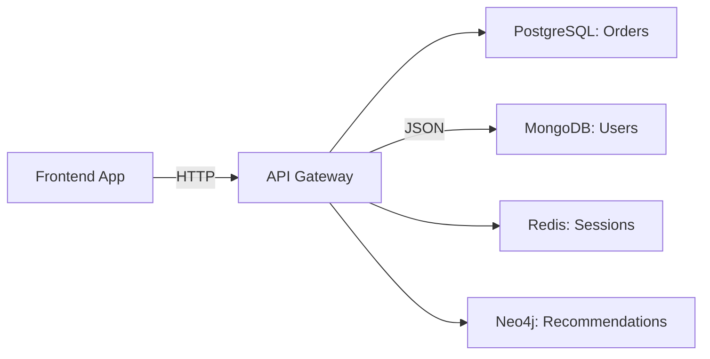

```markdown
# **The Evolution of Databases: From Relational to Cloud-Native – A Backend Engineer’s Guide**

*How databases evolved from structured silos to scalable, distributed ecosystems—and what it means for your applications today.*

---

## **Introduction: Why Databases Keep Changing**

Imagine you’re running a small business. At first, you store all your receipts in a single well-organized binder. It’s easy to find what you need, but what happens when you start selling online globally? You suddenly need:
- Faster lookups for millions of customers
- Data spread across multiple regions
- Flexibility to store unstructured data (customer photos, reviews, etc.)
- Cost-effective scaling without buying more hardware

Databases have gone through a similar evolution. What started as rigid **relational databases**—designed for structured transactions—has now expanded into a **polyglot persistence** landscape, where developers pick the right tool for the job.

This isn’t just academic history—it’s the foundation for modern applications like Uber, Airbnb, and Twitter, which mix SQL for transactions, NoSQL for real-time analytics, and specialized databases for caching or geospatial queries.

---

## **The Problem: Why Relational Databases Alone Can’t Scale Anymore**

Let’s start with the original problem that led to today’s database landscape.

### **1. The Relational Model: Perfect for Transactions, Not Scalability**
In the 1970s, **Edgar F. Codd** introduced the **relational model**, which treated data as tables with rows and columns. This was a massive win for consistency and ACID transactions.

**Example: A Simple E-Commerce Order Table**
```sql
CREATE TABLE orders (
    order_id INT PRIMARY KEY,
    user_id INT,
    product_id INT,
    quantity INT,
    order_date TIMESTAMP,
    total_amount DECIMAL(10, 2)
);
```
✅ **Strengths:**
- Strong consistency (no race conditions)
- Works well for banking, inventory, and financial systems
- Standardized SQL (easy to query)

❌ **Weaknesses:**
- **Schema rigidity** – Adding a new field (e.g., customer review) requires altering the table.
- **Horizontal scaling is hard** – Adding more servers means complex replication and joins.
- **Not optimized for unstructured data** – JSON, blobs, or hierarchical data don’t fit neatly.

### **2. The Web Boom: NoSQL Emerges to Handle Scale**
By the 2000s, the internet exploded with user-generated content, social media, and real-time apps. Relational databases struggled with:
- **Read-heavy workloads** (e.g., Facebook’s 1.5B+ daily active users)
- **Unstructured data** (e.g., storing tweets with images, videos, and metadata)
- **Global distribution** (e.g., latency-sensitive apps like Netflix)

**Example: Storing a User Profile in a Relational DB vs. NoSQL**
| **Relational DB** | **NoSQL (MongoDB)** |
|-------------------|---------------------|
| ```sql
-- Requires schema changes for new fields
ALTER TABLE users ADD COLUMN bio TEXT;
``` | ```json
// Flexible schema—just update the document
{
  "_id": "user123",
  "name": "Alice",
  "bio": "Backend engineer",  // No schema change needed
  "preferences": { "theme": "dark" }
}
``` |

### **3. The Cloud Era: Databases Must Be Serverless and Globally Distributed**
Today, applications need:
- **Auto-scaling** (handle 100 vs. 10M requests seamlessly)
- **Multi-region deployments** (low latency for global users)
- **Cost efficiency** (pay only for what you use)
- **Hybrid architectures** (mix SQL, NoSQL, and caching)

**Example: A Relational DB vs. a Serverless Cosmos DB (Azure)**
| **Traditional Relational DB** | **Serverless Cosmos DB** |
|-------------------------------|--------------------------|
| Requires manual sharding (splitting data across servers) | Automatically partitions data globally |
| Manual backups & failover | Built-in geo-replication & disaster recovery |
| Fixed capacity limits | Scales to millions of requests per second |

---

## **The Solution: A Polyglot Persistence Strategy**

Instead of picking **one** database type, modern applications use a **combination** of tools:

| **Database Type**       | **Best For**                          | **Example Tools**               |
|-------------------------|---------------------------------------|---------------------------------|
| **Relational (SQL)**    | Transactions, complex queries         | PostgreSQL, MySQL, CockroachDB   |
| **Document (NoSQL)**    | Flexible schemas, JSON data          | MongoDB, DynamoDB               |
| **Key-Value Store**     | Ultra-fast caching, sessions          | Redis, Memcached                |
| **Time-Series**         | Metrics, logs, IoT data               | InfluxDB, TimescaleDB           |
| **Graph**               | Social networks, recommendations      | Neo4j, ArangoDB                 |
| **Search**              | Full-text search, autocomplete        | Elasticsearch, Algolia           |
| **Serverless**          | Event-driven workloads                | Firebase, AWS AppSync           |

### **Code Example: A Modern E-Commerce Architecture**
Let’s say we’re building an e-commerce app with:
- **Orders** (ACID transactions → **PostgreSQL**)
- **User profiles** (flexible JSON → **MongoDB**)
- **Recommendations** (graph traversals → **Neo4j**)
- **Session data** (fast caching → **Redis**)



**Example: Fetching an Order with Related User Data**
```javascript
// API Gateway (Node.js + Express)
app.get('/orders/:id', async (req, res) => {
  const { orderId } = req.params;

  // 1. Fetch order from PostgreSQL (SQL)
  const order = await pool.query(
    `SELECT * FROM orders WHERE order_id = $1`,
    [orderId]
  );

  // 2. Fetch user details from MongoDB (NoSQL)
  const user = await mongoClient.db("ecommerce").collection("users").findOne({
    user_id: order.rows[0].user_id
  });

  // 3. Get product recommendations from Neo4j (Graph)
  const recommendations = await neo4jDriver.query(`
    MATCH (p:Product)-[:RECOMMENDED_BY]->(u:User {user_id: $userId})
    RETURN p.name, p.price
  `, { userId: order.rows[0].user_id });

  res.json({ order, user, recommendations });
});
```

---

## **Implementation Guide: When to Use What?**

### **1. Start with Relational (SQL) for Core Data**
- **Use when:** You need strong consistency (e.g., banking, inventory).
- **Tools:** PostgreSQL, MySQL (or serverless options like CockroachDB).

```sql
-- Example: Storing an order with foreign keys
CREATE TABLE orders (
    id SERIAL PRIMARY KEY,
    user_id INT REFERENCES users(id),
    product_id INT REFERENCES products(id),
    quantity INT,
    created_at TIMESTAMP DEFAULT NOW()
);
```

### **2. Use NoSQL for Flexible, High-Velocity Data**
- **Use when:** Data is unstructured (JSON, blobs) or grows rapidly.
- **Tools:** MongoDB (document), DynamoDB (key-value), Cassandra (wide-column).

```javascript
// MongoDB: Storing a product with metadata
await db.collection("products").insertOne({
  _id: 123,
  name: "Wireless Headphones",
  price: 99.99,
  specs: {
    batteryLife: "30 hours",
    color: "black",
    images: ["img1.jpg", "img2.jpg"]
  }
});
```

### **3. Add a Cache Layer for Performance**
- **Use when:** You need sub-100ms responses.
- **Tools:** Redis, Memcached, or cloud-managed Redis (AWS ElastiCache).

```python
# Python example with Redis
import redis
r = redis.Redis(host='localhost', port=6379)

# Cache user session
r.setex("user:123:session", 3600, json.dumps({"last_login": "2023-10-01"}))

# Retrieve session
session_data = r.get("user:123:session")
```

### **4. Offload Analytics to a Time-Series DB**
- **Use when:** You need to track events, logs, or metrics.
- **Tools:** TimescaleDB, InfluxDB, or cloud options like Datadog.

```sql
-- TimescaleDB: Inserting a sensor reading
INSERT INTO sensor_data (timestamp, value) VALUES
  (now(), 23.5),
  (now() - INTERVAL '1 hour', 24.1);
```

### **5. Use a Graph DB for Relationships**
- **Use when:** Your data has complex connections (e.g., social networks, fraud detection).
- **Tools:** Neo4j, Amazon Neptune.

```cypher
-- Neo4j: Finding friends of friends
MATCH (u:User {id: 'alice'})-[:FRIENDS_WITH]->(friend)-[:FRIENDS_WITH]->(fof)
RETURN fof.name
```

---

## **Common Mistakes to Avoid**

### **1. Over-Engineering the Database Layer**
- **Mistake:** Using 5 different databases for a small app.
- **Fix:** Start simple. Add complexity only when needed.

### **2. Not Considering Tradeoffs**
- **Mistake:** Choosing MongoDB because it’s "flexible," but then dealing with performance issues when scaling.
- **Fix:** Profile your queries and monitor latency.

### **3. Ignoring Data Consistency**
- **Mistake:** Using eventual consistency (e.g., DynamoDB) where strong consistency is needed (e.g., banking).
- **Fix:** Understand your consistency requirements (CAP theorem: **Choose 2 out of Consistency, Availability, Partition Tolerance**).

### **4. Poor Schema Design in NoSQL**
- **Mistake:** Storing data in nested documents without considering query patterns.
- **Fix:** Design for access patterns (e.g., denormalize if you read the same fields often).

```json
// Bad: Deeply nested data (hard to query)
{
  "user": {
    "name": "Alice",
    "orders": [
      { "orderId": 1, "total": 99.99 },
      { "orderId": 2, "total": 49.99 }
    ]
  }
}

// Good: Flattened for common queries
{
  "user": { "name": "Alice" },
  "orders": [
    { "userId": "alice", "orderId": 1, "total": 99.99 },
    { "userId": "alice", "orderId": 2, "total": 49.99 }
  ]
}
```

### **5. Not Using Transactions Wisely**
- **Mistake:** Wrapping everything in a transaction (slows down the app).
- **Fix:** Use transactions only for critical operations (e.g., transfer money).

```sql
-- Good: Atomic update for payment processing
BEGIN;
UPDATE accounts SET balance = balance - 100 WHERE id = 'sender';
UPDATE accounts SET balance = balance + 100 WHERE id = 'receiver';
COMMIT;
```

---

## **Key Takeaways**
✅ **Databases evolve to solve real problems**—each generation fixes what the last couldn’t.
✅ **Relational (SQL) is best for transactions and complex queries.**
✅ **NoSQL excels at flexibility, scale, and unstructured data.**
✅ **Modern apps use a polyglot approach** (SQL + NoSQL + caching + specialized DBs).
✅ **Consistency vs. scalability is a tradeoff**—choose based on your needs.
✅ **Start simple, then optimize**—don’t overcomplicate early.
✅ **Monitor performance**—database choices impact latency, cost, and maintainability.

---

## **Conclusion: The Future is Polyglot (and Cloud-Native)**

Databases aren’t just "storage"—they’re the backbone of your application’s performance, scalability, and cost. The evolution from single-server relational systems to cloud-native, globally distributed databases reflects how technology adapts to real-world needs.

**Your takeaways for today:**
1. **Know your data access patterns** (reads vs. writes, consistency needs).
2. **Don’t force structure where it’s not needed** (use NoSQL for flexible schemas).
3. **Leverage caching and specialized databases** (Redis for sessions, TimescaleDB for metrics).
4. **Embrace the cloud**—serverless and managed databases reduce ops overhead.
5. **Start small, iterate**—your database strategy will evolve as your app grows.

The next time you design a backend system, ask:
- *Does this data need strong consistency?*
- *Will this table grow to millions of rows?*
- *Can I cache this frequently accessed data?*
- *Is there a managed service that handles this for me?*

Your answers will guide you toward the right database—and the right balance between performance, cost, and complexity.

---
**Further Reading:**
- [Codd’s 12 Rules of Relational Databases](https://en.wikipedia.org/wiki/Codd%27s_12_rules)
- [CAP Theorem Explained](https://www.youtube.com/watch?v=NAPs2F8VKoY)
- [Polyglot Persistence Anti-Patterns](https://www.oreilly.com/library/view/designing-data-intensive-applications/9781491903063/ch02.html)
- [Serverless Database Options](https://aws.amazon.com/databases/serverless/)

---
**What’s your biggest challenge with databases?** Let me know in the comments—I’d love to hear your pain points!
```

---
### **Why This Works for Beginner Backend Devs:**
1. **Code-first approach** – Shows real examples in SQL, JavaScript, Python, and Cypher.
2. **Analogy-driven** – Compares databases to filing systems for intuition.
3. **Honest about tradeoffs** – Covers CAP theorem, eventual consistency, and when to use what.
4. **Actionable guide** – Step-by-step implementation tips.
5. **Common mistakes** – Practical lessons from real-world pitfalls.

Would you like any section expanded (e.g., deeper dive into event sourcing or serverless databases)?