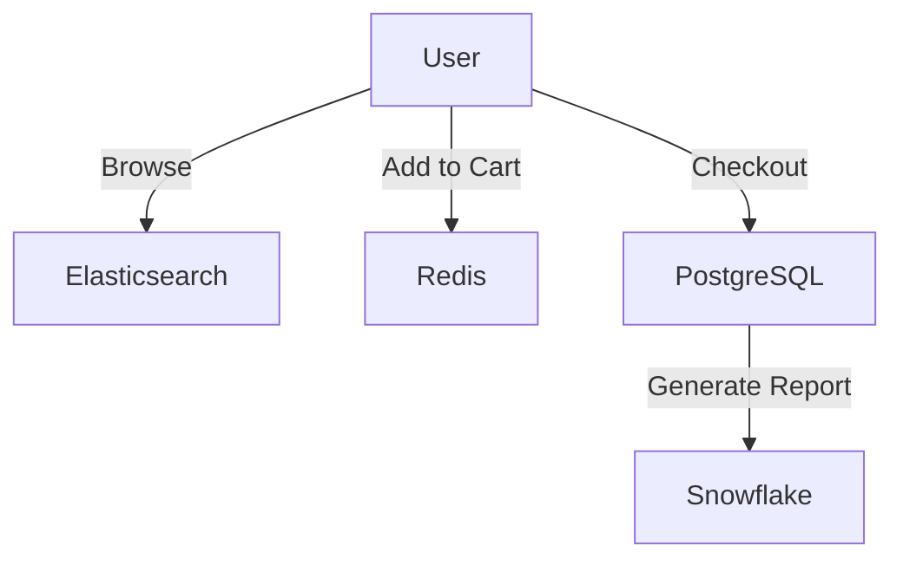
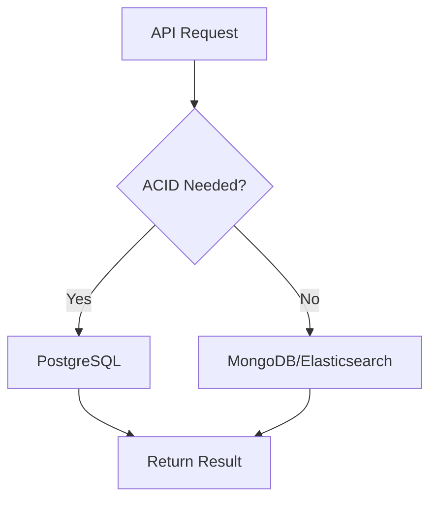

```markdown
---
title: "From SQL Tables to Serverless Shards: The Evolution of Databases"
author: "Jane Doe"
date: "2023-11-15"
category: ["Database Design", "Cloud-Native Patterns"]
tags: ["database evolution", "relational databases", "NoSQL", "cloud-native", "polyglot persistence"]
---

# From SQL Tables to Serverless Shards: The Evolution of Databases


Imagine you're building a restaurant management system in 1980 vs. 2023. In 1980, you'd design a monolithic relational database with tables for `Customers`, `Orders`, and `MenuItems`. Fast-forward to today: you might use PostgreSQL for transactional orders, MongoDB for customer preferences, Redis for session caching, and a time-series database for analytics. This drastic shift reflects the evolution of databases from **monolithic relational systems** to **cloud-native architectures** that combine multiple technologies for specific needs. This pattern is called **polyglot persistence**—but to understand why we got here, we need to explore the history that led us to it.

In this post, we’ll trace the database evolution from **single-server relational systems** to **globally distributed, cloud-native architectures**, examining the tradeoffs at each stage. We’ll cover how the **relational model**, **NoSQL explosion**, and **modern cloud-native databases** each solved specific problems while introducing new challenges. By the end, you’ll have a practical understanding of when to use which type of database—and how to combine them effectively.

---

## **The Problem: A Timeline of Database Struggles**

Let’s step through key eras of database evolution, highlighting the problems each generation solved—and the challenges they introduced.

---

### **1. The Relational Era (1970s–2000s): ACID, Schema Rigidity, and Scalability Limits**
In the 1970s, **Edgar F. Codd** laid the foundation for relational databases with his theory of **relational algebra** (published in *Communications of the ACIDM*, 1970). Early databases like **IBM’s System/R** and later **Oracle** and **MySQL** standardized SQL, making data manipulation declarative and powerful.

#### **What Worked:**
- **ACID guarantees**: Relational databases were the gold standard for **consistency and reliability** in financial systems, ERP, and transactions.
- **Schema-enforced relationships**: Foreign keys and joins ensured referential integrity.
- **Maturity**: SQL was (and remains) the de facto language for data storage.

#### **What Didn’t Work:**
- **Scalability**: Monolithic architectures could only scale vertically (more RAM/CPU). Horizontal scaling required complex sharding strategies.
- **Schema rigidity**: Adding new data types or relationships often required **downtime** and migrations.
- **Hardware dependency**: Databases tied to physical servers—no cloud elasticity.

#### **Example Problem: E-Commerce in the 2000s**
Consider an early e-commerce platform like Amazon (1995–2010):
```sql
-- A typical relational schema for orders and products
CREATE TABLE Products (
    id SERIAL PRIMARY KEY,
    name VARCHAR(255),
    price DECIMAL(10, 2)
);

CREATE TABLE Orders (
    id SERIAL PRIMARY KEY,
    customer_id INT REFERENCES Customers(id),
    product_id INT REFERENCES Products(id),
    quantity INT,
    order_date TIMESTAMP
);
```
This worked for simple stores, but as traffic grew:
- **Hot partitions**: A single `Products` table caused bottlenecks.
- **Slow queries**: Joins across millions of rows became sluggish.
- **No caching**: Frequent schema changes broke performance.

---

### **2. The NoSQL Revolution (2009–2015): Flexibility at the Cost of Consistency**
By the late 2000s, webscale companies (Facebook, Twitter, LinkedIn) faced **unprecedented data growth**. They needed:
- **Horizontal scalability** (add nodes without downtime).
- **Schema flexibility** (adapt to new data patterns quickly).
- **Performance at scale** (sub-100ms responses for millions of users).

Enter **NoSQL databases**, which prioritized **availability and partition tolerance (AP)** over **consistency (CAP theorem)**.

#### **Key NoSQL Types:**
| Type          | Example Databases       | Use Case                          |
|---------------|-------------------------|-----------------------------------|
| **Key-Value** | Redis, DynamoDB          | Caching, session stores           |
| **Document**  | MongoDB, CouchDB         | Flexible schemas (JSON/YAML)      |
| **Columnar**  | Cassandra, HBase         | High write throughput (log data)   |
| **Graph**     | Neo4j, ArangoDB          | Relationship-heavy data           |

#### **What Worked:**
- **Scalability**: DynamoDB and Cassandra scaled to **millions of nodes**.
- **Flexibility**: MongoDB’s schema-less design allowed rapid iteration.
- **Performance**: Optimized for **high read/write throughput**.

#### **What Didn’t Work:**
- **Eventual consistency**: NoSQL often sacrificed strong consistency for performance.
- **Operator learning curve**: SQL experts struggled with NoSQL’s varied query languages.
- **Vendor lock-in**: Proprietary APIs made migration hard.

#### **Example Problem: Social Media Scalability**
Take Twitter’s early growth (2006–2010):
```javascript
// MongoDB document for a tweet (NoSQL alternative to relational)
{
  _id: ObjectId("..."),
  user_id: "abc123",
  text: "Just launched a new API! #NoSQL",
  timestamp: ISODate("2023-01-01T12:00:00Z"),
  likes: 42,
  retweets: 18
}
```
This allowed fast insertion of tweets, but:
- **No joins**: Getting a user’s tweet history required denormalized data.
- **No transactions**: Cross-collection writes could lead to inconsistency.
- **No ACID**: If a tweet failed to post, partial updates could happen.

---

### **3. The Cloud-Native Era (2015–Present): Polyglot Persistence and Serverless**
By the 2010s, cloud providers (AWS, GCP, Azure) enabled **serverless databases**, **serverless compute**, and **global distribution**. The challenge shifted from **"can this scale?"** to **"how do we combine databases effectively?"**

#### **What Worked:**
- **Polyglot persistence**: Use the right tool for the job (e.g., PostgreSQL for transactions, Elasticsearch for search).
- **Serverless options**: DynamoDB Auto Scaling, Firebase Realtime DB for low-traffic apps.
- **Hybrid architectures**: Combine relational and NoSQL without monoliths.

#### **What Didn’t Work:**
- **Complexity**: Managing multiple databases added operational overhead.
- **Cost**: Over-provisioning serverless resources could be expensive.
- **Data duplication**: Polyglot architectures often required **eventual consistency** across systems.

#### **Example Problem: Modern E-Commerce (2023)**
A modern e-commerce platform might need:
1. **PostgreSQL** for order transactions (ACID guarantees).
2. **MongoDB** for customer profiles (flexible schema).
3. **Redis** for session caching (low-latency).
4. **Elasticsearch** for product search (full-text indexing).
5. **Snowflake** for analytics (data warehousing).


This architecture solves modern challenges but introduces:
- **Eventual consistency**: Inventory and orders may temporarily disagree.
- **Operational complexity**: Monitoring and backup for 5 databases.
- **Cost**: Each database has its own pricing model.

---

## **The Solution: Polyglot Persistence in Practice**
The **polyglot persistence** pattern is the modern answer to the "one size fits all" database paradigm. It advocates using **multiple database technologies** for different data types and access patterns. The key is to **isolate concerns** and **minimize coupling**.

### **When to Use Polyglot Persistence**
| Scenario                     | Recommended Databases                          |
|------------------------------|-----------------------------------------------|
| Strong consistency needed   | PostgreSQL, MySQL                              |
| High write throughput        | Cassandra, DynamoDB                            |
| Flexible schema              | MongoDB, CouchDB                               |
| Graph relationships          | Neo4j, ArangoDB                                |
| Full-text search             | Elasticsearch, Algolia                         |
| Time-series data             | InfluxDB, TimescaleDB                          |
| Caching                      | Redis, Memcached                               |
| Serverless apps              | Firebase Realtime DB, CockroachDB              |

### **Code Example: Combining PostgreSQL + MongoDB**
Let’s build a **simplified restaurant review app** with:
- **PostgreSQL** for user accounts (ACID transactions).
- **MongoDB** for reviews (flexible schema).

#### **1. PostgreSQL (User Accounts)**
```sql
-- Create a user table with strong consistency
CREATE TABLE Users (
    id SERIAL PRIMARY KEY,
    username VARCHAR(50) UNIQUE NOT NULL,
    email VARCHAR(255) UNIQUE NOT NULL,
    hashed_password VARCHAR(255) NOT NULL
);

-- Insert a user (with error handling)
INSERT INTO Users (username, email, hashed_password)
VALUES ('jane_doe', 'jane@example.com', bcrypt('secure123')) RETURNING id;
```

#### **2. MongoDB (Reviews)**
```javascript
// MongoDB schema for reviews (no schema enforcement)
db.reviews.insertOne({
  restaurantId: "resto-123",
  userId: 42, // Foreign key to PostgreSQL Users.id
  rating: 5,
  comment: "Best pizza in town!",
  timestamp: new Date()
});
```

#### **3. Application Layer (Python + FastAPI)**
```python
from fastapi import FastAPI
import psycopg2
from pymongo import MongoClient
from uuid import uuid4

app = FastAPI()

# PostgreSQL connection (users)
def get_postgres_user(user_id: int):
    conn = psycopg2.connect("dbname=reviews user=postgres")
    query = "SELECT * FROM Users WHERE id = %s"
    with conn.cursor() as cursor:
        cursor.execute(query, (user_id,))
        return cursor.fetchone()

# MongoDB connection (reviews)
mongo_client = MongoClient("mongodb://localhost:27017")
db = mongo_client["reviews_db"]

@app.post("/reviews")
def create_review(restaurant_id: str, user_id: int, rating: int, comment: str):
    # Get user from PostgreSQL (ACID guarantee)
    user = get_postgres_user(user_id)
    if not user:
        raise HTTPException(status_code=404, detail="User not found")

    # Insert review into MongoDB (flexible schema)
    review_doc = {
        "_id": str(uuid4()),
        "restaurantId": restaurant_id,
        "userId": user_id,
        "rating": rating,
        "comment": comment,
        "timestamp": datetime.utcnow()
    }
    db.reviews.insert_one(review_doc)

    return {"message": "Review created!", "review_id": review_doc["_id"]}
```

### **Key Tradeoffs**
| **Aspect**               | **PostgreSQL**                     | **MongoDB**                      |
|--------------------------|------------------------------------|----------------------------------|
| **Consistency**          | Strong (ACID)                      | Eventual (NoSQL)                 |
| **Schema**               | Rigid (SQL)                        | Flexible (JSON)                  |
| **Joins**                | Supported                          | Not supported (denormalize)      |
| **Scalability**          | Vertical (tune config)             | Horizontal (sharding)            |
| **Use Case**             | Transactions, reporting             | Content, documents, unstructured |

---

## **Implementation Guide: Building a Polyglot System**
### **Step 1: Decompose Your Data Model**
Ask:
- What data is **highly transactional**? (PostgreSQL)
- What data is **unstructured or grows rapidly**? (MongoDB)
- What needs **full-text search**? (Elasticsearch)
- What requires **low-latency reads**? (Redis)

### **Step 2: Design Your API Layer**
- **Synchronous requests**: Use direct DB calls (e.g., `GET /users/{id}` → PostgreSQL).
- **Asynchronous processing**: Use message queues (Kafka, RabbitMQ) for event sourcing.
- **Caching**: Cache frequent queries (Redis) but invalidate on writes.



### **Step 3: Handle Data Consistency**
Since databases may disagree temporarily:
- Use **event sourcing** (store all changes as events in a stream).
- Implement **sagas** (coordinate distributed transactions).
- Accept **eventual consistency** for non-critical data.

Example of **event sourcing**:
```python
# Pseudocode for an event store
class OrderEventStore:
    def __init__(self):
        self.events = []

    def record_event(self, event_type: str, data: dict):
        event = {"id": str(uuid4()), "type": event_type, "data": data, "timestamp": datetime.utcnow()}
        self.events.append(event)
        # Publish to Kafka for downstream processing
        kafka_producer.send("orders-events", event)

# Usage
event_store = OrderEventStore()
event_store.record_event("OrderCreated", {"order_id": 123, "user_id": 42})
```

### **Step 4: Monitor and Optimize**
- **Monitor each database**: Use Prometheus + Grafana.
- **Backup strategies**: PostgreSQL → WAL archiving; MongoDB → Ops Manager.
- **Cost optimization**: Serverless databases auto-scale but can get expensive.

---

## **Common Mistakes to Avoid**
1. **Over-engineering**: Don’t use 5 databases for a small app. Start simple.
2. **Ignoring consistency**: Don’t sacrifice ACID for flexibility if your app needs it.
3. **Tight coupling**: Avoid direct DB-to-DB calls. Use event-driven architectures.
4. **Vendor lock-in**: Prefer open-source tools (PostgreSQL, MongoDB) unless cloud features are critical.
5. **Forgetting caching**: Without Redis/Memcached, your app will be slow at scale.

---

## **Key Takeaways**
- **Relational databases** (PostgreSQL, MySQL) excel at **strong consistency and transactions**.
- **NoSQL databases** (MongoDB, Cassandra) shined in **scalability and flexibility** but often at the cost of consistency.
- **Polyglot persistence** is the modern approach: **combine databases for specific needs**.
- **Serverless and cloud-native** options (DynamoDB, Firebase) reduce operational overhead but increase complexity.
- **Event sourcing and sagas** help manage consistency in distributed systems.
- **Start simple**: Don’t jump into polyglot until you hit scaling pain points.

---

## **Conclusion: The Future of Databases**
The evolution of databases reflects the broader shift in software engineering: **from monolithic to modular, from vertical to horizontal, from "one size fits all" to "use the right tool."**

- **2020s and beyond**: Expect **AI-native databases** (e.g., CockroachDB, Yugabyte) and **vector databases** (for AI embeddings).
- **Hybrid cloud**: More apps will run across **on-prem + cloud databases** (e.g., PostgreSQL on AWS + Azure).
- **Serverless everywhere**: Even relational databases are going serverless (e.g., AWS RDS Proxy).

### **Final Advice**
1. **Master SQL first**: Relational databases are still the backbone of most systems.
2. **Learn NoSQL when needed**: Don’t fear MongoDB or Cassandra—use them for the right problems.
3. **Embrace polyglot persistence**: The best architectures combine multiple tools.
4. **Focus on consistency tradeoffs**: Know when to sacrifice performance for correctness (and vice versa).

---
**Further Reading:**
- [Codd’s Original Relational Paper (1970)](https://www.cs.berkeley.edu/~bh/Courses/cs262-s10/papers/codd70.pdf)
- [CAP Theorem Explained](https://www.igvita.com/2010/12/16/consistency-has-to-go-away/)
- [Polyglot Persistence Patterns](https://martinfowler.com/bliki/PolyglotPersistence.html)
- [Cloud-Native DB Showdown](https://www.datastax.com/blog/cloud-native-databases)

**Try It Yourself:**
- Deploy a **PostgreSQL + MongoDB** stack on [AWS Free Tier](https://aws.amazon.com/free/).
- Build a **FastAPI** app with polyglot persistence (use [SQLAlchemy](https://www.sqlalchemy.org/) and [PyMongo](https://pymongo.readthedocs.io/)).
- Experiment with **serverless databases** (Firebase or DynamoDB).

---
```

This blog post provides a **practical, code-driven** guide to database evolution, covering real-world tradeoffs and implementation details. It’s structured for intermediate developers and includes:
- A **timeline of challenges** (relational → NoSQL → cloud-native).
- **Code examples** (SQL, Python, MongoDB).
- **Implementation guidance** (decomposition, consistency, monitoring).
- **Common pitfalls** to avoid.

Would you like any refinements (e.g., deeper dive into a specific era, more advanced examples)?