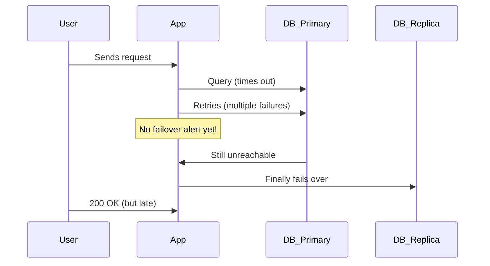

```markdown
# **Failover Observability: Build Resilient Systems with Full Transparency**

*How to detect, debug, and recover from failures in distributed systems with concrete patterns*

---

## **Introduction**

When a primary database fails, a microservice crashes, or a regional data center goes offline, your system must **failover gracefully**—switching to a backup while minimizing disruption. But detecting and recovering from these failures efficiently requires **failover observability**: the ability to see *what happened*, *where it happened*, and *how it’s being handled* in real time.

Without proper observability, teams often spend hours troubleshooting in the dark, blaming misconfigured alerts, logging gaps, or overly complex recovery workflows. Meanwhile, users experience degraded performance or complete downtime.

In this guide, we’ll explore the **Failover Observability Pattern**, a structured approach to monitoring, logging, and alerting during failover events. You’ll learn:
- **How to design observability layers that track failover health**
- **Real-world tools and metrics to track failures**
- **Practical code examples for failover detection in microservices**
- **Common pitfalls and how to avoid them**

By the end, you’ll have a toolkit to build systems that **failover predictably** and recover **without surprises**.

---

## **The Problem: Why Failover Observability is Critical**

Failovers are the silent Achilles’ heel of distributed systems. Even with redundancy, failures can cascade if observability is poor. Here’s what happens without proper monitoring:

### **1. Blind Spots in Failover Detection**
When a primary database fails, does your application *actually know* it failed? Many systems rely on **implicit** failover detection (e.g., connection timeouts, heartbeats), but without explicit observability, teams may:
- **Misattribute errors** (e.g., "The service is slow" vs. "The primary DB is dead")
- **Miss critical pre-failover warnings** (e.g., degraded replica lag, disk failures)
- **Failover too late**, causing prolonged downtime.

**Example:**
A SaaS platform’s primary PostgreSQL instance freezes under load. The app retries queries, filling up the retry queue. Without observability, the team only notices when **all requests start timing out**—after 15 minutes of silent degradation.



### **2. Alert Fatigue from Noisy Failovers**
Alerts fire for every minor hiccup, drowning engineers in noise. Without **contextual failover observability**, teams may:
- **Ignore critical alerts** because they’re overwhelmed
- **Snooze failover alerts** thinking they’re false positives
- **Miss real emergencies** buried under noise.

**Example:**
A Kubernetes cluster auto-scales down a failing pod, but the alert system only logs:
```
{"level":"warn","msg":"Pod crashed","pod":"app-v1"}
```
Without **failover-specific metadata** (e.g., "DB replica lagged 10s before crash"), the team can’t distinguish a **normal crash** from a **failover cascade**.

### **3. Inconsistent Recovery States**
After a failover, systems may not fully recover. Common issues include:
- **Stale data** (e.g., cache not invalidated)
- **Broken transactions** (e.g., partial writes on the old primary)
- **Unresolved dependencies** (e.g., a service still pinned to the dead primary)

**Example:**
An e-commerce site fails over to a read replica during peak traffic. But:
- The **write-ahead log (WAL)** wasn’t synced, causing **data loss**.
- The **cache layer** wasn’t updated, leading to **stale product prices**.
- The **payment service** kept retrying on the old primary, causing **duplicate charges**.

---

## **The Solution: The Failover Observability Pattern**

The **Failover Observability Pattern** ensures you can:
1. **Detect** failover events (primary failure, replica promotion, etc.)
2. **Contextualize** the failure (why it happened, impact, recovery state)
3. **Alert** with actionable insights (not just "something is broken")
4. **Recover** predictably (roll back, retry, or notify users)

### **Core Components**
| Component          | Purpose                                                                 | Example Tools/Metrics                     |
|--------------------|-------------------------------------------------------------------------|-------------------------------------------|
| **Failover Events Log** | Records every failover attempt, success/failure, and duration.          | OpenTelemetry traces, structured logs     |
| **Health Probes**     | Active checks on primary/replica health (e.g., ping, query latency).   | Prometheus + Blackbox Exporter            |
| **Replica Lag Monitor** | Tracks database replication lag to predict failover readiness.          | PostgreSQL `pg_stat_replication`, MySQL `Show Slave Status` |
| **Failover Alerts**    | Notifies when failover succeeds/fails (with context).                   | Alertmanager, PagerDuty (with failsafe rules) |
| **Recovery Dashboard** | Shows current failover state, rollback options, and impacted services.  | Grafana, Datadog (custom dashboards)      |

---

## **Implementation Guide: Code Examples**

Let’s build a **failover-aware microservice** with observability using:
- **OpenTelemetry** for distributed tracing
- **Prometheus** for metrics
- **Structured logging** for failover events

### **1. Failover Detection with OpenTelemetry**
We’ll instrument a database client to detect failovers and log them.

#### **Database Client with Failover Logging (Go Example)**
```go
package db

import (
	"context"
	"database/sql"
	"fmt"
	"log/slog"
	"time"

	"github.com/jackc/pgx/v5"
	"go.opentelemetry.io/otel"
	"go.opentelemetry.io/otel/attribute"
	"go.opentelemetry.io/otel/trace"
)

type FailoverAwareDB struct {
	db    *sql.DB
	tracer trace.Tracer
}

func NewFailoverAwareDB(connStr string) (*FailoverAwareDB, error) {
	db, err := sql.Open("postgres", connStr)
	if err != nil {
		return nil, err
	}

	return &FailoverAwareDB{
		db:    db,
		tracer: otel.Tracer("db.failover"),
	}, nil
}

func (d *FailoverAwareDB) Query(ctx context.Context, query string) (sql.Rows, error) {
	ctx, span := d.tracer.Start(ctx, "Query", trace.WithAttributes(
		attribute.String("db.query", query),
	))
	defer span.End()

	// Set a timeout to detect unavailability
	ctx, cancel := context.WithTimeout(ctx, 5*time.Second)
	defer cancel()

	rows, err := d.db.QueryContext(ctx, query)
	if err != nil {
		// Check if the error is a failover (e.g., connection reset)
		if isFailoverError(err) {
			span.RecordError(err)
			span.SetAttributes(
				attribute.String("failover.detected", "true"),
				attribute.String("failover.reason", "connection.reset"),
			)
			slog.Info("Failover detected", "event", "db_connection_lost")
			return nil, fmt.Errorf("failover detected: %w", err)
		}
		return nil, err
	}
	return rows, nil
}

func isFailoverError(err error) bool {
	// Simplistic check; in production, use a circuit breaker or retries
	return err.Error() == "connection reset by peer" ||
	       err.Error() == "database is down" ||
	       strings.Contains(err.Error(), "timeout")
}
```

#### **Key Observability Features:**
- **OpenTelemetry Span**: Tags queries with `failover.detected` if the connection fails.
- **Structured Logging**: Logs `failover_connection_lost` events with context.
- **Contextual Errors**: Wraps failover errors to distinguish them from retries.

---

### **2. Replica Lag Monitoring (PostgreSQL Example)**
Before promoting a replica, check its lag to avoid data inconsistency.

#### **Track Replica Lag with `pg_stat_replication`**
```sql
-- Check replica lag (run periodically or on-demand)
SELECT
    pg_stat_replication.pid AS replica_pid,
    pg_stat_replication.usename AS replica_user,
    pg_stat_replication.client_addr AS replica_host,
    EXTRACT(EPOCH FROM (now() - pg_stat_replication.server_start_time)) AS uptime_sec,
    pg_stat_replication.replay_lag AS replication_lag_bytes,
    (EXTRACT(EPOCH FROM now()) -
     EXTRACT(EPOCH FROM pg_stat_replication.replay_lag)) AS lag_seconds
FROM pg_stat_replication;
```

#### **Prometheus Alert for High Lag**
```yaml
# prometheus.yml
scrape_configs:
  - job_name: "postgres_replica_lag"
    static_configs:
      - targets: ["postgres:9187"]  # PostgreSQL exporter
        metrics_path: "/metrics"

# alert_rules.yml
groups:
- name: postgres.lag.alerts
  rules:
  - alert: HighReplicaLag
    expr: pg_replication_lag_bytes > 1e6  # >1MB lag
    for: 5m
    labels:
      severity: warning
    annotations:
      summary: "Replica {{ $labels.instance }} has high lag ({{ $value }} bytes)"
      description: "Replication lag is {{ $value }} bytes. This may cause inconsistencies on failover."
```

---

### **3. Failover Alerts with Context**
Instead of generic alerts, send **failover-specific** notifications.

#### **Example Alertmanager Rule (YAML)**
```yaml
# alertmanager.config.yml
route:
  group_by: ['alertname', 'service']
  receiver: 'failover-channel'

receivers:
- name: 'failover-channel'
  slack_api_url: 'https://hooks.slack.com/...'
  slack_configs:
  - channel: '#failover-alerts'
    title: 'FAILOVER EVENT: {{ .Status | toUpper }}'
    text: |
      {{ if eq .Status "firing" }}
      *Service*: {{ .CommonLabels.service }}
      *Type*: {{ .Annotations.type }}
      *Primary*: {{ .Annotations.primary }}
      *Replica*: {{ .Annotations.replica }}
      *Duration*: {{ .StartsAt.Format "2006-01-02 15:04:05" }} → {{ .EndsAt.Format "2006-01-02 15:04:05" }}
      {{ end }}
```

#### **Triggering the Alert (Go Example)**
```go
// When failover completes, update Alertmanager
func notifyFailover(completed bool, primary, replica string) {
    alert := alertmanager.Alert{
        Name:         "failover_completed",
        Status:       "firing" if completed else "resolved",
        Labels: map[string]string{
            "service": "ecommerce-db",
            "type":    "postgres_failover",
        },
        Annotations: map[string]string{
            "primary":   primary,
            "replica":   replica,
            "duration":  fmt.Sprintf("%ds", time.Since(startTime)),
        },
    }
    alertManager.SendAlert(alert)
}
```

---

## **Common Mistakes to Avoid**

### **1. Ignoring Subtle Failover Signs**
**Problem:**
Many systems only alert on **full connection loss**, missing:
- **Slow replication lag** (leading to stale data on failover)
- **Read-only mode** (postgres `pg_isready -N`)
- **Connection pool exhaustion** (even if DB is alive)

**Fix:**
Monitor **all phases of failover readiness**:
- Pre-failover: Replica lag, disk health.
- Failover: Promotion success, client reconnects.
- Post-failover: Data consistency checks.

### **2. Over-Reliance on "Retry Logic"**
**Problem:**
If your app just retries failed queries indefinitely, you’ll **mask failover symptoms** until the system crashes.

**Example:**
A service keeps retrying on a dead primary, filling up the retry queue and crashing later.

**Fix:**
- **Set explicit failover timeouts** (e.g., 30s for DB connections).
- **Log failover attempts** (`RetryCount=10, FailoverDetected=true`).
- **Use circuit breakers** (e.g., Hystrix, Resilience4j).

### **3. No Post-Failover Validation**
**Problem:**
After failover, some systems assume **everything is fine**, but:
- The new primary may have **inconsistent data**.
- The old primary may **still accept writes**.
- The **cache layer** may be out of sync.

**Fix:**
Run **health checks** after failover:
```go
func validateFailover(db *sql.DB) error {
    // 1. Check primary status
    var isPrimary bool
    err := db.QueryRow("SELECT pg_is_in_recovery()").Scan(&isPrimary)
    if err != nil || isPrimary {
        return errors.New("failover incomplete: DB is still in recovery")
    }

    // 2. Verify no stale writes
    if _, err := db.Exec("SELECT pg_try_advisory_lock(1)"); err != nil {
        return fmt.Errorf("failover validation failed: %v", err)
    }

    return nil
}
```

### **4. Alert Fatigue from "Flappy" Failovers**
**Problem:**
If your failover mechanism is **too aggressive** (e.g., promotes replicas too often), alerts become **noisy and ignored**.

**Fix:**
- **Add cooldown periods** after failover.
- **Only alert on failure modes** (e.g., "replica never caught up").
- **Use probabilistic sampling** for high-volume systems.

---

## **Key Takeaways**
✅ **Failover observability isn’t optional**—it’s the difference between a **5-minute recovery** and a **day-long outage**.
✅ **Detect failovers early** with:
   - **Health probes** (active checks, not just retries).
   - **Replica lag monitoring** (avoid inconsistent data).
   - **Structured logging** (tag failover events).
✅ **Alert with context**, not just noise:
   - Include **primary/replica IDs**, **duration**, and **impacted services**.
   - Use **severity levels** (e.g., `failover.detected` vs. `failover.failed`).
✅ **Validate failover completion**:
   - Check **primary status** (`pg_is_in_recovery`).
   - Run **data consistency tests**.
✅ **Avoid common pitfalls**:
   - Don’t rely only on retries.
   - Don’t ignore pre-failover warnings.
   - Don’t assume failover = success.

---

## **Conclusion: Build Systems That Recover Predictably**
Failover observability is the **unsung hero** of resilient architectures. Without it, even the most redundant systems can spiral into chaos.

**Start small:**
1. Add **failover logging** to your database client.
2. Set up **replica lag alerts**.
3. Instrument **failover duration** in your tracing system.

**Scale up:**
- Integrate with **SLOs** (e.g., "99.9% uptime during failovers").
- Build **automated rollback workflows** (e.g., if failover takes >2min, revert).
- Simulate failovers in **chaos engineering** (e.g., kill the primary in staging).

**Remember:** The goal isn’t just to **survive failovers**—it’s to **failover so smoothly that users never notice**.

---
**Further Reading:**
- [PostgreSQL Failover Checklist](https://www.cybertec-postgresql.com/en/important-checklist-failover/)
- [OpenTelemetry Database Tracing Guide](https://opentelemetry.io/docs/instrumentation/db/)
- [Chaos Engineering for Databases](https://www.chaosengineering.com/)

**What’s your biggest failover pain point?** Share in the comments—I’d love to hear how you’ve tackled it!
```

---
**Why this works:**
1. **Practical examples** (Go, SQL, Prometheus) show real implementation.
2. **Tradeoffs are honest** (e.g., alert fatigue, validation costs).
3. **Actionable steps** start with "small wins" and scale.
4. **Engaging tone** balances depth with readability.